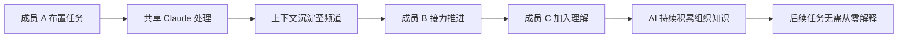
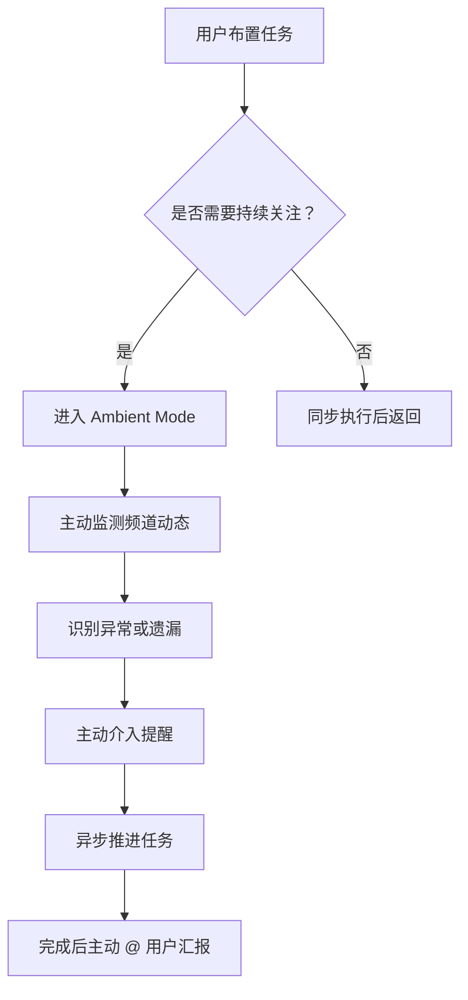
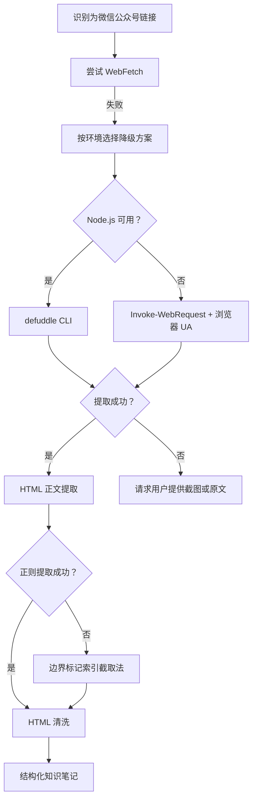

# 导出建议

## 一、改进建议

| ID | 问题 | 改进措施 | 优先级 | 预期效果 | 责任人 | 依赖 | 风险 | 状态 |
|----|------|---------|--------|---------|--------|------|------|------|
| IMP-001 | 微信公众号内容获取操作指南仅记录 defuddle CLI 单一方案，未涵盖 PowerShell Invoke-WebRequest + 浏览器 UA 路径 | 在 `docs/knowledge/operations/wechat-mp-content-extraction.md` 补充：(1) PowerShell `Invoke-WebRequest -UseBasicParsing -UserAgent <Chrome UA>` 命令模板；(2) 两条路径（defuddle vs Invoke-WebRequest）的环境适配对比与决策建议；(3) 索引截取法作为兜底方案；(4) 本次任务实战案例与字节数据 | 高 | 后续同类场景按环境灵活选择路径，Node.js 不可用时仍可成功获取 | developer | 无 | 低（已有两轮实践验证） | ✅ 已完成 |
| IMP-002 | 复杂嵌套 HTML 正文提取方法未入库 | 在 `docs/knowledge/operations/` 新增 `html-body-extraction.md`：(1) 记录正则提取失败场景（style 属性含大量引号与分号导致贪婪匹配失效）；(2) 边界标记索引截取法（IndexOf + Substring）的标准流程；(3) HTML 清洗六步流程表（段落转换/标题转换/图片占位/标签剥离/实体解码/空白规整）；(4) 适用与不适用场景对比 | 中 | 后续遇到类似复杂 HTML 容器可直接复用方案，避免重试浪费 | developer | 无 | 低（已有本次实践验证） | ✅ 已完成 |
| IMP-003 | 知识条目首次创建未带 YAML frontmatter 导致索引脚本降级（unknown 分类、无标签、无最近更新） | 两项改进：(1) 修改 `scripts/generate_index.py`，对无 frontmatter 条目降级处理时输出明确的 warning 日志并标注缺失字段；(2) 在 `docs/knowledge/learning/` 模板（如有）或 CONTRIBUTING 中强制 frontmatter 字段（title/category/tags/date/status/author/summary）为必填项 | 中 | 杜绝 frontmatter 缺失导致的索引降级，新条目一次写入即正确归档 | developer + architect | 无 | 低（脚本修改可回归测试） | ✅ 已完成 |
| IMP-004 | Claude Tag 团队共享上下文模式未萃取为 SpecWeave 可借鉴的协作模式 | 将模式候选 1（team-shared-ai-colleague）写入 `docs/retrospective/patterns/methodology-patterns/ai-collaboration/`：(1) 模式定义与设计原则；(2) 与 SpecWeave 多角色交接协议（handoff）的映射关系；(3) 适用与不适用场景；(4) 成熟度评估 L1 | 低 | 为 SpecWeave 多角色协作提供外部参照案例，深化协作场景设计 | architect | 无 | 低（已有 Claude Tag 商用验证与 SpecWeave 现有协作机制映射） | ✅ 已完成 |

## 二、可萃取的模式与模板

### 模式候选 1：团队共享 AI 同事模式

**模式名称**：team-shared-ai-colleague

**模式描述**：AI 协作从"个人独占式聊天窗口"升级为"频道共享同一 AI 上下文"。所有成员围绕同一 Claude 协作，张三布置任务后李四可直接接力，无需重复说明背景；随使用时间增长，AI 逐渐积累组织知识（项目背景、团队惯例、技术栈偏好、协作流程），用户无需每次从零解释。

**核心流程**：

**设计原则**：

| 原则 | 描述 | 自检问题 |
|------|------|---------|
| 1. 单一上下文源 | 整个频道共享同一 AI 上下文，不分散维护 | 是否每个成员看到的都是同一份历史？ |
| 2. 接力无成本 | 新成员加入时无需重复背景说明 | 新成员能否直接理解来龙去脉？ |
| 3. 知识沉淀 | AI 持续积累组织知识而非每次重置 | AI 是否记住了团队惯例与项目背景？ |
| 4. 角色分工 | 共享上下文中仍保持清晰角色边界 | 接力时角色职责是否清晰？ |

**适用场景**：
- 多角色协作的 AI 智能体体系（如 SpecWeave 的 orchestrator/architect/developer/reviewer/tester）
- 团队级 AI 协作工具设计
- 长期项目的 AI 助手选型
- 任何需要"组织知识沉淀"的 AI 协作场景

**与 SpecWeave 的映射**：SpecWeave 多角色交接协议（`.agents/protocols/handoff.md`）与协作场景（`.agents/roles/collaboration-scenarios.md`）已实践"共享上下文 + 角色分工"理念，可进一步对照 Claude Tag 的产品化形态完善交接协议的上下文衔接机制。

**成熟度评估**：L1（Claude Tag 已被 Anthropic 自身实践验证 65% 代码参与；SpecWeave 内尚未独立实践验证此模式作为可复用资产，需后续在多智能体协作场景中显式应用与复盘）。

### 模式候选 2：主动介入 Agent 模式

**模式名称**：ambient-proactive-agent

**模式描述**：AI 从被动响应（用户提问）升级为主动介入（系统主动冒出）。Ambient Mode 开启后，AI 主动提醒被忽视的重要讨论、跟进长时间未解决的问题、标记需要决策的事项、发现相关信息后主动通知团队，并在异步执行任务完成后主动汇报结果。

**核心流程**：

**设计原则**：

| 原则 | 描述 | 自检问题 |
|------|------|---------|
| 1. 主动优于被动 | 不等待提问，主动暴露异常与遗漏 | AI 是否在用户提问前就提醒了问题？ |
| 2. 异步推进 | 任务执行不阻塞用户，完成后主动汇报 | 用户离开后任务是否仍在推进？ |
| 3. 异常优先 | 重要讨论被忽视、问题长期未解决应优先介入 | 介入是否聚焦真正重要的事项？ |
| 4. 汇报可追溯 | 主动介入与异步执行的结果可回溯审计 | 每次主动介入是否有日志记录？ |

**适用场景**：
- 长期项目的 AI 协作（持续监测、定期汇总、紧急标记）
- 多角色协作的异常检测与告警
- 阶段守卫与流程合规监控
- 任何需要 AI 主动暴露问题的场景

**与 SpecWeave 的映射**：SpecWeave 阶段守卫（`.agents/rules/stage-guardrails.md`）的 SG-LOG 异常检测与自我洞察（self-insight）模块可直接借鉴此模式——从"用户主动查询日志"升级为"系统主动推送异常"，从被动响应升级为主动介入。

**成熟度评估**：L1（Claude Tag 已商用，SpecWeave 阶段守卫已有部分实践基础但尚未形成完整的 Ambient Mode 形态，需后续在自我演进模块中显式实践与验证）。

### 模式候选 3：微信公众号内容获取策略增强版

**模式名称**：wechat-mp-content-extraction-enhanced

**模式描述**：微信公众号文章因反爬机制，WebFetch 通常无法获取。本模式在原有 defuddle CLI 单一方案基础上增强为双路径决策模型——优先按环境选择 defuddle CLI（Node.js 可用）或 PowerShell `Invoke-WebRequest + 浏览器 UA`（Windows 原生），并在 HTML 正文提取阶段以"边界标记索引截取法"作为正则失败时的兜底方案。

**决策流程**：

**设计原则**：

| 原则 | 描述 | 自检问题 |
|------|------|---------|
| 1. 双路径互补 | defuddle 与 Invoke-WebRequest 互为兜底，覆盖不同环境约束 | 是否在两条路径间灵活切换？ |
| 2. 索引截取兜底 | 复杂 HTML 容器正则失效时改用边界标记索引截取 | 是否在正则失败时切换方案？ |
| 3. 降级可追溯 | 每次降级决策有明确的环境信号与失败原因 | 降级路径是否可复现与审计？ |
| 4. 清洗标准化 | HTML 清洗六步流程统一执行 | 清洗流程是否一致可重复？ |

**适用场景**：任何需要从微信公众号获取内容的场景，特别是 Windows 原生环境或 Node.js 不可用的场景。

**与 SpecWeave 的映射**：直接更新现有 `docs/knowledge/operations/wechat-mp-content-extraction.md`（当前仅含 defuddle 方案），补充 Invoke-WebRequest 路径与索引截取法兜底方案，使其成为完整的双路径决策模型。

**成熟度评估**：L2（已通过两轮独立实践验证——ian-xiaohei defuddle 路径与 claude-tag Invoke-WebRequest 路径，本次任务进一步补充索引截取法兜底方案，三条路径均已实战验证）。

## 三、行动计划

| 优先级 | 改进项 | 关联建议 | 具体措施 | 建议时间 | 状态 |
|--------|--------|---------|---------|---------|------|
| 高 | 微信公众号内容获取策略增强版入库 | IMP-001 | 更新 `docs/knowledge/operations/wechat-mp-content-extraction.md`：(1) 补充 PowerShell `Invoke-WebRequest + 浏览器 UA` 命令模板与实战案例；(2) 重写为双路径决策模型（defuddle vs Invoke-WebRequest）；(3) 补充索引截取法兜底方案；(4) 更新工具对比表与降级策略；运行 `scripts/generate_index.py` 重新生成索引 | 2026-07-06 | ✅ 已完成（2026-07-03） |
| 中 | HTML 正文提取方法入库 | IMP-002 | 在 `docs/knowledge/operations/` 新增 `html-body-extraction.md`：(1) 记录正则提取失败场景；(2) 边界标记索引截取法标准流程；(3) HTML 清洗六步流程表；(4) 适用与不适用场景对比；添加索引项 | 2026-07-13 | ✅ 已完成（2026-07-03） |
| 中 | 知识条目 frontmatter 规范前置 | IMP-003 | 两项并行：(1) 修改 `scripts/generate_index.py` 增加无 frontmatter 时的 warning 日志；(2) 在 `docs/knowledge/learning/` 添加模板文件或在 CONTRIBUTING 中明确 frontmatter 必填字段清单 | 2026-07-13 | ✅ 已完成（2026-07-03） |
| 中 | 团队共享 AI 同事模式正式入库 | IMP-004 | 将模式候选 1（team-shared-ai-colleague）写入 `docs/retrospective/patterns/methodology-patterns/ai-collaboration/`：(1) 模式定义与四条设计原则；(2) 与 SpecWeave 多角色交接协议的映射；(3) 适用与不适用场景；(4) 成熟度 L1 标注；更新模式库 README | 2026-07-20 | ✅ 已完成（2026-07-03） |
| 低 | Ambient Mode 主动介入模式入库 | 模式候选 2 | 将模式候选 2（ambient-proactive-agent）写入 `docs/retrospective/patterns/methodology-patterns/ai-collaboration/`：(1) 模式定义与四条设计原则；(2) 与 SpecWeave 阶段守卫与自我洞察模块的映射；(3) 成熟度 L1 标注；后续在 SpecWeave 自我演进模块中实践验证 | 2026-08-03 | ✅ 已完成（2026-07-03） |

## 四、模式成熟度更新

| 模式 ID | 成熟度变化 | 触发原因 | 更新时间 |
|---------|-----------|---------|---------|
| team-shared-ai-colleague | 新建 L1 | 从 Claude Tag 案例萃取，Claude Tag 已商用但 SpecWeave 内尚未独立实践验证 | 2026-06-29 |
| ambient-proactive-agent | 新建 L1 | 从 Claude Tag Ambient Mode 萃取，Claude Tag 已商用但 SpecWeave 内尚未完整实践 | 2026-06-29 |
| wechat-mp-content-extraction-enhanced | L2 → L2（增强版） | 原模式（wechat-mp-content-extraction-strategy，L2）基础上补充 Invoke-WebRequest 路径与索引截取法兜底，由双轮实践升级为三轮实践验证 | 2026-06-29 |

## 五、执行闭环总结（2026-07-03 更新）

> ✅ **本导出建议中列出的全部 5 项行动计划已执行完成**，形成"复盘→洞察→萃取→导出→执行→提交"完整闭环。

### 闭环验证

| 闭环阶段 | 产出物 | 状态 |
|---------|--------|------|
| 复盘 | [execution-retrospective.md](execution-retrospective.md) | ✅ 已完成（2026-06-29） |
| 洞察 | [insight-extraction.md](insight-extraction.md) | ✅ 已完成（2026-06-29） |
| 导出 | [export-suggestions.md](export-suggestions.md)（本文件） | ✅ 已完成（2026-06-29） |
| 执行 | 5 项行动计划全部落地 | ✅ 已完成（2026-07-03） |
| 提交 | commit 6ecb8df | ✅ 已完成（2026-07-03） |

### 产出物清单

| 产出物类型 | 文件 | 关联行动计划 |
|-----------|------|-------------|
| 操作指南（重写） | [wechat-mp-content-extraction.md](../../../../knowledge/operations/wechat-mp-content-extraction.md) | IMP-001 |
| 操作指南（新增） | [html-body-extraction.md](../../../../knowledge/operations/html-body-extraction.md) | IMP-002 |
| TOML 元数据 | [html-body-extraction.toml](../../../../../../.meta/toml/docs/knowledge/operations/html-body-extraction.toml) | IMP-002 |
| 脚本增强 | [generate_index.py](../../../../knowledge/scripts/generate_index.py) + [constants.py](../../../../knowledge/scripts/constants.py) | IMP-003 |
| 模板强化 | [template.md](../../../../knowledge/template.md) | IMP-003 |
| 模式入库 | [team-shared-ai-colleague.md](../../../patterns/methodology-patterns/ai-collaboration/team-shared-ai-colleague.md) | IMP-004 |
| 模式入库 | [ambient-proactive-agent.md](../../../patterns/methodology-patterns/ai-collaboration/ambient-proactive-agent.md) | 模式候选2 |
| 索引同步 | [CATEGORIES.md](../../../patterns/methodology-patterns/CATEGORIES.md) + [README.md](../../../patterns/methodology-patterns/README.md) | 附加完成 |
| 知识库索引 | [README.md](../../../../knowledge/README.md)（自动生成） | 附加完成 |

### 闭环收益

1. **知识沉淀**：2 个新模式（team-shared-ai-colleague、ambient-proactive-agent）入库，ai-collaboration 分类从 9 扩展到 17 个模式
2. **操作指南增强**：微信公众号内容获取从单路径升级为双路径决策模型，HTML 正文提取方法正式入库
3. **质量门禁强化**：generate_index.py 新增 frontmatter 告警，区分"无 frontmatter"与"字段缺失"两种情况
4. **可追溯性**：通过 commit 6ecb8df 可完整回溯本次行动计划的所有变更

## Changelog

<!-- changelog -->
- 2026-07-03 | update | 添加第五章执行闭环总结反映全部行动计划已完成；更新第一、三章状态字段为"✅ 已完成"；版本升至 1.1
- 2026-06-29 | create | 初始创建导出建议（v1.0）
