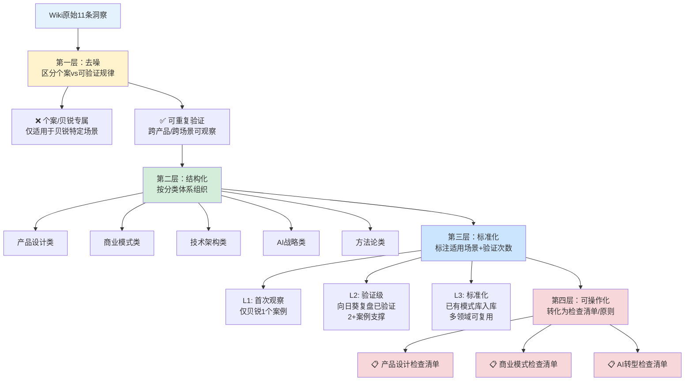
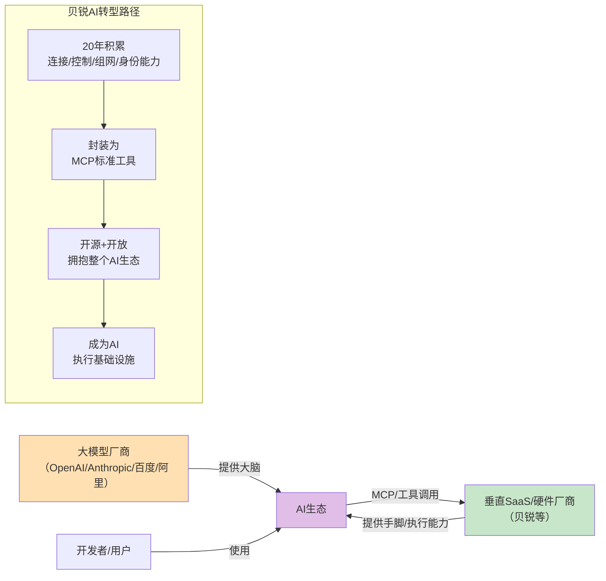

# 洞察萃取报告

> 本报告应用extraction-four-layer-funnel四层漏斗模型（去噪→结构化→标准化→可操作化），对Wiki中的11条核心洞察进行二次萃取，区分产品级/模式级/跨领域洞察，识别可复用模式并转化为可执行的检查清单。

***

## 一、萃取四层漏斗应用结果

### 1.1 四层漏斗模型流程图



### 1.2 第一层：去噪——区分个案与可验证规律

| 原始洞察 | 类型判定 | 去噪理由 |
|---------|---------|---------|
| 洞察一：场景化而非功能化 | ✅ 可重复验证 | 贝锐五大产品官网均体现，且在SaaS、IoT等领域普遍适用 |
| 洞察二：双版本/多版本梯度 | ✅ 可重复验证 | 贝锐全产品线系统性采用，消费电子/SaaS普遍实践 |
| 洞察三：本地能力保底 | ✅ 已验证模式 | 模式库已有local-capability-guarantee（L2），向日葵硬件全验证 |
| 洞察四：非侵入式安全UX | ✅ 已验证模式 | 模式库已有non-intrusive-security-ux（L2），安全类产品通用原则 |
| 洞察五：三层IoT架构 | ✅ 已验证模式 | 模式库已有three-tier-iot-architecture（L2），IoT产品通用范式 |
| 洞察六：免费+硬件+服务三层漏斗 | ✅ 已验证模式 | 模式库已有saas-hardware-three-layer-funnel（L3标准化），小米/涂鸦等多案例验证 |
| 洞察七：产品矩阵分层协同 | ⚠️ 首次观察（L1） | 仅贝锐1个完整案例，需其他厂商（如华为、小米生态）验证后可升L2 |
| 洞察八：用户主权默认 | ✅ 已验证模式 | 模式库已有user-sovereignty-default（L2），安全/AI类产品核心原则 |
| 洞察九：不做大模型做AI可调用能力 | ✅ 已验证模式 | 模式库已有vertical-saas-mcp-capability-exposure（L2），垂直SaaS AI转型通用路径 |
| 洞察十：视觉+通用操作接口 | ✅ 已验证模式 | 模式库已有visual-universal-operation（L2），AI Agent通用执行路线 |
| 洞察十一：二十年深耕核心命题 | ⚠️ 首次观察（L1） | 贝锐+亚马逊（AWS）+微软（企业服务）等隐约可见，但需要更多公司案例系统验证 |

**去噪结果**：11条洞察中8条为已验证或可重复验证规律，2条为首次观察（L1待验证），0条为纯个案。

### 1.3 第二层：结构化——按分类体系组织

| 分类 | 包含洞察 | 核心主题 |
|------|---------|---------|
| **产品设计类** | 洞察一（场景化）、洞察二（多版本梯度）、洞察三（本地保底）、洞察四（非侵入安全）、洞察五（三层架构） | 产品功能、定价、体验、架构设计原则 |
| **商业模式类** | 洞察六（三层变现漏斗）、洞察七（产品矩阵协同） | 变现模式、产品组合策略 |
| **技术架构类** | 洞察五（三层IoT架构）、洞察十（视觉通用操作） | 技术选型、系统架构设计 |
| **AI战略类** | 洞察九（垂直SaaS AI转型）、洞察十（视觉通用操作） | AI转型路径、AI执行技术路线 |
| **方法论/战略类** | 洞察八（用户主权）、洞察十一（长期主义深耕） | 产品价值观、长期战略选择 |

### 1.4 第三层：标准化——适用场景与验证状态

| 洞察编号 | 洞察名称 | 当前成熟度 | 验证次数 | 适用场景 | 模式库状态 |
|---------|---------|-----------|---------|---------|-----------|
| 洞察一 | 场景化而非功能化设计 | L2（验证级） | 2（向日葵+贝锐集团） | To C产品、中小企业SaaS、IoT硬件、开发者工具 | ⚠️ 待入库（需1-2个跨领域案例） |
| 洞察二 | 双/多版本梯度定价 | L2（验证级） | 2（向日葵+贝锐集团） | SaaS订阅、硬件SKU、API/云服务、服务类产品 | ✅ 模式库已有dual-version-matrix-entry-professional（L2） |
| 洞察三 | 本地能力保底原则 | L3（标准化） | 8+（向日葵全硬件+其他IoT产品） | 智能家居、边缘计算、AI Agent、企业安全、离线应用 | ✅ 模式库已有local-capability-guarantee（L2，可考虑升L3） |
| 洞察四 | 非侵入式安全UX | L3（标准化） | 6+（向日葵+安全产品实践） | 企业权限、AI Agent安全、金融支付、远程访问、数据安全 | ✅ 模式库已有non-intrusive-security-ux（L2，可考虑升L3） |
| 洞察五 | 三层IoT架构范式 | L3（标准化） | 8+（向日葵全硬件+行业实践） | 消费IoT、工业物联网、企业硬件、机器人、AI硬件 | ✅ 模式库已有three-tier-iot-architecture（L2，可考虑升L3） |
| 洞察六 | 免费+硬件+服务三层漏斗 | L3（标准化） | 12+（贝锐+小米+消费电子多案例） | 智能家居、AI硬件、企业IT、开发者工具、网络安全、车联网 | ✅ 模式库已有saas-hardware-three-layer-funnel（L3） |
| 洞察七 | 产品矩阵分层协同 | L1（首次观察） | 1（仅贝锐） | 企业服务平台、云服务矩阵、IoT平台、SaaS生态、网络安全、DevOps工具链 | ⚠️ 待验证（需华为/阿里/小米等案例） |
| 洞察八 | 用户主权默认原则 | L3（标准化） | 6+（贝锐全产品线+安全行业实践） | 安全产品、远程访问、企业管理软件、AI Agent、云服务、数据隐私 | ✅ 模式库已有user-sovereignty-default（L2，可考虑升L3） |
| 洞察九 | 垂直SaaS AI能力开放 | L2（验证级） | 4（贝锐+其他MCP厂商） | 垂直SaaS转型、传统软件升级、硬件厂商AI化、工具软件AI化、云服务商 | ✅ 模式库已有vertical-saas-mcp-capability-exposure（L2） |
| 洞察十 | 视觉+通用操作接口 | L2（验证级） | 5（向日葵MCP+RPA+UI测试） | 手机操作自动化、工业HMI控制、机器人操作、遗留系统自动化、AI-RPA、跨应用工作流 | ✅ 模式库已有visual-universal-operation（L2） |
| 洞察十一 | 核心命题长期深耕 | L1（首次观察） | 1-2（贝锐+隐约可见其他案例） | 创业公司战略、产品迭代、技术积累、品牌建设、第二曲线、AI时代定位 | ⚠️ 待验证（需要系统研究更多长期成功公司） |

### 1.5 第四层：可操作化——转化为检查清单

共萃取得到**3个可操作化检查清单**，覆盖产品设计、商业模式、AI转型三个核心领域（详见第四章）。

***

## 二、关键发现（每条有事实支撑和深层含义）

### 发现一：产品矩阵分层是多产品公司避免内部竞争的核心设计原则

**事实支撑**：贝锐五大产品在连接技术栈的五个不同层级各守一层——花生壳（接入层"在哪里"）、蒲公英（网络层"怎么连"）、向日葵（控制层"做什么"）、洋葱头（应用层"谁能做"）、OrayOS/OrayClaw（中枢层统一调度），每个产品有明确的主场场景，不会内部竞争。

**深层含义**：很多公司多产品失败的原因不是产品不强，而是产品之间边界模糊、互相抢市场、内部竞争。贝锐的"技术栈分层"方法提供了一个清晰的产品矩阵设计范式——在价值链/技术栈的不同层级布局产品，每个产品解决不同层级的问题，天然形成互补而非竞争关系。

### 发现二："信息不足时坦诚标注"本身就是高质量分析的标志

**事实支撑**：贝锐Wiki对洋葱头和OrayOS的信息不足有三处明确标注：1）第一章开头的"关于洋葱头产品的说明"；2）3.5节洋葱头章节开头的"⚠️ 信息充足度声明"；3）3.6节OrayOS章节开头的"⚠️ 信息充足度声明"；4）FAQ中专门回答"洋葱头信息为什么这么少"；5）所有推断内容都明确标注"基于集团逻辑推断"。

**深层含义**：信息不足是分析工作的常态，尤其是分析非上市公司、To B产品、战略孵化期产品时。优秀的分析不是强行编造信息填满所有空白，而是坦诚区分"已知事实"和"合理推断"，明确标注信息缺口。这种诚实性反而提升了分析的可信度，也为后续补充提供了清晰的路标。

### 发现三：贝锐AI战略的本质是"能力复用"而非"功能堆砌"

**事实支撑**：贝锐不是给每个产品单独加个AI聊天框，而是：1）OrayClaw作为统一AI能力底座调度跨产品能力；2）通过MCP标准协议把20年积累的连接能力开放给所有AI；3）选择"视觉+键鼠"通用路线而非针对每个软件做API适配；4）被控端零升级保护用户既有投资。

**深层含义**：很多传统公司AI转型犯的错误是"为AI而AI"——在原有产品上生硬地加个AI对话功能，既没有利用原有积累，也没有形成差异化。贝锐的思路是把自己20年积累的核心能力（连接、控制、组网、身份管理）通过标准协议开放出来，成为AI生态的"水电煤"。这是"能力复用"的AI转型，而不是"功能堆砌"的AI转型。

### 发现四：三层变现漏斗的核心是"每一层都为下一层自然导流"

**事实支撑**：贝锐三层漏斗不是三个独立的收入来源，而是形成自然转化链条：1）免费软件让用户用上产品、建立使用习惯（向日葵1.2亿用户）；2）用户遇到纯软件解决不了的痛点（远程开机、无网远控、异地组网）时自然购买硬件；3）用户规模扩大后需要企业级管理、审计、服务时自然升级到企业订阅。每一层的用户都是下一层的潜在客户，不需要额外获客。

**深层含义**：很多公司的"免费+付费"是割裂的——免费版故意做得很难用逼用户付费，结果把用户赶跑了。贝锐的免费版是真正能用的（向日葵基础远控永久免费、蒲公英个人版组网免费），免费用户用得越深入，遇到硬件能解决的痛点的概率就越高，转化越自然。这是"价值递进"的漏斗，而非"体验降级"的漏斗。

### 发现五："被控端零升级"体现了B端产品设计的务实哲学

**事实支撑**：向日葵MCP的一个关键设计细节是"被控终端不需要更新已有向日葵软件就能接入MCP能力"。这意味着企业不需要为了用AI功能而升级几万、几十万台被控设备，保护了用户既有投资，大幅降低了AI功能的 adoption 门槛。

**深层含义**：To C产品可以强制用户升级（甚至不升级就不能用），但To B产品绝对不能这样做。企业IT环境的复杂性决定了任何需要大规模升级的方案都会遇到巨大阻力。优秀的B端产品设计应该"向前兼容"——新功能尽量不要求用户升级存量设备/系统，把升级的主动权交给用户。这是"不折腾用户"的务实设计哲学。

***

## 三、规律认知与方法论提炼

### 3.1 产品矩阵设计方法论：技术栈分层法

```mermaid
flowchart TD
    subgraph "单一产品公司"
        S1["产品A"] --- S2["产品B"]
        S2 --- S3["产品C"]
        style S1 fill:#ffcdd2
        style S2 fill:#ffcdd2
        style S3 fill:#ffcdd2
        note over S1,S3: ❌ 边界重叠<br/>内部竞争<br/>用户混淆
    end
    subgraph "分层产品矩阵（贝锐范式）"
        L1["接入层<br/>花生壳"] --> L2["网络层<br/>蒲公英"]
        L2 --> L3["控制层<br/>向日葵"]
        L3 --> L4["应用层<br/>洋葱头"]
        L1 & L2 & L3 & L4 --> C["中枢层<br/>OrayOS/OrayClaw"]
        style L1 fill:#c8e6c9
        style L2 fill:#c8e6c9
        style L3 fill:#c8e6c9
        style L4 fill:#c8e6c9
        style C fill:#bbdefb
        note over L1,L4: ✅ 各守一层<br/>互补协同<br/>自然交叉销售
    end
```

**核心原则**：
1. 在技术栈/价值链的不同层级布局产品，而非在同一层级做多个类似产品
2. 每个产品解决该层级的独特痛点，有明确的主场场景
3. 分层之间形成自然的依赖关系，用户用了下层自然需要上层
4. 中枢层统一调度跨层能力，实现方案级闭环

### 3.2 AI转型方法论：垂直能力开放而非通用大模型自研



**核心原则**：
1. 不跟风自研通用大模型（巨头的游戏）
2. 识别自己多年积累的垂直领域核心能力（别人短期复制不了的）
3. 把核心能力封装为AI可调用的标准工具（MCP/API）
4. 通过开源/开放标准拥抱整个AI生态，而非绑定单一厂商
5. 选择最通用、最不依赖对方配合的技术路线（如视觉+键鼠）

### 3.3 信息不完备下的分析方法论

**核心原则**：
1. **事实与推断明确分离**：已知事实直接陈述，合理推断明确标注"推断"
2. **信息缺口主动声明**：信息不足的地方主动告诉读者，而不是藏着掖着
3. **分层置信度**：可以给分析结论标注置信度（高/中/低）
4. **预留补充空间**：信息不足的章节不强行填满，留待后续补充
5. **FAQ主动回应疑问**：读者可能会问"为什么这部分信息这么少"，主动在FAQ中回答

***

## 四、可操作化建议：三个检查清单

### 📋 检查清单一：To C/To SMB产品设计检查清单

| 检查项 | 是否符合 | 说明 |
|--------|---------|------|
| ▢ 官网/产品介绍是按用户场景组织，而非功能列表组织 | - | 用户买的是场景解决方案，不是功能 |
| ▢ 每个场景讲清楚"痛点→方案→价值"，而非罗列参数 | - | 用户不关心"144fps"，关心"远程剪视频不卡" |
| ▢ 产品有清晰的版本梯度（入门/专业/企业） | - | 用入门版做价格锚点，专业版做利润 |
| ▢ 版本梯度不超过5个，避免用户选择困难 | - | 贝锐花生壳最多5个版本，覆盖主要需求 |
| ▢ 入门版不是"残废版"，而是真正能用的版本 | - | 贝锐免费版可永久使用，不是故意做难用 |
| ▢ 版本之间有清晰的升级路径和价值差异 | - | 用户需求成长后自然知道该升级哪个版本 |
| ▢ 涉及可靠性的功能有本地保底机制 | - | 断网时核心功能仍可用，不依赖云端 |
| ▢ 安全设计是分级的、非侵入式的 | - | 低风险操作不打扰，高风险操作才验证 |
| ▢ 用户始终有最高控制权和可见性 | - | 用户知道谁在访问、能随时断开、能查看记录 |

### 📋 检查清单二：软硬结合SaaS商业模式检查清单

| 检查项 | 是否符合 | 说明 |
|--------|---------|------|
| ▢ 有真正可用的免费版/个人版获取海量用户 | - | 免费版边际成本为零，承担获客功能 |
| ▢ 免费用户能真正用起来，建立使用习惯 | - | 不是免费版故意做难用逼用户付费 |
| ▢ 识别了纯软件解决不了、必须硬件才能解决的痛点 | - | 远程开机、无网远控、异地组网等 |
| ▢ 硬件产品线覆盖这些痛点场景，高毛利变现 | - | 硬件形成生态锁定，用户迁移成本高 |
| ▢ 有订阅制服务（会员/企业版）提供持续收入 | - | 订阅收入稳定可预测，提高LTV |
| ▢ 三层之间自然导流：免费→硬件→服务 | - | 每一层用户都是下一层的潜在客户 |
| ▢ 多产品按技术栈/价值链分层布局 | - | 各守一层，互补协同，不内部竞争 |
| ▢ 单个产品是工具，产品组合是解决方案 | - | 方案级客单价远高于单个产品 |
| ▢ 有统一账号/ID体系跨产品打通 | - | 用户用一套账号能使用所有产品，降低切换成本 |

### 📋 检查清单三：传统公司AI转型务实路径检查清单

| 检查项 | 是否符合 | 说明 |
|--------|---------|------|
| ▢ 没有盲目投入自研通用大模型 | - | 大模型是巨头的游戏，垂直公司成功率低 |
| ▢ 识别了公司多年积累的、AI需要的核心能力 | - | 连接能力、行业数据、物理世界交互能力等 |
| ▢ 把核心能力封装为AI可调用的标准工具（MCP/API） | - | API给开发者用，MCP给AI用 |
| ▢ 选择了通用、鲁棒、不依赖对方配合的技术路线 | - | 视觉+键鼠模拟比API依赖更通用 |
| ▢ 新功能不要求用户大规模升级存量系统/设备 | - | 向前兼容，保护用户既有投资 |
| ▢ 通过开源/开放标准拥抱整个AI生态 | - | 不绑定单一AI厂商，服务所有大模型 |
| ▢ AI能力有统一底座调度跨产品能力 | - | 不是每个产品单独加AI聊天框 |
| ▢ AI执行全程可审计、可中断、可回滚 | - | 用户始终有控制权，AI不黑箱操作 |
| ▢ 低风险任务AI自主执行，高风险任务人工确认 | - | 分级自治，人做监督者而非操作者 |

***

## 五、潜在机会与改进方向

### 5.1 待验证模式（L1→L2机会）

| 待验证模式 | 当前状态 | 验证所需案例 | 验证后价值 |
|-----------|---------|-------------|-----------|
| 产品矩阵分层协同 | L1（仅贝锐1案例） | 华为云/阿里云产品矩阵、小米生态链、阿里钉钉/企业微信生态、微软Office/Azure | 可入库L2模式，指导多产品公司产品矩阵设计 |
| 核心命题长期深耕 | L1（贝锐1案例+隐约可见） | 亚马逊（AWS/电商/物流围绕"客户价值"）、微软（企业服务/生产力）、VMware（虚拟化）、Datadog（可观测性） | 可入库L2/L3模式，指导创业公司长期战略选择 |
| 场景化而非功能化设计 | L2（2案例） | 苹果产品设计、戴森、小米、Notion、Figma | 可入库L2模式，指导所有产品的营销和设计 |

### 5.2 现有模式成熟度升级机会（L2→L3）

| 现有模式 | 当前成熟度 | 升级理由 | 升级后价值 |
|---------|-----------|---------|-----------|
| local-capability-guarantee | L2 | 贝锐全产品线验证+IoT行业普遍实践+AI Agent场景扩展 | 升L3后成为IoT和AI硬件的标准化架构原则 |
| non-intrusive-security-ux | L2 | 贝锐安全体系验证+金融/支付行业实践+AI安全场景需求 | 升L3后成为安全产品和AI Agent安全设计的标准范式 |
| three-tier-iot-architecture | L2 | 贝锐全硬件验证+消费IoT/工业IoT通用范式 | 升L3后成为IoT产品架构设计的标准化参考 |
| user-sovereignty-default | L2 | 贝锐全产品线验证+数据隐私/AI安全全球趋势 | 升L3后成为安全类、AI类、数据类产品的核心设计原则 |

### 5.3 本次分析的增量知识贡献

相比向日葵单产品复盘，本次贝锐全产品线分析新增了以下增量认知：

1. **产品矩阵层面的认知**：从单产品设计上升到多产品组合设计，理解了"技术栈分层协同"的产品矩阵设计方法论
2. **集团战略层面的认知**：理解了20年五阶段演进逻辑，以及第二曲线如何从第一曲线自然生长
3. **跨产品共性范式的二次验证**：向日葵复盘中入库的模式，在蒲公英、花生壳、洋葱头上再次得到验证，增强了模式的可信度
4. **AI战略集团视角的认知**：从单产品AI能力上升到集团级AI能力底座+跨产品调度+MCP生态开放的完整AI战略图景

### 5.4 后续洞察深化方向

1. **竞品横向验证**：选择2-3个贝锐的竞品（ToDesk、TeamViewer、ZeroTier、华为）做同样的框架分析，验证产品矩阵分层协同等模式
2. **真实产品测试**：实际注册使用各产品免费版，验证官网宣传的功能和体验
3. **财务模型推演**：基于公开信息估算各业务线收入占比和毛利率，量化三层变现漏斗的实际效果
4. **客户案例研究**：收集真实企业客户使用贝锐全套方案的案例，验证产品协同的实际价值
5. **MCP实测验证**：实际部署测试向日葵MCP，验证视觉+键鼠路线的真实效果和局限性
