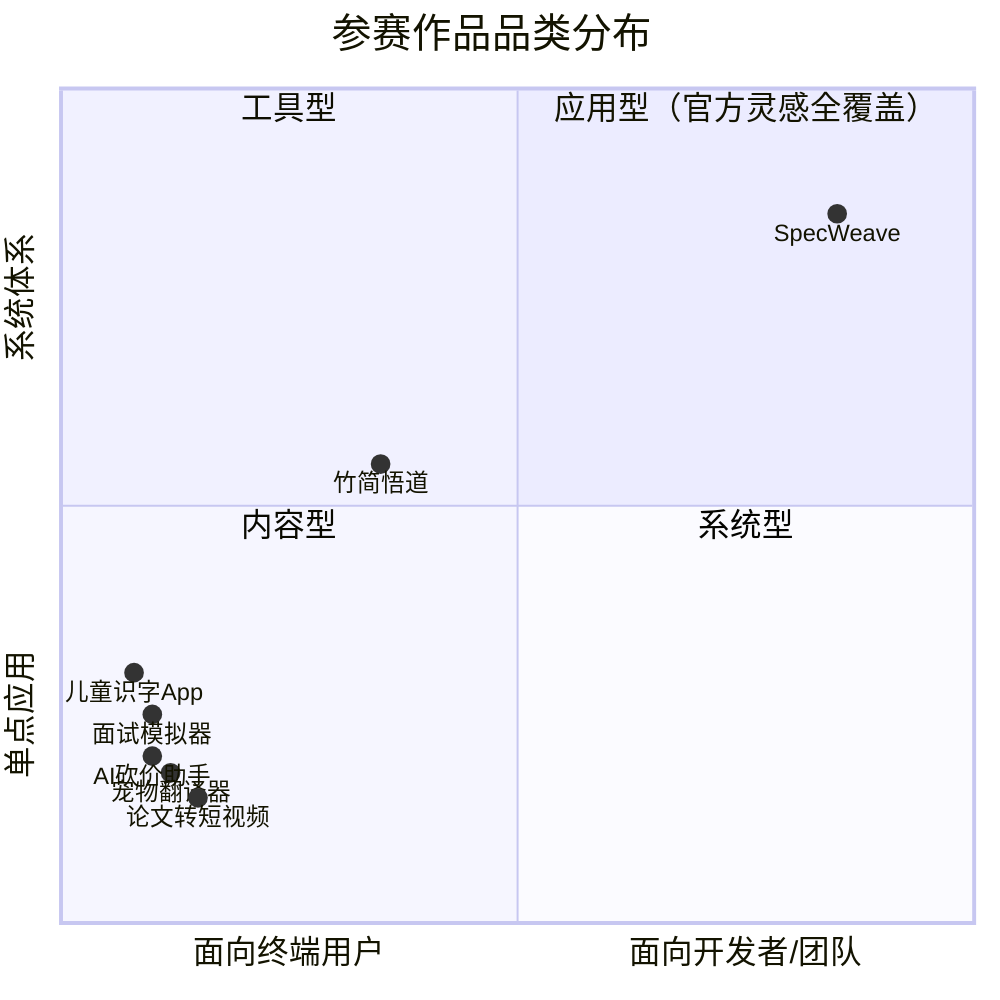

# 二、执行复盘：分析流程与方法论

## 2.1 信息来源与可信度分层

本轮分析综合了十三个信息来源，按权威层级排列：

| 来源 | 类型 | 信息密度 | 可信度 | 关键增量 |
|------|------|---------|--------|---------|
| [初赛参赛指南](https://forum.trae.cn/t/topic/22549) | 赛段规则 | 评审4维+权重、Demo帖模板(5部分)、人气榜计分规则(≥500赞门槛)、奖励细则 | 最高 | 评审维度权重(创新30%/体验30%/TRAE深度20%/价值20%)、人气最低门槛≥500赞 |
| [赛事细则](https://bytedance.larkoffice.com/wiki/DScwwZPzsikvNzk5slJc2kgpnie) | 赛事章程 | 赛道设置、赛程详解、晋级机制、奖金池(113万)、评审体系、知识产权 | 最高 | 单作品限制、全人工评审、独立晋级不重复占位、奖金池 113 万 |
| [竹简悟道报名帖](https://forum.trae.cn/t/topic/28207) | 报名帖 | daoyi 于 6/17 发布的「学习工作+社会公益」赛道报名帖，已通过审核，是本次分析的**真实参赛作品** | 最高（已通过审核） | **真实参赛身份确认**——主作品为竹简悟道（帛书道德经 AI 反思工具），SpecWeave 为方法论基础设施 |
| [创作规范与参赛指南](https://my.feishu.cn/wiki/PBeMwUbB6ipyx6kjxCMcYlaynMe) | 二手汇总（耿家威个人） | 汇总官方规则为 11 章技能指南，含 6 个结构化表格（赛事日程、赛道介绍、评审标准、决赛奖项、学习资料、资源链接） | **中高**（二手加工，存在矛盾：Q17 允许修改原帖 vs 报名指南"重发新帖"；评审维度名称与赛事细则不一致） | **社会公益赛题特别奖 4 个 ¥50,000/队**（此前未知）、评审维度"表达与呈现"提法、允许用外部 AI 做辅助分析（Q29）、报名帖可修改再审（与报名指南矛盾） |
| [晋级&获奖公示](https://bytedance.larkoffice.com/wiki/WN1CwOygLiyM7BkW8X3cMgh7nob) | 公示入口 | 报名审核通过名单（按工作日滚动更新）、初赛结果公示时间 | 最高 | 竞争规模确认（12,000+人）、7月21日初赛结果、昵称一致性 |
| [Community Live #13](https://bytedance.larkoffice.com/wiki/L1UlwL1XFip1FxkLPt9cUGySnfh) | 产品直播 | TRAE 产品架构讲解：Rules/Skills/Slash命令/三智能体体系 | 最高 | **SpecWeave 方法论的产品根基**——Rules 特性是 AGENTS.md 体系的底层基础 |
| [Community Live 产品介绍场](https://bytedance.larkoffice.com/docx/JINtdCSkSob27BxLyRyc2kZXnPd) | 产品直播 | TRAE 品牌定义（The Real AI Enabler）、双产品线（IDE vs Work）、目标用户分层 | 最高 | **TRAE 产品线双轨定位**——SpecWeave 位于 IDE 产品线的最高使用深度；品牌口号"智能无限，协作无间" |
| [创意文档学习资料](https://bytedance.larkoffice.com/wiki/INVIwWx7KiKGgMk4mxacDReFnwb) | 实操指南 | 报名6步流程、3套Prompt模板、5项AI质检清单 | 高 | 标准化Prompt模板→同质化风险、HTML自动生成机制 |
| [大赛报名指南](https://forum.trae.cn/t/topic/22548) | 操作手册 | 报名帖模板、标签格式、审核标准、奖励细则 | 最高 | 报名帖逐段格式要求、HTML 上传限制(20MB) |
| [抖音流量扶持入口](https://bytedance.larkoffice.com/share/base/form/shrcnzp18Sdf6XQxm8wGPPXDt4b) | 操作表单 | 话题格式、提及要求、提交流程、审核周期 | 最高 | 精确话题格式、@提及要求、5 万曝光/条 |
| [保姆级教程](https://forum.trae.cn/t/topic/22569) | 实操指南 | 视频+图文教程链接、Demo 提交格式选项 | 高 | Demo 提交流程确认、"可运行≠部署上线" |
| [大赛官网](https://www.trae.cn/ai-creativity) | 品牌页面 | 赛道定义、评委阵容、奖项结构、创意灵感示例 | 高 | 赛道哲学定义、品牌叙事、30+ 官方灵感 |
| [FAQ 文档](https://bytedance.larkoffice.com/wiki/Mv7CwCVNNiK2v6k28K8cP5NrnSe) | 规则文档 | ~30 个问答，覆盖全流程 | 最高 | 评审维度、晋级机制、奖励领取细节 |

### 2.1.1 报名指南关键增量（此前两轮分析未覆盖）

| 信息 | 此前了解 | 报名指南新增 | 策略影响 |
|------|---------|-------------|---------|
| 报名帖具体格式 | "≥100 字" | 精确 4 部分模板：创意名称+介绍 / 目标用户及痛点 / 价值与意义 / HTML 产物 | 策略化撰写每部分内容 |
| 标签格式 | 未明确 | **四选一**：生活娱乐/学习工作/社会服务/硬件交互；可附加社会公益 | 确认标签用法 |
| HTML 上传 | "上传 HTML" | 直接上传到社区，**20MB 以内** | 控制 HTML 文件大小 |
| 奖励发放时间 | "实时发放" | "当天完成报名的，奖励将于次日发放"；已持同类权益者改发等值奖励(¥99、100次、31天) | 了解时间线 |
| 审核机制 | "每个工作日" | **审核只看前一天新发的帖**，修改旧帖不重新审核 | 确认"重发不修改"策略 |
| 重要链接集 | 未汇总 | 6 个链接：保姆级教程 / FAQ / 抖音入口 / 赛事细则(含评审规则) / 速通领奖 / 晋级公示 | 获取所有参考材料 |
| 报名流程总图 | 未明确 | 5 步：TRAE Work 生成 HTML → 发帖 → 审核 → 通过 → 领奖 | 简化用户理解 |

### 2.1.2 🆕 抖音流量扶持机制详解

抖音流量扶持并非自动发放，而是一个**主动申请 + 人工审核**的流程。关键机制如下：

| 机制要素 | 详细说明 | 策略影响 |
|---------|---------|---------|
| 前置条件 | 必须**已通过报名审核**，且已在初赛区**发布 Demo 帖** | 时间线：先通过报名审核 → 提交 Demo → 再申请抖音流量 |
| 话题格式 | `#vibecoding 大赏` `#TRAEAI 创造力大赛`（**精确无空格**） | 此前认知的话题格式有误（写成了 `#vibe coding 大赏` `#TRAE AI 创造力大赛`），必须修正 |
| 提及要求 | 发布抖音视频时必须 **@TRAE @抖音科技** | 两个 @ 均为硬性要求，缺一不可 |
| 提交流程 | 在抖音发布视频后，**填写飞书表单**提交申请：抖音用户名、Demo 帖链接、抖音帖链接、社区个人主页截图 | 发布抖音 ≠ 获得流量；填写表单后进入人工审核 |
| 审核周期 | 表单提交后**2 个工作日内**人工审核 | 需预留至少 2 天的审核等待时间 |
| 流量额度 | **每条符合条件的帖子获得 50,000 曝光扶持** | 非流量池模式，而是按条定额分配——多发多扶持 |
| 持续时间 | 表单中明确标注"活动期间" | 需确认活动结束日期，在此之前持续产出抖音内容 |

**此前策略与官方机制的关键差异**：

| 要素 | 此前策略（错误） | 官方要求（正确） | 修正成本 |
|------|---------------|---------------|---------|
| 话题格式 | `#TRAE AI 创造力大赛` `#vibe coding 大赏` | `#TRAEAI 创造力大赛` `#vibecoding 大赏` | 极低（修正文字即可） |
| 提及 | 未涉及 | @TRAE @抖音科技 | 极低（发布时补上） |
| 流量获取 | 以为话题加持自动获得 | 需填写飞书表单申请 | 新增步骤（约 5 分钟） |

### 2.1.3 🆕 赛事细则关键增量（此前所有轮次分析未覆盖）

赛事细则文档是本次迭代的核心数据来源，揭示了此前所有轮次均未覆盖的关键机制：

| 信息 | 此前了解 | 赛事细则新增 | 策略影响 |
|------|---------|-------------|---------|
| 晋级限制 | 未明确 | **同一账号下只取得分/人气分最高的 1 个作品晋级**（专业评审通道和抖音人气通道均适用） | 100% 聚焦一个作品，不做"多作品分散投稿" |
| 通道占位 | 未明确 | **同一作品同时通过两条通道，仅占用 1 个晋级名额、不重复晋级也不顺延补位** | 无需反复权衡通道选择，一个作品同时冲击两通道即可 |
| 参赛形式 | 未明确 | **仅支持个人参赛** | 无需考虑团队组织形式 |
| 奖金池总额 | 未明确 | **113 万元**（此前分析引用了官网但未确认总额） | 确认赛道大奖 ¥50,000 在总池中的占比 |
| 评审方式 | 未明确 | **初赛、复赛和决赛全部采用人工评审**（非 AI 评审） | 对"人"的叙事说服力比技术参数更重要 |
| 每周直播 | 未明确 | **大赛期间每周举办一场线上直播**（赛制规则讲解 + 开发拆解） | 可参与直播了解评审倾向、展示作品思路 |
| 知识产权 | 未明确 | 用户**永久、不可撤销地授权**主办方非独家信息网络传播权 | Apache 2.0 开源项目无冲突——开源许可证已授予更广泛权利 |
| 初赛详细评审 | 未知 | 初赛详细评审维度与标准在**另一个独立文档**中（《TRAE AI 创造力大赛 · 报名与初赛详细说明》） | 该文档尚未获取，下一轮迭代优先目标 |

> ⚠️ **重要发现**：赛事细则文档自身**不含**初赛评审的维度拆解与权重——它引用了一个独立文档（`GiunwGMFjiPhpekTWwYcLokQnVe`）。这意味着我们目前的分析在"评审维度权重"层面仍存在信息缺口。复赛和决赛的评审标准将随赛程阶段开启后另行公布。

### 2.1.4 🆕 信息源获取状态（更新）

| 文档 | 链接/Token | 状态 | 对分析的贡献 |
|------|-----------|------|------------|
| **初赛参赛指南** | [社区帖子](https://forum.trae.cn/t/topic/22549) | ✅ 已获取（见 §2.1.6） | 补齐评审维度权重、人气榜门槛、奖励细则、双通道独立性、已有作品参赛规则——核心缺口已关闭 |
| **报名与初赛详细说明** | wiki `GiunwGMFjiPhpekTWwYcLokQnVe` | ⬜ 仍未获取 | 初赛参赛指南已覆盖其中大部分关键信息，增量价值有限，不再作为阻塞性依赖 |

### 2.1.5 🆕 保姆级教程关键增量（实操流程确认）

教程帖提供的是实操指导而非规则条款，但其价值在于**官方推荐路径的明确化**：

| 信息 | 此前了解 | 教程明确 | 策略影响 |
|------|---------|---------|---------|
| Demo 提交格式 | "上传 HTML" | **三种格式**：① 可公开访问的体验链接 ② 交互式 HTML ZIP 打包上传社区 ③ 硬件交互赛道可用 Bilibili 演示视频 | SpecWeave 走第②条（HTML ZIP）——无需部署服务器 |
| 部署澄清 | 担心"需要部署上线"才能参赛 | **"可运行 ≠ 部署上线"**——评审只看核心功能可体验 | 消除部署焦虑——HTML 文件是官方认可的一等提交格式 |
| 工具推荐 | "用 TRAE Work/IDE" | TRAE Work **Auto 模式**是官方推荐的创意提案生成方式 | 报名帖 HTML 直接用 TRAE Work Auto 模式生成 |
| 教程结构 | 未明确 | 三部分：创意提案（报名）→ 产品 Demo（初赛）→ 线上直播（陪跑） | 确认官方对"报名→初赛"两阶段的认知模型 |

> **关键澄清**：教程确认 Demo 提交的 HTML ZIP 路径是**正式、合规、推荐**的提交方式——不是临时替代方案。这对 SpecWeave 的"文档即产品"定位是直接的操作许可。

### 2.1.5b 🆕 创意文档学习资料关键增量（报名阶段实操细节）

该学习资料是保姆级教程中引用的"如何生成创意文档"的详细图文版，提供了三套标准 Prompt 模板等实操细节：

| 信息 | 此前了解 | 学习资料新增 | 策略影响 |
|------|---------|-------------|---------|
| **标准化 Prompt 模板** | 报名帖需 3 部分内容 | 官方提供了**3 套可直接复制粘贴的 Prompt 模板**（赛道推荐 / 创意完善 / 报名帖生成） | 大多数参赛者将使用相同模板——报名帖结构高度同质化 |
| HTML 生成机制 | "用 TRAE Work 生成 HTML" | TRAE Work 从创意 Doc 文档**自动生成 HTML**——非手动编写 | 官方教程孵化的 HTML 文件在结构和风格上可能高度相似 |
| **AI 质检 5 项清单** | 未明确 | 创意名称清晰度 / 问题具体性 / 目标用户明确性 / 产品形态清晰度 / 价值可信度 | 可用于自检 SpecWeave 报名帖——每一项都是过关信号 |
| "产品策划助手"模式 | 未明确 | 赋予 AI **产品策划助手**角色，连续问 5 个问题检验创意可行性 | 可复用的方法论——报名帖提交前做"角色扮演审查" |
| 文件操作细节 | "上传 HTML ZIP" | Mac 可直接拖文件；Windows 不支持路径跳转——需手动找文件路径；确认步骤截图 | 纯操作层面，无策略影响 |
| TRAE Work 模式 | "用 TRAE Work" | **明确推荐 Work 模式**（非 Code 模式）用于报名阶段——面向非开发者 | 确认报名阶段大部分参赛者使用的工具和模式 |

> **关键洞察**：学习资料提供的标准化 Prompt 模板意味着大量报名帖将遵循完全相同的生成路径（TRAE Work → 复制 Prompt → 生成 Doc → 生成 HTML）。在高度同质化的报名池中，SpecWeave 的报名帖和 HTML 文件需要刻意制造**结构性差异**——详见洞察 11。

### 2.1.5c 🆕 晋级&获奖公示关键增量（竞争规模与公示机制确认）

晋级&获奖公示是此前多个来源中引用的滚动公示入口，其价值在于提供了**竞争规模的实际数据**：

| 信息 | 此前了解 | 公示文档新增 | 策略影响 |
|------|---------|-------------|---------|
| **竞争规模** | "可能很多人参赛" | 公示文档中各日期的通过人数累加已超 **12,000 人**——且报名尚未截止（7 月 15 日截止） | 专业评审通道 300 席 vs 可能 15,000-20,000 报名者 → **晋级率约 1.5-2%** |
| 公示机制 | "每天审核" | **按工作日滚动更新**，同步在社区/社群/短信/官网发布 | 审核和公示节奏已确认 |
| 昵称一致性 | 未注意到 | **全程使用同一社区账号、不更换昵称**——否则影响核验与发奖 | 提交前确认昵称不再变更 |
| 初赛结果时间 | "7月21-23日" | **7 月 21 日统一发布**（晋级复赛名单 + 初赛优秀奖 TOP 2,000） | 精确到日——7 月 21 日是初赛的"D-Day" |

> **关键认知**：12,000+ 的已通过规模将此前洞察中的"极端长尾分布"进一步强化——在 15,000-20,000 人的报名池中脱颖而出需要的不是"稍微好一点"，而是"让人无法归类到任何其他作品中"。

### 2.1.5d 🆕 Community Live #13 关键增量（TRAE 产品架构→SpecWeave 方法论的产品根基）

NO.13 直播是产品经理对 TRAE 产品架构的正式讲解，揭示了与 SpecWeave 直接相关的核心 AI 能力：

| 能力 | TRAE 原生支持 | SpecWeave 的延伸 | 叙事价值 |
|------|------------|-----------------|---------|
| **Rules 规则** | 用户可在设置中用自然语言配置 Rules（如"遇到 API 泄露停止开发"、"在代码文件上方添加注释"） | SpecWeave 的 AGENTS.md 体系本质上是 **Rules 的系统化工程**——从单条规则升级为四层架构的完整方法论 | ⭐⭐⭐⭐⭐ 这是"从产品能力到方法论体系"的完整叙事线 |
| **Skills 技能** | 可在技能市场添加预置 Skills，使用时会自动识别加载（如 PPT Skills） | SpecWeave 可封装为一个 TRAE Skill——"TRAE 协作规范 Skill"，参赛者使用它来优化自己的 TRAE 工作流 | ⭐⭐⭐⭐ 直接的产品集成路径 |
| **Slash 命令** | Spec 模式（大型重组）/ Plan 模式（中小型开发）/ 自定义指令 | SpecWeave 的复盘流程与 TRAE 的 Spec 模式天然对齐——AGENTS.md 规范就是 Spec 的输入 | ⭐⭐⭐ 工作流对齐 |
| **三智能体体系** | Chat / Agent / Solo Agent + 可自定义子智能体 | SpecWeave 的 .agents/ 目录结构恰好构成了一个"智能体目录"的完整框架 | ⭐⭐ 架构隐喻 |

**核心发现**：TRAE 产品经理在分享中专门介绍了 Rules 特性——这一特性正是 SpecWeave 方法论作用于 TRAE 的底层基础。SpecWeave 不是在 TRAE 之外另建一套规则体系——它是在 TRAE **原生支持的 Rules 特性**之上，将其从"零散的规则列表"系统化为"四层架构的方法论工程"。

这一发现为 SpecWeave 的参赛叙事提供了一个此前缺失的关键环节：**你的产出物并非 TRAE 平台的附加品——它根植于 TRAE 的产品基因，是产品能力的深度延伸**。任何评审（尤其是产品经理背景的评委）在看到"我在 TRAE 内置的 Rules 特性基础上构建了一套完整的方法论"时，会产生两种强烈的正面感知：(1) 这是对 TRAE 产品能力的深度应用而非浅层使用；(2) 这个作品是在"拓宽 TRAE 的可能性边界"，符合官方对创造力大赛的期待。

### 2.1.5e 🆕 Community Live 产品介绍场关键增量（TRAE 产品线双轨定位）

Community Live 产品介绍场（6/17，面向 TRAE 新用户的产品定位直播）以正式品牌语言定义了 TRAE 的完整面貌，与 #13 场形成互补——#13 讲产品能力（怎么做），本场讲产品定位（是什么/给谁用）：

| 信息 | 详情 | SpecWeave 的关联 |
|------|------|-----------------|
| **品牌定义** | TRAE = "The Real AI Enabler" | SpecWeave 的核心命题"让 AI 协作从一场对话升级为工程体系"是对这一品牌承诺的工程师级诠释 |
| **品牌口号** | 「智能无限，协作无间」 | SpecWeave 的 AGENTS.md 体系恰好实现"协作无间"的工程化保障 |
| **产品线 1：TRAE IDE** | 「你的专属 AI 开发工程师」——深度融合 AI 的开发工具，保留完整 IDE 能力 | **SpecWeave 的核心战场**——AGENTS.md 四层架构是对 IDE 中 AI 智能体协作的系统化工程 |
| **产品线 2：TRAE Work** | 「全新上线的智能工作助手」——独立 AI 工作台，网页/桌面/移动三端，Work & Code 双模式 | SpecWeave 不在此线——Work 追求轻量提效，非方法论建构 |
| **目标用户分层** | IDE 面向"需要精细掌控代码的开发者"；Work 面向"所有人" | SpecWeave 精确命中 IDE 产品线的目标用户画像 |

**核心发现**：TRAE 不是一款产品，而是两条产品线。这一区隔对参赛策略的三层影响：

1. **评审预期修正**：IDE 赛道的评审期望是"深度使用"——不是"我用 AI 做了应用"，而是"我如何将 AI 深度融入工程流程"。SpecWeave 完美命中这一预期。
2. **赛道归位**：竹简悟道主作品是 IDE 线上"一个应用的深度开发"；SpecWeave 辅助作品是 IDE 线上"开发方法论本身的系统化建构"。两作品在同一产品线的不同深度形成垂直互补。
3. **品牌叙事锚定**：TRAE 承诺"AI 赋能"，SpecWeave 证明"如何最大化这一赋能"——形成了品牌宣言与工程实践的闭环。

### 2.1.6 🆕 初赛参赛指南关键增量（解决了从 v3 追踪至今的评审维度缺口）

初赛参赛指南是本次迭代最重要的数据来源——它补齐了赛事细则中缺失的**初赛评审维度与权重**：

| 信息 | 此前了解 | 初赛指南新增 | 策略影响 |
|------|---------|-------------|---------|
| **评审维度与权重** | "创新性/完成度/用户体验/技术实现"（FAQ推测） | **产品创新性 30% / 用户体验与产品完成度 30% / TRAE 应用深度 20% / 社会商业价值 20%** | 终结了多轮推测——可直接做策略分配（详见 §2.5.2 及 §4.1.2 双作品四维评审得分预估） |
| 人气榜门槛 | 未明确 | **单条内容点赞 ≥ 500** 才能进入人气榜计分 | 抖音人气通道有硬性门槛——500 赞是战术目标而非累积量 |
| 初赛参与奖 | 未明确 | **专业评审得分前 2,000 名**获 ¥100 大赛专属礼包 | 初赛阶段的保底奖励确认 |
| 晋级复赛奖 | 未明确 | Pro+ 月卡 + **TRAE 导师一对一指导** + 明星导师沟通 + 高曝光传播资源 | 晋级后的额外价值（非现金） |
| 双通道独立性 | "相互独立" | 同一选手**两作品分别从两通道晋级**时，只保留专业评审晋级的作品 | 一个账号下作品 A 走专业 + 作品 B 走抖音 = 只保留 A |
| 已有作品参赛 | 未明确 | **可以不是从 0 创建**——已有作品在参赛期间完成实质性版本迭代即可 | SpecWeave 的既有积累可直接复用 |
| 公示时间 | "7月中下旬" | **7 月 21-23 日**在社区/社群/短信/官网公示 | 精确的等待周期 |

### 2.1.7 🆕 信息缺口更新

初赛参赛指南补齐了评审维度的核心缺口。当前唯一仍未获取的重要文档为《报名与初赛详细说明》（wiki `GiunwGMFjiPhpekTWwYcLokQnVe`），但初赛参赛指南已包含其中大部分关键信息，其增量价值可能有限。

### 2.1.9 🆕 元复盘完成——知识转化闭环（2026-06-25）

在 v11 定稿后，对本分析项目执行了完整的元复盘（复盘→洞察→萃取→更新），产出见 [retrospective-meta-20260625/](retrospective-meta-20260625/README.md)。元复盘从 v3→v11 的全生命周期中萃取了 **6 条元洞察**（信息源分层采集/信息缺口感知与策略暂挂/规则条款双面性/定位漂移早期识别/全量重写幂等性/元复盘价值）和 **4 个可复用方法论模式**（信息源分层采集策略/模板同质化避让策略/反向借势/元复盘双轮法），连同 v11 迭答复盘阶段入库的 5 个模式，本次分析项目合计贡献 **9 个方法论模式**。元复盘验证了一个规律：复盘的层级决定知识可迁移的范围——第一层复盘产出存档，第二层（元）复盘产出可跨项目复用的方法论。

### 2.1.8 🆕 重大策略转向：从 SpecWeave 单作品到双作品交叉叙事（v10 → v11）

**触发事件**：在 v10 版本完成后，确认了实际参赛身份——报名帖 [竹简悟道](https://forum.trae.cn/t/topic/28207)（学习工作 + 社会公益赛道）已于 6/17 提交并通过审核。这意味着此前全部 v3-v10 的分析均基于一个**假设的参赛身份**（SpecWeave 作为主作品参赛），而实际参赛身份为竹简悟道作为主作品。

**策略影响矩阵**：

| 分析维度 | v10（SpecWeave 单作品） | v11（竹简悟道主 + SpecWeave 辅） | 变化性质 |
|---------|----------------------|-------------------------------|---------|
| 主作品 | SpecWeave（未报名） | 竹简悟道（已通过审核 ✅） | 根本性替换 |
| 赛道 | 学习工作 | 学习工作 + 社会公益 | 新增社会公益赛道机会 |
| 四维评审重心 | 创新性（品类独占）+ 补强体验短板 | 创新性（逆周期定位）+ 社会价值满格 + TRAE 深度靠 SpecWeave 加持 | 维度分布更均衡 |
| SpecWeave 定位 | 独立参赛作品——冲击赛道大奖 | 方法论基础设施——增强主作品 TRAE 应用深度维度 | 从「竞争者」变为「增强器」 |
| 资源分配 | 100% 投入 SpecWeave | 80% 竹简悟道 + 20% SpecWeave | 重心转移 |
| 叙事策略 | 「我是怎么用 TRAE 研究出 AI 智能体协作的方法论」 | 「我用 TRAE 发现了方法论，并用它开发了一款逆周期的 AI 反思工具」 | 从单向叙事变为交叉叙事 |

**核心洞察**：赛事规则「同一账号只取最高分 1 个作品晋级」在此次转向中起到了关键的策略约束作用——它消除了「两个作品分别投稿增加概率」的 FOMO 心理，强制聚焦于一个作品的极致表达。SpecWeave 的 v3-v10 分析资产（13 项优势、13 条叙事洞察）并未因此作废——它们被重新定位为竹简悟道在 TRAE 应用深度维度的**证据弹药库**。

**v10 资产的再利用路径**：

```
v10 SpecWeave 分析资产
├── 13 项优势 → 浓缩为竹简悟道 Demo 帖 §4 的「方法论证据」
├── 13 条叙事洞察 → 共享策略中的人工评审叙事框架（§4.3.1）
├── Demo 帖模板 → 拆分为竹简悟道版（完整）和 SpecWeave 版（轻量级）
├── 抖音传播策略 → 共享策略，新增联合内容方向
├── 全流程行动清单 → 两作品并行版，严格 80/20 时间分配
└── 赛事数据来源 → 全部保留，新增竹简悟道报名帖
```

## 2.2 赛道精准匹配（v11 双作品确认版）

在 v11 策略转向后，参赛格局明确为「竹简悟道（主作品） + SpecWeave（方法论基础设施）」的双作品架构。以下分别分析两作品与赛道的匹配关系。

### 2.2.1 主作品：竹简悟道——学习工作（主）+ 社会公益（附加）

竹简悟道报名帖已于 6/17 通过审核，定位为学习工作赛道（主）+ 社会公益赛道（附加）：

| 赛道关键词 | 竹简悟道的对应 | 匹配度 |
|-----------|---------------|--------|
| 「新一代」 | 面向 AI 时代的传统文化现代化——以帛书版《道德经》哲学链为内核的 AI 反思引导工具 | ⭐⭐⭐⭐⭐ |
| 「学习与工作方式」 | 四路径 AI 反思对话（虚静内观/自然无为/柔弱不争/生活实践）——不是知识查询，而是思维训练 | ⭐⭐⭐⭐⭐ |
| 「更高效」 | 「概念解缚」——在所有 AI 追求更快更准的时代，刻意追求更慢、更深、更静的反思质量 | ⭐⭐⭐⭐ |
| 「协同」 | 竹简卷轴 UI 的仪式感 + AI 反思对话引擎 + 每日一问机制——人机协同的"慢思考"体验 | ⭐⭐⭐⭐⭐ |
| 「智能」 | 帛书版完整哲学链（反者道之动→玄同）驱动对话逻辑——非关键词匹配，而是哲学结构引导 | ⭐⭐⭐⭐⭐ |
| 「职业成长体验」 | 面向职场转型者、创业决策者的内心困惑——帮助用户在"不追求答案"中获得成长 | ⭐⭐⭐⭐ |
| 社会公益（附加） | 传统文化数字化传承 + 心理健康辅助工具 + Freemium 模型 = 双重公益属性 | ⭐⭐⭐⭐⭐ |

### 2.2.2 辅助作品：SpecWeave——学习工作（方法论基础设施）

SpecWeave 作为方法论基础设施，其赛道匹配定位为「竹简悟道 TRAE 应用深度的证据层」：

| 赛道关键词 | SpecWeave 的对应 | 匹配度 |
|-----------|-----------------|--------|
| 「新一代」 | 面向 AI 智能体协作的全新工作范式 | ⭐⭐⭐⭐⭐ |
| 「学习与工作方式」 | 规范 AI 智能体的角色、协议与工作流 | ⭐⭐⭐⭐⭐ |
| 「更高效」 | 142 次协作实践 → 34 个方法论模式的效率提升证据 | ⭐⭐⭐⭐ |
| 「协同」 | 7 角色 + 5 协议 + 3 工作流的多智能体协作体系 | ⭐⭐⭐⭐⭐ |
| 「智能」 | 感知→认知→执行→治理四层闭环的自我演进机制 | ⭐⭐⭐⭐⭐ |
| 「职业成长体验」 | 开源可迁移 → 任何 AI 开发团队可直接采用的成长工具 | ⭐⭐⭐⭐ |

> **策略定位**：SpecWeave 不独立冲击赛道晋级——它作为竹简悟道在「TRAE 应用深度（20%）」维度的证据弹药库存在。其在学习工作赛道的匹配度仅作为双作品交叉叙事中的"方法论深度证明"，而非独立得分来源。

### 2.2.3 标签选择（确认版）

| 作品 | 主标签（必选） | 附加标签（可选） | 说明 |
|------|-------------|---------------|------|
| 竹简悟道 | `学习工作` | `社会公益` | 已通过报名审核 ✅ |
| SpecWeave | `学习工作` | — | 轻量级报名，核心价值在交叉叙事而非独立参赛 |

## 2.3 竞争定位：双作品的品类矩阵

30+ 官方灵感示例全部为 C 端应用（AI 砍价助手、儿童识字 App、宠物翻译器等）。竹简悟道和 SpecWeave 分别占据两个独特的象限位置——两作品从不同维度与全部官方灵感形成对角线差异。



**双作品品类矩阵分析**：

| 作品 | 象限位置 | 与官方灵感的差异 | 竞争环境 |
|------|---------|----------------|---------|
| 竹简悟道 | 右上区（C 端 × 系统深度） | 虽面向终端用户，但其内核是帛书哲学链驱动的反思系统——具有 C 端应用罕见的"思想深度" | 赛道内以 C 端工具类为主，竹简悟道的文化/哲学属性使其难以被归类 |
| SpecWeave | 极右上角（开发者 × 完整体系） | **品类独占**——30+ 官方灵感中没有任何涉及"如何更好地使用 TRAE 本身" | 无同品类竞争对手——所有其他作品都在"用 TRAE 做东西"，而 SpecWeave 在"研究如何更好地用 TRAE" |

**核心策略含义**：两作品不构成内部竞争，而是在不同维度各自占据品类空白——竹简悟道在 C 端用户路径中占据"传统文化 × AI 反思"的独特交叉点，SpecWeave 在开发者工具路径中占据"AI 协作方法论"的品类独占位。在「同一账号只取最高分 1 个作品」规则下，双作品的核心价值不是分散风险，而是通过交叉叙事让主作品（竹简悟道）的关键评审维度获得方法论层面的证据支撑。

## 2.4 晋级机制详解（赛事细则确认版）

赛事细则明确了初赛的两条独立晋级通道及其核心约束：

### 2.4.1 通道容量与规则

| 通道 | 席数 | 取作品规则 | 关键约束 |
|------|------|-----------|---------|
| 专业评审通道 | **300 席** | 同一账号下综合得分最高的 1 个作品 | 多作品投稿仅取最优，不累加 |
| 抖音人气通道 | **50 席** | 同一账号下人气分最高的 1 个作品 | 同上 |

### 2.4.2 通道交叉规则

```
同一作品同时通过两通道 → 仅占用 1 个晋级名额
                        → 不重复晋级
                        → 不顺延补位
```

**策略含义**：实际进入复赛的作品总数可能少于 350 个。对双作品策略而言：
- **无需在多通道间做取舍**——一个作品可以同时冲击两个通道
- **专业评审是主战场**——300 席 vs 50 席，专业评审通道的容量是抖音的 6 倍
- **抖音作为补充杠杆**——如能同时通过两通道，不影响晋级名额分配
- **主作品聚焦**——竹简悟道同时冲击专业评审 + 抖音人气双通道，SpecWeave 不单独运营抖音内容

### 2.4.3 参赛形式约束

赛事细则明确**仅支持个人参赛**。对双作品策略无影响（本就是个人项目），但确认了不存在"团队协作加分"机制。

## 2.5 评审机制详解（双作品视角）

### 2.5.1 评审方式：全部人工

赛事细则 §5.3 明确：**初赛、复赛和决赛全部采用人工评审**。

这与许多 AI 大赛的"AI+人工混合评审"模式有本质区别。人工评审意味着：

| 维度 | 对双作品策略的影响 |
|------|-------------------|
| 叙事清晰度 | 评审是人，需要"一眼看懂"你的作品是什么——不能用技术术语堆砌。竹简悟道的"竹简卷轴 UI + 帛书哲学链"比 SpecWeave 的"四层架构方法论"更直观 |
| 差异化冲击 | 评审连续看几十个作品后会产生疲劳——两作品分别在不同的维度（C 端视觉/开发者方法论）产生品类切换效应 |
| 情感共鸣 | 人是情感动物——"在所有 AI 追求更快的时代，我做了一款追求更慢的 AI"比"我开发了一个方法论工具"有更强的情感说服力 |
| 证据可信度 | 人能判断证据链的完整性——142 次对话记录 + SpecWeave 规范截图比单一 Demo 更能证明 TRAE 使用深度 |
| Session ID 验证 | 评审期主办方将要求候选作品提供 Session ID 等创作过程证明——竹简悟道的开发过程由 SpecWeave 规范全程记录 |

### 2.5.2 初赛评审维度与权重（初赛参赛指南确认版 ⭐⭐⭐⭐⭐）

初赛参赛指南明确了专业评审通道的四个维度及权重。以下为 v11 双作品策略下的维度分析：

**竹简悟道（主作品）四维评审得分预估**：

| 维度 | 权重 | 得分预估 | 竹简悟道论据 | SpecWeave 加持 | 策略优先级 |
|------|------|---------|------------|--------------|-----------|
| **产品创新性** | **30%** | ★★★★★ | 「概念解缚」——在所有 AI 追求"更快更准"的时代，刻意追求"更慢、更深、更静"的逆周期定位。帛书版完整哲学链作为对话引擎，非任何现有 AI 产品具备 | — | P0 全力铺排 |
| **用户体验与产品完成度** | **30%** | ★★★★☆ | 竹简卷轴 UI + 四路径对话（虚静内观/自然无为/柔弱不争/生活实践）+ 每日一问机制——需确保 HTML ZIP 可完整体验核心功能 | — | P0 保障核心体验流畅 |
| **TRAE 应用深度** | **20%** | ★★★★★ | 竹简悟道的全部开发在 TRAE 中完成 | ⭐⭐⭐⭐⭐ SpecWeave 提供完整证据链——142 次对话 + AGENTS.md 规范截图 + Session ID 记录 | **P0 SpecWeave 证据注入** |
| **社会/商业价值** | **20%** | ★★★★★ | 社会公益赛道天然高分（传统文化现代化 + 心理健康辅助）+ Freemium 商业模式 | Apache 2.0 开源 + AGENTS.md 标准生态贡献 | P1 叙事突出 |

**加权总分预估：约 4.7/5**

**关键发现——双作品策略的评审维度覆盖**：

```
竹简悟道独立覆盖：创新性(30%) + 体验(30%) + 社会价值(20%) = 80%
SpecWeave 赋能维度：TRAE 应用深度(20%)               = 20%
                                    ─────────────────────
双作品交叉叙事总覆盖：                                 100%
```

这一维度分布揭示的双作品协同逻辑：
- **竹简悟道独立打满 80%**：创新性（逆周期定位）、体验（竹简卷轴 UI）、社会价值（传统文化+心理健康）三个维度竹简悟道可自主完成
- **SpecWeave 赋能 20%**：TRAE 应用深度是人工评审中最容易被"用 TRAE 做了一个 App"这种浅层叙事蒙混过关的维度。SpecWeave 的 142 次对话记录使竹简悟道在这一维度获得其他参赛者无法复制的证据链
- **最大风险**：竹简悟道的体验与完成度占 30%——竹简卷轴 UI 的 HTML ZIP 必须确保交互流畅、核心功能可用，避免被评审视为"半成品"

**策略重心**：将 60% 投入放在竹简悟道的**产品打磨**（竹简 UI 交互 + 四路径对话引擎），30% 投入在**叙事铺排**（让评审在创新性和 TRAE 深度上打出最高分），10% 投入 SpecWeave 的**证据整理**（交互式导航页 + 142 次对话时间线 + AGENTS.md 截图）。

### 2.5.3 复赛与决赛评审

赛事细则 §5.2 明确指出：**复赛、决赛的评审维度与标准将随相应赛程阶段开启后另行公布**。这意味着当前阶段（报名/初赛期），所有人对复赛和决赛评审的了解程度是一致的——不存在信息差。

## 2.6 知识产权与合规说明

| 条款 | 内容 | 对双作品策略的影响 |
|------|------|-------------------|
| 知识产权授权 | 用户永久、不可撤销地授权主办方非独家信息网络传播权，以及为宣传推广所需的转载、复制、改编、汇编权 | 两作品均为 Apache 2.0 开源许可证——已授予更广泛权利，无新增约束 |
| 原创性要求 | 作品不得在其他赛事中获奖，不得在公开平台以参赛成品形态公开展示 | 竹简悟道和 SpecWeave 均为首次参赛作品，无冲突 |
| 创作工具限制 | 作品须全部使用 TRAE Work 或 TRAE IDE 创作，需提供创作过程证明 | 两作品的全部开发均在 TRAE 中完成——竹简悟道由 SpecWeave 规范全程记录，材料天然充足 |
| 提交后不可修改 | 提交截止后不得擅自补交、替换、撤回或修改——否则视为放弃资格 | 提交前务必完成两作品的质量审查 |

## 2.7 🆕 v12 迭代：创作规范与参赛指南的增量贡献

### 2.7.1 文档性质评估

本指南为耿家威（个人）汇总的"AI 技能指南"，非 TRAE 官方一手出品。其汇总了多个官方文档的核心规则，但存在**两处与官方源的矛盾**：

| 问题 | 本指南 | 官方源 | 建议 |
|------|--------|--------|------|
| 报名帖未过能否修改原帖 | 可以修改后等重新审核（Q17） | 报名指南：**不建议，直接重发新帖** | 重发更安全 |
| 评审维度名称 | 创意与价值 / 产品完成度 / TRAE 使用深度 / 表达与呈现 | 赛事细则：产品创新性 / 用户体验与产品完成度 / TRAE 应用深度 / 社会商业价值 | 以赛事细则为准 |

**结论**：本指南可作为快速参考，但在规则细节上以官方一手源为准。

### 2.7.2 🔥 关键增量：社会公益赛题特别奖

决赛奖项表格明确列出**社会公益赛题特别奖**：**4 个名额，¥50,000/队**。此前我们只知道有"社会公益"附加赛题，但从未在任何官方文档中确认其有**独立奖项**——这一发现对竹简悟道的策略有直接影响：

| 维度 | 此前认知 | 新信息 | 策略变化 |
|------|---------|--------|---------|
| 奖项通道 | 学习工作赛道大奖 ¥50,000（1 个名额） | **新增**：社会公益特别奖 ¥50,000（4 个名额） | **双通道获奖机会**——竹简悟道可同时冲击赛道大奖 + 社会公益奖 |
| 竞争者规模 | 学习工作赛道 ~3,000 人（1/4 总报名） | 社会公益：附加选报，参赛者远少于四大赛道 | 社会公益通道的竞争对手**远少于**学习工作赛道 |
| 获奖概率 | 单一通道 300 进赛事大奖 | 两通道并行——一个从千人中突围，一个从百人中突围 | 社会公益通道获奖概率可能**高出 10 倍** |

**策略建议**：竹简悟道在 Demo 帖中应**同等重视**社会公益叙事——不只是"附带选了公益标签"，而是用专门段落展示帛书《道德经》数字化传播的社会价值（降低古籍学习门槛、高压时代下的精神健康支持、从个人到生态的解缚能力扩散效应）。

### 2.7.3 辅助发现

| 发现 | 策略影响 |
|------|---------|
| Q29：允许用外部 AI 做**辅助分析**（"使用网页 AI 来评估回复和优化提示词是允许的"），核心开发须用 TRAE | 在开发过程中使用外部 AI 辅助分析规则文档、评估策略方案不违规 |
| "表达与呈现"评审维度暗示 | Demo 帖本身的排版、截图质量、文字可读性直接影响评审体验——这不是额外加分项，而是独立评审维度（虽然权重未知） |
| 赛事日程表确认 | 复赛 07.21–08.09，决赛 08.21–08.22——与赛事细则一致 |

---

*数据来源：[初赛参赛指南](https://forum.trae.cn/t/topic/22549) + [赛事细则](https://bytedance.larkoffice.com/wiki/DScwwZPzsikvNzk5slJc2kgpnie) + [Community Live #13](https://bytedance.larkoffice.com/wiki/L1UlwL1XFip1FxkLPt9cUGySnfh) + [Community Live 产品介绍场](https://bytedance.larkoffice.com/docx/JINtdCSkSob27BxLyRyc2kZXnPd) + [创意文档学习资料](https://bytedance.larkoffice.com/wiki/INVIwWx7KiKGgMk4mxacDReFnwb) + [晋级公示](https://bytedance.larkoffice.com/wiki/WN1CwOygLiyM7BkW8X3cMgh7nob) + [报名指南](https://forum.trae.cn/t/topic/22548) + [抖音流量扶持入口](https://bytedance.larkoffice.com/share/base/form/shrcnzp18Sdf6XQxm8wGPPXDt4b) + [保姆级教程](https://forum.trae.cn/t/topic/22569) + [官网](https://www.trae.cn/ai-creativity) + [FAQ](https://bytedance.larkoffice.com/wiki/Mv7CwCVNNiK2v6k28K8cP5NrnSe) + [创作规范与参赛指南](https://my.feishu.cn/wiki/PBeMwUbB6ipyx6kjxCMcYlaynMe) + SpecWeave 项目资产*
