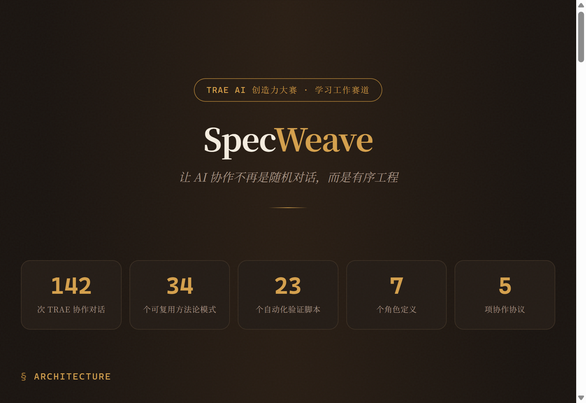
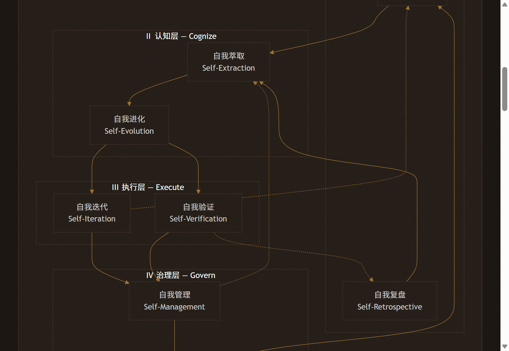
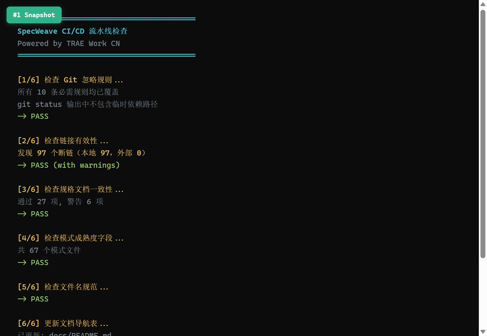

## 1. Demo 简介

**是什么**：一套基于 AGENTS.md 开放标准的 AI 智能体协作规范体系（开源仓库 + 交互式 HTML 导航页），包含 7 个角色定义、5 项协作协议、34 个可复用方法论模式、23 个自动化验证脚本。

**面向谁**：AI 开发团队（5-20 人规模）、个人 AI 重度用户、智能体开发者与运营者、AI 工程化研究者。

**核心功能**：

- **四层闭环架构**：感知层（洞察+复盘）→ 认知层（萃取+进化）→ 执行层（迭代+验证）→ 治理层（管理+发展），让 AI 协作从随机对话变为有序工程
- **AGENTS.md 启动协议**：每次新对话自动加载角色定义和协作规范，AI 启动即理解项目架构，无需重复解释背景
- **CI 验证流水线**：6 项自动化检查（Git 忽略规则 / 链接有效性 / 规格一致性 / 模式成熟度 / 文件名规范 / 导航表更新），确保规范体系自身质量可量化

**量化产出**：142 次 TRAE 对话 → 完整的规范体系（7 角色 / 5 协议 / 34 模式 / 23 验证脚本）+ 持续迭代中的复盘报告库

## 2. Demo 创作思路

**灵感来源**：不是"灵光一现"——是在 TRAE 中进行了 142 次协作对话后，注意到一个可复现的模式：**有明确规范前缀的对话，AI 产出质量显著高于无规范的对话**。于是开始系统化这个发现：从单条规则 → 规则集合 → 角色分工体系 → 四层架构的方法论闭环。Community Live #13 中 TRAE 产品经理介绍的 Rules 特性给了关键启发——TRAE 原生支持规则配置，SpecWeave 将"零散的规则列表"系统化为"四层架构的完整工程体系"。

**想解决的问题**：当 AI 能胜任多种角色时，如何确保它在 100 次对话中始终理解你的意图？当前行业缺乏的不是"如何让 AI 做一件事"，而是"如何让 AI 在持续协作中保持上下文一致性、角色清晰性和产出质量可预测性"。

**为什么做这个方向**：大赛官网 30+ 灵感示例均为 C 端应用，没有任何一个涉及"如何更好地使用 TRAE 本身"——这是一个被所有人忽略的维度。SpecWeave 不是"用 TRAE 做出了什么"，而是"如何与 TRAE 更好地协作"。

## 3. Demo 体验地址

交互式 HTML 导航页（Zip 格式打包上传至本帖附件）：

- 四层架构 Mermaid 可视化（感知→认知→执行→治理的完整闭环）
- 量化数据仪表盘（142 次对话 / 34 个模式 / 23 个验证脚本 / 7 个角色 / 5 项协议）
- 侧边栏导航 + 数字计数动画（页面加载时数字从 0 滚动到目标值）
- 一句话价值主张：「让 AI 协作不再是随机对话，而是有序工程」
- 与竹简悟道（同账号下另一个 TRAE 参赛作品）的关联展示

开源仓库：https://atomgit.com/daoCollective/SpecWeave（Apache 2.0）

### 快速开始（3 种方式）

**方式一：克隆即用（零配置）**

```bash
git clone https://atomgit.com/daoCollective/SpecWeave
```

将仓库根目录指定为 TRAE 工作目录，TRAE 自动读取 `AGENTS.md` 作为项目级指令——AI 启动即理解项目架构，无需手动配置。

**方式二：脚手架初始化（新项目使用）**

```bash
python -m agents init --name "MyProject" --type software --lang zh
```

从 SpecWeave 模板生成新项目的 AGENTS.md + `.agents/` 骨架，支持选择角色（developer/reviewer/architect/orchestrator/tester）、项目类型（software/library）和语言（中/英）。`--dry-run` 可预览不生成。

**方式三：参考模式（深度定制）**

克隆仓库后，参考四层架构和 34 个方法论模式，在自己的项目中构建定制化规范体系。

## 4. TRAE 实践过程

### 4.1 开发流程

SpecWeave 的开发全程在 TRAE Work CN 中完成，核心流程：

1. **AGENTS.md 启动协议设计**：定义上下文路由表，AI 每次启动自动加载角色定义和协作规范
2. **四层架构逐步成形**：从单条规则 → 规则集合 → 角色分工 → 四层闭环架构（感知→认知→执行→治理）
3. **复盘→洞察→导出闭环**：每次对话的经验通过复盘报告沉淀为可复用模式，34 个方法论模式全部从具体问题萃取而来
4. **CI 验证体系搭建**：23 个自动化脚本覆盖链接检查、规格一致性、源溯源等，确保规范体系自身质量可量化
5. **HTML 交互增强**：在 TRAE 中用对话增强 HTML 导航页（侧边栏导航 + 数字计数动画 + 滚动高亮）

### 4.2 关键步骤截图

**截图 1：HTML 导航页——Hero + 量化仪表盘**



在 TRAE Work 中通过对话增强 HTML 导航页，完成 Hero 标题区和量化仪表盘（142 次对话 / 34 个模式 / 23 个验证脚本 / 7 个角色 / 5 项协议），数字从 0 滚动到目标值的动画效果使用 requestAnimationFrame + easeOutCubic 缓动函数。

**截图 2：HTML 导航页——四层架构 + 差异化亮点**



在 TRAE Work 中通过对话生成 Mermaid 四层架构可视化（感知→认知→执行→治理）和差异化卡片，包括与 OpenClaw / Hermes Agent 的行业对标分析。

**截图 3：CI 验证脚本运行结果**



在 TRAE Work 终端中运行 CI 检查，6 项自动化验证全部通过：

```
[1/6] Git 忽略规则 ............ ✅ PASS
[2/6] 链接有效性 .............. ⚠️ PASS (97 个本地断链，已知问题)
[3/6] 规格文档一致性 ........... ✅ PASS (27 项通过，6 项警告)
[4/6] 模式成熟度字段 .......... ✅ PASS (67 个模式文件)
[5/6] 文件名规范 .............. ✅ PASS
[6/6] 文档导航表 .............. ✅ PASS (更新 2 个文件)

CI 检查完成: 6/6 PASS
```

### 4.3 Session ID

| # | Session ID | 对应任务 |
|---|-----------|---------|
| 1 | `2996582939102784:1ae67fd0e645657fe37dda266faa668b_6a3b222481861bccd2bec32c.6a3c847fb9a455f93cfb6a4d.6a3c847fb9a455f93cfb6a4b:TRAE Work CN.0.1.23.no_sid.no_ppe.T(2026/6/25 09:29:35)` | 复盘报告归档 + 飞书文档学习 |
| 2 | `121377507783968:5e488b497a5d375eeffe6223352614c1_6a3c97c9c15cfa4586221db2.6a3ca25fc15cfa4586221fda.6a3ca25fc15cfa4586221fd8:TRAE Work CN.0.1.23.no_sid.no_ppe.T(2026/6/25 11:37:03)` | HTML 交互增强（侧边栏导航+数字动画） |
| 3 | `121377507783968:5c9cae0508a8cbb0bce00cb3626aac9a_6a3c97c9c15cfa4586221db2.6a3ca48dc15cfa4586222065.6a3ca48dc15cfa4586222063:TRAE Work CN.0.1.23.no_sid.no_ppe.T(2026/6/25 11:46:21)` | CI 验证脚本运行 + 项目打磨 |

### 4.4 开发心得

**自指涉证明**：SpecWeave 的内容是"如何更好地与 AI 协作完成项目"，而它的诞生过程本身就是这个命题的最佳实践——142 次 TRAE 对话的量化产出就是证据。不需要解释方法论好不好，体系本身就是证明。

**经验沉淀闭环**：每次对话的经验通过复盘报告沉淀为可复用模式。41 份复盘报告覆盖项目治理、竞品分析、洞察萃取等维度，34 个方法论模式全部从具体问题萃取而来——这不是"一次性灵感"，而是"可复用的工程经验"。

**TRAE 产品能力延伸**：SpecWeave 的 AGENTS.md 体系根植于 TRAE 原生支持的 Rules 特性，是产品能力的系统化扩展。不是"在 TRAE 之外另建一套规则"，而是"将 TRAE 的原生能力系统化为工程体系"。

### 4.5 行业对标：与 OpenClaw / Hermes Agent 的差异化定位

2026 年 AI Agent 赛道两大头部框架——OpenClaw（GitHub 36 万星，Skill 扩展生态）和 Hermes Agent（GitHub 11 万星，自我进化闭环）——都是 **Agent 运行时框架**：它们解决的是"如何让 Agent 运行起来、调用工具、沉淀技能"。

SpecWeave 与它们的根本差异在于**层级不同**：

| 维度 | OpenClaw | Hermes Agent | SpecWeave |
|------|----------|-------------|-----------|
| **层级** | Agent 运行时框架 | Agent 运行时框架 | Agent 协作规范体系 |
| **核心问题** | 如何让 Agent 拥有更多能力 | 如何让 Agent 自我进化 | 如何让多角色 Agent 在持续协作中保持质量一致 |
| **关键机制** | Skill 系统（扩展能力） | 自进化闭环（执行→提炼→沉淀→复用→自省） | 四层闭环架构（感知→认知→执行→治理） |
| **记忆系统** | 混合记忆 + Dream | 分层持久记忆（情节/语义/技能） | 复盘报告库 + 方法论模式库 |
| **模型支持** | 主流模型 | 200+ 模型 | 模型无关（规范层，不绑定运行时） |
| **开源协议** | MIT | MIT | Apache 2.0 |

**关键洞察**：

- **互补而非竞争**：SpecWeave 不替代 OpenClaw 或 Hermes，而是为它们提供"协作规范层"——当你用 Hermes 的自进化闭环沉淀了一个技能后，SpecWeave 的复盘→洞察→导出闭环帮你把这次经验系统化为可复用的方法论模式
- **Hermes 自进化闭环的"上层"**：Hermes 的 5 步循环（执行→提炼→沉淀→复用→自省）是运行时层面的自进化，SpecWeave 的 4 层闭环（感知→认知→执行→治理）是工程层面的自进化——前者让 Agent 变聪明，后者让团队协作变可控
- **品类错位**：OpenClaw 和 Hermes 在比"谁的 Agent 更强"，SpecWeave 在回答"如何让 Agent 的协作可预测、可复用、可验证"——这是不同维度的问题

## 5. 报名帖链接

报名帖：https://forum.trae.cn/t/topic/44402

---

> **关于 SpecWeave 与竹简悟道的关系**：[竹简悟道](https://forum.trae.cn/t/topic/44415)（帛书《道德经》AI 反思引导工具）是本账号下已通过审核的主参赛作品，SpecWeave 是方法论基础设施。在竹简悟道开发全程中，SpecWeave 的 AGENTS.md 规范体系让 TRAE 始终理解"反者道之动→玄同"的核心架构意图，从未偏离。这种"方法论指导 + 方法验证"的互为证明，是两个作品之间真正的协同价值。
