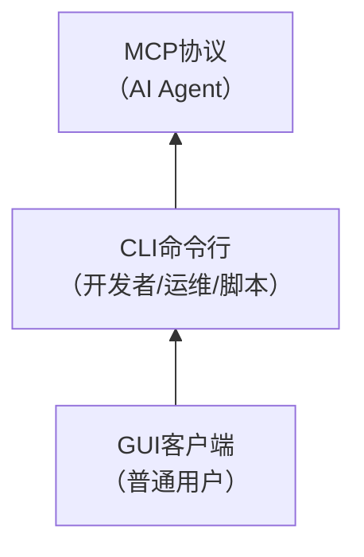

# 洞察萃取

[CMD-LOG] | level=INFO | cmd=insight | step=S3 | event=ROOT_CA_FOUND | session=insgt-20260706-sunlogin-cli-wiki | msg=根因分析完成，共识别3个核心产品洞察+2个元洞察

## 一、产品洞察

### 洞察1：CLI即API——命令行工具的AI原生设计哲学
**支撑事实**：
- 向日葵CLI提供4种输出格式（table/json/yaml/wide），其中JSON格式专门为程序解析设计
- 所有命令输出可被机器消费，而非仅面向人类阅读
- 会话ID机制支持长时操作中断续接，类似API的session token
- 全局选项--output控制输出格式，--verbose控制详细程度，类似API的Accept头和debug参数

**深层含义**：
传统CLI工具主要面向人类交互（表格输出、彩色高亮、进度条），而"CLI即API"设计同时服务两类消费者：
1. **人类用户**：table/wide格式提供友好的可读输出
2. **程序/脚本/AI Agent**：json/yaml格式提供结构化的可解析输出

这种双模式设计不是简单的"加个--json参数"，而是从底层数据模型出发，确保命令输出天然结构化——人类可读格式只是结构化数据的一种渲染方式。

**可复用模式**：`cli-as-api-design`（CLI即API设计模式）— ✅ 已入库 [code-patterns/cli-as-api-design.md](../../../patterns/code-patterns/cli-as-api-design.md)
- **触发条件**：设计命令行工具时，预期会被脚本/自动化/AI Agent调用
- **核心要素**：多格式输出（table/json/yaml）、结构化错误输出（JSON错误对象）、机器可解析的退出码、会话持久化机制
- **反模式**：仅面向人类的彩色表格输出、错误信息混入stdout、没有明确的退出码约定
- **成熟度**：L1（validation_count=1）

---

### 洞察2：归一化坐标系统——跨分辨率的抽象层设计
**支撑事实**：
- 桌面鼠标操作使用[0.0, 1.0]归一化坐标，(0.0, 0.0)为左上角，(1.0, 1.0)为右下角
- 无论被控端屏幕分辨率是1920x1080还是4K，指令格式完全一致
- 连接建立后，CLI自动处理坐标映射

**深层含义**：
这是一个经典的"抽象层"设计决策。如果使用绝对像素坐标：
- 不同分辨率需要不同指令
- AI Agent需要先查询分辨率再计算坐标
- 脚本无法在不同设备间复用

归一化坐标将"屏幕尺寸"这一变量从控制协议中剥离，使控制指令具有分辨率无关性。这与CSS的百分比布局、响应式设计中的相对单位思想一致。

**可复用模式**：`normalized-coordinate-abstraction`（归一化坐标抽象）— ✅ 已入库 [architecture-patterns/normalized-coordinate-abstraction.md](../../../patterns/architecture-patterns/normalized-coordinate-abstraction.md)
- **触发条件**：需要对具有不同尺寸/分辨率/配置的目标发送统一的控制指令
- **核心要素**：使用[0.0, 1.0]区间表示位置、控制协议不携带分辨率信息、被控端负责映射
- **应用场景**：远程桌面控制、UI自动化测试、跨设备鼠标/触摸控制、RPA机器人
- **成熟度**：L1（validation_count=1）

---

### 洞察3：MCP+CLI+GUI三层能力开放体系——分层覆盖不同用户群
**支撑事实**：
- MCP（Model Context Protocol）：面向AI Agent，标准化协议接口，22个工具
- CLI（Command Line Interface）：面向开发者/运维/脚本，命令行工具，7大类命令
- GUI（Graphical User Interface）：面向普通用户，图形客户端，完整交互体验
- 三者在综合分析Wiki中被明确定位为互补关系

**深层含义**：
向日葵构建了一个"三层能力开放金字塔"：

这不是简单的"多个入口"，而是每层都基于相同的底层能力（MCP API），向上封装为不同的交互范式。这种分层设计的关键洞察是：
- **AI Agent需要的不是图形界面，而是结构化的工具调用接口**（MCP）
- **开发者需要的不是图形界面，而是可脚本化的命令行工具**（CLI）
- **普通用户需要的是直观易用的图形界面**（GUI）

很多工具厂商只提供GUI或只提供API，缺少中间层（CLI）。CLI作为"API的人类可调试接口"和"脚本的入口"，是连接API/MCP和GUI的关键桥梁。

**可复用模式**：`three-layer-capability-openness`（三层能力开放体系）— ✅ 已入库 [architecture-patterns/three-layer-capability-openness.md](../../../patterns/architecture-patterns/three-layer-capability-openness.md)
- **触发条件**：构建平台型产品，需要同时服务终端用户、开发者、AI Agent
- **核心要素**：底层API/MCP协议层（机器友好）→ CLI命令行层（人类可调试+脚本友好）→ GUI图形层（终端用户友好）
- **关键价值**：每层受众不同，但共享底层能力；CLI层是连接AI和人类的关键桥梁
- **成熟度**：L1（validation_count=1）

---

## 二、可复用模式清单

| 模式ID | 模式名称 | 成熟度 | 状态 | 入库位置 |
|--------|---------|--------|------|---------|
| cli-as-api-design | CLI即API设计模式 | L1 | ✅ 已入库 | [code-patterns](../../../patterns/code-patterns/cli-as-api-design.md) |
| normalized-coordinate-abstraction | 归一化坐标抽象 | L1 | ✅ 已入库 | [architecture-patterns](../../../patterns/architecture-patterns/normalized-coordinate-abstraction.md) |
| three-layer-capability-openness | 三层能力开放体系 | L1 | ✅ 已入库 | [architecture-patterns](../../../patterns/architecture-patterns/three-layer-capability-openness.md) |

---

## 三、AI Agent系统设计启示

从向日葵CLI的设计中，可以提炼出对AI Agent工具设计的4点启示：

### 启示1：工具必须同时服务于"人类调试"和"机器调用"
- 人类需要table/wide格式进行调试和验证
- AI Agent需要json/yaml格式进行可靠解析
- 缺少任何一方都会导致：人类难以调试（只有JSON），或AI难以解析（只有彩色表格）

### 启示2：会话持久化是长时任务的基础
- 复杂任务（批量部署、渲染）可能持续数小时
- 会话ID机制允许中断续接，类似HTTP session
- AI Agent执行长时任务时，需要能够"暂停-恢复"而非一次性完成

### 启示3：错误信息必须结构化
- 向日葵CLI返回JSON格式的错误对象（含错误码、错误消息）
- 非结构化的错误字符串（如"连接失败"）让AI无法判断重试还是放弃
- 错误码体系（7种错误类型）让AI可以程序化处理不同错误

### 启示4：归一化抽象降低Agent认知负担
- AI不需要知道目标屏幕是1080p还是4K
- AI不需要知道目标设备是什么操作系统（命令执行部分由CLI适配）
- 抽象层让AI使用统一的"心智模型"控制异构设备

---

## 四、元洞察（关于执行过程）

### 元洞察1：独立验证阶段的价值——"第三视角"发现风格一致性问题
- 内容创作者（子代理）按照通用最佳实践添加了./前缀
- 主代理审核时关注内容准确性，忽略了风格一致性
- 独立验证子代理（Task5）发现了风格不一致问题
- **教训**：风格一致性是一种"隐性规范"，需要独立的验证视角才能发现；内容创作者和审核者容易陷入"内容正确即可"的局部视角

### 元洞察2：工具选择需要考虑输入特征
- 初始选择WebFetch因为它是通用网页抓取工具
- 但CLI文档是长文档（1500+行），WebFetch有token截断
- 切换到Defuddle后完整获取内容
- **教训**：工具选择不仅要看"能不能用"，还要看输入特征（文档长度、内容类型、格式）与工具能力的匹配度
