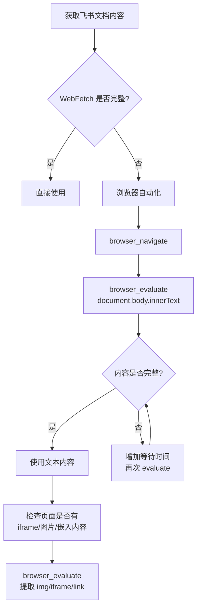

# 洞察萃取：TRAE AI 创造力大赛学习资料分析

## 一、核心洞察

### 洞察 1：飞书文档的动态加载特性与工具选择策略 ⭐⭐⭐⭐

**事实**：使用 WebFetch 获取飞书文档时，仅得到入口页摘要（标题、修改日期、部分正文段落），无法获取 JavaScript 动态渲染的完整文档正文。切换到浏览器自动化工具后，通过 `browser_evaluate` 执行 `document.body.innerText` 成功提取全文。

**分析**：飞书云文档采用客户端渲染（CSR）架构，文档正文通过 JavaScript 异步加载。WebFetch 作为服务端抓取工具，只能获取初始 HTML 骨架，无法执行 JavaScript。浏览器自动化工具在真实浏览器环境中运行，能够完整渲染动态内容。

**洞察**：针对飞书文档的信息获取，应建立分层工具选择策略：
1. **首选**：浏览器自动化 `browser_evaluate` + `document.body.innerText`（最可靠）
2. **次选**：`browser_snapshot`（获取结构化 refs，但内容不够详细）
3. **兜底**：WebFetch（仅适用于静态内容或获取摘要）

**可复用模式**：这验证了项目中已有的 `information-source-layered-collection.md`（信息源分层采集策略）模式——不同信息源需要不同获取工具，应根据源的特性选择适配工具。

### 洞察 2：TRAE 产品定位从 Engineer 到 Enabler 的品牌演进 ⭐⭐⭐⭐

**事实**：TRAE SOLO 已正式升级为 TRAE Work，品牌内涵从 "The Real AI Engineer" 变为 "The Real AI Enabler"。产品线从单一 IDE 扩展为双模式工作台（Work 模式 + Code 模式），覆盖从全员办公到专业开发的全场景。

**分析**：品牌定位从 "Engineer"（指向身份——工程师）到 "Enabler"（指向能力——让你做到某件事）的转变，反映了 TRAE 从开发者工具向全民 AI 工作助手的战略扩展。这一转变与大赛"无身份要求、无技术门槛"的定位高度一致——大赛不是面向工程师的 Hackathon，而是面向所有人的创造力实践。

**洞察**：TRAE 的产品定位演进对 SpecWeave 参赛策略有直接影响：
- SpecWeave 的 AGENTS.md 方法论体系位于 **TRAE IDE 产品线的最高使用深度**——不是 Work 场景下的轻量提效，而是在 IDE 中构建 AI 协作的工程化体系
- 大赛评审看到的不是一个"外部导入的方法论"，而是一个"从 TRAE 产品能力中生长出的方法论"
- 参赛叙事应强调 SpecWeave 是 TRAE IDE 深度使用的最佳实践，而非独立于 TRAE 的外部工具

**关联**：此洞察与现有报告中的"关键信号 2"（Community Live 产品介绍场）一致，但本次从官方产品知识技能角度提供了更权威的验证。

### 洞察 3：大赛学习资料体系的分层结构 ⭐⭐⭐

**事实**：飞书文档 `ARW8wsexFiG80Fkh2VJcIwWNnmh` 是大赛学习资料的入口导航页，内容精简（仅 3 段文字 + 2 个链接），其核心价值在于指向的次级文档。现有报告中已引用的"创意文档学习资料"（`INVIwWx7KiKGgMk4mxacDReFnwb`）是操作层指南，而本次学习的文档是品牌层入口。

**分析**：大赛学习资料体系呈现分层结构：

| 层次 | 文档 | 内容 | 策略价值 |
|------|------|------|---------|
| 品牌层 | `ARW8wsexFiG80Fkh2VJcIwWNnmh`（本次学习） | 产品介绍 + 规则链接 + 提交链接 | 大赛官方学习资料体系入口 |
| 操作层 | `INVIwWx7KiKGgMk4mxacDReFnwb`（已有来源） | 报名流程 + Prompt 模板 + AI 质检清单 | 标准化生成路径→同质化风险 |
| 规则层 | `DScwwZPzsikvNzk5slJc2kgpnie`（赛事细则） | 参赛须知 + 评审规则 + 奖励发放 | 合规底线与评审维度 |

**洞察**：完整的大赛情报体系需要覆盖所有三个层次。现有报告已覆盖操作层和规则层，本次学习补充了品牌层入口，使来源体系更加完整。

### 洞察 4：大赛参赛流程的 5 步法与 SpecWeave 方法论的映射 ⭐⭐⭐

**事实**：CSDN 参赛指南总结了用 TRAE 生成产品 Demo 的 5 步法：选题与创意→环境搭建→原型生成→分步实现→材料提交。每一步都可以用 TRAE Work 或 TRAE IDE 辅助完成。

**分析**：这 5 步法与 SpecWeave 的 Spec-driven 开发流程存在结构性映射：

| 大赛 5 步法 | SpecWeave 对应 | 映射关系 |
|------------|---------------|---------|
| 选题与创意 | 需求分析 + Spec 编写 | 创意文档即 Spec |
| 环境搭建 | 项目初始化 | TRAE IDE 工作空间 |
| 原型生成 | 快速原型 + AI 生成代码 | TRAE AI 助手对话生成 |
| 分步实现 | 迭代开发 + 测试 | 增量验证 + 回归验证 |
| 材料提交 | 交付物整理 + 导出 | TRAE Work 生成报名帖 + HTML |

**洞察**：SpecWeave 的方法论体系天然适配大赛的参赛流程。参赛叙事可以强调"SpecWeave 不是在大赛流程之外另建体系，而是将大赛的 5 步法系统化为可复用的工程方法论"。

### 洞察 5：多源情报迭代法的再次验证 ⭐⭐⭐

**事实**：本次学习任务从单一飞书文档出发，通过 4 类来源（飞书文档 + 大赛官网 + 赛事细则 + 网络报道）和 5 种工具（WebFetch + 浏览器自动化 + WebSearch + WebFetch 官网 + TRAE 产品知识技能）的交叉验证，构建了完整的大赛参赛认知图谱。

**分析**：这再次验证了项目中已有的 `multi-source-intelligence-iteration.md`（多源增量情报迭代法）模式：
- 单一来源（飞书文档）信息不完整
- 通过主动搜索发现次级来源（官网、赛事细则）
- 通过网络报道获取第三方视角
- 通过官方产品知识技能获取权威定位
- 每个新来源都提供了增量信息

**洞察**：多源情报迭代法已从 L2（已验证）向 L3（标准化）演进——本次是第 3 次完整验证（前两次在参赛策略分析报告 v1-v12 迭代过程中），且每次验证都发现了新的增量信息。

---

## 二、规律认知

### 2.1 飞书文档信息获取决策模型

### 2.2 大赛情报来源完整性检查清单

| 检查项 | 来源 | 状态 |
|--------|------|------|
| 品牌层入口 | `ARW8wsexFiG80Fkh2VJcIwWNnmh` | ✅ 本次补充 |
| 操作层指南 | `INVIwWx7KiKGgMk4mxacDReFnwb` | ✅ 已有 |
| 规则层细则 | `DScwwZPzsikvNzk5slJc2kgpnie` | ✅ 已有 |
| 官网品牌页 | `trae.cn/ai-creativity` | ✅ 已有 |
| FAQ 文档 | `Mv7CwCVNNiK2v6k28K8cP5NrnSe` | ✅ 已有 |
| 报名指南 | `forum.trae.cn/t/topic/22548` | ✅ 已有 |
| 保姆级教程 | `forum.trae.cn/t/topic/22569` | ✅ 已有 |
| 初赛参赛指南 | `forum.trae.cn/t/topic/22549` | ✅ 已有 |
| 晋级公示 | `WN1CwOygLiyM7BkW8X3cMgh7nob` | ✅ 已有 |
| Community Live #13 | `L1UlwL1XFip1FxkLPt9cUGySnfh` | ✅ 已有 |
| Community Live 产品介绍场 | `JINtdCSkSob27BxLyRyc2kZXnPd` | ✅ 已有 |
| 竹简悟道报名帖 | `forum.trae.cn/t/topic/28207` | ✅ 已有 |
| 创作规范与参赛指南 | `PBeMwUbB6ipyx6kjxCMcYlaynMe` | ✅ 已有 |
| TRAE 产品知识技能 | `docs.trae.cn/llms.txt` | ✅ 本次补充 |

---

## 三、潜在机会

### 3.1 现有报告来源补充

本次学习发现的飞书文档 `ARW8wsexFiG80Fkh2VJcIwWNnmh` 可作为现有参赛策略分析报告（v12）的第 13 个来源，补全品牌层入口。虽然该文档内容精简，但其作为大赛官方学习资料体系入口的定位，使来源体系更加完整。

### 3.2 TRAE 产品知识技能的常态化使用

本次任务中调用 `TRAE-product-knowledge` 技能获取了官方产品定位，避免了依赖网络报道中的二手信息。建议在后续的大赛相关分析中，将 TRAE 产品知识技能作为常规信息源之一。

### 3.3 飞书文档获取工具链的标准化

本次任务中形成的"WebFetch 初筛 → 浏览器 evaluate 兜底"工具链，可作为获取飞书文档内容的标准流程，写入项目知识库。

---

*数据来源：飞书学习资料 + 大赛官网 + 赛事细则 + TRAE 产品知识技能 + 网络公开报道*
