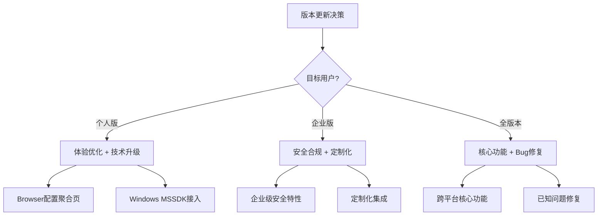

# 洞察萃取：TRAE v3.3.74 版本发布分析

## 一、核心洞察

### 洞察 1：TRAE 个人版功能加速迭代的战略信号 ⭐⭐⭐⭐⭐

**事实**：v3.3.74 版本的两项核心更新（Browser 配置聚合页、Windows MSSDK 接入）均标注"仅个人版"。此前版本更新中，功能通常同时面向个人版和企业版。

**分析**：
- 个人版专属功能的集中发布，表明 TRAE 正在加速个人版的差异化竞争
- 个人用户群体增长可能已成为 TRAE 的战略重点
- 企业版可能在进行更深度的定制化开发，与个人版形成不同迭代节奏
- - "仅个人版"的标注方式，可能是为了管理企业用户的预期，避免功能缺失导致的困惑

**洞察**：TRAE 的产品战略正在从"统一版本"向"分版本差异化"演进。个人版聚焦用户体验优化和技术架构升级，企业版可能聚焦安全合规和定制化功能。这一战略转变对 SpecWeave 的参赛策略有影响——个人版的功能创新更适合作为参赛 Demo 的展示亮点。

**关联**：此洞察与"TRAE 产品定位从 Engineer 到 Enabler"的演进方向一致，个人版的体验优化是 Enabler 定位的具体体现。

---

### 洞察 2：Windows 平台技术架构从自研向官方方案迁移 ⭐⭐⭐⭐

**事实**：TRAE 此前在 Windows 平台上基于自研沙箱 SDK 实现命令执行的安全隔离，此次接入 MSSDK（微软官方 SDK）。

**分析**：
- 自研方案的优势：完全可控、灵活定制
- 自研方案的劣势：稳定性、兼容性、安全合规性难以与官方方案媲美
- 官方方案的优势：经过广泛测试、与系统深度集成、符合安全标准
- 迁移时机：TRAE 已进入成熟阶段，需要更稳定的基础架构支撑快速迭代

**洞察**：技术架构从"自研"向"官方方案"的迁移，标志着 TRAE 从"快速迭代探索期"进入"稳定运营成熟期"。这一迁移的核心收益在于：
1. **稳定性保障**：减少因底层技术问题导致的崩溃和异常
2. **兼容性提升**：消除 Windows 版本差异带来的兼容性问题
3. **安全合规**：符合微软安全标准，增强企业用户信任
4. **研发效率**：减少底层技术维护成本，将资源投入到上层功能创新

**可复用模式**：这验证了技术产品生命周期的普遍规律——初创期以自研快速迭代，成熟期以官方方案保障稳定。

---

### 洞察 3：设置体验优化的"聚合化"设计模式 ⭐⭐⭐⭐

**事实**：Browser 配置聚合页将分散在设置中心不同区域的浏览器相关配置项集中到一个专门页面。

**分析**：
- **分散式问题**：用户需要在多个设置页面间切换查找浏览器相关配置
- **聚合式方案**：统一入口、一目了然、便捷操作
- **设计原则**：符合"近因效应"——用户最近使用的功能应该容易找到

**洞察**：设置体验优化正在遵循"聚合化"设计模式：
1. **功能域识别**：识别相关度高的配置项集合（如浏览器相关）
2. **聚合页创建**：为每个功能域创建专门的配置聚合页
3. **导航优化**：在设置中心导航栏中添加对应入口
4. **渐进扩展**：从 Browser 开始，未来可能扩展到 AI、MCP、安全等功能域

**可复用模式**："配置聚合页"设计模式可应用于其他复杂系统的设置界面优化。

---

### 洞察 4：MSSDK 接入与 Browser 配置聚合页的内部联动 ⭐⭐⭐

**事实**：MSSDK 接入和 Browser 配置聚合页是两个独立的更新项，但存在技术关联。

**分析**：
- MSSDK 提供更稳定的浏览器控制能力（通过官方浏览器 API）
- Browser 配置聚合页提供浏览器配置的统一管理入口
- 两者结合：底层能力增强 + 上层配置优化 = 完整的浏览器体验升级

**洞察**：TRAE 的版本更新不是孤立功能的堆砌，而是具有内部逻辑的系统升级：
1. **底层能力层**：MSSDK 接入 → 增强浏览器控制和沙箱隔离能力
2. **配置管理层**：Browser 配置聚合页 → 提供统一的配置入口
3. **用户体验层**：两者结合 → 更好的浏览器使用体验

这种分层升级策略，确保了功能的可扩展性和用户体验的一致性。

---

### 洞察 5：版本信息归档流程的标准化验证 ⭐⭐⭐

**事实**：本次任务从版本公告解析到 Wiki 归档再到复盘报告，整个流程顺畅完成，符合项目规范。

**分析**：
- 流程步骤：概念解释 → 归档 Wiki → 更新索引 → 内容扩展 → 复盘报告
- 每个步骤都有明确的产出物和验证标准
- 索引更新（README + CATEGORIES）确保归档内容可被发现

**洞察**：项目的版本信息归档流程已经标准化，具备以下特点：
1. **分类明确**：根据项目分类决策树，正确归入 03-agent-platforms-tools
2. **索引完整**：同时更新 README（内容索引）和 CATEGORIES（分类索引）
3. **格式规范**：遵循 YAML frontmatter + 结构化内容的标准格式
4. **可追溯**：source 字段标注数据来源，便于后续追溯

**可复用模式**：此流程可作为项目中其他版本信息归档的标准参考。

---

## 二、规律认知

### 2.1 TRAE 版本更新决策模型

### 2.2 技术架构演进规律

| 阶段 | 策略 | 代表技术 | TRAE 当前位置 |
|------|------|---------|-------------|
| 初创期 | 自研快速迭代 | 自研沙箱 SDK | ✅ 已完成 |
| 成长期 | 混合架构 | 自研 + 部分官方组件 | ✅ 过渡中 |
| 成熟期 | 官方方案为主 | MSSDK + Windows App SDK | 🔄 进行中 |
| 稳定期 | 深度集成 | 全面官方方案 + 定制扩展 | 🔮 未来方向 |

### 2.3 设置体验优化路径

| 阶段 | 特点 | 代表 |
|------|------|------|
| 阶段 1 | 单一设置页 | 所有配置集中在一个页面 |
| 阶段 2 | 分类设置页 | 按功能域划分多个设置页 |
| 阶段 3 | 聚合设置页 | 相关配置聚合到专门页面 |
| 阶段 4 | 智能设置 | AI 驱动的个性化配置推荐 |

---

## 三、模式识别

### 3.1 已验证模式

| 模式名称 | 验证场景 | 成熟度 | 说明 |
|---------|---------|--------|------|
| 信息源分层采集策略 | 版本公告 + 官方文档 + 网络搜索 | L2 | 多源交叉验证确保信息完整 |
| 技术产品生命周期规律 | TRAE 从自研到官方方案迁移 | L2 | 初创期自研→成熟期官方方案 |
| 配置聚合页设计模式 | Browser 配置聚合页 | L1 | 设置体验优化的有效模式 |

### 3.2 新发现模式

**模式 1：版本信息归档标准化流程**

- **核心逻辑**：概念解释 → Wiki 归档 → 索引更新 → 内容扩展 → 复盘报告
- **适用场景**：版本发布信息、技术公告、产品更新等信息的归档处理
- **关键要素**：分类决策树、双索引更新、格式规范、来源追溯
- **成熟度**：L1（本次验证）

**模式 2：个人版/企业版差异化迭代策略**

- **核心逻辑**：个人版聚焦体验优化和技术升级，企业版聚焦安全合规和定制化
- **适用场景**：面向不同用户群体的产品版本管理
- **关键要素**：明确标注版本限制、管理用户预期、差异化功能路线图
- **成熟度**：L1（本次观察）

---

## 四、知识沉淀

### 4.1 TRAE 版本更新分析框架

| 分析维度 | 分析要点 |
|---------|---------|
| **更新类型** | 功能新增 / Bug修复 / 技术升级 / 体验优化 |
| **用户范围** | 个人版 / 企业版 / 全版本 |
| **技术背景** | 自研方案 / 官方方案 / 混合方案 |
| **战略意图** | 体验提升 / 技术升级 / 市场竞争 / 用户增长 |
| **内部关联** | 与其他更新项的技术关联 / 与已有功能的增强关系 |
| **影响评估** | 对用户体验 / 性能 / 兼容性 / 安全性的影响 |

### 4.2 版本信息归档检查清单

- [ ] 确认分类归属（根据项目分类决策树）
- [ ] 创建 Wiki 笔记（YAML frontmatter + 结构化内容）
- [ ] 更新 learning/README.md（内容索引）
- [ ] 更新 learning/CATEGORIES.md（分类索引）
- [ ] 更新 CHANGELOG.md（版本变更记录）
- [ ] 创建复盘报告（如需要深入分析）