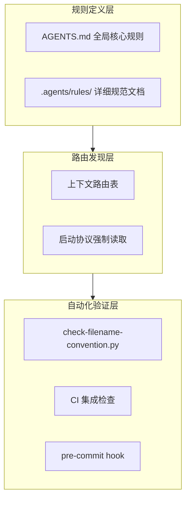

# 规律1：规范约束的三层次模型

**来源**：TuyaOpen 学习报告优化任务

> **归档状态**：本规律已归档为模式 [three-layer-spec-constraint](../../../../patterns/methodology-patterns/governance-strategy/three-layer-spec-constraint.md)（L2），模式库为唯一权威来源。

## 模型描述

规范约束需要三个层次的保障——规则定义层、路由发现层、自动化验证层。

## 层次职责

| 层次 | 职责 | 本次修复内容 |
|------|------|-------------|
| 规则定义层 | 定义规范内容 | AGENTS.md 新增「文件创建纪律」规则 |
| 路由发现层 | 确保规范可被发现 | 上下文路由表新增命名规范条目 |
| 自动化验证层 | 强制验证合规性 | check-filename-convention.py 验证 |

## 关联洞察

- [洞察1：规范前置化是预防违规的根本手段](../insights/insight-1-spec-frontloading.md)
- [洞察3：路由表是规范可发现性的关键](../insights/insight-3-routing-table-is-key-to-discoverability.md)

## 关联模式

- [文件创建前置检查模式](../patterns/pattern-1-file-creation-precheck.md)
- [规范可发现性保障模式](../patterns/pattern-2-spec-discoverability-guarantee.md)