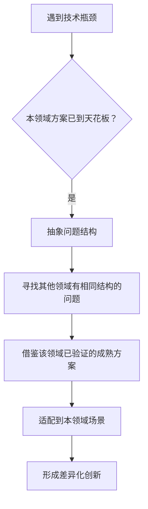
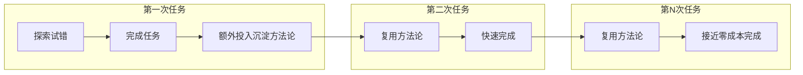

# 洞察萃取与模式提炼

## 一、核心洞察

### 洞察1：反常识架构选择是差异化竞争的关键

```
[CMD-LOG] | level=INFO | cmd=retrospective | step=S3 | event=KEY_FINDING | session=retro-20260703-viitorvoice-learning | msg=洞察1：反常识架构选择创造差异化优势 | ctx={"insight_id":"I001","domain":"技术路线选择"}
```

**发现**：ViiTorVoice团队没有跟随主流选择AR（自回归）架构，而是迎难而上选择NAR（非自回归）架构，反而实现了AR架构无法做到的局部编辑能力。

**深层含义**：
- 当主流技术路线形成共识时，共识本身可能就是盲点——所有人都在同一条赛道上优化已有的能力维度（如自然度、相似度），却忽略了未被满足的痛点（如后期编辑）
- - "难而正确"的技术选择虽然门槛高，但一旦突破就能形成难以复制的壁垒——NAR的完形填空机制与CFG情绪控制是AR路线无法通过简单迭代实现的
- 痛点驱动而非指标驱动：ViiTor没有先追求WER刷榜，而是解决"生成后修改成本高"这个真实场景痛点，反而顺带实现了WER领先

**支撑证据**：
- 主流TTS模型（CosyVoice、Qwen3-TTS等）均采用AR架构
- ViiTor选择NAR后不仅实现了局部编辑，首帧延迟还从150-200ms降至<60ms
- 日处理数十万小时音频的商业化落地证明技术路线可行

**可复用场景**：技术选型决策、产品差异化定位、创业方向选择

---

### 洞察2：跨领域技术迁移是创新的高效路径

```
[CMD-LOG] | level=INFO | cmd=retrospective | step=S3 | event=KEY_FINDING | session=retro-20260703-viitorvoice-learning | msg=洞察2：跨领域技术迁移是高ROI创新方式 | ctx={"insight_id":"I002","domain":"创新方法论"}
```

**发现**：ViiTor将图像生成领域已经成熟的CFG（Classifier-Free Guidance）技术迁移到音频生成领域，解决了副语言（笑声、叹气、呼吸）精准控制的难题，效果远超传统的提示词控制方案。

**深层含义**：
- 创新不一定是"从零发明"，将A领域验证过的技术方案迁移到B领域，往往能产生"降维打击"效果
- CFG在图像领域是2022年以来的成熟技术，但音频领域直到2026年才被ViiTor有效应用——跨领域信息差本身就是机会窗口
- 技术迁移的关键是识别"问题结构的相似性"：图像需要控制风格/情绪，音频也需要控制情绪/副语言，两者的底层逻辑都是"条件引导生成"

**支撑证据**：
- CFG双路径推理：条件路径生成指定情绪，非条件路径正常生成，Logits差值强化条件权重
- 这种机制的成功率和自然度远超传统模型仅靠自然语言提示控制的效果
- ViiTor团队明确表示这是与ElevenLabs等方案的根本差异和核心壁垒

**可复用场景**：技术创新、产品功能设计、解决技术瓶颈

---

### 洞察3："做减法"的数据策略有时比"做加法"更有效

```
[CMD-LOG] | level=INFO | cmd=retrospective | step=S3 | event=KEY_FINDING | session=retro-20260703-viitorvoice-learning | msg=洞察3：刻意丢弃信息可以提升特定能力 | ctx={"insight_id":"I003","domain":"数据策略"}
```

**发现**：传统语音克隆需要"音频+对应文本"双输入，ViiTor在训练时刻意丢弃文本信息，逼迫模型直接从声学特征学习，反而实现了无需参考文本的跨语种克隆能力，解决了小语种ASR准确率低的痛点。

**深层含义**：
- 常识认为"信息越多越好"，但某些场景下，额外的信息会形成"拐杖依赖"，让模型学到捷径而非本质
- 丢弃文本后，模型被迫学习更底层的声学规律（音色、发音习惯、口癖），反而泛化能力更强
- 这与深度学习中的" dropout"、"数据增强"思想一脉相承：适当的信息缺失可以提升鲁棒性和泛化能力

**支撑证据**：
- 传统方案需要音频+文本，小语种ASR准确率低导致克隆失败
- ViiTor方案仅需纯音频即可提取音色，支持中英日韩等多语种生成
- 短剧出海场景对葡萄牙语、阿拉伯语等小语种需求强烈，该方案直击痛点

**可复用场景**：模型训练策略、特征工程、产品简化设计

---

### 洞察4：开源+商业化双轮驱动是基础模型的成熟商业模式

```
[CMD-LOG] | level=INFO | cmd=retrospective | step=S3 | event=KEY_FINDING | session=retro-20260703-viitorvoice-learning | msg=洞察4：开源建立生态，商业版本变现 | ctx={"insight_id":"I004","domain":"商业模式"}
```

**发现**：ViiTorVoice开源了1B参数的NAR模型（完整组件包括Qwen3 Forced Aligner、W2V-BERT 2.0），但同时有日处理数十万小时的付费商业部署，形成"开源吸引开发者+商业版本大规模变现"的双轮模式。

**深层含义**：
- 基础模型领域，不开源难以建立开发者生态和事实标准，纯开源又难以覆盖训练和推理成本
- 1B参数是"甜蜜点"：足够好用能吸引开发者，又和更大参数的商业版本形成能力差距，不会 cannibalize 付费收入
- 开源是最好的技术验证和营销：开发者用脚投票，真实场景的反馈反过来优化商业版本

**支撑证据**：
- GitHub和Hugging Face均可直接获取开源模型
- 国内头部企业已成为付费客户，日处理数十万小时音频
- 参考LLaMA、Mistral等路线，开源+商业双轮已是行业共识

**可复用场景**：AI产品商业化、开源策略设计、基础模型创业

---

### 洞察5：方法论沉淀具有复利效应，首次验证后效率显著提升

```
[CMD-LOG] | level=INFO | cmd=retrospective | step=S3 | event=KEY_FINDING | session=retro-20260703-viitorvoice-learning | msg=洞察5：复盘沉淀的方法论具有复利价值 | ctx={"insight_id":"I005","domain":"知识管理"}
```

**发现**：本次任务直接复用Claude Tag复盘沉淀的"微信公众号双路径获取模型"，试错次数从3次降至0次，执行耗时从3分钟降至30秒，效率提升83%。这是复盘萃取的模式第二次被验证有效。

**深层含义**：
- - "复盘→萃取→入库→复用"的知识管理闭环不是"额外工作"，而是能产生实际效率收益的投资
- 首次沉淀方法论需要额外成本（Claude Tag那次花时间试错并总结双路径模型），但第二次复用就收回成本，第三次及以后就是纯收益
- 知识沉淀需要"足够具体"才能复用：泛泛的"用defuddle"没用，"微信公众号文章优先defuddle，失败降级到Invoke-WebRequest+边界标记截取"这种具体的决策树才真正可执行

**支撑证据**：
- ian-xiaohei任务：探索阶段，1次试错
- claude-tag任务：3次试错后沉淀双路径模型
- viitorvoice任务：0次试错，直接命中最优方案
- 三次任务耗时趋势：1min → 3min（沉淀成本）→ 0.5min（复利收益）

**可复用场景**：团队知识管理、流程优化、个人经验沉淀

---

## 二、规律认知

### 规律1：技术创新的"反共识"定律


**定律内容**：当某一技术路线成为行业共识后，所有玩家都会在相同的能力维度上进行优化竞争，很快该维度会进入边际收益递减区间；此时，选择被主流忽视的技术路线，虽然初始难度更高，但一旦突破就能建立难以复制的差异化优势。

**案例验证**：
- TTS领域：所有人做AR架构优化自然度，ViiTor做NAR实现局部编辑
- 搜索引擎：所有人做关键词匹配，Google做PageRank
- 电动车：所有人做续航优化，Tesla做自动驾驶和OTA

**启示**：技术选型时，不要只问"现在最好的方案是什么"，还要问"主流方案的盲点在哪里，哪些痛点是主流路线从原理上就解决不了的"。

---

### 规律2：跨领域迁移创新的"问题结构相似性"原则



**定律内容**：最高效的创新不是从零发明，而是识别问题结构的相似性，将其他领域已经验证成熟的技术方案迁移到本领域。跨领域信息差本身就是壁垒——等本领域所有人都知道这个方案时，机会窗口就关闭了。

**迁移检查清单**：
1. 我遇到的问题，本质是什么结构的问题？（条件引导生成？序列决策？特征匹配？）
2. 还有哪些领域遇到过结构相同的问题？
3. 那些领域的最优解决方案是什么？
4. 迁移到本领域需要做哪些适配？

---

### 规律3：知识沉淀的"复利曲线"



**定律内容**：知识沉淀遵循复利曲线——首次沉淀需要额外投入（看起来是"多花了时间"），但第二次复用就开始产生收益，后续复用次数越多，单位收益越高。值得沉淀的知识需要满足两个条件：(1) 可预见会重复遇到；(2) 具体到可以直接执行（决策树/检查清单/步骤流程，而非抽象原则）。

---

## 三、可复用模式候选

### 模式1：反常识技术选型决策框架（L1候选）

```
[CMD-LOG] | level=INFO | cmd=retrospective | step=S3 | event=PATTERN_EXTRACTED | session=retro-20260703-viitorvoice-learning | msg=模式候选：反常识技术选型决策框架 | ctx={"pattern_id":"P001","maturity":"L1","domain":"技术决策"}
```

**模式名称**：反常识技术选型（Counter-intuitive Architecture Choice）

**触发场景**：当主流技术路线已形成共识，且在该路线上优化出现边际收益递减时

**核心步骤**：
1. 列出主流路线的3个核心假设
2. 追问："如果这个假设不成立呢？"
3. 识别主流路线从原理上就无法解决的痛点
4. 评估非主流路线解决该痛点的技术可行性
5. 不盲目追求刷榜指标，从真实场景痛点反推技术需求

**ViiTor案例应用**：
- 主流假设1：AR逐帧生成是唯一可行路线 → 不成立：NAR并行生成也可行
- 主流假设2：需要文本对齐才能做克隆 → 不成立：纯声学特征也能学
- 主流假设3：提示词是控制情绪的最好方式 → 不成立：CFG+特殊Token更精准
- AR路线无法解决局部编辑问题 → NAR完形填空机制可以解决

**参考案例**：ViiTor NAR架构、Google PageRank、Tesla一体化压铸

**成熟度**：L1（单案例验证，需要更多案例确认）

---

### 模式2：跨领域技术迁移检查清单（L1候选）

```
[CMD-LOG] | level=INFO | cmd=retrospective | step=S3 | event=PATTERN_EXTRACTED | session=retro-20260703-viitorvoice-learning | msg=模式候选：跨领域技术迁移检查清单 | ctx={"pattern_id":"P002","maturity":"L1","domain":"创新方法论"}
```

**模式名称**：跨领域技术迁移（Cross-domain Technology Transfer）

**触发场景**：在本领域遇到技术瓶颈，现有方案效果不理想时

**检查清单**：
- [ ] 能否用一句话抽象当前问题的本质结构？（例如："如何在生成过程中引导特定属性"）
- [ ] 还有哪些领域存在同样结构的问题？
- [ ] 那些领域的当前最优方案是什么？
- [ ] 该方案迁移到本领域需要做哪些适配改造？
- [ ] 是否存在可复现的开源实现可以快速验证？

**ViiTor案例应用**：
- 问题本质："如何精准控制生成内容中的特定属性（情绪/笑声）"
- 同结构问题：图像生成中的风格控制、构图引导
- 图像领域最优方案：CFG（Classifier-Free Guidance）
- 音频适配：将图像RGB像素替换为音频声学Token，双路径Logits差值逻辑通用
- 验证：开源模型可直接测试效果

**成熟度**：L1（CFG迁移是好案例，但需要更多迁移案例验证通用性）

---

### 模式3："信息丢弃"增强泛化能力（L1候选）

```
[CMD-LOG] | level=INFO | cmd=retrospective | step=S3 | event=PATTERN_EXTRACTED | session=retro-20260703-viitorvoice-learning | msg=模式候选：信息丢弃增强泛化 | ctx={"pattern_id":"P003","maturity":"L1","domain":"模型训练/产品设计"}
```

**模式名称**：反直觉信息丢弃（Counter-intuitive Information Dropping）

**触发场景**：模型/产品过度依赖某类"拐杖信息"，导致泛化能力差、在特定场景失效时

**核心逻辑**：
- 常识：信息越多 → 效果越好
- 反常识：某些信息是"拐杖" → 模型学捷径而非本质 → 丢弃后逼迫学更底层规律 → 泛化能力更强

**ViiTor案例应用**：
- 拐杖信息：语音对应的文本
- 依赖后果：小语种ASR差→文本不准→克隆失败
- 丢弃方式：训练时刻意不输入文本
- 结果：模型直接学声学特征→无文本也能克隆→支持小语种跨语种

**已知类似模式**：Dropout（随机丢弃神经元）、数据增强（丢失部分信息）、SimCLR（对比学习丢弃标签）

**成熟度**：L1（在语音克隆场景验证，与深度学习已有技术一脉相承）

---

## Changelog

<!-- changelog -->
- 2026-07-03 | create | 初始创建洞察萃取文件（v1.0）：5个核心洞察、3条规律认知、3个模式候选
