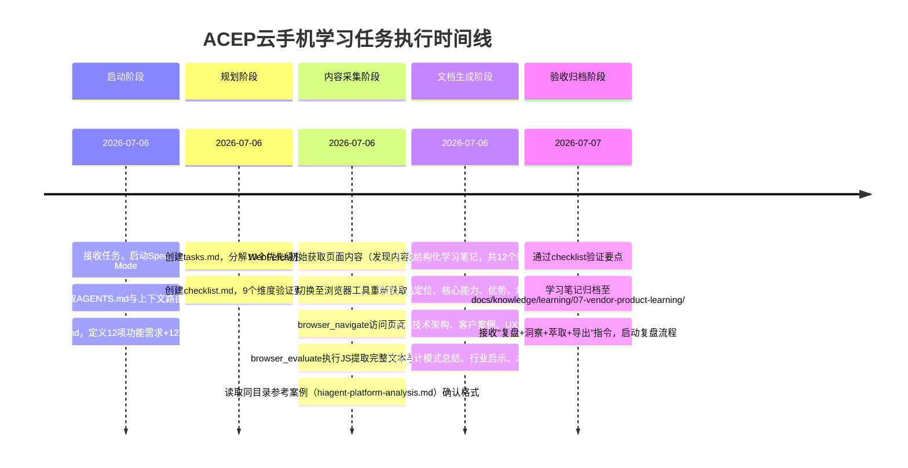

# 执行复盘：火山引擎ACEP云手机产品学习分析

[CMD-LOG] | level=INFO | cmd=retrospective | step=S1 | event=KEY_FINDING | session=retr-20260707-volcengine-acep | msg=S1事实收集开始：整理任务时间线、产出物清单、关键事件

## 一、任务概述

| 项目 | 内容 |
|------|------|
| **任务名称** | 火山引擎ACEP云手机产品网页系统性学习与深度洞察分析 |
| **任务入口** | `/spec` 指令，针对 `https://www.volcengine.com/product/ACEP` 网页 |
| **任务类型** | 外部产品学习与UX分析 |
| **执行时间** | 2026-07-06 ~ 2026-07-07 |
| **最终产出** | 1份Spec三件套（spec.md/tasks.md/checklist.md）+ 1份结构化学习笔记（1076行） |

## 二、实施过程回顾

### 2.1 任务时间线

### 2.2 关键决策节点

| 决策点 | 时间 | 决策内容 | 依据 | 结果 |
|--------|------|---------|------|------|
| 内容采集方案切换 | 2026-07-06 | 从WebFetch切换至浏览器工具 | WebFetch返回内容重复且架构图/案例信息不全 | 获取完整页面内容，包含动态渲染部分 |
| 格式参考选择 | 2026-07-06 | 参考hiagent-platform-analysis.md | 同目录同类型产品分析案例，遵循"格式一致性优先"原则 | 学习笔记结构与项目现有规范一致 |
| UX分析深度 | 2026-07-06 | 除产品信息提取外，增加网页信息架构和UX设计深度分析 | 用户明确要求分析"内容组织方式、信息呈现逻辑及用户体验设计" | 产出第7-9章共3章UX专项分析，总结B端产品展示模式 |

[CMD-LOG] | level=INFO | cmd=retrospective | step=S1 | event=KEY_FINDING | session=retr-20260707-volcengine-acep | msg=S1事实收集完成：整理出完整时间线、3个关键决策节点、4份产出物清单

### 2.3 交付物清单

| 产出物 | 路径 | 规模 | 说明 |
|--------|------|------|------|
| Spec需求文档 | [.trae/specs/retrospectives-insights/analyze-volcengine-acep/spec.md](../../../../../../.trae/specs/retrospectives-insights/analyze-volcengine-acep/spec.md) | 169行 | 12项功能需求、12项验收标准、Non-Goals/Constraints/Assumptions完整 |
| 任务计划 | [.trae/specs/retrospectives-insights/analyze-volcengine-acep/tasks.md](../../../../../../.trae/specs/retrospectives-insights/analyze-volcengine-acep/tasks.md) | - | 10个优先级任务分解 |
| 验证清单 | [.trae/specs/retrospectives-insights/analyze-volcengine-acep/checklist.md](../../../../../../.trae/specs/retrospectives-insights/analyze-volcengine-acep/checklist.md) | - | 9个维度验证要点 |
| 结构化学习笔记 | [docs/knowledge/learning/07-vendor-product-learning/volcengine-acep-cloudphone-analysis.md](../../../../knowledge/learning/07-vendor-product-learning/volcengine-acep-cloudphone-analysis.md) | 1076行/12章 | 产品概述、四大能力、四大优势、五大场景、架构、案例、UX分析、设计模式、行业启示、术语表 |

### 2.4 量化结果数据

| 指标 | 数值 | 说明 |
|------|------|------|
| 产品信息覆盖度 | 100% | 12项功能需求全部完成，12项验收标准全部通过 |
| 学习笔记章节数 | 12章 | 从产品定位到行业启示完整覆盖 |
| 提取性能指标 | 4项 | 端到端延时&lt;70ms、游戏延时&lt;50ms、24小时搭建、24小时直播 |
| 分析应用场景 | 5个 | 云游戏、仿真测试、直播互娱、应用审核、安全办公 |
| 解读客户案例 | 4个 | 吉利汽车、中科深智、巨量引擎、快盘科技 |
| 提炼技术模块 | 8个 | 音视频、控制指令、智能调度、应用分发、边缘节点、ARM服务器、资源管理、存算分离 |
| 总结设计模式 | 7个 | B端技术产品展示页面可复用模式 |
| UX分析章节 | 3章 | 信息架构、UX特点、设计模式总结 |

[CMD-LOG] | level=INFO | cmd=retrospective | step=S2 | event=KEY_FINDING | session=retr-20260707-volcengine-acep | msg=S2过程分析开始：识别成功因素、问题与改进机会

## 三、过程分析

### 3.1 成功因素

| 成功因素 | 支撑事实 | 可复用性 |
|---------|---------|---------|
| **Spec三件套前置规划** | 提前创建spec.md定义明确的需求和验收标准，tasks.md分解任务，checklist.md提供验证清单，执行过程无方向偏差 | 高，所有外部学习任务都可复用此模式 |
| **格式一致性优先原则落地** | 执行前先读取同目录参考案例（hiagent-platform-analysis.md），确认章节结构、表格使用、Mermaid格式等，产出笔记与现有风格一致 | 高，已在project_memory中明确为工程惯例 |
| **多工具组合解决内容采集问题** | WebFetch失败后及时切换到浏览器工具（browser_navigate + browser_evaluate），通过JavaScript提取完整页面文本，解决了动态内容和信息不全问题 | 高，网页内容采集的标准应对流程 |
| **需求分层：产品信息+UX分析双轨并行** | 不仅提取产品功能信息，还按用户要求深入分析网页信息架构和UX设计，产出3章UX专项内容，超出纯产品信息提取的价值 | 中，竞品/产品学习类任务适用 |
| **量化指标完整提取** | 准确记录页面展示的所有量化性能数据（延时指标、时间指标），形成KPI表格便于后续对比参考 | 高，技术产品分析的标准要求 |

### 3.2 遇到的问题与处理

| 问题 | 影响 | 处理方式 | 根因分析 |
|------|------|---------|---------|
| **WebFetch初始内容重复且不全** | 产品架构和客户案例信息缺失，无法完成完整分析 | 切换至浏览器工具，使用browser_navigate访问页面，browser_evaluate执行JS提取全文 | WebFetch对动态渲染内容和现代SPA页面支持有限，静态抓取无法获取完整内容 |
| **架构图为图片形式无法读取文字** | 技术架构细节只能基于页面文字描述推断，无法获取图中可能包含的更细粒度模块信息 | 基于文字描述提炼八大核心模块，在Open Questions中记录此限制 | 产品页架构图采用图片形式而非可交互/可文本化组件，是B端产品页常见设计选择 |
| **无实际性能测试数据验证** | 页面展示的性能指标（<70ms等）无法独立验证，只能如实记录 | 在Constraints和Assumptions中明确标注"仅基于页面公开信息，性能指标未经验证" | 单页产品介绍的信息边界限制，外部分析无法进行实测验证 |

### 3.3 流程瓶颈与改进机会

| 瓶颈/机会 | 现状 | 改进方向 | 预期收益 |
|-----------|------|---------|---------|
| **WebFetch作为首选工具的失败率** | 现代火山引擎等云厂商产品页普遍采用动态渲染，WebFetch成功率低 | 建立"WebFetch→浏览器工具"的标准降级流程，或直接对动态站点优先使用浏览器工具 | 减少工具切换的重试时间，提高内容采集效率 |
| **架构图信息提取能力不足** | 图片形式的架构图只能人工解读，无法自动提取模块关系 | 考虑结合截图+视觉理解能力，或寻找产品文档中的文字版架构说明 | 提高技术架构分析的准确性和完整性 |
| **B端设计模式萃取可更系统化** | 本次总结了7个设计模式，但未关联到现有模式库进行系统化归类 | 建立竞品UX分析→设计模式萃取→模式库更新的标准化流程 | 设计经验可沉淀复用，而非每次重新总结 |
| **Open Questions闭环机制缺失** | 本次列出10个Open Questions，但无后续跟进机制 | 建立待解答问题跟踪机制，或在后续相关产品学习中尝试解答 | 形成持续知识积累，而非单次分析后遗留问题 |
