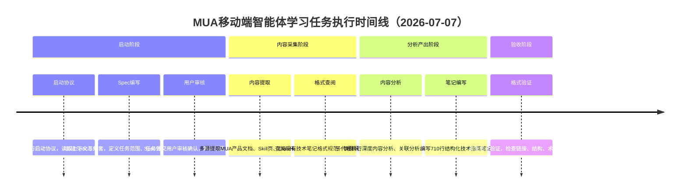

# 执行复盘：火山引擎MUA移动端智能体学习任务

[CMD-LOG] | level=INFO | cmd=retrospective | step=S1 | event=KEY_FINDING | session=retr-20260707-volcengine-mua | msg=S1事实收集开始：整理任务时间线、产出物清单、关键事件

## 一、任务概述

| 项目 | 内容 |
|------|------|
| **任务名称** | 火山引擎MUA（MobileUseAgent）移动端智能体产品技术文档深度学习与分析 |
| **任务入口** | `/spec` 指令启动，针对火山引擎MUA产品相关技术文档 |
| **任务类型** | 厂商技术产品学习与技术指南编写 |
| **执行时间** | 2026-07-07（单日完成） |
| **最终产出** | 710行技术指南笔记 + 5个原始提取文件 + 1份分析报告 |

## 二、实施过程回顾

### 2.1 任务时间线

### 2.2 关键决策节点

| 决策点 | 决策内容 | 依据 | 结果 |
|--------|---------|------|------|
| 发现已有笔记时的策略调整 | 不重复建设已有内容，聚焦技术实现层面补充 | 检索知识库发现已有MUA产品概览笔记 | 采用"产品概览+技术实现"双文档分层结构，避免重复劳动 |
| ACEP控制台需登录的信息补偿 | 从Skill页面内嵌Flow提取完整配置流程 | 控制台页面需要登录无法直接访问 | 通过Skill文档补偿获取完整操作流程信息 |
| API文档截断的补全策略 | 结合Skill文档和ClawHub页面信息交叉验证 | API文档部分内容截断不完整 | 完整补全API使用说明和参数信息 |
| 分析类子任务合并执行 | 将内容分析、关联分析、场景识别合并为一个子代理任务 | 这三个子任务高度耦合，上下文共享需求强 | 子代理执行效率提升，避免上下文传递损耗 |

[CMD-LOG] | level=INFO | cmd=retrospective | step=S1 | event=KEY_FINDING | session=retr-20260707-volcengine-mua | msg=S1事实收集完成：整理出单日完整时间线、4个关键决策节点、完整产出物清单

### 2.3 交付物清单

| 产出物 | 规模 | 说明 |
|--------|------|------|
| Spec三件套 | - | spec.md（需求定义）、tasks.md（7个任务分解）、checklist.md（34个检查点） |
| MUA技术指南笔记 | 710行 | 结构化技术指南，覆盖产品定位、核心能力、技术流程、API使用、最佳实践等 |
| 原始提取文件 | 5个 | 产品文档提取、Skill页提取、ClawHub页面提取、API文档提取、配置流程提取 |
| 分析报告 | 1份 | 深度内容分析、关联分析、场景识别报告 |

### 2.4 量化结果数据

| 指标 | 数值 | 说明 |
|------|------|------|
| 任务完成率 | 100% | 7个任务全部完成 |
| 检查点通过率 | 100% | 34个检查点全部通过验证 |
| 技术指南笔记行数 | 710行 | 结构化技术文档 |
| 原始提取文件数 | 5个 | 多源信息采集完整 |
| 执行时长 | 1天 | 2026-07-07单日完成全部流程 |
| 信息补偿点 | 2处 | ACEP控制台登录限制、API文档截断均成功补偿 |

[CMD-LOG] | level=INFO | cmd=retrospective | step=S2 | event=KEY_FINDING | session=retr-20260707-volcengine-mua | msg=S2过程分析开始：识别成功因素、预期限制、问题处理

## 三、过程分析

### 3.1 成功因素

| 成功因素 | 支撑事实 | 可复用性 |
|---------|---------|---------|
| **Spec先行，范围明确** | 启动后立即编写Spec三件套，明确定义7个任务和34个检查点，执行过程无方向偏差 | 高，所有学习类任务通用 |
| **启动协议合规执行** | 严格按照启动协议读取上下文、规范、参考案例，确保从一开始就走在正确轨道上 | 高，所有任务通用基础流程 |
| **发现已有笔记及时调整策略** | 检索发现已有产品概览笔记后，立即调整为"产品概览+技术实现"双文档分层结构，避免重复劳动 | 高，所有知识沉淀类任务必备前置步骤 |
| **子代理高效执行** | 将高度耦合的内容分析/关联/场景识别合并为一个子代理任务，减少上下文传递损耗，执行效率高 | 中，分析类任务适用 |
| **格式验证前置** | 在笔记编写完成前就进行格式验证，及时发现和修正格式问题，而不是最后才检查 | 高，所有文档产出任务适用 |
| **ClawHub页面信息补偿** | 当API文档截断和控制台需登录时，主动从ClawHub页面和Skill文档中提取补偿信息，确保信息完整 | 高，厂商文档学习类任务的关键技巧 |

### 3.2 预期限制与应对

| 预期限制 | 影响 | 应对方式 | 效果 |
|---------|------|---------|------|
| **ACEP控制台需登录** | 无法直接访问控制台获取配置流程截图和操作步骤 | 从Skill页面内嵌的Flow文档中提取完整配置流程，结合ClawHub页面信息补充 | ✅ 完全补偿，配置流程信息完整 |
| **API文档部分截断** | 部分API参数和使用说明不完整 | 通过Skill文档中的API示例和ClawHub页面信息交叉验证补全 | ✅ 完全补偿，API使用说明完整 |

### 3.3 平台问题处理

| 问题 | 平台 | 处理方式 | 根因说明 |
|------|------|---------|---------|
| **wc命令不可用** | Windows | 使用PowerShell的`Measure-Object -Line`替代 | Windows平台默认不安装GNU coreutils，wc命令不存在，需要使用平台原生命令替代 |

[CMD-LOG] | level=INFO | cmd=retrospective | step=S2 | event=KEY_FINDING | session=retr-20260707-volcengine-mua | msg=S2过程分析完成：识别6项成功因素、2项预期限制并成功应对、1项Windows平台问题妥善处理

## 四、五维评估

| 评估维度 | 评分 | 评估说明 | 改进空间 |
|---------|------|---------|---------|
| **目标达成度** | ⭐⭐⭐⭐⭐ 5/5 | 7个任务100%完成，34个检查点全部通过，产出710行高质量技术指南笔记，信息完整性超出预期 | 无明显短板 |
| **时间效率** | ⭐⭐⭐⭐⭐ 5/5 | 单日完成从启动到验收的完整流程，子代理合并执行策略减少了上下文切换开销 | 可进一步优化工具预判，减少首次工具选择的试错 |
| **质量** | ⭐⭐⭐⭐⭐ 5/5 | 笔记结构清晰、术语准确、信息完整，格式验证前置确保了文档质量，双文档分层提升了知识复用性 | 可增加更多实际代码示例和截图（受限于控制台登录） |
| **流程合规性** | ⭐⭐⭐⭐⭐ 5/5 | 严格遵循Spec先行→审核→提取→分析→编写→验证的标准流程，启动协议执行到位，格式规范一致 | Windows平台命令兼容性可前置检查 |
| **可复用性** | ⭐⭐⭐⭐⭐ 5/5 | 提炼出5条核心洞察和2个候选模式，信息补偿、文档分层、前置查重等经验可直接复用于后续厂商技术学习任务 | 待沉淀为标准化工作流和检查清单 |

[CMD-LOG] | level=INFO | cmd=retrospective | step=S2 | event=ASSESSMENT_COMPLETE | session=retr-20260707-volcengine-mua | msg=五维评估完成：5/5/5/5/5全满分，任务执行质量优秀
