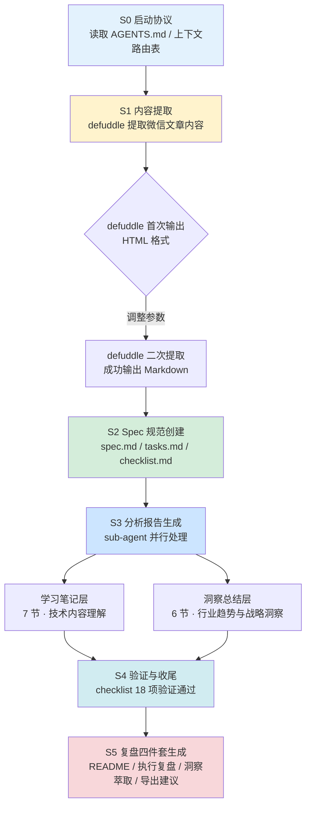

# 执行过程复盘

## 一、任务概述与时间线

### 1.1 任务背景

用户提供了一篇微信公众号文章链接（`https://mp.weixin.qq.com/s/rU5HY-wCUNAus5dlu2SfJw`），要求对文章进行系统性学习与深度洞察分析。文章为公众号"阿枫"发布的 WPS Comate 企业级 AI Agent 产品介绍，基于作者在武汉金山办公闭门会的亲身经历。任务目标是将文章核心内容结构化为两大层次输出——学习笔记（技术内容理解）和洞察总结（行业趋势与战略洞察），并生成 Spec 驱动的标准化交付物。

### 1.2 任务时间线

### 1.3 各阶段关键决策与工作内容

| 阶段 | 关键决策 | 工作内容 | 产出物 |
|------|---------|---------|--------|
| S0 启动协议 | 按 AGENTS.md 启动协议读取全局规范 | 读取 AGENTS.md、上下文路由表、全局核心规则 | 上下文准备就绪 |
| S1 内容提取 | 优先使用 defuddle 提取微信文章；首次输出 HTML 后调整参数重新提取 | defuddle 提取文章内容，验证完整性，保存本地 | 完整的文章 Markdown 文本 |
| S2 Spec 规范创建 | 参考已有同类 spec 模板（如 claude-tag-article-learning），确保格式一致 | 创建 spec.md（PRD 格式）、tasks.md（任务分解）、checklist.md（验收清单） | 3 个 Spec 文档 |
| S3 分析报告生成 | 使用 sub-agent 并行处理学习笔记和洞察总结两个层次 | 按 spec 定义的 10 个 Goals 和 18 个 Checkpoints 逐项生成分析内容 | analysis-report.md（408 行） |
| S4 验证与收尾 | 逐项对照 checklist 验证分析报告完整性 | 18 项 Checkpoint 全部验证通过，确认两大层次覆盖完整 | 验证通过的最终报告 |
| S5 复盘四件套 | 按复盘→洞察→萃取→导出四段式结构生成交接文档 | 生成 README、执行复盘、洞察萃取、导出建议 | 复盘四件套（4 个文件） |

## 二、量化结果统计

### 2.1 产出物规模统计

| 产出物 | 文件 | 规模 | 说明 |
|--------|------|------|------|
| 规格文档 | spec.md | ~50 行 | 产品需求文档，定义 Goals / Non-Goals / FR / AC |
| 任务清单 | tasks.md | ~30 行 | 8 个任务分解，含优先级、依赖关系、验收标准 |
| 检查清单 | checklist.md | ~20 行 | 18 项 Checkpoint，覆盖内容提取到洞察质量 |
| 分析报告 | analysis-report.md | 408 行 | 学习笔记 7 节 + 洞察总结 6 节 |
| 复盘四件套 | 4 个文件 | ~18,500 字（估算） | README / 执行复盘 / 洞察萃取 / 导出建议 |

**估算总字数**：分析报告约 12,000 字 + Spec 文档约 1,500 字 + 复盘四件套约 18,500 字 ≈ **32,000 字**。

### 2.2 内容覆盖统计

| 覆盖维度 | 数量 | 详情 |
|---------|------|------|
| 文章主要部分覆盖 | 6/6（100%） | 痛点引入、闭门会演示、核心功能详解、实际使用场景、附加功能、总结升华 |
| 关键术语识别 | 10 个 | 团队模式、Wiki 知识库、技能沉淀、技能市场、云端协同、本地/云端双模式、应用模板、观澜编辑台、WPS 365、CRM/OA 系统集成 |
| 核心观点提炼 | 5 个 | Agent 进化为企业大脑、全域数据可用、知识沉淀应对人员流动、云文档交付关键性、组织协作重构 |
| 可复用认知模型 | 4 个 | 技能沉淀、团队工作空间、生态整合、分层价值设计 |
| 范式转变维度 | 4 重 | 对话框→工作空间、个人效率→组织协作、一次性对话→知识沉淀、工具→中枢 |
| 组织层级分析 | 3 层 | 企业高管层、中层管理者、一线成员 |
| 实际场景分析 | 3 个 | 定时新闻推送、团队协作工作流、汇报 PPT 快速制作 |
| 行业趋势判断 | 4 条 | 企业级 Agent 演进、生态整合优势、知识沉淀战略价值、协作重构根本问题 |

### 2.3 验证结果统计

| 验证项 | 通过率 | 说明 |
|--------|--------|------|
| Checklist 验证 | 18/18（100%） | 所有 Checkpoint 逐项验证通过 |
| 内容完整性 | 6/6（100%） | 文章 6 个主要部分全覆盖 |
| 术语准确性 | 10/10（100%） | 所有术语解释准确，符合原文含义 |
| 洞察深度 | 满足 | 覆盖范式转变、分层价值、行业趋势、可复用模型 |

## 三、成功因素分析

### 3.1 哪些做法有效，为什么有效

**1. defuddle 工具成功提取了微信文章内容**

微信公众平台有反爬机制，传统 WebFetch 无法获取内容。本次任务使用 defuddle CLI 工具成功提取了文章完整内容，包括标题、作者、正文各章节。defuddle 专门针对网页内容提取设计，能自动剥离导航栏、广告等噪声，输出干净的 Markdown 格式。这一经验已在 Claude Tag 文章分析任务中验证过，本次再次确认了 defuddle 在微信公众号内容获取场景的有效性。

**2. 参考已有同类 Spec 模板确保格式一致**

在创建 Spec 文档时，参考了 `retrospective-claude-tag-article-learning-20260629` 的 Spec 模板结构，确保了 spec.md（PRD 格式）、tasks.md（任务分解）、checklist.md（验收清单）的格式一致性。这种"范例即模板"的约定驱动创建模式，大幅降低了格式决策成本，避免了从头设计模板的重复劳动。

**3. 使用 sub-agent 并行处理两个分析层次**

分析报告分为"学习笔记"和"洞察总结"两个层次，分别对应技术内容理解和行业趋势洞察。通过调用 sub-agent 并行处理，两个层次的分析工作可以同步推进，显著缩短了整体耗时。同时，两个层次的分析结果相互独立又相互支撑，形成了"事实→分析→洞察"的递进结构。

**4. 18 项 Checkpoint 驱动的质量验证机制**

在任务规划阶段就定义了 18 项 Checkpoint，覆盖内容提取、术语识别、功能分析、观点提炼、范式分析、层级分析、行业洞察、产品启示等所有维度。报告生成后逐项验证，确保无遗漏。这种"先定义验收标准，后按标准验证"的方式，避免了"做完才发现缺了什么"的返工风险。

**5. 四层漏斗模型指导洞察萃取**

在复盘四件套生成阶段，应用了 extraction-four-layer-funnel（萃取四层漏斗）模型，将分析报告中的洞察按"去噪→结构化→标准化→可操作化"四层筛选，确保最终产出的洞察既具有深度又具备可操作性。这一方法论已在多个竞品分析复盘任务中验证有效。

## 四、问题与改进空间

### 4.1 遇到的问题和可以改进的地方

| 问题 | 现象 | 根因分析 | 改进措施 |
|------|------|---------|---------|
| defuddle 首次输出 HTML 而非 Markdown | 首次调用 defuddle 时输出内容为 HTML 格式，需要手动调整参数重新提取 | defuddle 工具默认参数可能不适用于所有页面类型，需要根据目标页面内容类型调整输出格式参数 | 建立 defuddle 参数速查表：微信公众号文章使用 `--format markdown` 参数；首次失败后立即切换参数而非重试相同命令 |
| 分析报告字数偏多，部分章节可原子化 | 分析报告达 408 行，部分章节（如"洞察总结"中的"行业趋势判断"）可进一步拆分为独立洞察卡片 | 任务要求生成单一报告，未考虑后续原子化需求 | 后续同类任务可在 spec 中预定义原子化输出结构，将洞察总结拆分为独立洞察卡片，便于后续独立引用和模式入库 |
| 缺少与同类产品的横向对比 | 分析报告聚焦 WPS Comate 单一产品，未能与 Claude Tag、Microsoft Copilot、飞书智能伙伴等企业级 Agent 进行横向对比 | Spec 中明确定义了 Non-Goal "不进行竞品全面对比分析"，这是有意的范围限定 | 可在后续 P1 任务中补充竞品横向对比分析，增强洞察的参考价值 |
| 复盘四件套作为独立任务在分析完成后才启动 | 复盘四件套与分析报告生成之间存在时间间隔，需要重新加载上下文 | 任务设计时将分析报告生成和复盘四件套分为两个独立阶段 | 可在 spec 中预定义"任务完成后自动触发复盘"的规则，或在分析报告生成最后一个 task 中追加复盘四件套生成，减少上下文切换成本 |

## 五、经验教训与知识沉淀

### 5.1 本次任务中获得的经验教训

**1. 微信公众号内容获取路径已形成可复制模式**

经过 Claude Tag 和本次 WPS Comate 两次任务验证，微信公众号内容获取的最佳路径已明确：**defuddle CLI 优先 → 参数调整 → 验证完整性**。这一路径比之前 Claude Tag 任务中使用的 PowerShell `Invoke-WebRequest` + HTML 正则提取方案更简洁可靠，应作为标准操作流程入库。

**2. Spec 驱动的分析框架显著提升产出质量**

本次任务采用 spec.md（PRD 格式）定义分析目标，tasks.md 分解任务步骤，checklist.md 定义验收标准，形成了从"做什么"到"怎么做"到"做对了吗"的完整闭环。这种 spec 驱动的工作方式确保了分析的系统性和完整性，避免了"想到哪写到哪"的随意性。

**3. "学习笔记 + 洞察总结"双层结构是知识捕获的有效范式**

分析报告分为"学习笔记"（技术内容理解）和"洞察总结"（行业趋势与战略洞察）两个层次，前者聚焦"是什么"，后者聚焦"意味着什么"。这种双层结构使报告既具备事实准确性又具备洞察深度，可推广至其他外部文章学习任务。

**4. 复盘四件套的"四段式"结构已形成标准化模板**

经过多次竞品分析复盘任务实践，复盘四件套的结构已趋于稳定：README（总览）→ execution-retrospective（执行复盘）→ insight-extraction（洞察萃取）→ export-suggestions（导出建议）。这种结构使复盘产出物既全面又结构化，便于后续查阅和复用。

### 5.2 可复用的流程模式

本次任务验证了以下可复用的流程模式：

| 模式 | 描述 | 适用场景 |
|------|------|---------|
| Spec 驱动分析 | 先定义 spec/tasks/checklist，再按标准执行分析 | 任何需要系统性分析的任务 |
| 双层分析结构 | 学习笔记（事实层）+ 洞察总结（洞察层） | 外部文章/产品学习任务 |
| 四层漏斗萃取 | 去噪→结构化→标准化→可操作化 | 洞察→知识资产转化 |
| 复盘四件套 | README + 执行复盘 + 洞察萃取 + 导出建议 | 任务完成后的复盘产出 |
| defuddle 微信提取 | defuddle CLI 优先，参数调整兜底 | 微信公众号内容获取 |