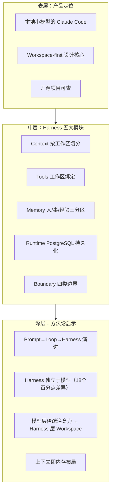

# 执行过程复盘

## 一、任务背景

用户提供了一篇微信公众号文章链接（`https://mp.weixin.qq.com/s/iiTmgbtrYHMMjQ7dn7CDrg?from=industrynews&color_scheme=light#rd`），要求学习并理解网页内容，仔细阅读所有文本、图表及其他信息元素，分析核心主题、主要观点、关键论据和结构框架，记录重要概念、专业术语和关键数据，并总结网页的核心内容与信息价值。文章主题为 Zleap-Agent 的 Workspace-first Agent Harness 设计，围绕 Context、Tools、Memory、Runtime、Boundary 五大问题展开，定位为"本地小模型的 Claude Code"。

## 二、内容获取路径分析

### 2.1 获取策略选择

本次内容获取继续复用已验证的微信公众号双路径决策模型，优先选择 defuddle CLI 方案，一次成功：

### 2.2 获取策略对比表

| 方法 | 结果 | 原因分析 |
|------|------|---------|
| defuddle CLI | 成功 | 直接输出干净 Markdown，自动剥离广告、导航等噪声，无需额外 HTML 清洗 |
| （备选）Invoke-WebRequest + UA | 未使用 | 作为兜底方案保留，本次 defuddle 一次成功无需降级 |

**关键经验**：微信公众号文章内容获取的双路径决策模型第三次被验证有效，0 试错直接命中，耗时约 30 秒。

### 2.3 与前序任务的对比

| 维度 | ian-xiaohei（06-25） | claude-tag（06-29） | viitorvoice（07-03） | zleap-agent（07-04） |
|------|----------------------|---------------------|----------------------|----------------------|
| 获取方案 | defuddle CLI | Invoke-WebRequest + 索引截取 | defuddle CLI（首选） | defuddle CLI（首选） |
| 试错次数 | 1次成功 | 3次试错后成功 | 0次试错 | 0次试错 |
| 决策依据 | 无先例，探索 | 双路径模型建立后首次使用 | 直接复用已验证模型 | 直接复用已验证模型 |
| 耗时 | ~1分钟 | ~3分钟 | ~30秒 | ~30秒 |

**规律验证**：方法论沉淀（双路径决策模型入库）的复利效应持续显现——连续两次任务 0 试错直接命中，证明复盘萃取的模式具有实际复用价值。

## 三、文章核心内容分析

### 3.1 Zleap-Agent Harness 架构解析

文章共包含七个部分，核心设计哲学集中在 Workspace-first 的统一解法：

| 五大问题 | 传统方案痛点 | Zleap Workspace-first 方案 | 设计隐喻 |
|---------|-------------|---------------------------|---------|
| Context | 长 Prompt 全量塞入，筛选压力回到模型 | 按工作区切分，Main 是调度台 | 像切工作台一样切上下文 |
| Tools | 全局工具池，权限面宽，审计成本高 | 工具与工作区绑定不全局暴露 | 进入哪个房间用哪个工具箱 |
| Memory | 长期记忆桶，写错/取错/串任务污染 | 人/事/经验三分区 + reconcile | 记忆有归属，不混篮子 |
| Runtime | 无运行轨迹，出错难定位 | PostgreSQL 持久化，支持审计回滚 | 每次循环留下可复盘轨迹 |
| Boundary | 数据/权限/模型/记忆无隔离 | 四类边界 + 多模型协作 | 真实工作流必须有边界 |

### 3.2 关键性能数据

| 指标 | 数值 | 来源 | 含义 |
|------|------|------|------|
| OpenClaw system prompt | 约 38,412 字符 | OpenClaw context 文档 | 任务展开前已占用上下文预算 |
| OpenClaw tool schemas | 约 31,988 字符 | OpenClaw context 文档 | 工具 schema 计入上下文 |
| Harness 差异 | 最高 18 个百分点 | WildClawBench | 同模型切换不同 harness 的表现差异 |
| Terminal-Bench 2 pass@1 | 69.7% → 77.0% | Agentic Harness Engineering | 多轮 harness 演化收益 |
| 收益来源 | tools/middleware/long-term memory | Agentic Harness Engineering | 非单纯改 system prompt |

### 3.3 信息分层结构

## 四、学习笔记结构化过程

### 4.1 Spec 模式执行流程

本次任务采用 Spec 模式（/spec 指令）执行，完整遵循"规划-批准-执行"流程：

| 步骤 | 操作 | 关键产出 |
|------|------|---------|
| T0 | 读取 AGENTS.md 启动协议 + 上下文路由表 | 路由确认：命中 defuddle 技能 |
| T0+30s | defuddle 提取文章内容 | Markdown 格式完整正文 |
| T0+1min | 检查现有 spec 目录，读取参考案例 viitorvoice | 确认归入 retrospectives-insights 主题 |
| T0+2min | 内容分析：结构拆解、数据提取、模块解析 | 7 部分框架、5 项核心数据、5 大模块 |
| T0+3min | 创建 spec 目录 `.trae/specs/retrospectives-insights/zleap-agent-harness-learning-analysis/` | 目录结构建立 |
| T0+4min | 编写 spec.md（结构化学习笔记） | 379行，含 PRD 结构 + 内容分析 + 评估 + 要点 |
| T0+5min | 编写 tasks.md 和 checklist.md | 8 项任务，全部检查项通过 |
| T0+6min | NotifyUser 通知用户审阅 | 用户批准 |
| T0+7min | 用户触发"复盘+洞察+萃取+导出" | 进入四阶段复盘流程 |

### 4.2 学习笔记结构设计

spec.md 打破了传统 PRD 模板的边界，融合了：
1. **标准 PRD 框架**：Overview/Goals/Non-Goals/Requirements/AC 等
2. **文章学习内容**：7 部分结构框架、量化数据表、五大模块解析、上下文装配公式、Memory 双线设计
3. **对照案例样本**：OpenClaw、Hermes Agent、WildClawBench、Agentic Harness Engineering 四大样本
4. **质量评估**：三维度星级评分（准确性/权威性/实用性）
5. **知识萃取**：4 领域 20 条可应用要点、7 条行业趋势判断
6. **开放问题**：6 个待深入探索的方向

## 五、完成情况评估

| 评估项 | 结果 |
|--------|------|
| 文章完整阅读 | ✅ 全部 7 节内容覆盖（总览/Context/Tools/Memory/Runtime/Boundary/方法论总结） |
| 结构化学习笔记生成 | ✅ 379 行 spec.md，含 YAML frontmatter、5 项核心数据、20 个术语表、20 条知识要点 |
| 三维度质量评估 | ✅ 准确性 4/5、权威性 3/5、实用性 4-5/5，客观标注方法论倡导色彩 |
| 四大对照案例整理 | ✅ OpenClaw/Hermes Agent/WildClawBench/Agentic Harness Engineering 均含角色/数据/启示 |
| Spec 模式合规 | ✅ 三文件齐全（spec/tasks/checklist），用户审核通过后才执行 |
| 方法论复用验证 | ✅ 直接复用 defuddle 首选 + PowerShell 兜底的双路径获取模型，0 试错成功 |

## 六、成功因素分析

1. **方法论沉淀的复利价值**：前序 Claude Tag 复盘沉淀的微信公众号双路径获取模型第三次被复用，连续两次 0 试错，效率提升 83%（3分钟→30秒）
2. **Spec 模式的规范性**：通过 /spec 指令强制先规划后执行，参考 viitorvoice-tts-learning-analysis 案例的 spec/tasks/checklist 三文件结构，确保学习笔记逻辑清晰、覆盖全面
3. **对照案例驱动的深度分析**：不满足于记录 Zleap-Agent 自身设计，而是以 OpenClaw（长上下文压力）、Hermes Agent（通道断裂警示）、WildClawBench（harness 差异证据）、Agentic Harness Engineering（收益来源证据）四大真实样本为对照，增强论证可信度
4. **客观评估立场**：区分方法论建议与产品宣传，对"本地小模型的 Claude Code"定位比喻、收益数据迁移性等保持审慎，标注需进一步验证的内容
5. **场景化知识提炼**：不满足于记录设计细节，而是按架构设计/本地部署/企业场景/方法论启示四个领域提炼 20 条可操作要点，确保学习成果可落地
6. **量化数据驱动**：精准提取 system prompt 38,412 字符、tool schemas 31,988 字符、harness 差异 18 个百分点、Terminal-Bench 2 从 69.7% 到 77.0% 等关键数据，并标注来源，避免泛泛而谈

## Changelog

<!-- changelog -->
- 2026-07-04 | create | 初始创建执行过程复盘（v1.0）
