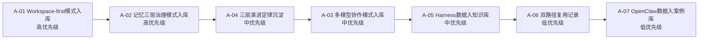

# 洞察行动项 backlog

> 本文件记录从 [insight-extraction.md](insight-extraction.md) 萃取的洞察转化而来的可执行行动项，按优先级排序，每项含验收标准。

## 行动项总览

| ID | 优先级 | 行动项 | 关联洞察 | 状态 |
|----|--------|--------|----------|------|
| A-01 | 高 | Workspace-first 上下文治理模式入库 | 洞察2 / 模式1 | 待执行 |
| A-02 | 高 | Agent 记忆三层治理模式入库 | 洞察3 / 模式2 | 待执行 |
| A-03 | 中 | 多模型协作路由模式入库 | 洞察4 / 模式3 | 待执行 |
| A-04 | 中 | Agent 工程三层演进定律沉淀 | 洞察1 / 规律1 | 待执行 |
| A-05 | 中 | Harness 差异 18 个百分点数据纳入知识库 | 洞察1 | 待执行 |
| A-06 | 低 | 双路径获取模型第四次复用记录 | 洞察5 | 待执行 |
| A-07 | 低 | OpenClaw context 数据纳入上下文工程案例库 | 洞察2 | 待执行 |

---

## A-01：Workspace-first 上下文治理模式入库

- **优先级**：高
- **关联洞察**：洞察2（Workspace-first 是上下文治理通用解法）/ 模式1
- **行动内容**：将 Workspace-first 上下文治理框架沉淀为 L2 模式，入库 `docs/retrospective/patterns/architecture-patterns/`
- **验收标准**：
  - [ ] 模式文件创建，含 TOML frontmatter（id/domain/layer/maturity=L2/validation_count=2/reuse_count=0）
  - [ ] 模式包含触发场景、核心步骤、Zleap-Agent 案例应用、OpenClaw 反面案例
  - [ ] 更新 `docs/retrospective/patterns/architecture-patterns/README.md` 索引
  - [ ] 交叉引用检查：中英文双关键词 Grep 搜索所有引用
- **预计耗时**：30 分钟

---

## A-02：Agent 记忆三层治理模式入库

- **优先级**：高
- **关联洞察**：洞察3（记忆系统从存储思维升级到治理思维）/ 模式2
- **行动内容**：将 Agent 记忆三层治理框架沉淀为 L1 模式，入库 `docs/retrospective/patterns/architecture-patterns/`
- **验收标准**：
  - [ ] 模式文件创建，含 TOML frontmatter（id/domain/layer/maturity=L1/validation_count=1）
  - [ ] 模式包含三层治理（归属/链路/生命周期）+ 经验记忆准入规则
  - [ ] 包含 Hermes Channel Fracture 反面案例
  - [ ] 更新 architecture-patterns/README.md 索引
- **预计耗时**：30 分钟

---

## A-03：多模型协作路由模式入库

- **优先级**：中
- **关联洞察**：洞察4（本地小模型价值由数据边界驱动）/ 模式3
- **行动内容**：将多模型协作路由模式沉淀为 L1 模式，入库 `docs/retrospective/patterns/architecture-patterns/`
- **验收标准**：
  - [ ] 模式文件创建，含 TOML frontmatter（id/domain/layer/maturity=L1/validation_count=1）
  - [ ] 模式包含数据边界驱动逻辑、工作区路由边界、财务报销案例
  - [ ] 更新 architecture-patterns/README.md 索引
- **预计耗时**：20 分钟

---

## A-04：Agent 工程三层演进定律沉淀

- **优先级**：中
- **关联洞察**：洞察1（Agent 工程从 Prompt 演进到 Harness）/ 规律1
- **行动内容**：将 Prompt→Loop→Harness 三层演进定律沉淀到 `docs/retrospective/patterns/methodology-patterns/`
- **验收标准**：
  - [ ] 定律文件创建，含三层演进路径图（Mermaid）
  - [ ] 包含每层解决上层瓶颈的说明
  - [ ] 包含 Agentic Harness Engineering 收益来源证据
  - [ ] 更新 methodology-patterns/README.md 索引
- **预计耗时**：25 分钟

---

## A-05：Harness 差异 18 个百分点数据纳入知识库

- **优先级**：中
- **关联洞察**：洞察1
- **行动内容**：将 WildClawBench 的"harness 差异 18 个百分点"与 Agentic Harness Engineering 的"Terminal-Bench 2 从 69.7% 到 77.0%"数据纳入技术知识库
- **验收标准**：
  - [ ] 在 `docs/knowledge/` 下创建或更新 Agent Harness 工程条目
  - [ ] 数据标注来源（WildClawBench / Agentic Harness Engineering）
  - [ ] 更新 `docs/knowledge/README.md` 索引
- **预计耗时**：15 分钟

---

## A-06：双路径获取模型第四次复用记录

- **优先级**：低
- **关联洞察**：洞察5（经验沉淀复利曲线第三次验证）
- **行动内容**：在 viitorvoice 复盘的双路径获取模型复用记录中追加本次（zleap-agent）第四次复用数据
- **验收标准**：
  - [ ] 更新 viitorvoice 复盘的 insight-extraction.md 复用对比表
  - [ ] 在本次复盘的 execution-retrospective.md 已记录第四次复用
  - [ ] validation_count 从 3 更新为 4（如模式已入库）
- **预计耗时**：10 分钟

---

## A-07：OpenClaw context 数据纳入上下文工程案例库

- **优先级**：低
- **关联洞察**：洞察2
- **行动内容**：将 OpenClaw 的 system prompt 38,412 字符 + tool schemas 31,988 字符数据作为"长上下文压力"典型案例纳入上下文工程案例库
- **验收标准**：
  - [ ] 在 `docs/knowledge/` 下创建或更新上下文工程条目
  - [ ] 标注数据来源（OpenClaw context 文档）
  - [ ] 作为 Workspace-first 模式的反面案例引用
- **预计耗时**：10 分钟

---

## 执行优先级建议

## Changelog

<!-- changelog -->
- 2026-07-04 | create | 初始创建行动项 backlog（v1.0）：7 个行动项，2 高 / 3 中 / 2 低
