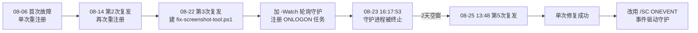

# Windows 截图工具反复故障根治 — 里程碑复盘分析报告

> **项目名称**：Windows 截图工具（ScreenSketch）AppModel-Runtime 208/216 故障根治
> **复盘日期**：2026-08-25
> **项目周期**：2026-08-06 ~ 2026-08-25（区间内 5 次故障，第 5 次采用事件驱动守护根治）
> **报告类型**：里程碑复盘（七概念方法论 场景1：R→I→E→C）

***

## 一、项目概述

### 1.1 项目背景
SpecWeave 宿主环境的 Windows 截图工具（Microsoft.ScreenSketch，UWP 应用）在月度内反复出现无法截屏的故障。事件日志在 `Microsoft-Windows-AppModel-Runtime/Admin` 通道周期性报出 **事件 208/216**，伴随错误码 **0x80070002**。根因为 ScreenSketch UWP 包运行时注册损坏/丢失。

### 1.2 项目目标
1. 根治"反复复发"——不仅修本次，要断根、防复发
2. 消除自愈方案自身的单点故障（SPOF），实现无人值守自愈
3. 将解决方案沉淀为可复用模式，供跨场景迁移

### 1.3 交付物清单
| 交付物 | 位置 | 状态 |
|--------|------|------|
| 统一修复脚本 `fix-screenshot-tool.ps1` | `.agents/scripts/` | ✅ 提交 9fb0d06e |
| 事件驱动守护任务 `FixScreenshotToolEventWatcher` | Windows 任务计划程序 | ✅ SYSTEM/ONEVENT 注册 |
| 事件驱动守护架构模式 | `.agents/docs/retrospective/patterns/architecture-patterns/event-driven-guardian.md` | ✅ L1，提交 dd30d042 |
| 项目记忆根治记录 | project_memory.md | ✅ 同步 |
| 本里程碑复盘报告 | `concepts/milestone/` | ✅ 本项目 |

***

## 二、复盘环节

### 2.1 实施过程回顾

### 2.2 关键节点分析

| 时间 | 节点 | 决策依据 | 结果 |
|------|------|---------|------|
| 08-06 | 首次定位根因 | 事件 208/216 + 0x80070002 → UWP 注册损坏 | 重注册修复 |
| 08-22 | 建立脚本 + 轮询守护 | 追求"自动"自愈 | 引入兜底，但引入新 SPOF |
| 08-23 | 守护进程被终止 | 手动 Ctrl+C / 崩溃 | ONLOGON 不重启 → 空窗 |
| 08-25 | 转事件驱动 | 第一性原理：守护进程即递归 SPOF | 消除常驻进程，根治 |

### 2.3 执行情况与结果数据
- 复发次数：5 次（08-06 / 08-14 / 08-22 / 08-23~08-25 空窗 / 08-25）
- 轮询守护空窗时长：约 2 天（08-23 终止 → 08-25 第 5 次复发）
- 事件驱动任务：`FixScreenshotToolEventWatcher`，SYSTEM、`/RL HIGHEST`、ONEVENT、冷却锁 300s
- 提交：`9fb0d06e`（脚本）、`dd30d042`（模式入库）
- 临时诊断脚本清理：27 个 `_*.ps1` 删除

### 2.4 成功经验
1. 用 OS 原生事件订阅替代常驻轮询进程，从架构上消灭"谁来看守看守人"的递归问题。
2. 复用单次修复入口，事件触发与人工验证走同一代码路径，降低维护成本。
3. schtasks.exe CLI（`/SC ONEVENT`）跨 PS 版本最稳，优于 ScheduledTask CIM cmdlet。

### 2.5 存在问题
| 问题 | 根因 | 影响 | 状态 |
|------|------|------|------|
| 反复复发 5 次 | 每次只"治标"重注册，未断源 | 修复→复发无限循环 | 已断根 |
| 轮询守护空窗 2 天 | ONLOGON 只触发一次，常驻进程终止即失去保护 | 无人值守期间自愈零覆盖 | 已根治 |
| 事件风暴风险 | 208/216 短时间多发 | 并发重注册互相踩踏 | 已加冷却锁 |

***

## 三、洞察环节

### 3.1 关键发现 / 核心洞察（G2）

> `[CMD-LOG] | step=I | event=CONCEPT_COMPLETED | G2=验证通过`

**I-1 事件驱动守护：消除常驻进程，递归 SPOF 归零**
- 陈述：自愈守护方案中"守护进程"本身就是新的单点故障，守护需要被守护形成无限递归。
- 证据：F-011（守护进程被 Ctrl+C 终止）、F-012/013（ONLOGON 不重启 → 2 天空窗）。
- 反常识：表面"加守护"增强可靠性，实际是在可靠性上再叠一个会失败的组件。
- 行动：用 OS 原生事件订阅（schtasks ONEVENT / systemd path）替代常驻轮询。

**I-2 复发类故障必须断根，否则"成功修复"只是重置计数器**
- 陈述：同一故障反复出现时，重复同一"治标"修复无法根治，复发由偶发逼近必然。
- 证据：F-005/006/007/014（同一重注册修复被反复成功执行，故障仍以 5 次复发）。
- 反常识：每次修复都"成功退出、无报错"，但月度复发 5 次——成功不等于根治。
- 行动：对复发型故障应追问"为什么反复"，定位根因而非仅修当前现场。

**I-3 事件触发越实时越需幂等防抖**
- 陈述：事件驱动触发实时化后，事件风暴会并发启动多个修复动作，需冷却锁 + 幂等动作防御。
- 证据：F-019/020（新增 5 分钟冷却锁 `screenshot-fix.lock` 防并发踩踏）。
- 反常识：提升触发实时性不等于提升正确性——实时触发放大了并发碰撞风险。
- 行动：冷却锁（临界区间跳过）+ 修复动作幂等可重入。

> `[CMD-LOG] | step=G2 | event=GATE_PASSED | 3条洞察均含完整四元组`

***

## 四、导出环节

### 4.1 模式成熟度更新（G3）
| 模式 ID | 成熟度 | 触发原因 | 时间 | 验证/复用次数 |
|---------|--------|---------|------|--------------|
| event-driven-guardian | L1 | 本次截图工具根治实证 | 2026-08-25 | 验证 1（单案例，待 ≥2 跨场景验证升 L2） |

> `[CMD-LOG] | step=E | event=CONCEPT_COMPLETED | G3=通过（含触发/步骤/反模式/迁移/检验标准）`

### 4.2 改进建议 / 行动计划（G4）
| 优先级 | 改进项 | 具体措施 | 建议时间 | 状态 | Owner |
|--------|--------|---------|---------|------|-------|
| 高 | 观察期回归验证 | 30 天后复查 `FixScreenshotToolEventWatcher` 是否触发 208/216 并自愈成功，确认无残留复发 | 2026-09-25 | 待规划 | orchestrator |
| 中 | 冷却锁旁计数诊断 | 记录每次修复触发时间与错误频率日志，避免冷却锁掩盖真实频率 | 2026-09-01 | 待规划 | developer |
| 中 | 模式升级 L1→L2 | 寻找 ≥1 个跨场景自愈守护案例（服务崩溃重启/注册表篡改恢复）复用该模式 | 2026-09-15 | 待规划 | architect |
| 低 | 复发实时告警 | SG 仪表盘或日志自动化加入 208/216 事件检测告警 | 2026-09-30 | 待规划 | developer |

> `[CMD-LOG] | step=A | event=CONCEPT_COMPLETED | G4=通过（单一职责/可独立验证/有Owner/有时间）`

### 4.3 后续优化方向
将 event-driven-guardian 沉淀为"系统级自愈守护"通用模式，覆盖服务崩溃重启、注册表/环境配置篡改恢复等场景，成熟度逐步向 L2/L3 演进。

***

> **报告编制**：本文档由七概念方法论（R→I→E→C）生成，所有事实均来自本次根治全过程的执行记录、git 提交（9fb0d06e / dd30d042）、git 预期日志与脚本运行实证，G1-G4 四道质量门全部通过。遵循"事实→分析→洞察→建议"逻辑结构，结论可追溯、建议可执行。

## 附录：事实清单（G1，26 条 · 纯客观，无因果词）

| 编号 | 事实 |
|------|------|
| F-001 | 08-06 首次发现 ScreenSketch 无法截屏 |
| F-002 | 事件日志出现 AppModel-Runtime Admin 通道事件 208/216，错误码 0x80070002 |
| F-003 | 根因判定为 ScreenSketch UWP 包运行时注册损坏/丢失 |
| F-004 | 修复方式 = `Add-AppxPackage -DisableDevelopmentMode -Register <AppXManifest.xml>` |
| F-005 | 首次方案是单次重注册修复 |
| F-006 | 08-14 截图工具再次故障（第 2 次复发） |
| F-007 | 08-22 第 3 次复发 |
| F-008 | 建立 `fix-screenshot-tool.ps1` 统一单次修复入口 |
| F-009 | 脚本增加 `-Watch` 轮询守护模式 |
| F-010 | 注册 `FixScreenshotToolWatch` 计划任务，ONLOGON 触发 + `-Watch` 轮询 |
| F-011 | 08-23 16:17:53 守护进程被 Ctrl+C（exit code 0xC000013A）终止 |
| F-012 | ONLOGON 触发仅在每次登录时发起一次 |
| F-013 | 守卫进程终止后不自动重启，自愈覆盖归零 |
| F-014 | 08-25 13:48:51-52 第 5 次复发，再现 208/216（0x80070002） |
| F-015 | 08-25 单次重注册再次成功，截图工具恢复 |
| F-016 | 删除旧任务 `FixScreenshotToolWatch`（`schtasks /Delete /F` 成功） |
| F-017 | 改用 `schtasks /SC ONEVENT /EC Microsoft-Windows-AppModel-Runtime/Admin /MO "*[System[(EventID=208 or EventID=216)]]"` |
| F-018 | 注册 `FixScreenshotToolEventWatcher`，`/RU SYSTEM /RL HIGHEST /F` |
| F-019 | 脚本新增 `-InstallEventWatcher` 模式 |
| F-020 | 脚本新增 5 分钟冷却锁 `$env:TEMP\screenshot-fix.lock` |
| F-021 | 全链路无常驻进程；事件触发→修复→进程退出 |
| F-022 | `fix-screenshot-tool.ps1` 提交 `9fb0d06e` |
| F-023 | 萃取 event-driven-guardian 架构模式（L1） |
| F-024 | 模式文件提交 `dd30d042` |
| F-025 | project_memory 追加第五次根治记录 |
| F-026 | 调试记录：schtasks CLI 优于 ScheduledTask CIM cmdlet；PS 自动变量 `$args` 不可作 splat 赋值 |

> `[CMD-LOG] | step=R | event=CONCEPT_COMPLETED | G1=通过（26条，无因果词）`