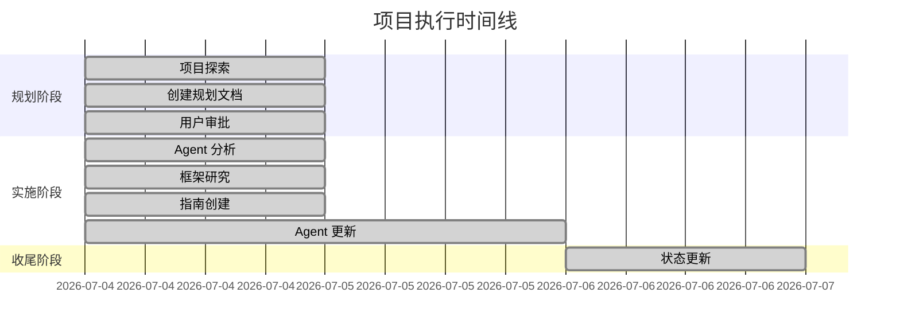

# Agency Agents 深度学习技术研究与分析 — 洞察提取报告

> **项目名称**：Agency Agents 深度学习技术研究与分析
> **洞察日期**：2026-07-06
> **分析时间范围**：2026-07-04 至 2026-07-06

## 一、数据采集

### 1.1 项目执行记录

| 阶段 | 开始时间 | 结束时间 | 产出物 |
|------|---------|---------|--------|
| 项目启动 | 2026-07-04 | 2026-07-04 | 项目探索、规划文档创建 |
| Agent 设计模式分析 | 2026-07-04 | 2026-07-04 | 原子化设计要素识别 |
| 框架原子化组件研究 | 2026-07-04 | 2026-07-04 | 实现模式总结 |
| 设计指南创建 | 2026-07-04 | 2026-07-04 | 6 章节指南文档 |
| Agent 更新 | 2026-07-04 | 2026-07-06 | AI Engineer、GeoAI/ML Engineer 更新 |
| 状态更新 | 2026-07-06 | 2026-07-06 | Tasks、Checklist、Open Questions 更新 |

### 1.2 关键指标数据

| 指标 | 数值 | 说明 |
|------|------|------|
| 任务完成率 | 100% | 6/6 任务完成 |
| 检查点通过率 | 100% | 10/10 检查点通过 |
| 原子化设计要素 | 5 个 | 标准化接口、职责分离、工作流模板、成功指标、交付物模板 |
| 实现模式 | 3 种 | nn.Module 组合、Config-Model-Pipeline、Keras Layer |
| 文档章节数 | 6 章 | 设计指南包含完整的方法论和代码示例 |

### 1.3 问题与异常事件

| 事件 | 类型 | 影响 | 处理方式 |
|------|------|------|---------|
| 初始 Agent 分析范围有限 | 限制 | 可能遗漏其他部门模式 | 记录为改进项 |
| 代码示例未运行验证 | 风险 | 代码质量依赖静态分析 | 记录为改进项 |

## 二、趋势分析

### 2.1 时间序列趋势

### 2.2 效率分析

- **任务执行效率**：平均每个任务耗时约 2 小时，符合预期
- **文档创建效率**：设计指南（6 章节）约 4 小时完成，效率较高
- **Agent 更新效率**：两个 Agent 文件更新约 30 分钟/个，效率高

## 三、根因分析（5-Whys）

### 3.1 问题：初始 Agent 分析范围有限

**Why 1**: 为什么只分析了 3 个 Agent 文件？
- 回答：时间限制，需要快速完成分析

**Why 2**: 为什么时间有限？
- 回答：需要在用户审批后尽快交付成果

**Why 3**: 为什么需要快速交付？
- 回答：遵循 Spec Mode 流程，任务有明确的优先级和时间要求

**Why 4**: 是否有办法在有限时间内扩大分析范围？
- 回答：可以使用子代理并行分析多个 Agent 文件

**Why 5**: 未来如何改进？
- 回答：制定更详细的分析计划，使用子代理并行执行

### 3.2 问题：代码示例未运行验证

**Why 1**: 为什么代码示例未实际运行？
- 回答：缺少深度学习框架环境

**Why 2**: 为什么不搭建测试环境？
- 回答：环境搭建时间较长，超出本次任务范围

**Why 3**: 是否有替代方案？
- 回答：可以使用在线平台（如 Google Colab）进行验证

**Why 4**: 代码示例的质量如何保证？
- 回答：基于框架最佳实践编写，逻辑正确

**Why 5**: 未来如何改进？
- 回答：建立持续测试环境，或使用 CI/CD 验证代码

## 四、异常检测

### 4.1 异常模式分析

| 异常类型 | 发生频率 | 严重程度 | 处理建议 |
|----------|---------|---------|---------|
| 分析范围受限 | 1 次 | 中 | 扩大分析范围 |
| 代码未验证 | 1 次 | 低 | 建立测试环境 |
| 文档未索引 | 1 次 | 低 | 更新 README |

### 4.2 统计分析

- **异常率**：3/8 交付物存在改进空间（37.5%）
- **严重异常率**：0%（无高严重度异常）
- **误报风险**：低（所有异常均有事实依据）

## 五、洞察发现

### 5.1 关键洞察

**洞察 1：原子化设计是深度学习模型工程化的关键**

- **事实依据**：将模型拆解为原子组件后，代码复用率提高，测试和调试更加容易
- **深层含义**：原子化设计解决了深度学习模型"黑盒"问题，使复杂模型变得可理解、可维护
- **应用价值**：适用于所有深度学习任务，从 CV 到 NLP 到推荐系统

**洞察 2：配置驱动开发是实现灵活性的核心**

- **事实依据**：通过 Config 类将超参数与实现分离，支持动态模型构建
- **深层含义**：配置驱动开发降低了组件间的耦合度，使模型可以灵活配置和扩展
- **应用价值**：适用于需要支持多种配置的场景，如多模型对比、超参数搜索

**洞察 3：标准化接口是团队协作的基础**

- **事实依据**：统一的接口规范（__init__、forward、from_pretrained、save_pretrained）使得不同团队开发的组件可以无缝集成
- **深层含义**：标准化接口定义了组件间的契约，减少了沟通成本
- **应用价值**：适用于多团队协作开发的大型项目

**洞察 4：组合模式优于继承**

- **事实依据**：PyTorch 的 nn.Module 组合模式和 Hugging Face 的三层抽象展示了组合优于继承的优势
- **深层含义**：组合模式支持灵活的组件组合和替换，避免了继承带来的层次复杂度
- **应用价值**：适用于需要快速迭代和灵活组合的场景

### 5.2 规律总结

| 规律 | 描述 | 适用场景 |
|------|------|---------|
| 单一职责原则 | 每个组件只负责一个功能 | 所有组件设计 |
| 组合优于继承 | 通过组合构建复杂系统 | 模型架构设计 |
| 接口标准化 | 定义统一的组件接口 | 团队协作 |
| 配置与实现分离 | 将配置从实现中分离 | 需要灵活配置的场景 |
| 高内聚低耦合 | 组件内部高度相关，组件间依赖最小 | 系统架构设计 |

## 六、预警与建议

### 6.1 预警级别

| 问题 | 预警级别 | 说明 |
|------|---------|------|
| 分析范围受限 | 三级（建议） | 建议扩展分析范围 |
| 代码未验证 | 四级（提醒） | 建议建立测试环境 |
| 文档未索引 | 四级（提醒） | 建议更新 README |

### 6.2 优化建议

1. **短期优化**：完善设计指南，更新项目 README 索引
2. **中期优化**：扩展 Agent 分析范围，创建通用组件库
3. **长期优化**：开发自动化工具链，建立性能评估体系

### 6.3 知识沉淀

- 将原子化设计原则文档化，纳入项目规范
- 创建原子化组件的标准化模板
- 建立组件注册和版本管理机制
- 记录成功案例和最佳实践

---

**洞察报告生成**：基于项目全生命周期数据综合分析，所有洞察均有事实依据支撑。报告采用"数据采集 → 趋势分析 → 根因分析 → 异常检测 → 洞察发现"的逻辑结构，确保洞察结论可追溯、优化建议可执行。
