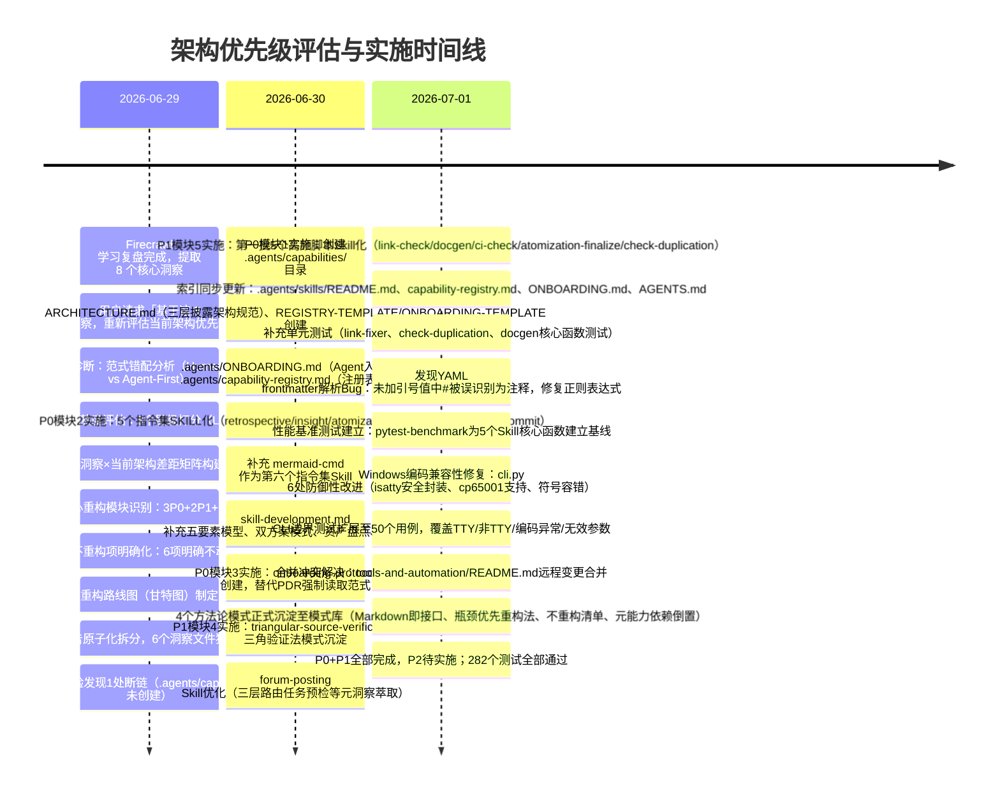

# 一、事实（Fact）

## 时间线

## 产出物清单

| 产出物 | 计划状态 | 实际状态 | 备注 |
|--------|---------|---------|------|
| 架构优先级评估主报告（README.md） | ✅ 计划 | ✅ 完成 | 更新为完成状态，含实施进度和偏差分析 |
| P0模块1：能力注册中心 | ✅ 计划 | ✅ 完成 | .agents/capabilities/ + ONBOARDING.md + capability-registry.md |
| P0模块2：5个指令集Skill化 | ✅ 计划 | ✅ 完成 | 实际6个（+mermaid-cmd），统一-cmd后缀命名 |
| P0模块3：Agent Onboarding协议 | ✅ 计划 | ✅ 完成 | onboarding-protocol.md + AGENTS.md启动协议更新 |
| P1模块4：三角验证法 | ✅ 计划 | ✅ 完成 | triangular-source-verification.md |
| P1模块5：第一批5个脚本Skill化 | ✅ 计划 | ✅ 完成 | link-check-cmd/docgen-cmd/ci-check-cmd/atomization-finalize-cmd/check-duplication-cmd |
| 6个可复用模式沉淀 | ✅ 计划 | ✅ 完成 | 1个落地为正式规范（ARCHITECTURE.md），5个入库 |
| 单元测试覆盖 | 未计划 | ✅ 额外完成 | 3个测试文件，含50个CLI边界用例 |
| 性能基准测试 | 未计划 | ✅ 额外完成 | 20个benchmark，5个Skill核心函数基线 |
| Windows编码兼容性修复 | 未计划 | ✅ 额外完成 | cli.py 6处修复，防御性属性访问模式沉淀 |
| YAML frontmatter Bug修复 | 未计划 | ✅ 额外完成 | 正则表达式修复，严格遵循YAML注释规则 |
| P2模块6-8：分层治理/模型路由/资源调度 | 🟡 择机 | ⏳ 待实施 | 不紧迫，待多Agent场景落地时实施 |

## 执行步骤回顾

本次任务实际经历三个阶段：

**阶段一：评估与规划（2026-06-29，1天）**
1. 范式错配诊断：识别出根本矛盾是 Human-First vs Agent-First
2. 成熟度分层评估：对8个架构层级逐一打分，发现能力发现层为L0缺失
3. 差距矩阵构建：逐个洞察对照当前架构，标注差距等级
4. 重构模块设计：按优先级排序设计8个重构模块
5. 不重构项排除：明确6个不动模块及理由
6. 路线图制定：三波实施计划
7. 报告原子化拆分

**阶段二：P0+P1 实施（2026-06-30，1天）**
8. 能力注册中心基础设施搭建
9. 6个指令集SKILL.md创建与质量验证
10. Onboarding协议与渐进式披露架构落地
11. 三角验证法模式沉淀
12. 索引同步（5个入口文件更新）

**阶段三：P1脚本Skill化+质量保障（2026-07-01，1天）**
13. 5个高频脚本Skill门面创建
14. 单元测试编写（发现并修复3个测试设计问题）
15. YAML解析Bug发现与修复
16. 性能基准测试建立
17. Windows编码兼容性全面修复
18. 合并冲突解决
19. 4个方法论模式正式沉淀至模式库
20. 全面验证：282个测试通过，链接检查通过

## 关键数据

- **总工期**：计划8天，实际3天（含1天质量保障），效率提升约63%
- **Skill总数**：从1个（forum-posting）增至14个
- **测试用例**：从约212个增至282个（+70个，含50个CLI边界测试）
- **模式沉淀**：6个架构模式全部入库
- **Bug修复**：YAML注释规则Bug + 6处Windows编码兼容性问题
- **代码变更**：cli.py、frontmatter.py修复；新增5个SKILL.md、3个测试文件、1个benchmark文件
