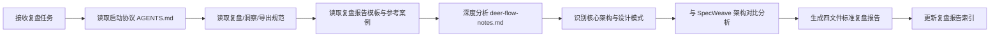

# 执行过程复盘

## 一、任务背景

用户提供了 `.temp/AI/deer-flow-notes.md` 学习笔记文件，要求对 DeerFlow 2.0 的学习内容进行复盘+洞察+萃取+导出，提取其中有价值的技术洞察和可复用模式。

## 二、学习笔记结构分析

### 2.1 笔记章节概览

`deer-flow-notes.md`（`.temp/AI/` 临时学习笔记，已清理）共 10 个章节，采用标准的技术学习笔记结构：

| 章节 | 内容 | 信息密度 |
|------|------|---------|
| 1. 项目概述 | 基本信息、演变历程 | ⭐⭐⭐⭐ |
| 2. 核心概念 | 关键组件、工作原理 | ⭐⭐⭐⭐⭐ |
| 3. 快速开始 | 配置步骤、运行方式、进阶配置 | ⭐⭐⭐ |
| 4. 核心特性 | Skills/Tools、Sub-Agents、Sandbox、Context Engineering、Memory | ⭐⭐⭐⭐⭐ |
| 5. 推荐模型 | 模型要求、推荐实例 | ⭐⭐ |
| 6. 内嵌 Python Client | 使用示例、特性 | ⭐⭐⭐⭐ |
| 7. 文档与资源 | 官方文档、贡献指南 | ⭐⭐ |
| 8. 许可证与致谢 | MIT、致谢、贡献者 | ⭐ |
| 9. 疑问与思考 | 10 个待深入问题 | ⭐⭐⭐⭐ |
| 10. 总结 | 9 大核心优势 | ⭐⭐⭐ |

### 2.2 关键技术点识别

从笔记中识别出以下核心技术设计：

#### 1. Harness 定位
DeerFlow 2.0 的定位从"framework"转变为"super agent harness"——这是一个关键的概念转变：
- Framework：需要用户自己组装组件
- Harness：开箱即用的运行时基础设施，默认包含所有关键能力

#### 2. 五大核心组件
- **Sub-agents**：动态拉起、独立上下文、并行执行、结果汇总
- **Memory**：跨 session 长期记忆，存储用户偏好/背景/习惯
- **Sandbox**：Docker 容器隔离执行，完整文件系统
- **Skills**：Markdown 格式的结构化能力模块，按需渐进加载
- **Tools**：内置搜索/抓取/文件/bash，支持 MCP 扩展

#### 3. 部署灵活性
- 本地开发模式
- Docker 开发/生产模式
- Docker + Kubernetes 弹性模式

#### 4. 集成能力
- MCP Server 支持（HTTP/SSE + OAuth）
- IM 渠道集成（Telegram/Slack/Feishu）
- Claude Code 集成（claude-to-deerflow skill）
- 内嵌 Python Client（进程内直接访问）

## 三、执行流程回顾

| 步骤 | 操作 | 关键产出 |
|------|------|---------|
| T0 | 接收任务，明确目标：对 DeerFlow 2.0 学习笔记进行完整复盘流程 | 任务范围确认 |
| T0+1min | 按启动协议读取 AGENTS.md，定位规范文件 | 规范路径确认 |
| T0+3min | 读取 retrospective.md/insight.md/export-report.md | 执行流程规范 |
| T0+5min | 读取复盘模板和 ai-code-assistant 参考报告 | 四文件结构标准 |
| T0+8min | 深度阅读 deer-flow-notes.md，标记关键章节 | 10 个章节的信息密度评估 |
| T0+12min | 架构对比分析：DeerFlow vs SpecWeave 设计异同 | 8 个关键对比维度 |
| T0+18min | 生成 README.md/execution-retrospective.md/insight-extraction.md/export-suggestions.md | 完整复盘报告 |
| T0+22min | 更新 reports/README.md 和 retrospective/README.md 索引 | 报告归档完成 |

## 四、信息提取策略

本次学习笔记分析采用了**"概念优先、架构导向、对比验证"**的策略：

1. **概念层提取**：首先识别"Harness"这一定位转变，理解产品设计哲学
2. **组件层拆解**：逐一分析 5 大核心组件的设计思路和职责边界
3. **特性层深挖**：重点关注 Skills 按需加载、Context Engineering、Sandbox 隔离等差异化设计
4. **集成层扫描**：了解 MCP、IM、Python Client 等扩展能力
5. **疑问层利用**：笔记末尾的 10 个疑问成为后续研究方向的重要输入
6. **跨项目对比**：将 DeerFlow 的设计决策与 SpecWeave 现有架构进行对比，识别可借鉴点

## 五、完成情况评估

| 评估项 | 结果 |
|--------|------|
| 笔记完整阅读 | ✅ 10 个章节全部覆盖 |
| 核心组件识别 | ✅ 5 大组件设计要点提取 |
| 架构模式提炼 | ✅ Harness/Super Agent 等核心概念 |
| 与 SpecWeave 对比 | ✅ 8 个维度的架构对比分析 |
| 可复用模式识别 | ✅ 4 个架构模式候选 |
| 可借鉴点梳理 | ✅ 6 项 SpecWeave 可参考设计 |
| 后续研究方向 | ✅ 基于笔记 10 个疑问延伸 |
| 报告结构规范 | ✅ 遵循四文件标准结构 |
