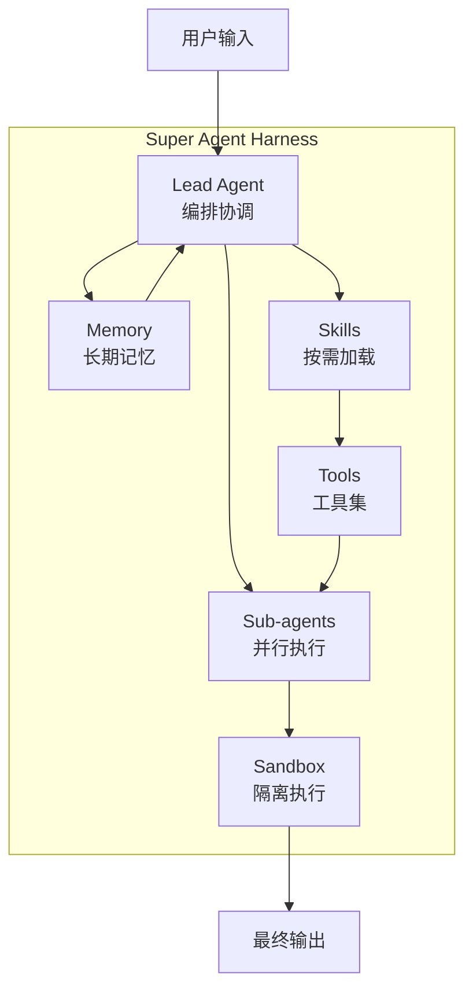
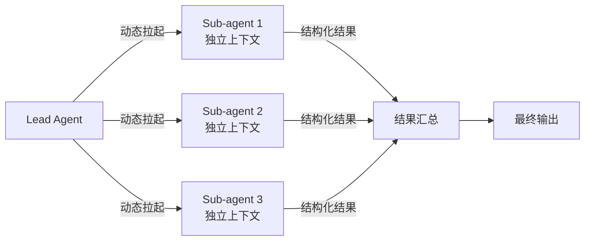
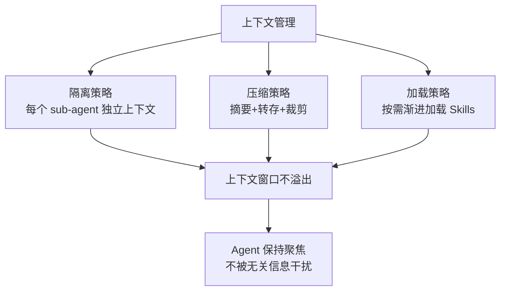
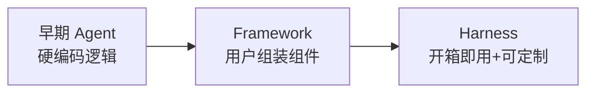

# 洞察萃取

## 一、关键发现与深层分析

### 洞察 1：Super Agent Harness 架构范式

**事实**：DeerFlow 2.0 从"framework"重新定位为"super agent harness"——一个让 agents 把事情做完的运行时基础设施。

**深层含义**：

Framework 和 Harness 的本质区别：

| 维度 | Framework（框架） | Harness（驾驭装置/运行时） |
|------|------------------|---------------------------|
| 用户角色 | 组装者 | 使用者/定制者 |
| 默认能力 | 需自行拼装 | 开箱即用 |
| 扩展方式 | 基于框架开发 | 替换/重组模块 |
| 学习曲线 | 陡峭（需理解架构） | 平缓（先使用再深入） |
| 典型代表 | LangChain、LangGraph | DeerFlow 2.0 |

**Harness 架构抽象**：



**对 SpecWeave 的启示**：SpecWeave 当前定位为"AI 智能体协作的工程化方法"，可以考虑是否需要向"Harness"方向演进——提供更开箱即用的体验，而不仅仅是规范和模板。

### 洞察 2：Skills 系统的 Markdown 化与按需加载

**事实**：DeerFlow 的 Skills 是结构化能力模块，**通常是 Markdown 文件**，定义工作流、最佳实践和参考资源，采用按需渐进加载策略。

**深层含义**：

这与 SpecWeave 的 `.agents/` 规范体系有惊人的相似性，但也有关键差异：

| 维度 | DeerFlow Skills | SpecWeave .agents/ |
|------|-----------------|-------------------|
| 格式 | Markdown 文件 | Markdown + TOML frontmatter |
| 加载方式 | 按需渐进加载，控制上下文窗口 | 启动协议一次性路由，按需读取 |
| 内容 | 工作流、最佳实践、参考资源 | 角色定义、系统提示词、协议、工作流、模板 |
| 扩展性 | 用户可添加自己的 skills | 通过 .agents/ 目录扩展 |
| 执行控制 | 由 Lead Agent 动态调度 | 由启动协议静态路由 |

**关键设计亮点**：
1. **Markdown 作为能力载体**：降低了技能扩展的门槛，用户无需写代码即可添加新能力
2. **按需渐进加载**：只有任务需要时才加载，有效控制上下文窗口大小
3. **可替换性**：内置 skills 可以被用户自定义 skills 替换

**SpecWeave 可借鉴点**：
- 当前的启动协议要求"一次性读取所有规范文件"可能导致上下文过载，可以考虑引入按需加载机制
- Skills 的 Markdown 化思路验证了 SpecWeave 选择 Markdown 作为规范载体的正确性
- 可以考虑将 .agents/ 的内容进一步"技能化"，让 AI 能更自主地决定加载哪些规范

### 洞察 3：Sub-Agents 的独立上下文与并行执行

**事实**：DeerFlow 的 Sub-agents 由 Lead Agent 动态拉起，每个 Sub-agent 有**独立的上下文、工具和终止条件**，条件允许时**并行运行**，最后由 Lead Agent 汇总结果。

**深层含义**：

这是一种"分而治之"的多智能体协作模式，与 SpecWeave 的角色分工有相似之处，但执行模型不同：

| 维度 | DeerFlow Sub-agents | SpecWeave Roles |
|------|---------------------|-----------------|
| 实例化 | 动态按需拉起 | 静态定义，按需激活 |
| 上下文 | 完全独立 | 共享项目上下文，角色专属提示词 |
| 执行模式 | 并行执行 | 串行交接（handoff） |
| 通信机制 | Lead Agent 汇总结果 | 消息传递 + 任务交接 |
| 适用场景 | 复杂任务拆解、从几分钟到几小时的长任务 | 开发流程各环节分工 |

**Sub-Agents 执行模型**：



**对 SpecWeave 的启示**：
- SpecWeave 当前的 handoff 协议是串行的，可以考虑引入并行 sub-agent 模式
- 独立上下文是控制 context window 的关键手段——SpecWeave 的规范读取也可以借鉴这种隔离思路
- - "返回结构化结果"是多智能体协作成功的关键，SpecWeave 的 handoff 模板可以强化这一点

### 洞察 4：Sandbox 隔离执行机制

**事实**：DeerFlow 每个任务运行在隔离的 Docker 容器里，有完整文件系统（skills/workspace/uploads/outputs），整个过程可审计、会隔离，不会在不同 session 之间互相污染。

**深层含义**：

Sandbox 解决了 Agent 执行的三大核心问题：
1. **安全性**：Agent 代码不会影响宿主机
2. **隔离性**：不同任务/会话之间互不干扰
3. **可审计性**：所有操作在容器内可追溯

**Sandbox 文件系统布局**：

```
/mnt/user-data/
├── uploads/          # 用户文件
├── workspace/        # agents 工作目录
└── outputs/          # 最终交付物
```

**三级部署模式**：
1. 本地执行（宿主机直接运行）
2. Docker 执行（单容器隔离）
3. Docker + Kubernetes 执行（弹性伸缩，通过 provisioner 管理 Pod）

**与 SpecWeave 的对比**：
- SpecWeave 当前通过规范治理（AGENTS.md + 规则体系）来"软隔离"，而不是技术隔离
- SpecWeave 的 `.temp/` → `apps/` 迁移流程某种程度上也是一种"沙箱"机制——.temp/ 是探索区，apps/ 是稳定区
- 可以考虑为 SpecWeave 的代码执行引入可选的沙箱机制

### 洞察 5：Context Engineering 的主动管理

**事实**：DeerFlow 积极管理上下文，包括：
- 隔离的 Sub-Agent Context：每个 sub-agent 在自己独立的上下文里运行
- 摘要压缩：总结已完成的子任务、转存中间结果、压缩不重要信息

**深层含义**：

Context Engineering 正在成为 Agent 系统设计的核心挑战：



**SpecWeave 当前的上下文管理**：
- 通过"按需读取"原则控制上下文
- 通过原子化文档拆分减少单次加载量
- 通过"先搜索、再精读、只保留相关上下文"原则降噪
- 但缺少主动的摘要压缩机制和独立子任务上下文

### 洞察 6：长期记忆的分层设计

**事实**：DeerFlow 的 Memory 跨 session 积累关于用户的持久信息，包括个人偏好、知识背景和工作习惯，记忆保存在本地，控制权始终在用户手里。

**深层含义**：

这是一种"用户主权"的记忆设计：
1. **本地化存储**：数据不离开用户设备
2. **用户控制权**：用户可以查看、编辑、删除记忆
3. **渐进积累**：跨 session 持续学习用户偏好

**与 SpecWeave memory 系统的对比**：

| 维度 | DeerFlow Memory | SpecWeave Memory |
|------|-----------------|------------------|
| 存储位置 | 本地 | 本地 `.trae-cn/memory/` |
| 内容 | 个人偏好、知识背景、工作习惯 | user_profile + project_memory + 每日 topics |
| 结构 | 用户为中心 | 项目为中心 + 用户画像 |
| 控制权 | 用户所有 | 用户所有 |
| 积累方式 | 自动积累 + 显式管理 | 会话结束自动摘要 |

**SpecWeave 可借鉴点**：
- DeerFlow 的"个人偏好、知识背景、工作习惯"三维度记忆模型更结构化
- 可以考虑在 user_profile.md 中增加这些维度的明确字段

### 洞察 7：内嵌 Python Client 的进程内访问模式

**事实**：DeerFlow 提供 `DeerFlowClient`，作为内嵌 Python 库使用，不必启动完整 HTTP 服务，可以在进程内直接访问，覆盖所有 agent 和 Gateway 能力，返回数据结构与 HTTP Gateway API 保持一致。

**深层含义**：

这是一种"双模式访问"设计：
1. **HTTP 模式**：Web UI、IM 集成、跨语言调用
2. **内嵌模式**：Python 应用内直接调用，无网络开销

**API 一致性原则**：两种模式返回相同的数据结构，且都通过 Pydantic 响应模型校验。

**对 SpecWeave 的启示**：
- SpecWeave 当前是"规范驱动"的，主要通过 Markdown 规范指导 AI 行为
- 可以考虑未来提供 Python SDK，将规范体系可编程化
- API 一致性原则值得借鉴——多种访问方式背后是同一套能力模型

### 洞察 8：MCP 作为能力扩展标准

**事实**：DeerFlow 支持可配置的 MCP Server 和 skills 用于扩展能力，支持 HTTP/SSE MCP Server 和 OAuth token 流程。

**深层含义**：

MCP（Model Context Protocol）正在成为 Agent 工具扩展的事实标准：
- 不再需要为每个 Agent 框架单独开发工具
- 工具可以跨框架复用
- OAuth 支持解决了授权问题

**与 SpecWeave 扩展机制的对比**：
- SpecWeave 通过 `.agents/` 目录和 scripts/ 目录扩展
- DeerFlow 通过 MCP Server 标准化扩展
- 可以考虑 SpecWeave 未来支持 MCP 工具，接入更广泛的工具生态

## 二、DeerFlow 与 SpecWeave 架构对比总结

| 维度 | DeerFlow 2.0 | SpecWeave | 可借鉴程度 |
|------|-------------|-----------|-----------|
| 定位 | Super Agent Harness（运行时） | AI 智能体协作的工程化方法（规范体系） | - |
| 核心抽象 | Lead Agent + Sub-agents | 7 种角色 + 5 种协议 | ⭐⭐⭐ |
| 能力载体 | Markdown Skills | Markdown 规范文件 | ⭐⭐⭐⭐⭐ |
| 上下文管理 | 隔离+压缩+按需加载 | 按需读取+原子化拆分 | ⭐⭐⭐⭐ |
| 执行隔离 | Docker/K8s Sandbox | .temp/ 软隔离 | ⭐⭐⭐ |
| 记忆系统 | 用户偏好/背景/习惯三维 | 用户画像+项目记忆 | ⭐⭐⭐ |
| 扩展方式 | MCP Server + 自定义 Skills | .agents/ + scripts/ | ⭐⭐⭐⭐ |
| 访问方式 | HTTP + 内嵌 Python Client | 规范引导（无 SDK） | ⭐⭐ |
| 并行执行 | Sub-agents 并行 | 角色串行 handoff | ⭐⭐⭐⭐ |
| 部署方式 | 本地/Docker/K8s | 无（纯规范） | - |

## 三、规律认知

### 规律 1：Agent 系统从 Framework 到 Harness 的演进



Agent 系统正在经历类似 Web 框架的演进：从早期的 CGI 脚本（硬编码）→ 到 Spring/Rails（框架，需组装）→ 到 Next.js/Nuxt（全栈框架，约定优于配置，开箱即用）。DeerFlow 2.0 的"Harness"定位符合这一演进趋势。

### 规律 2：Markdown 正在成为 Agent 能力的一等公民

DeerFlow 的 Skills 是 Markdown，SpecWeave 的规范是 Markdown，Claude Code 的 Skills 也是 Markdown。Markdown 因其：
1. **人类可读**：便于编写和维护
2. **结构清晰**：标题/列表/表格天然适合表达流程和规范
3. **AI 友好**：是 LLM 训练数据的主要格式
4. **版本可控**：纯文本，Git 友好

正在成为 Agent 能力定义的首选格式。

### 规律 3：上下文管理是 Agent 系统的核心战场

当 Agent 能力越来越强、工具越来越多，如何有效管理 context window 成为关键：
- **空间隔离**：Sub-agent 独立上下文
- **时间压缩**：摘要已完成任务
- **按需加载**：不提前加载不需要的信息
- **结构化返回**：子任务返回结构化结果而非完整对话历史

### 规律 4：多智能体协作的"分-合"模式

复杂任务处理正在收敛到"分而治之，汇总输出"的模式：
1. Lead Agent 理解任务，规划拆解方式
2. 动态拉起多个 Sub-agents 并行处理子任务
3. 每个 Sub-agent 在独立上下文里专注自己的任务
4. Sub-agents 返回结构化结果
5. Lead Agent 汇总成最终输出

## 四、潜在机会识别

### 机会 1：SpecWeave 的 Harness 化演进

当前 SpecWeave 是一个"规范体系"，用户需要阅读 AGENTS.md 才能开始使用。可以考虑：
- 提供 `python -m specweave init` 这样的一键初始化命令（已有 `agents.py init`）
- 将核心规范打包为内置 Skills，按需加载
- 提供更开箱即用的体验，降低上手门槛

### 机会 2：引入并行 Sub-agent 模式

SpecWeave 当前的角色协作是串行 handoff 模式，可以引入：
- 任务并行化能力（多个角色同时工作）
- 独立子任务上下文
- 结构化结果汇总机制

### 机会 3：主动 Context Engineering

在现有"按需读取"基础上，增加：
- 已完成任务的自动摘要
- 中间结果的转存机制
- 不重要信息的自动裁剪

### 机会 4：记忆系统结构化升级

参考 DeerFlow 的三维记忆模型，升级 SpecWeave 的记忆：
- 在 user_profile.md 中显式增加"个人偏好、知识背景、工作习惯"维度
- 提供记忆查看和编辑的交互方式

### 机会 5：MCP 工具生态接入

研究如何让 SpecWeave 支持 MCP 工具：
- 可以复用 MCP 生态中已有的工具
- 不需要重复开发搜索/文件/浏览器等通用工具
