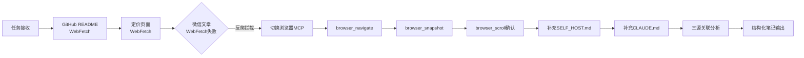

# 执行过程复盘

## 任务背景

用户要求系统学习三个网页内容：
1. https://github.com/firecrawl/firecrawl — GitHub 开源仓库
2. https://www.firecrawl.dev/pricing — 官方定价页面
3. https://mp.weixin.qq.com/s/Kk_Z4d3Ft7SKejgQoLCHXg — 微信公众号「逛逛GitHub」行业解读文章

要求针对每个网页完成四项任务：全面理解核心内容/功能/技术实现、提取关键信息/技术要点/重要概念、分析网页间关联性与信息互补性、整理结构化学习笔记。

## 执行步骤

### 步骤1：启动协议与任务规划

- 遵循 AGENTS.md 启动协议，确认任务为"外部技术学习"类型
- 创建 TodoWrite 任务列表，规划5个执行阶段
- 确定信息采集策略：GitHub+定价页用 WebFetch，微信文章因反爬机制需用浏览器工具

### 步骤2：GitHub 仓库内容采集

- 使用 WebFetch 获取 https://github.com/firecrawl/firecrawl 主页
- 获取到 README 核心内容（约前半部分，包含产品概述、功能表、Quick Start、SDK 示例）
- 补充获取 SELF_HOST.md（自托管指南，含 Docker/K8s 部署、环境变量配置）
- 补充获取 CLAUDE.md（开发指南，含 monorepo 结构、测试流程）
- 关键发现：仓库为 monorepo 结构，核心 API 在 apps/api，多语言 SDK 在 apps/*-sdk

### 步骤3：定价页面内容采集

- 使用 WebFetch 获取 https://www.firecrawl.dev/pricing
- 提取到六档定价方案（Free/Hobby/Standard/Growth/Scale/Enterprise）
- 提取 Credit 消耗规则表、并发数限制、Enterprise 专属特性
- 提取 FAQ 中关于计费规则（失败不收费、credits 不滚存等）的说明

### 步骤4：微信公众号文章采集

- 因微信公众号反爬机制，WebFetch 无法直接获取有效内容
- 切换策略：使用 integrated_browser MCP 工具
- 读取 browser_navigate、browser_snapshot、browser_tabs、browser_scroll 工具 Schema
- 在新标签页导航至微信文章 URL
- 通过 browser_snapshot 获取页面可访问性快照（含所有文本内容）
- 向下滚动确认无更多内容
- 成功提取文章全文，核心主题为"Firecrawl 推出无 Key 模式"及其战略解读

### 步骤5：补充技术文档采集

- 额外获取 SELF_HOST.md：了解自托管部署方式、环境变量、限制条件（无 Fire-engine）
- 获取 CLAUDE.md：了解 monorepo 结构、测试规范（pnpm harness）、knip 检查要求

### 步骤6：三源关联性分析

- 建立"信息三角"模型：GitHub=技术实现、定价页=商业模式、公众号=战略意图
- 识别交叉验证点（如 1000 次免费额度、Keyless 模式、MCP/CLI 集成在三个源中均有体现）
- 识别信息互补关系（技术深度↔商业边界↔战略背景）

### 步骤7：结构化学习笔记输出

- 输出10个章节的系统化笔记：产品概述、核心功能与API、技术架构、AI Agent生态集成、商业模式、战略洞察、关联性分析、快速上手、关键概念速查、总结
- 使用 Mermaid 图表展示范式转移逻辑

## 信息采集路径时间线

## 关键决策点

### 决策1：微信文章采集工具切换

**问题**：WebFetch 无法获取微信公众号文章内容（反爬机制返回的是验证页面或空壳 HTML）。

**决策**：从 WebFetch 切换到 integrated_browser MCP 工具，通过真实浏览器渲染获取内容。

**结果**：成功获取完整文章内容，包含三段核心论述（开源简介、Keyless 三大入口、战略逻辑分析）。

**经验**：国内平台（微信、知乎等）普遍有反爬机制，遇到 WebFetch 失败时应立即切换到浏览器自动化工具，而非反复重试。

### 决策2：信息采集深度的边界控制

**问题**：GitHub 仓库内容庞大（5541 commits、多个子目录），是否需要深入 apps/api 源码？

**决策**：停留在 README + SELF_HOST.md + CLAUDE.md 层面，不深入源码。理由：
1. 用户要求是"系统学习网页内容"，三个指定网页已覆盖核心信息
2. SELF_HOST.md 和 CLAUDE.md 提供了足够的技术架构细节
3. 深入源码会偏离用户需求边界

**经验**：外部产品学习以官方文档和 README 为主，源码是最后手段。

### 决策3：分析维度的三角模型构建

**问题**：三个来源风格迥异（技术文档/商业页面/行业评论），如何整合？

**决策**：构建"技术-商业-战略"三角模型，不强行统一格式，而是让三个维度互相补充和验证。

**结果**：形成了比单独阅读任何一个来源都更完整的认知——GitHub 回答"怎么做"，定价页回答"多少钱"，公众号回答"为什么"。

## 遇到的问题与解决

| 问题 | 解决方式 | 耗时影响 |
|------|---------|---------|
| WebFetch 无法获取微信文章 | 切换到 integrated_browser MCP | +2步工具调用 |
| GitHub README 被截断 | 补充获取 raw SELF_HOST.md 和 CLAUDE.md | +2次 WebFetch |
| 浏览器 MCP 工具需先读 Schema | 按 MCP 协议先 LS → Read → run_mcp | +3步工具调用 |

## 执行结果

- 成功采集三个网页的完整核心内容
- 补充获取了2份关键技术文档（SELF_HOST.md、CLAUDE.md）
- 完成三源关联性分析，建立信息三角模型
- 输出约8000字结构化学习笔记，覆盖10个章节
- 无遗漏用户要求的任何任务项
