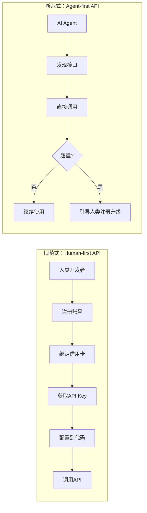

# 洞察1：Agent 时代 API 设计范式转移——Keyless 模式

**来源**：微信公众号深度解读 + GitHub Agent Onboarding 章节 + 定价页 FAQ

## 事实

Firecrawl 推出 Keyless 模式：无需注册、无需 API Key、无需配置环境变量，直接通过 MCP/CLI/REST 三个入口调用 API，每月自动赠送 1000 次免费额度。

## 分析

传统 API Key 模式的设计前提是：**API 的消费者是人**（开发者）。人会注册账号、绑定支付、管理密钥轮换。但 AI Agent 不会做这些事——它只会调用接口。当 Agent 成为 API 的主要消费者时，"先注册再使用"成为最大的接入摩擦。

Keyless 模式的本质不是"免费送"，而是**重新定义 API 的默认消费者**：
- 旧范式：人 → 注册 → Key → 配置 → 调用
- 新范式：Agent → 发现 → 直接调用 → 超量后再引导注册

## 可复用模式萃取

**模式名称**：Agent-First API Design（Agent 优先 API 设计）

**核心原则**：
1. **零配置启动**：首次调用无需任何前置步骤（注册、Key、配置）
2. **免费额度内置**：自动赠送基础额度，不设前置门槛
3. **Agent 可自主发现**：提供标准化的服务发现机制（如 MCP、Skill 描述符）
4. **升级路径清晰**：超量时引导人类介入付费决策，而非阻断服务
5. **身份轻量认证**：初始调用可用设备指纹/IP 等轻量标识，Key 作为升级选项而非必需

**成熟度**：L3（已在 Firecrawl 产品中验证，具备可复制性）

**SpecWeave 相关性**：SpecWeave 的多智能体协作体系中，agent 间的服务调用也可借鉴此模式——新 skill/新能力首次被 agent 发现时，无需复杂的权限配置即可试用，通过用量阈值控制资源消耗。

**关联洞察**：
- [洞察4：Agent Onboarding](insight-4-agent-onboarding.md) — Keyless 依赖 Agent 可读的服务描述
- [洞察5：三入口并行](insight-5-omnichannel-api.md) — Keyless 需要在所有入口对等支持
