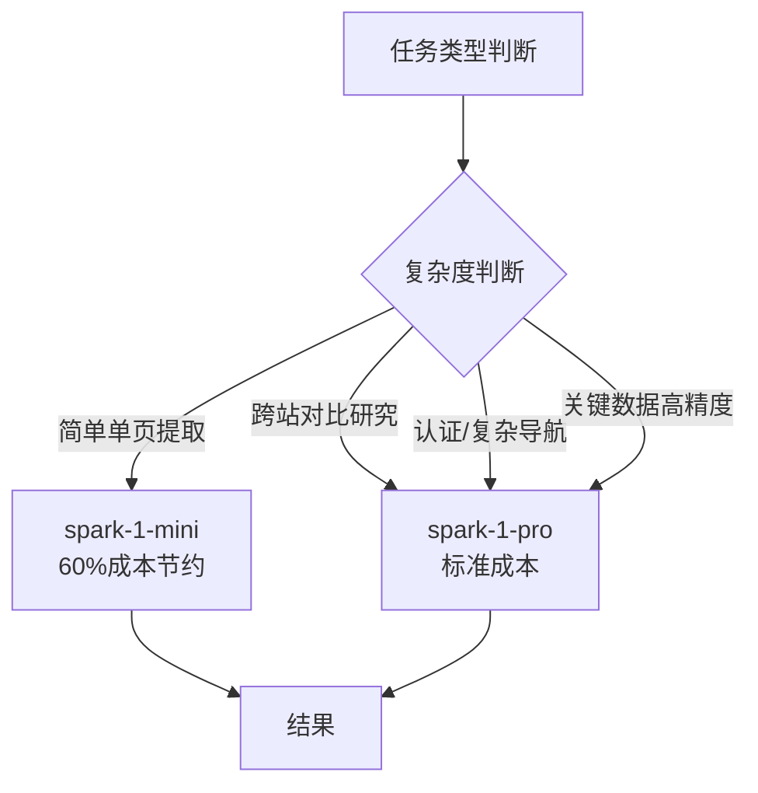

# 洞察7：双模型策略——成本-质量弹性切换

**来源**：GitHub Agent 章节 "Model Selection"

## 事实

Firecrawl Agent 模式提供两个模型选择：
- `spark-1-mini`（默认）：成本低 60%，适合大多数任务
- `spark-1-pro`：标准成本，适合复杂研究、跨站对比、高准确性场景

## 分析

这是一个聪明的**产品化思维**——不试图用一个模型满足所有场景，而是给用户选择权：

这种设计既控制了用户的成本（默认用便宜的），又不牺牲复杂场景的能力。它把"该用哪个模型"的决策权部分交给用户，同时给出明确的选择指引（什么时候用 Pro 的四个场景）。

## 可复用模式萃取

**模式名称**：Dual-Model Cost-Quality Switch（双模型成本-质量开关）

**核心原则**：
1. **默认经济档**：默认选择成本最低的选项，避免用户意外消耗
2. **明确升级条件**：列出何时需要升级到高质量模型的具体场景
3. **价格差异感知明显**：60% 的成本差异足够驱动用户有意识选择
4. **API 参数简单切换**：通过一个参数（`model: "spark-1-pro"`）即可切换
5. **结果格式一致**：不同模型输出相同格式，不增加集成复杂度

**成熟度**：L3（OpenAI API 首创，Firecrawl 将其应用于垂直 Agent 场景）

**SpecWeave 相关性**：可在 LLM 调用层提供成本-质量弹性选项，简单任务（格式检查、链接验证）用快速模型，关键路径（架构决策、代码审查）用高质量模型。

**关联洞察**：
- [洞察3：层级化Credit经济](insight-3-tiered-credit.md) — 双模型是成本控制的微观体现
