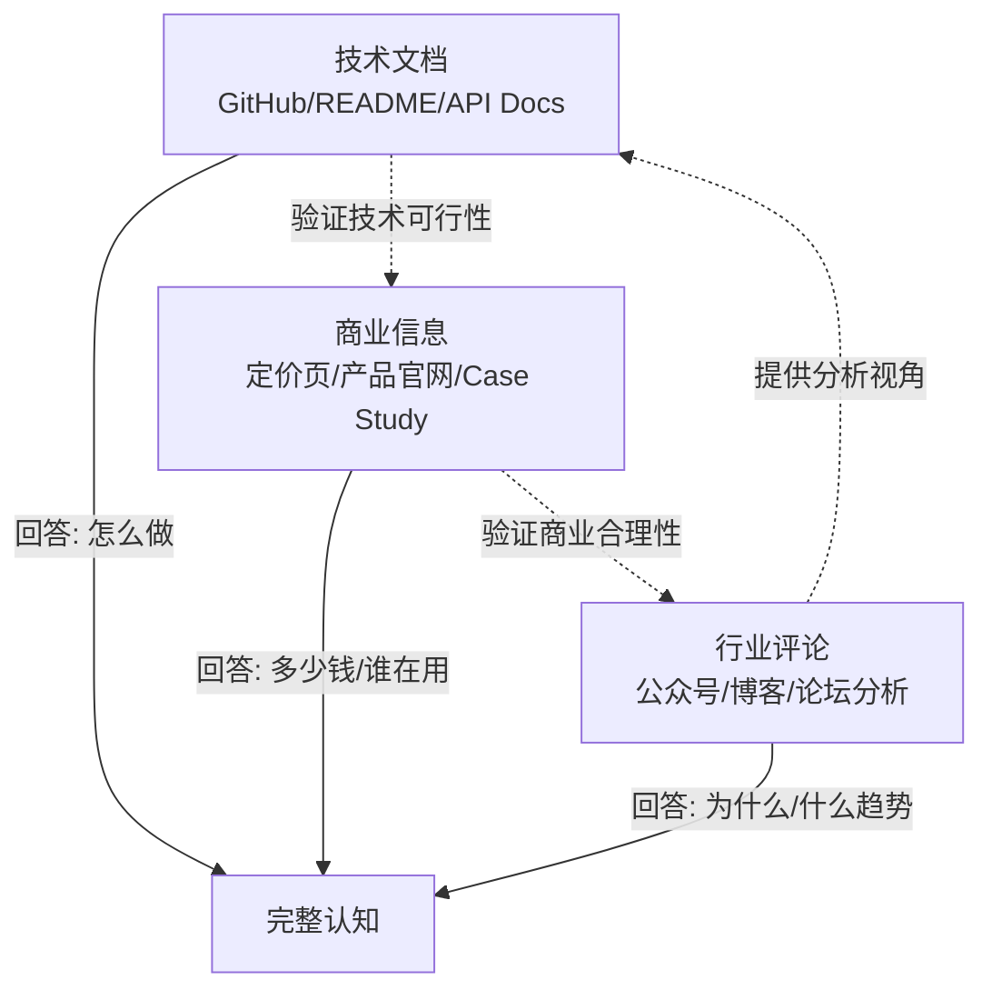

# 洞察8：三源信息三角验证法（方法论萃取）

**来源**：本次学习过程中总结的信息采集方法论

## 事实

本次学习过程中发现，单一信息源无法形成完整认知：
- 只读 GitHub：了解技术实现，但不知道商业模式和战略意图
- 只读定价页：知道价格，但不知道技术能力和产品定位
- 只读公众号：理解战略判断，但缺少技术细节和商业数据验证

三源结合才能形成完整认知三角。

## 分析

在研究外部产品/技术时，信息源可分为三类，形成互补三角：

**三层验证机制**：
1. **事实交叉验证**：同一数据点在多个源中出现时可信度更高（如 1000 免费额度在三个源中都有提及）
2. **缺口互补**：一个源未覆盖的信息由其他源补充（如公众号提供的战略解读是 GitHub 不涉及的）
3. **偏差校正**：官方文档可能夸大优势，第三方评论可能揭示问题，结合起来更客观

## 可复用模式萃取

**模式名称**：Triangular Source Verification（三源信息三角验证法）

**核心原则**：
1. **技术源**：官方文档、GitHub、API Reference — 回答"How"
2. **商业源**：定价页、产品主页、Customer Stories — 回答"How much/Who"
3. **第三方源**：行业评论、独立评测、社区讨论 — 回答"Why/So what"
4. **交叉验证**：关键数据点至少在两个源中得到确认
5. **缺口标注**：明确标注哪些信息仅来自单一来源，可信度较低

**成熟度**：L2（本次实践中总结，可在后续外部研究中反复验证）

**SpecWeave 相关性**：可作为 .agents/commands/insight.md 洞察指令集的标准信息采集方法论。在后续的架构评估任务中，已实践了此模式的扩展版本——架构决策三角验证（代码视角+使用视角+标杆视角）。

**关联洞察**：
- 此洞察是元方法论，支撑洞察1-7的研究质量
- 在架构优先级评估中已扩展为 [架构决策三角验证](../../retrospective-architecture-priority-20260629/insight-extraction.md#洞察-e架构决策三角验证architecture-triangulation)
