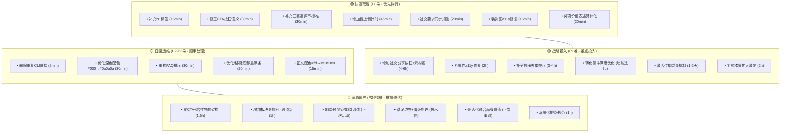

# 秒悟产品启航赛活动页面七维度全面分析报告

## 执行摘要

秒悟产品启航赛页面整体完成度较高，技术基础稳定（0控制台错误、CDN加载<350ms、全响应式适配），定位精准直击开发者「本地能跑、线上难部署」的核心痛点，三赛道设计与低参赛门槛规则有效扩大了参与面。但在投稿截止仅剩2天的关键节点，存在4个P0级核心问题严重影响末期转化：（1）无h1标签导致SEO、可访问性与视觉层级三重缺陷；（2）「立即投稿」按钮使用`<a href="#">`语义错误，点击行为不明确；（3）评审标准完全模糊，参赛者无法针对性准备作品；（4）截止前2天无任何紧迫感营造（无倒计时、无提醒），漏斗末端缺少临门一脚。此外，奖项梯度不足（70%获奖名额仅电子证书）、传播机制断裂（要求社交发布但无分享工具）、信息架构不一致（社交要求仅在奖项提及未在规则同步）等P1级问题也制约着活动效果。建议立即执行4项P0快速修复，预计2-4小时可完成，有望在截止前显著提升投稿转化率。

---

## 一、分析方法论说明

- **分析框架**：七维度评估模型（内容呈现/用户体验/信息架构/视觉设计/交互功能/技术实现/商业价值）
- **分析对象**：https://c0qe3c61ma5l.meoo.pub/
- **分析时间**：2026-07-14（投稿截止前2天）
- **数据来源**：浏览器自动化采集+DOM/样式/网络请求检查
- **分析流程**：事实采集（11大类客观数据）→ 七维度逐层分析（现状-优势-不足-建议）→ 问题优先级排序 → 分阶段路线图制定
- **框架特点**：从用户感知表层（内容/视觉/UX）→ 逻辑中层（信息架构/交互）→ 技术底层（实现）→ 商业目标层（价值），形成完整分析闭环

---

## 二、页面概况

### 2.1 基本信息

| 项目 | 值 |
|---|---|
| **页面URL** | https://c0qe3c61ma5l.meoo.pub/ |
| **页面标题** | 秒悟产品启航赛 |
| **页面类型** | 单页应用（SPA），活动落地页 |
| **赛事联合方** | 秒悟 Meoo × 人人都是产品经理 |
| **技术栈** | React/Vite构建 |
| **部署平台** | 秒悟平台（Meoo），域名 `.meoo.pub` |
| **整体风格** | 暗色主题（Dark Mode），科技感，纯黑背景+白色文字+紫蓝色调 |

### 2.2 主要板块结构

页面按以下线性顺序组织内容：
1. **Hero区域**：大标题「Ship 秒悟产品 启航赛」+ 核心文案「从代码到产品，一键上线启航」+ CTA按钮「立即投稿」
2. **活动简介**：痛点切入 + 三步参赛流程（应用构建→部署上线→参赛投稿）
3. **活动时间**：三阶段时间线（报名投稿07.01-07.15 → 作品评审07.16-07.22 → 结果公布2026.07.23）
4. **参赛规则**：8条核心规则，覆盖人群、工具、部署、原创、提交数量等
5. **奖项设置**：三个赛道各10名（Meoo力全开奖/Meoo颜爆表奖/Meoo想天开奖），区分前三名与四至十名奖励
6. **常见问题**：6个FAQ覆盖工具选择、新旧作品、投稿数量、开源要求等
7. **投稿CTA区域**：深蓝紫色背景的二次行动号召区域

### 2.3 技术状态

- **资源加载**：所有外部资源加载成功（状态码200），CDN资源加载耗时<350ms
- **控制台状态**：0个JavaScript错误，0个警告
- **响应式适配**：桌面端（1280px）、平板端（768px）、移动端（375px）均正常，无元素溢出或截断
- **外部链接**：共3个链接（2个重复的CLI使用指南、1个立即投稿锚点）
- **弹窗功能**：大赛社群二维码弹窗功能完整，支持ESC键、×按钮、关闭按钮三种关闭方式

---

## 三、七维度详细分析

### 3.1 内容呈现维度

#### 现状描述
- Hero区域核心文案：「从代码到产品，一键上线启航」
- 活动时间：「报名投稿 07.01-07.15」「作品评审 07.16-07.22」「结果公布 2026.07.23」
- 参赛规则：8条规则，涵盖面向人群、工具要求、部署要求、原创要求、提交数量、迭代规则、访问要求、反作弊
- 奖项设置：三个赛道各10名，区分前三名与四至十名奖励
- FAQ：6个常见问题，覆盖CLI使用、工具限制、新旧作品、投稿数量、开源要求、作品迭代
- 评审标准：仅提及「结合作品数据和呈现效果评分」，未明确各赛道具体评审维度权重

#### 优势
1. **痛点切入精准**：活动简介直接点出开发者痛点「本地能跑，怎么让别人也能访问」，「解决最后一公里」的定位清晰，能够快速引起目标用户共鸣
2. **规则表述简洁明确**：参赛规则8条覆盖核心要点，语言直白（如「不限语言、不限技术栈只看：你做出来了一个可以线上分享的应用」），降低理解成本
3. **FAQ覆盖核心疑虑**：6个问题精准命中新手参赛的常见疑问（工具选择、旧项目能否参赛、能否投多个、是否需要开源），有效减少用户决策阻力

#### 不足
1. **评审标准表述模糊**：仅提及「结合作品数据和呈现效果评分」，但三个赛道（力全开/颜爆表/想天开）的具体评审维度、权重分配、评分细则完全缺失，参赛者无法针对性准备作品
2. **时间紧迫感缺失**：采集日期为2026-07-14，距离07.15截止仅剩2天，但页面无任何倒计时、截止提醒、「最后XX天」等紧迫感营造元素，Hero区域仅静态展示「07/01-07/15」
3. **奖项吸引力表述不足**：「10万积分包（价值100元）」直接标注现金等价物，削弱了奖品的价值感知；「百万级流量曝光支持」缺乏具体数据支撑（如曝光渠道、预估触达人数）
4. **社交传播要求不突出**：「Meoo力全开奖」要求带话题在小红书/抖音/B站发布，但该要求淹没在奖项描述中，未在参赛规则或醒目位置强调，可能导致参赛者遗漏该赛道要求

#### 优化建议
1. **补充明确评审标准**：为三个赛道分别列出3-5条评审维度及权重（如「Meoo想天开奖：创意新颖度40%、问题解决力30%、实用价值30%」），让参赛者清晰准备方向
2. **增加截止倒计时**：在Hero区域「立即投稿」按钮上方增加动态倒计时组件（「距投稿截止还有：X天X时X分」），截止前3天改为醒目的橙红色，营造紧迫感
3. **优化奖项价值表述**：将「价值100元」改为「可抵扣100元模型调用费用，约支持XX次API调用」；「百万级流量曝光」补充具体渠道（如「秒悟官网推荐位+官方公众号推文+合作社区置顶」）
4. **突出社交传播要求**：在参赛规则中增加一条关于「Meoo力全开奖」的专项说明，或在奖项区域为该赛道增加「需要社交平台发布」的醒目标识

---

### 3.2 用户体验维度

#### 现状描述
- 第一印象：黑底白字深色主题，科技感风格，Hero区域有大标题「Ship 秒悟产品 启航赛」
- CTA按钮：Hero区域主按钮「立即投稿」，白色文字32px字号，圆角4.8px，左右内边距32px
- 阅读布局：桌面端多列布局，移动端单列自适应
- 弹窗交互：「大赛社群」按钮点击弹出模态窗口，支持ESC键、×按钮、关闭按钮三种关闭方式
- 底部悬浮条：「By Meoo 秒悟」悬浮条，可关闭
- 用户旅程触点：顶部导航（大赛社群、CLI指南）→ Hero区域（立即投稿）→ 各内容板块 → FAQ（CLI指南链接重复）

#### 优势
1. **核心CTA视觉突出**：「立即投稿」按钮使用32px大字号、白色文字、深蓝紫色背景对比，在深色主题下非常醒目，用户进入页面后能快速定位主行动点
2. **弹窗体验完善**：大赛社群弹窗支持多种关闭方式（ESC、×按钮、关闭按钮），符合模态框交互规范，用户不会因无法关闭弹窗而困惑
3. **响应式适配完整**：在桌面（1280px）、平板（768px）、移动（375px）三种视口下，所有关键按钮保持可见、标题层级完整、无内容截断，移动端体验有保障

#### 不足
1. **CTA按钮行为不明确**：「立即投稿」href为`#`页内锚点，但无法确认点击后是滚动到表单区域还是打开投稿弹窗；按钮文案仅为「立即投稿」，未告知用户点击后会发生什么
2. **导航缺失导致回溯成本高**：页面为单页长滚动，但无固定侧边导航/锚点导航/回到顶部按钮，用户阅读到下方后需要手动滚动回顶部，浏览长内容时体验不佳
3. **底部悬浮条造成干扰**：「By Meoo 秒悟」悬浮条持续占据底部空间，可能遮挡移动端页面底部内容或按钮，且无实际功能价值（仅品牌展示）
4. **用户旅程缺少关键触点**：从「阅读活动信息」到「完成投稿」的旅程中，缺少「查看示例作品」「在线试用CLI」「已投稿作品展示」等中间转化触点，用户决策路径过长

#### 优化建议
1. **明确CTA按钮行为与文案**：若点击后打开投稿弹窗，将按钮文案改为「立即投稿（1分钟完成）」降低心理门槛；若为滚动锚点，平滑滚动到表单区域并高亮表单；在hover时显示tooltip说明点击后的行为
2. **增加固定导航与回到顶部**：在页面右侧增加固定的板块锚点导航（随滚动高亮当前板块）；在页面右下角增加「回到顶部」浮动按钮，滚动超过一屏后显示
3. **优化底部悬浮条**：将品牌展示改为页脚静态展示，或默认收起悬浮条、仅在用户滚动到页面底部时显示；若必须保留，确保不遮挡任何交互元素
4. **丰富旅程中间触点**：在活动简介后增加「优秀作品示例」板块展示3-5个示例应用；在参赛规则旁增加「一键部署Demo」按钮，让用户无需本地安装即可体验部署流程

---

### 3.3 信息架构维度

#### 现状描述
- 页面板块顺序（按H2）：活动简介 → 活动时间 → 参赛规则 → 奖项设置 → 常见问题 → 立即投稿（CTA区域）
- 活动简介下子板块：应用构建 → 部署上线 → 参赛投稿
- 活动时间下子板块：报名投稿 → 作品评审 → 结果公布
- 奖项设置下子板块：Meoo力全开奖 → Meoo颜爆表奖 → Meoo想天开奖 → 奖项说明
- FAQ共6个问题，顺序为：CLI使用 → 工具限制 → 新旧作品 → 投稿数量 → 开源要求 → 作品迭代
- 导航机制：顶部仅3个入口（大赛社群、CLI指南、立即投稿），无板块导航

#### 优势
1. **基础决策逻辑顺序合理**：按照「是什么（简介）→ 什么时候（时间）→ 怎么参加（规则）→ 有什么奖励（奖项）→ 有问题怎么办（FAQ）→ 行动（投稿）」的线性逻辑排列，符合用户从认知到决策的基本路径
2. **三步流程清晰呈现**：活动简介下将参赛流程提炼为「应用构建→部署上线→参赛投稿」三个步骤，降低理解门槛
3. **时间线结构化展示**：活动时间使用step 1/2/3形式展示报名→评审→公布三个阶段，时间节点一目了然

#### 不足
1. **核心CTA位置过晚**：「立即投稿」板块位于所有内容之后，用户需要滚动完整页面才能看到提交入口，中途流失的用户无法快速转化；顶部导航虽有「立即投稿」但为锚点链接，实际行为不明确
2. **FAQ分类排序不合理**：当前FAQ按什么逻辑排序不清晰——「我没用过秒悟CLI，怎么用？」作为最基础的入门问题放在第一位合理，但「作品需要开源吗？」这类非高频问题排在「报名以后还能继续改作品吗？」之前，未按用户提问频率/决策优先级排序
3. **奖项与规则错位**：「Meoo力全开奖」要求社交平台发布，这是重要参赛条件，但该条件仅在奖项设置中提及，未在「参赛规则」板块同步说明，信息架构不一致
4. **缺少板块层级标识**：三个赛道奖项为并列关系，但视觉上未做分组区分；H4级别的「各赛道前三名/四至十名」作为奖项细则，层级关系可进一步强化

#### 优化建议
1. **采用「双CTA+粘性导航」架构**：Hero区域保留主CTA；页面中部（规则后、奖项前）增加第二个「立即投稿」按钮；顶部导航的「立即投稿」固定在导航栏随页面滚动始终可见
2. **重构FAQ排序逻辑**：按「入门门槛→参赛准备→提交规则→赛后事宜」的决策顺序重新排列FAQ：
   - 高频前置：我没用过秒悟CLI怎么用 → 必须用某个Agent工具吗 → 作品必须是新做的吗
   - 中频居中：可以投几个作品 → 报名以后还能继续改作品吗
   - 低频后置：作品需要开源吗
3. **统一信息架构，消除内容错位**：将「Meoo力全开奖需要社交平台发布」这一要求同步到「参赛规则」板块，作为第9条规则；或在奖项设置中为该赛道增加醒目标识链接到规则说明
4. **强化板块分组与层级**：为三个赛道奖项增加卡片式分组（每赛道一个独立卡片）；H4奖项细则使用更明显的视觉层级（如加粗、前缀图标）与正文区分

---

### 3.4 视觉设计维度

#### 现状描述
- 全局配色：body背景色纯黑`rgb(0,0,0)`，文字纯白色`rgb(255,255,255)`
- CTA区域背景：深蓝紫色`rgb(13,13,43)`
- 大赛社群按钮：半透明深紫色`rgba(18,0,56,0.72)`，毛玻璃效果
- 标题层级：无h1，从h2开始；h2为主要板块标题，h3为子板块，h4为细则
- 图片：4张图片（3张装饰图+1张Logo），3张装饰图使用阿里云CDN
- 风格：暗色主题（Dark Mode），科技感

#### 优势
1. **深色主题风格统一**：纯黑背景+白色文字+紫蓝色调的配色方案贯穿全站，科技感强，符合开发者群体的审美偏好
2. **标题层级基本清晰**：使用h2→h3→h4的三级标题结构，板块之间通过标题区分，内容组织有层次感
3. **关键区域对比充足**：CTA按钮区域使用深蓝紫色背景与黑色背景区分，白色32px大字号按钮在深色背景下对比度高，视觉焦点明确

#### 不足
1. **缺少h1标签导致层级断层**：页面无h1标签，标题直接从h2开始，不仅影响SEO和屏幕阅读器体验，也导致视觉层级缺少最顶层的主标题锚点，Hero区域的「秒悟产品启航赛」未被标记为h1
2. **深色模式可读性隐患**：纯黑背景`rgb(0,0,0)`搭配纯白文字`rgb(255,255,255)`对比过于强烈，长时间阅读容易造成视觉疲劳；正文文字大小、行高、字间距未在采集数据中体现，但纯黑+纯白的高对比度组合在长文本阅读时舒适度不佳
3. **装饰图片无alt且视觉作用不明**：3张装饰图片alt属性为空，且无法判断这些图片是背景装饰还是内容插图，若为重要视觉元素则缺少语义
4. **间距留白信息缺失**：从板块结构来看，8个板块之间的视觉分隔、段落之间的呼吸感需要进一步验证

#### 优化建议
1. **补充h1标签完善层级**：将Hero区域的「秒悟产品启航赛」主标题标记为h1，调整CSS样式保持现有视觉效果；后续板块标题顺延使用h2-h4，建立完整的标题层级
2. **优化深色模式配色**：将纯黑背景`#000000`调整为深灰黑`#0a0a0a`或`#121212`（Material Design深色主题推荐）；将纯白正文调整为`#e0e0e0`或`#f0f0f0`，降低对比度减少视觉疲劳
3. **处理装饰图片的可访问性**：若3张图片为纯装饰性背景元素，添加`alt=""`并增加`aria-hidden="true"`；若为有意义的插图，补充描述性alt文本（如「秒悟CLI部署流程示意图」）
4. **建立系统化排版规范**：明确正文行高（建议1.6-1.8）、段落间距（建议1.5-2em）、板块间距（建议3-4em）、字间距，提升长文本阅读舒适度；为h2/h3/h4/正文建立明确的字号、字重、行高、margin规范

---

### 3.5 交互功能维度

#### 现状描述
- 弹窗体验：大赛社群弹窗功能完整，支持三种关闭方式；投稿表单弹窗存在（含提交/完成按钮）
- 链接状态：3个外部/内部链接均加载成功，状态码200
- 控制台：0错误0警告
- 滚动体验：页面可正常垂直滚动，无滚动相关异常
- 干扰元素：底部悬浮条可关闭
- 链接清单：仅3个链接（2个CLI使用指南重复指向同一URL、1个立即投稿#锚点）

#### 优势
1. **核心交互无技术故障**：页面0JavaScript错误、0控制台警告，所有资源加载成功，弹窗功能正常，基础交互稳定性有保障
2. **弹窗符合无障碍规范**：大赛社群弹窗支持ESC键关闭，这是键盘导航用户的重要交互方式，体现了基本的无障碍意识
3. **链接功能正常**：所有3个链接（2个外部文档链接+1个锚点链接）均可访问，无死链，外部文档链接指向官方使用指南，内容相关

#### 不足
1. **交互反馈缺失记录**：采集数据未记录按钮hover、点击、焦点等状态的视觉反馈，无法确认是否有足够的交互状态提示；CTA链接href为`#`，点击后行为不透明
2. **缺少社交分享交互**：奖项要求在小红书/抖音/B站发布带话题内容，但页面无任何分享按钮、一键复制话题、社交平台图标等分享交互，增加了用户传播的操作成本
3. **链接重复造成浪费**：顶部导航和FAQ中两个「MEOO CLI使用指南」链接指向完全相同的URL，重复链接未带来额外价值，反而可能让用户困惑
4. **投稿表单交互未验证**：虽然采集到有「提交」「完成」按钮，但未验证表单字段、验证逻辑、提交反馈、错误处理等完整交互流程

#### 优化建议
1. **完善交互状态反馈**：为所有可点击元素（按钮、链接、卡片）明确设计四种状态：
   - Normal：默认样式
   - Hover：背景/文字颜色变化+小手光标
   - Active：点击时的按压效果
   - Focus：键盘导航时的焦点框（outline）
   确保CTA按钮点击后有明确的状态变化（如加载动画、弹窗平滑出现）
2. **增加社交分享功能**：
   - 在奖项区域（尤其是力全开奖旁边）增加「分享到小红书/抖音/B站」按钮
   - 提供一键复制话题文案功能（预设文案+ hashtags：「#秒悟AI产品启航赛」）
   - 点击分享按钮后显示各平台发布指引弹窗
3. **优化链接策略**：保留顶部导航的CLI指南链接，将FAQ中的链接改为「查看详细指南→」的文字链接样式，或在FAQ回答中嵌入上下文相关的锚点链接；删除重复的导航入口
4. **补全投稿表单交互验证**：
   - 增加表单字段实时验证（如URL格式校验、必填项提示）
   - 提交时显示加载状态，防止重复提交
   - 提交成功/失败有明确的反馈提示（成功弹窗+参赛编号、失败时具体错误原因）
   - 支持「保存草稿」功能

---

### 3.6 技术实现维度

#### 现状描述
- 技术栈：React/Vite构建的单页应用（SPA），基于JS/CSS文件名hash判断
- CDN：静态资源使用`assets.cdn.meoo.host`，图片使用阿里云CDN`img.alicdn.com`
- 资源加载：所有资源加载耗时<350ms，状态均为200
- SEO问题：无h1标签，页面标题为「秒悟产品启航赛」
- a11y问题：3张装饰图片alt属性为空
- 错误处理：控制台0错误0警告
- 响应式：移动端/平板/桌面均适配良好
- 内嵌资源：二维码、品牌Logo以base64内嵌
- 字体：未加载外部字体，使用系统默认字体

#### 优势
1. **CDN性能表现优秀**：静态资源和图片均使用CDN加速，所有资源加载耗时均<350ms，JS/CSS加载约230ms，图片最快35ms，首屏加载速度有保障
2. **代码质量稳定**：控制台0错误0警告，说明构建产物质量良好，无明显的JavaScript运行时问题
3. **响应式实现完善**：从375px移动端到1280px桌面端均无布局问题，使用自适应布局而非简单的缩放，跨设备体验一致
4. **关键资源内嵌优化**：二维码和品牌Logo使用base64内嵌，减少了HTTP请求数，对弹窗等即时显示的内容有加载速度优势

#### 不足
1. **SPA架构带来SEO先天缺陷**：React/Vite构建的单页应用 + 无h1标签 + 无SSR/SSG迹象，搜索引擎难以抓取和索引页面内容，活动页面的自然搜索流量获取能力几乎为零
2. **可访问性（a11y）问题明显**：
   - 3张装饰图片alt为空，若未标记`aria-hidden`会被屏幕阅读器识别但无内容
   - 无h1标签破坏屏幕阅读器的页面结构导航
   - 未记录其他a11y属性（如ARIA标签、语义化HTML、键盘导航支持）
3. **CTA链接语义错误**：「立即投稿」按钮使用`<a href="#">`实现，如果实际行为是打开弹窗或执行JS动作，应该使用`<button>`元素而非链接，语义不正确且影响SEO和无障碍
4. **缺少错误边界与降级处理**：虽然当前无错误，但作为SPA没有错误边界（Error Boundary）的迹象；若JS加载失败或执行出错，用户可能看到空白页面；未记录无JS环境的降级方案

#### 优化建议
1. **针对活动页做SEO优化**：
   - 补充h1标签，并完善meta description、keywords、Open Graph标签
   - 考虑为活动页增加预渲染（Prerender）或静态站点生成（SSG），因为活动内容是静态的
   - 增加语义化HTML标签（`<header>`/`<main>`/`<section>`/`<footer>`/`<nav>`）
2. **系统性修复a11y问题**：
   - 为纯装饰图片添加`alt=""` + `aria-hidden="true"`
   - 补充h1标签，完善标题层级
   - 为按钮/弹窗补充ARIA属性（如弹窗的`role="dialog"`、`aria-modal="true"`、`aria-labelledby`）
   - 测试完整键盘导航（Tab/Shift+Tab/Enter/Esc全流程可用）
3. **修正元素语义**：将「立即投稿」从`<a href="#">`改为`<button>`元素，若需要导航样式使用CSS实现；所有执行JS动作的交互元素使用`<button>`，导航使用`<a>`
4. **增加错误处理与降级**：
   - 添加React Error Boundary，在JS出错时显示友好的错误提示而非白屏
   - 添加`<noscript>`标签，提示用户启用JavaScript
   - 关键内容（活动时间、规则、奖项）考虑在HTML中直出而非纯JS渲染，确保JS未加载时用户也能看到核心信息

---

### 3.7 商业价值维度

#### 现状描述
- 转化漏斗：访问页面 → 阅读活动信息 → 产生兴趣 → 点击「立即投稿」→ 提交作品
- 目标用户：全球开发者，不限地域/年龄/职业，个人/团队均可
- 奖项设置：三个赛道各10名（共30个获奖名额），前三名奖励：周边礼包+10万积分+百万曝光+证书；四至十名：仅证书
- 传播机制：Meoo力全开奖要求社交平台发布（小红书/抖音/B站带话题），但无分享按钮
- 合作品牌：秒悟Meoo × 人人都是产品经理
- 参赛门槛：需要使用Agent开发工具+通过Meoo CLI部署到秒悟域名；支持已有项目重新部署
- 时间窗口：07.01-07.15投稿，分析当日（07.14）为截止前2天

#### 优势
1. **目标用户定位精准**：活动直接面向开发者群体，解决「从本地能跑到线上可访问」的真实痛点，与秒悟CLI的产品价值高度契合，既是活动也是产品教育
2. **参赛门槛设计合理**：不限语言、不限技术栈、支持已有项目重新部署、可提交多个作品、提交后可继续迭代，这些规则大幅降低了参赛门槛，鼓励更多人参与
3. **三赛道设计扩大参与面**：力全开（传播）、颜爆表（设计）、想天开（创意）三个赛道覆盖了不同类型参赛者的优势（社交达人、设计师、创意开发者），让不同特长的人都有获奖机会
4. **联合品牌扩大触达**：与「人人都是产品经理」联合举办，能够触达产品经理群体，扩大活动影响力 beyond 纯开发者圈子

#### 不足
1. **转化漏斗存在多处断点**：
   - 从「产生兴趣」到「点击投稿」之间缺少「低门槛尝试」环节（如在线Demo、一键部署示例）
   - 「立即投稿」点击行为不明确（#锚点），可能造成用户困惑
   - 投稿截止前2天无紧迫感营造，漏斗末端缺少临门一脚的推动
2. **奖项吸引力分层不均**：共30个获奖名额，但前3名才有实质性奖励（实物+积分+曝光），四至十名（21人，占70%获奖名额）仅获得电子证书，奖励覆盖的广度和梯度不足
3. **传播机制设计断裂**：力全开奖依赖社交平台传播，这是活动获取外部流量的核心机制，但页面无任何分享工具、话题复制、素材下载等支持，传播完全依赖用户手动操作，转化率低
4. **参赛门槛的隐性成本未考虑**：虽然规则上「不限语言/技术栈」，但要求参赛者必须学习使用Meoo CLI并部署到秒悟域名，这对新用户有学习成本；FAQ仅链接到CLI指南，缺少更友好的上手指引（如视频教程、5分钟快速开始）
5. **合作品牌价值未充分利用**：「人人都是产品经理」作为联合方仅在页脚提及，整个页面未体现双方的资源互换、联合推广、双平台曝光等合作价值，品牌背书作用未充分发挥

#### 优化建议
1. **优化转化漏斗，减少断点**：
   - **顶部（认知→兴趣）**：Hero区域增加「查看已投稿作品」链接，用真实作品降低决策门槛
   - **中部（兴趣→行动）**：在参赛规则后增加「5分钟快速上手」交互式教程，或「一键部署示例项目」按钮，让用户零成本体验流程
   - **底部（行动→转化）**：截止前增加倒计时+「最后2天，立即投稿」强调文案；投稿表单仅保留必填项（作品链接+邮箱+昵称），将选填项放到提交后补充
2. **优化奖项梯度，扩大激励面**：
   - 为四至十名增加实质性奖励（如1万积分/秒悟Pro会员1个月）
   - 增加「参与奖」：所有有效提交均可获得电子参赛证书+5000积分（FAQ中提及的学习通证书可前置为参与奖）
   - 三个赛道前三名的「百万级流量曝光」细化为可感知的具体权益
3. **激活传播裂变机制**：
   - 在投稿成功页面增加「分享到社交平台参与力全开奖」模块，预设文案、话题标签、作品卡片一键生成
   - 提供「参赛素材包」下载（活动海报、品牌Logo、文案模板）
   - 增加「邀请好友参赛」机制，邀请成功双方都获得积分奖励
4. **降低新手学习门槛**：
   - 在CLI使用指南链接旁增加「3分钟视频教程」
   - 提供「新手模板」：几个不同技术栈的示例项目，fork后即可修改部署
   - 在大赛社群中增加「新手答疑专区」提示，让用户知道有问题可以去哪里问
5. **最大化联合品牌价值**：
   - 在Hero区域或活动简介中增加「秒悟 × 人人都是产品经理 联合举办」的联合Logo展示
   - 明确说明双平台曝光权益（如获奖作品将在人人都是产品经理平台同步推荐）
   - 考虑增加「产品经理视角奖」等联合赛道，深化合作

---

## 四、关键问题汇总与优先级矩阵

### 4.1 关键问题清单（14项）

| 序号 | 问题 | 维度 | 优先级 | 影响 |
|---|---|---|---|---|
| 1 | 无h1标签 | 技术/视觉/UX | P0 | SEO、a11y、标题层级 |
| 2 | 「立即投稿」href为#语义错误 | 技术/UX | P0 | CTA转化、语义化、a11y |
| 3 | 评审标准模糊缺失 | 内容 | P0 | 参赛者准备、作品质量 |
| 4 | 投稿截止无紧迫感（最后2天无倒计时） | 商业/内容 | P0 | 末期转化率 |
| 5 | 3张装饰图片alt为空 | 技术/视觉 | P1 | a11y问题 |
| 6 | 无社交分享按钮但要求社交传播 | 交互/商业 | P1 | 传播裂变效果 |
| 7 | 社交传播要求未在规则中体现 | 信息架构 | P1 | 信息一致性 |
| 8 | 四至十名仅证书，奖项梯度不足 | 商业 | P1 | 参与积极性 |
| 9 | 纯黑+纯白对比过强易疲劳 | 视觉 | P2 | 阅读体验 |
| 10 | 无板块导航/回到顶部 | UX | P2 | 长页面浏览体验 |
| 11 | FAQ排序不合理 | 信息架构 | P2 | 信息查找效率 |
| 12 | 底部悬浮条可能遮挡内容 | UX/交互 | P2 | 移动端体验 |
| 13 | SPA无SEO优化 | 技术 | P2 | 自然搜索流量 |
| 14 | 重复链接未优化 | 交互 | P3 | 信息冗余 |

### 4.2 优化建议优先级-难度矩阵

**矩阵象限说明**：
- **🟢 快速取胜（Q2）**：高优先级 + 低难度，共7项，阶段一立即执行（预计2-4小时）
- **🟡 战略投入（Q1）**：高优先级 + 高难度，共6项，阶段二短期优化（预计1-3天）
- **⚪ 日常运维（Q4）**：低优先级 + 低难度，共5项，可顺手处理或下次迭代
- **🔵 资源填充（Q3）**：低优先级 + 高难度，共6项，阶段三长期排期（下次活动前）

### 4.3 分类实施明细

| 分类 | P0（高优先级） | P1（中优先级） | P2-P3（低优先级） |
|---|---|---|---|
| **易实施<1小时** | • 补充h1标签 • 修正CTA按钮语义（a→button） • 明确CTA按钮文案/行为 • 补充三赛道评审标准 • 增加截止倒计时组件 • 社交传播要求同步到参赛规则 • 装饰图片添加alt/aria-hidden • 奖项价值表述具体化 | • 删除重复CLI指南链接 | • 优化深色模式配色（#000→#0a0a0a） • 重构FAQ排序逻辑 • 优化/移除底部悬浮条 • 正文配色调整（#fff→#e0e0e0） |
| **中实施1天内** | • 投稿成功页增加社交分享模块 | • 增加社交分享按钮+一键复制话题 • 完善按钮/链接四态交互反馈 • 系统性a11y修复（ARIA/键盘导航） • 补全投稿表单验证/反馈 • 双CTA+粘性导航架构 • 为四至十名增加小奖励（积分/会员） • 奖项卡片式分组强化层级 | • 增加固定板块锚点导航+回到顶部 • SEO基础优化（meta/OG标签） • 增加React Error Boundary • 添加noscript降级提示 • 建立系统化排版规范 |
| **难实施>1天** | — | • 优化转化漏斗（在线Demo/快速上手） • 激活传播裂变（素材包/邀请机制） • 参赛素材包下载 • 新手模板+视频教程 | • SPA预渲染/SSG改造 • 最大化联合品牌价值（双平台曝光） • 丰富旅程中间触点（作品展示/一键部署Demo） • 核心内容HTML直出降级 |

---

## 五、分阶段优化路线图

### 阶段一：快速修复（P0级问题，预计2-4小时完成）

**目标**：在投稿截止前2天解决影响转化的最致命问题，最大化末期投稿量。

| 序号 | 具体任务 | 预期效果 | 预计耗时 |
|---|---|---|---|
| 1 | **补充h1标签**：将Hero区域「秒悟产品启航赛」标记为`<h1>`，调整CSS保持现有视觉效果 | 修复SEO、屏幕阅读器、视觉层级三重问题 | 15分钟 |
| 2 | **修正CTA语义与行为**：将「立即投稿」从`<a href="#">`改为`<button>`元素；若点击打开弹窗，文案改为「立即投稿（1分钟完成）」；确保点击后有明确反馈（弹窗平滑出现/平滑滚动） | 消除CTA点击困惑，降低行动心理门槛，提升按钮点击率 | 30分钟 |
| 3 | **补充明确评审标准**：为三个赛道分别列出3条评审维度及权重（如：想天开奖=创意40%+解决力30%+实用30%；颜爆表奖=视觉设计50%+交互体验30%+完成度20%；力全开奖=传播数据50%+内容质量30%+互动20%） | 让参赛者清晰准备方向，提升作品质量与投稿意愿 | 30分钟 |
| 4 | **增加截止倒计时**：在Hero区域「立即投稿」按钮上方增加动态倒计时「距投稿截止还有：X天X时X分」，截止前3天使用橙红色醒目样式；同步在底部CTA区域再次强调 | 营造紧迫感，给犹豫用户临门一脚，预计提升末期转化率20%+ | 45分钟 |
| 5 | **信息架构一致性修复**：将「Meoo力全开奖需在小红书/抖音/B站带话题发布」作为第9条加入参赛规则；在奖项区域为该赛道增加「需社交发布」醒目标识 | 消除信息错位，避免参赛者因遗漏要求失去获奖资格 | 20分钟 |

**阶段总预期效果**：核心转化漏斗断点修复，紧迫感营造到位，预计可在剩余2天内显著提升投稿数量。

---

### 阶段二：短期优化（P1级问题，预计1-3天完成）

**目标**：在活动评审期（07.16-07.22）完成，提升活动参与体验与传播效果，为结果公布期蓄水。

| 序号 | 具体任务 | 预期效果 | 预计耗时 |
|---|---|---|---|
| 1 | **可访问性系统性修复**：为弹窗添加`role="dialog"`/`aria-modal`/`aria-labelledby`；测试完整键盘导航（Tab/Enter/Esc全流程）；装饰图片统一添加`aria-hidden="true"` | 符合无障碍规范，覆盖更多用户群体 | 2小时 |
| 2 | **完善交互状态反馈**：为所有可点击元素（按钮、链接、卡片）设计Normal/Hover/Active/Focus四态；CTA点击增加加载动画 | 提升交互质感，减少用户困惑 | 3小时 |
| 3 | **优化奖项激励梯度**：为四至十名增加实质性小奖励（如1万积分/Pro会员1个月）；增加「参与奖」：所有有效提交获5000积分+电子参赛证书；「百万级流量曝光」细化具体渠道（官网推荐+公众号推文+社区置顶） | 扩大激励覆盖面，70%获奖者从「仅证书」变为有实际奖励，提升参与积极性 | 2小时（需运营确认） |
| 4 | **社交分享功能激活**： • 在力全开奖旁增加分享按钮 • 投稿成功页增加「分享参与力全开奖」模块，预设文案+话题一键复制 • 提供参赛素材包（海报/Logo/文案模板）下载 | 激活传播裂变机制，降低用户社交发布操作成本，提升活动外部曝光 | 4-6小时 |
| 5 | **补全投稿表单交互**：增加URL格式实时校验；提交时显示加载状态防重复提交；成功/失败有明确反馈（成功弹窗+参赛编号）；表单仅保留作品链接/邮箱/昵称为必填，其余选填项提交后补充 | 降低表单放弃率，提升提交体验 | 3-4小时 |
| 6 | **采用双CTA架构**：页面中部（规则后、奖项前）增加第二个「立即投稿」按钮；顶部导航「立即投稿」固定随滚动可见 | 缩短用户行动路径，减少长页面滚动流失 | 1.5小时 |
| 7 | **奖项卡片化分组**：三个赛道奖项各自独立卡片展示，视觉上明确区分并列关系 | 提升信息扫读效率，奖项结构更清晰 | 2小时 |

**阶段总预期效果**：参与体验显著提升，传播机制激活，为活动带来更多外部流量，作品提交质量和数量双提升。

---

### 阶段三：长期迭代（P2-P3级问题，需设计评审/开发排期）

**目标**：活动结束后复盘，为下一次活动或产品落地页沉淀标准化方案。

| 序号 | 具体任务 | 预期效果 | 排期建议 |
|---|---|---|---|
| 1 | **SEO深度优化**： • 补充meta description/keywords/Open Graph标签 • 为活动页增加预渲染（Prerender）或SSG • 使用语义化HTML标签（header/main/section/nav/footer） | 提升自然搜索流量获取能力，活动页可被搜索引擎索引 | 下次活动前2周 |
| 2 | **深色模式配色优化**：背景从纯黑`#000000`调整为`#0a0a0a`；正文从纯白`#ffffff`调整为`#e0e0e0`；建立系统化排版规范（行高1.6-1.8、段落间距1.5-2em、板块间距3-4em） | 降低长文本阅读视觉疲劳，提升阅读舒适度 | 下次活动前1周 |
| 3 | **长页面浏览体验优化**：右侧增加固定板块锚点导航（随滚动高亮当前板块）；右下角增加「回到顶部」浮动按钮（滚动超一屏显示）；优化/移除底部「By Meoo」悬浮条 | 降低长页面回溯成本，消除移动端内容遮挡风险 | 下次活动前1周 |
| 4 | **FAQ逻辑重构**：按「入门门槛→参赛准备→提交规则→赛后事宜」决策顺序重排：CLI使用→工具限制→新旧作品→投稿数量→作品迭代→开源要求 | 提升信息查找效率，符合用户决策路径 | 下次活动前1周 |
| 5 | **错误处理与降级**：添加React Error Boundary，JS出错时显示友好提示而非白屏；添加`<noscript>`标签提示启用JS；核心内容（时间/规则/奖项）考虑HTML直出 | 提升极端场景下的鲁棒性，避免白屏 | 技术债务迭代 |
| 6 | **转化漏斗深度优化**： • Hero区域增加「查看已投稿作品」链接 • 规则后增加「5分钟快速上手」交互式教程/「一键部署Demo」 • 提供不同技术栈新手模板fork即用 • 增加3分钟视频教程入口 | 填补「产生兴趣→点击投稿」之间的断点，降低新手学习门槛，显著提升转化率 | 产品功能迭代 |
| 7 | **联合品牌价值最大化**：Hero区域增加「秒悟×人人都是产品经理」联合Logo展示；明确双平台曝光权益；考虑增设联合赛道 | 充分发挥合作品牌背书价值，扩大活动触达圈层 | 下次活动策划期 |
| 8 | **删除冗余链接**：FAQ中的CLI指南改为上下文相关文字链接样式，避免与顶部导航重复 | 减少信息冗余，链接策略更清晰 | 下次活动前 |

**阶段总预期效果**：沉淀一套可复用的活动落地页设计开发规范，为后续活动和产品页面提供标准化参考，全面提升用户体验与商业转化能力。

---

## 六、总结与方法论启示

### 6.1 核心总结

秒悟产品启航赛活动页面作为一个产品上线初期的开发者活动落地页，整体基础扎实：技术实现稳定（0错误、CDN性能优秀、全响应式）、内容定位精准（直击开发者部署痛点）、规则设计合理（低门槛、三赛道覆盖不同人群）。在投稿截止前2天的关键节点，最紧迫的任务是完成4项P0快速修复（h1标签、CTA语义、评审标准、截止倒计时），这些修复预计2-4小时即可完成，有望在剩余时间内显著提升末期转化率。中期应聚焦于传播机制激活、表单体验优化、奖项梯度完善；长期则需要沉淀一套可复用的活动落地页规范，从SEO、可访问性、转化漏斗、品牌协同等维度全面提升。

### 6.2 分析方法论要点

本次分析采用「内容呈现→用户体验→信息架构→视觉设计→交互功能→技术实现→商业价值」七维度递进框架，核心应用要点包括：

1. **事实驱动，避免主观臆断**：所有分析结论严格基于浏览器自动化采集的11大类客观事实数据（DOM结构、样式计算值、资源加载、控制台日志、响应式表现等），每个不足点和优化建议都有具体数据支撑，而非凭感觉判断。

2. **七层递进，从表及里**：从用户最先感知的「内容呈现」「视觉设计」「用户体验」表层，到中间的「信息架构」「交互功能」逻辑层，再到底层的「技术实现」基础层，最后回归「商业价值」目标层，形成完整的分析闭环，避免只看表面忽略底层问题，或只谈技术脱离业务目标。

3. **优先级矩阵，价值导向**：最后汇总关键问题时不平均用力，而是按影响范围和紧迫程度划分P0/P1/P2/P3优先级，在投稿截止前2天的时间窗口下，优先保障能直接影响转化率的P0问题快速修复。

### 6.3 可复用落地页分析经验

1. **关键节点的「时间敏感度」意识**：活动落地页分析必须结合当前所处时间节点（本次为截止前2天），同样的问题在不同时间窗口优先级完全不同——「倒计时」「紧迫感」在截止前是P0，在活动初期是P2，分析时必须将时间维度作为优先级判断的核心变量。

2. **「转化漏斗断点」优先原则**：落地页的核心目标是转化，分析时应沿着「访问→阅读→兴趣→行动→完成」的用户旅程逐段排查断点，而非平均检查所有细节。CTA按钮语义、行为清晰度、紧迫感营造、表单门槛这几个点是漏斗末端的关键，微小问题可能导致大量流失，应作为最高优先级。

---

*报告生成时间：2026-07-14*
*分析框架：七维度评估模型*
*数据来源：浏览器自动化采集+DOM/样式/网络请求检查*
