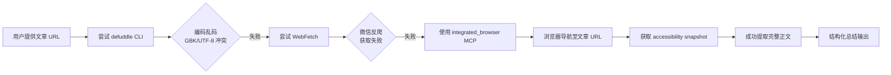

# Skills 文章学习·执行复盘

> **分析对象**：微信公众号文章《一文搞懂 Skills：Anthropic 用它重新定义了"怎么给 Agent 喂知识"，它根本不是一份 markdown》—— 公众号「架构师带你玩转 AI」2026 年发表
> **复盘日期**：2026-07-03
> **学习日期**：2026-06-29
> **任务类型**：外部技术文章知识捕获与结构化沉淀
> **报告类型**：知识捕获执行型复盘报告

***

## 一、项目概述

### 1.1 文章背景

| 指标 | 内容 |
|------|------|
| 文章标题 | 一文搞懂 Skills：Anthropic 用它重新定义了"怎么给 Agent 喂知识"，它根本不是一份 markdown |
| 来源公众号 | 架构师带你玩转 AI（AllenTang） |
| 原文 URL | https://mp.weixin.qq.com/s/fuhenGVN36CHTvj3LW_D_Q |
| 核心主题 | AI Agent 知识喂给机制的范式演进（Prompt → RAG → CLAUDE.md → Skills） |
| 关键论点 | Skills 不是 markdown 文件，是可执行能力的文件夹；从"提前给"到"按需取"的范式反转 |
| 外部引用 | 苏黎世联邦理工 2026 年 2 月实证研究（CLAUDE.md 类文件使任务成功率降 3%、推理成本涨 20%） |

### 1.2 学习目标

1. 理解 Anthropic Skills 的核心机制与设计理念
2. 梳理 AI 知识喂给的四代演进脉络
3. 评估 Skills 范式对 SpecWeave 项目 `.agents/skills/` 体系的启示
4. 萃取可复用的架构模式与方法论

### 1.3 交付物清单

| 交付物 | 格式 | 状态 |
|--------|------|------|
| 文章核心内容总结 | 对话内 Markdown | ✅ 已完成 |
| 执行复盘报告 | Markdown | ✅ 本文件 |
| 洞察萃取报告 | Markdown | ✅ 已完成 |
| 导出建议报告 | Markdown | ✅ 已完成 |
| 报告导航 README | Markdown | ✅ 已完成 |

***

## 二、复盘环节

### 2.1 实施过程回顾

### 2.2 关键节点分析

#### 节点 1：内容获取工具链切换

| 尝试顺序 | 工具 | 结果 | 原因 |
|---------|------|------|------|
| 1 | defuddle CLI | ❌ 乱码 | PowerShell 环境下 GBK/UTF-8 编码冲突，微信公众号 HTML 输出被错误解码 |
| 2 | WebFetch | ❌ 失败 | 微信公众号反爬机制，WebFetch 无法获取动态渲染内容 |
| 3 | integrated_browser MCP | ✅ 成功 | 浏览器真实渲染，accessibility snapshot 提取结构化内容，绕过编码与反爬问题 |

**决策依据**：defuddle 与 WebFetch 均失败后，判断需要真实浏览器渲染环境。integrated_browser MCP 的 `browser_navigate` + `browser_snapshot` 组合可直接获取页面 accessibility 树，包含完整正文内容且无编码问题。

#### 节点 2：文章核心内容结构化

文章采用"进化线叙事"结构，沿一条清晰的演进脉络展开：

| 喂法 | 核心机制 | 致命短板 | 范式特征 |
|------|---------|---------|---------|
| ① Prompt | 当场说，当场喂 | 一次性：对话结束即遗忘 | 即时性 |
| ② RAG | 提前存库，用时检索 | 需提前猜需求：存少遗漏、存多噪音 | 沉淀性 |
| ③ CLAUDE.md | 每次自动注入 | 越全越糟：噪音稀释信号（实证：成功率降 3%） | 常驻性 |
| ④ Skills | 按需取，渐进披露 | 无致命短板（未用不占上下文） | 按需性 |

**关键拐点**：前三种喂法的共同死穴是"提前给"——必须在 AI 干活前准备知识，但永远猜不准需要什么、需要多少。Skills 将整件事反转为"平时不给，用时再取"。

#### 节点 3：Skills 三层渐进式披露机制

| 层级 | 加载内容 | 加载时机 | Token 开销 |
|------|---------|---------|-----------|
| L1 目录 | 每个 skill 一行简介（元数据） | 系统启动时全量加载 | 极轻：17 个官方 skill 共约 1000 token |
| L2 正文 | 匹配命中的 skill 完整文档 | 任务与简介匹配时加载 | 仅命中那一个 |
| L3 细节 | 正文中引用的深层参考文件 | 读正文发现需要时加载 | 精确到具体文件 |

**设计精妙处**：没用上的 skill 压根不占用上下文，装一百个也不会互相干扰——这直接解决了苏黎世研究中"写越多越糟"的困境。

#### 节点 4：Skills ≠ Markdown 的硬区别

| 维度 | 纯 Markdown 文档 | Skill（文件夹） |
|------|-----------------|----------------|
| 能提供什么 | 文字描述的知识 | 可执行的能力 |
| 占不占上下文 | 占（每次灌入） | 不占（按需加载，脚本执行不进上下文） |
| 可靠性 | 模型用脑子硬想（易错） | 运行代码（确定性） |
| 工程经验固化 | 无法靠讲道理喂进去 | 固化成脚本直接调用 |
| 本质 | 喂知识 | 装备能力 |

**文章核心隐喻**：把 Skill 理解成 markdown，就像把一个会干活的员工理解成他桌上的工作说明书——你看到的是文字，但真正产生价值的是背后那套流程、工具和执行方式。

### 2.3 执行情况与结果数据

| 指标 | 数值 |
|------|------|
| 文章字数（估） | ~3000 字 |
| 提取的喂法模型 | 4 种（Prompt/RAG/CLAUDE.md/Skills） |
| 提取的 Skills 机制层 | 3 层（目录→正文→细节） |
| 提取的关键洞察 | 5 项（见洞察报告） |
| 可复用模式候选 | 3 个（见导出建议） |
| 内容获取工具尝试次数 | 3 次（defuddle→WebFetch→browser MCP） |
| 最终成功方案 | integrated_browser MCP accessibility snapshot |

### 2.4 成功经验

1. **工具链 fallback 策略有效**：defuddle 失败→WebFetch 失败→browser MCP 成功，三轮 fallback 确保了内容获取的可靠性。这与 SpecWeave 已有的 [wechat-mp-content-extraction.md](../../../../../knowledge/operations/wechat-mp-content-extraction.md) 双路径决策模型一致，验证了"浏览器 MCP 作为兜底方案"的策略正确性。

2. **accessibility snapshot 优于截图**：相比 `browser_take_screenshot`，`browser_snapshot` 返回的是结构化的 YAML 格式 accessibility 树，包含完整正文文本，可直接用于内容分析，无需 OCR。

3. **文章叙事结构清晰**：作者采用"进化线叙事"，沿一条清晰的演进脉络展开，便于结构化提取和四步法复盘。

### 2.5 存在问题

| 问题 | 根因分析 | 影响评估 |
|------|---------|---------|
| defuddle CLI 编码乱码 | PowerShell 环境下 GBK/UTF-8 编码冲突，微信公众号 HTML 字符集为 UTF-8 但被终端错误解码 | 低：已有 browser MCP 兜底方案，但 defuddle 作为首选工具的可靠性受损 |
| WebFetch 对微信公众号无效 | 微信公众号的反爬机制阻止非浏览器 UA 的请求 | 低：已知限制，已有替代方案 |
| 学习与复盘跨会话 | 学习发生在 06-29 会话，复盘在 07-03 会话，中间依赖上下文记忆传递 | 中：跨会话信息传递可能有损耗，所幸上轮会话已输出完整结构化总结 |

***

## 三、与 SpecWeave 项目的映射

### 3.1 SpecWeave 已有的 Skills 体系对照

SpecWeave 的 `.agents/skills/` 体系与文章描述的 Anthropic Skills 机制高度一致：

| Skills 机制 | SpecWeave 对应实现 | 对齐程度 |
|------------|-------------------|---------|
| L1 目录（一行简介） | SKILL.md 的 `description` 字段（frontmatter） | ✅ 完全对齐 |
| L2 正文（完整文档） | SKILL.md 的 `## Details` 部分（按需加载） | ✅ 完全对齐 |
| L3 细节（参考文件） | SKILL.md 中的 L2 参考链接（如 `commands/retrospective.md`） | ✅ 完全对齐 |
| 文件夹而非单文件 | `.agents/skills/<skill-name>/` 目录结构 | ✅ 完全对齐 |
| 可执行代码 | `.agents/scripts/` 脚本 + skill 内嵌的执行逻辑 | ✅ 部分对齐（脚本独立存放，非 skill 内嵌） |

### 3.2 文章验证了 SpecWeave 的架构方向

文章中 Skills 的三层渐进式披露架构，与 SpecWeave `.agents/skills/` 的渐进式披露三层架构（L0 ONBOARDING → L1 SKILL.md 门面 → L2 完整文档）完全吻合。这从外部权威来源验证了 SpecWeave 架构方向的正确性。

> **关键发现**：SpecWeave 的 Skill 门面架构不是自创的另类设计，而是与 Anthropic 官方 Skills 机制独立收敛到同一范式——这本身就是"约定驱动创建"模式（从实践中长出标准）的有力证据。

***

> **报告编制**：本文档基于文章学习过程的真实数据编制，采用"事实 → 分析 → 洞察 → 建议"的逻辑结构。所有事实数据均来自文章原文和学习过程记录。
