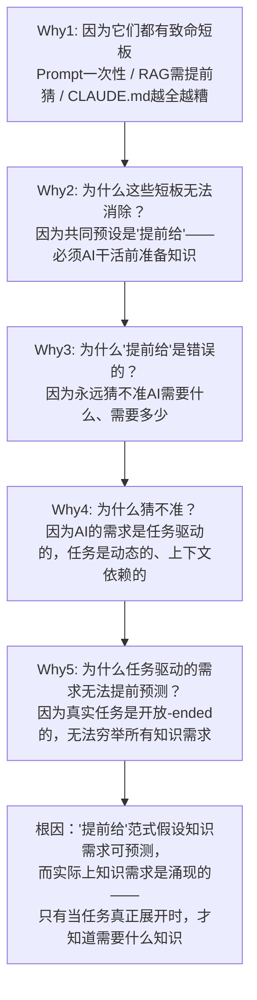
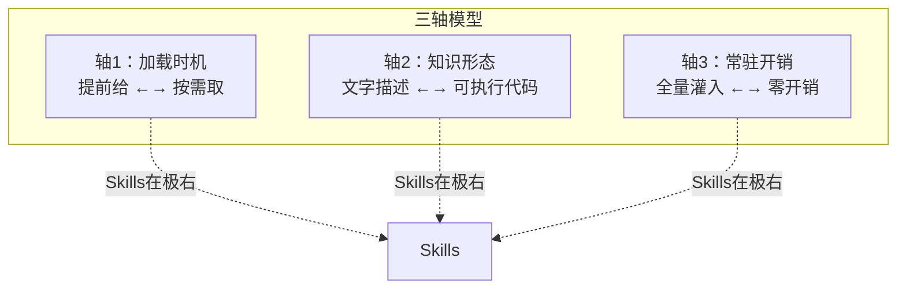

# Skills 文章学习·洞察萃取

> **分析目标**：process（AI 知识喂给机制的范式演进过程）
> **分析方法**：5-Whys 根因分析法 + 四步分析流程
> **数据来源**：文章原文 + SpecWeave 项目实践 + 苏黎世联邦理工实证研究
> **萃取日期**：2026-07-03

***

## 一、关键发现

### 发现 1：范式反转——从"提前给"到"按需取"

| 层次 | 内容 |
|------|------|
| **表面现象** | Skills 是第四种知识喂给方式，比前三种更先进 |
| **深层含义** | Skills 不是在"给多少"上做优化，而是跳出了"提前给"的整个框架，改为"按需取" |
| **支撑事实** | 前三种喂法（Prompt/RAG/CLAUDE.md）的共同预设是"必须提前准备知识"，Skills 把这个预设推翻了 |
| **可迁移性** | 高——"反转预设"是通用创新方法论：当优化陷入瓶颈时，质疑前提假设而非优化参数 |

> **洞察**：真正的范式突破往往不是"做得更好"，而是"质疑了错误的前提"。前三种喂法在"提前给多少"这个问题上反复优化（给少→给多→给全），但问题本身是错的——应该问的不是"给多少"，而是"该不该提前给"。

### 发现 2：渐进式披露——上下文经济学

| 层次 | 内容 |
|------|------|
| **表面现象** | Skills 分三层加载（目录→正文→细节） |
| **深层含义** | 这是一套"上下文经济学"——用最小的常驻开销覆盖最大的能力广度 |
| **支撑事实** | 17 个官方 skill 的目录层总共约 1000 token，不到单个 skill 正文的 token 量 |
| **可迁移性** | 高——"分层加载 + 按需展开"是信息过载时代的通用设计模式 |

> **洞察**：LLM 的核心约束不是能力不足，而是上下文窗口有限。在有限窗口内，"常驻什么"比"拥有什么"更重要——能力的广度靠存储解决，能力的精度靠加载解决。这就像人脑：你知道图书馆里有什么书（目录），但只在需要时去翻那一本（正文）。

### 发现 3：Skills ≠ Markdown——从"喂知识"到"装备能力"

| 层次 | 内容 |
|------|------|
| **表面现象** | Skill 是文件夹不是单文件，里面能装可执行代码 |
| **深层含义** | 这代表了从"描述性知识"到"执行性能力"的跃迁 |
| **支撑事实** | docx skill 中"必须显式设置纸张大小""不要用 unicode 字符当项目符号"这类经验，无法靠文字描述让模型每次记住，但可以固化成脚本让模型直接调用 |
| **可迁移性** | 中——需要可执行环境支持，适用于有工具调用能力的 Agent 系统 |

> **洞察**：有些工程经验是"隐性知识"——你知道怎么做，但没法靠讲道理传给别人。传统做法是靠师徒制口传心授，而 Skills 机制提供了一种新可能：把隐性知识固化成可执行代码，让 Agent 直接调用。这不是"教会 AI"，而是"给 AI 装备工具"。

### 发现 4：独立收敛验证——SpecWeave 与 Anthropic 殊途同归

| 层次 | 内容 |
|------|------|
| **表面现象** | SpecWeave 的 Skill 门面架构与 Anthropic Skills 机制高度相似 |
| **深层含义** | 两个独立团队面对同一问题（上下文约束下的知识管理）时收敛到同一最优解 |
| **支撑事实** | SpecWeave 的 L0→L1→L2 三层架构（ONBOARDING→SKILL.md 门面→完整文档）与 Anthropic 的目录→正文→细节三层完全对齐 |
| **可迁移性** | 高——"独立收敛"是架构方向正确性的有力证据 |

> **洞察**：当两个独立团队从不同起点出发、解决同一问题时收敛到同一方案，这通常意味着该方案是问题空间中的全局最优解或接近最优解。SpecWeave 的 Skill 门面架构不是自创的另类设计，而是问题的必然解——这比任何内部论证都更有说服力。

### 发现 5：苏黎世研究的反直觉——写越多越糟

| 层次 | 内容 |
|------|------|
| **表面现象** | CLAUDE.md 写得越全，任务成功率反而降低约 3%，推理成本涨 20% |
| **深层含义** | 不是"知识有害"，而是"无关知识稀释了信号"——LLM 的注意力是零和博弈 |
| **支撑事实** | 常驻上下文中的冗余内容（模型本来就知道的、读代码就能看出的）等于往上下文灌噪音，模型看到的东西太多反而抓不住当前任务真正需要的 |
| **可迁移性** | 高——"信噪比优于信息量"是认知科学的通用规律 |

> **洞察**：这与人脑的认知负荷理论一致——工作记忆容量有限（7±2），塞满无关信息会降低对当前任务的聚焦能力。LLM 的注意力机制同理：上下文不是越大越好，信噪比才是关键。这也解释了为什么 Skills 的"按需取"比 CLAUDE.md 的"全量灌"更优——前者保证了上下文中的每一条信息都是任务相关的。

***

## 二、5-Whys 根因分析

**分析问题**：为什么前三种知识喂法（Prompt/RAG/CLAUDE.md）都撞墙了？

| 层级 | 追问 | 回答 |
|------|------|------|
| Why 1 | 为什么三种喂法都撞墙？ | 各有致命短板：Prompt 一次性、RAG 需提前猜、CLAUDE.md 越全越糟 |
| Why 2 | 为什么这些短板无法消除？ | 因为共同预设是"提前给"——必须在 AI 干活前准备知识 |
| Why 3 | 为什么"提前给"是错误的？ | 因为永远猜不准 AI 需要什么、需要多少 |
| Why 4 | 为什么猜不准？ | 因为 AI 的需求是任务驱动的，任务是动态的、上下文依赖的 |
| Why 5 | 为什么任务驱动的需求无法提前预测？ | 因为真实任务是 open-ended 的，无法穷举所有可能的知识需求 |

**根因结论**："提前给"范式的根本错误在于假设知识需求可预测，而实际上知识需求是涌现的——只有当任务真正展开时，才知道需要什么知识。Skills 的突破正在于此：它不试图预测需求，而是让需求在涌现时自行触发知识加载。

> **根因分析的启示**：很多技术问题的根因不在"怎么做"层面，而在"该不该做"层面。前三种喂法在"怎么提前给"上反复优化（给少→给多→给全），但从未质疑过"该不该提前给"这个前提。5-Whys 分析的价值在于它能帮你跳出"优化参数"的思维惯性，触达"质疑前提"的根因层面。

***

## 三、规律认知

### 规律 1：知识管理的三轴模型

从四种喂法的演进中，可以提炼出 AI 知识管理的三个正交维度：

| 喂法 | 加载时机 | 知识形态 | 常驻开销 |
|------|---------|---------|---------|
| Prompt | 提前给（当场） | 文字描述 | 高（每次重输） |
| RAG | 提前给（存库） | 文字描述 | 中（检索时占上下文） |
| CLAUDE.md | 提前给（每次灌） | 文字描述 | 高（全量常驻） |
| **Skills** | **按需取** | **文字+可执行代码** | **极低（仅目录常驻）** |

**规律**：知识管理系统的演进方向是——加载时机从"提前"到"按需"、知识形态从"描述"到"执行"、常驻开销从"全量"到"极低"。三个维度独立演进，但 Skills 是首个在三个维度同时到达极右的方案。

### 规律 2：上下文信噪比定律

从苏黎世研究和 Skills 机制中，可以提炼出一条规律：

> **上下文信噪比 > 上下文信息量**

LLM 的任务完成质量不取决于上下文中包含多少信息，而取决于信号（任务相关）与噪音（任务无关）的比值。CLAUDE.md 的"全量灌"提高了信息量但降低了信噪比（大量冗余信息成为噪音）；Skills 的"按需取"保证了上下文中只有信号、没有噪音。

**推论**：在设计 AI 知识管理系统时，应优先优化信噪比而非信息量。"少而精"优于"多而全"。

### 规律 3：独立收敛作为架构正确性的证据

当两个或多个独立团队从不同起点出发、解决同一问题时收敛到同一方案，该方案大概率是问题空间中的全局最优解或接近最优解。这种"独立收敛"比任何单方面的内部论证都更有说服力。

SpecWeave 与 Anthropic 在 Skill 三层架构上的独立收敛，验证了"渐进式披露"是 LLM 上下文约束下的必然解。

***

## 四、潜在机会

### 机会 1：SpecWeave Skill 体系的可执行代码增强

文章指出 Skills 的核心优势之一是"能装可执行代码"。SpecWeave 目前的 `.agents/scripts/` 脚本是独立存放的，非 skill 内嵌。可以考虑将部分高频调用的脚本直接内嵌到对应 skill 的文件夹中，进一步对齐 Anthropic 的 Skills 范式。

### 机会 2：上下文信噪比量化监控

基于"上下文信噪比 > 信息量"的规律，可以开发一个监控工具，量化评估 CLAUDE.md/AGENTS.md 中常驻内容的信噪比——识别"模型本来就知道的"或"读代码就能看出的"冗余内容，为精简提供数据支撑。

### 机会 3：模式库的"按需取"改造

SpecWeave 的模式库（`docs/retrospective/patterns/`）目前有 97 个模式，如果全部常驻会撑爆上下文。可以考虑为模式库也建立类似的"目录→正文→细节"三层渐进式披露机制，让模式按需加载而非全量检索。

***

## 五、可复用模式萃取

### 模式候选 1：渐进式披露三层架构（外部验证）

| 字段 | 内容 |
|------|------|
| 模式名称 | 渐进式披露三层架构（Progressive Disclosure Three-Layer） |
| 成熟度变化 | L2→L3（已有模式，此次获外部权威验证） |
| 触发原因 | Anthropic 官方 Skills 机制独立收敛到同一架构，验证了模式的正确性 |
| SpecWeave 已有实现 | `.agents/skills/` 的 L0→L1→L2 三层架构 |
| 外部参照 | Anthropic Skills 的目录→正文→细节三层 |
| 复用场景 | 任何 LLM 上下文约束下的知识管理系统 |

> **验证意义**：这是 SpecWeave 模式库中首个获得外部独立验证的模式——从 L2（已验证）升级到 L3（标准化），具备了向外部推广的成熟度。

### 模式候选 2：知识调用时机反转

| 字段 | 内容 |
|------|------|
| 模式名称 | 知识调用时机反转（Knowledge Retrieval Timing Inversion） |
| 成熟度 | L1（实验性，首次从外部萃取） |
| 核心思想 | 当"提前准备"陷入"给少遗漏、给多噪音"的两难时，反转范式为"平时不给，用时再取" |
| 适用条件 | ①知识需求不可预测 ②有按需检索/加载机制 ③常驻开销有约束 |
| 反模式 | Prompt（当场给）、RAG（提前存库）、CLAUDE.md（每次灌） |
| 复用场景 | 任何"提前准备 vs 按需获取"的两难决策 |

### 模式候选 3：可执行能力装备

| 字段 | 内容 |
|------|------|
| 模式名称 | 可执行能力装备（Executable Capability Equipment） |
| 成熟度 | L1（实验性，首次从外部萃取） |
| 核心思想 | 将无法靠文字描述传递的隐性工程经验，固化为可执行代码，让 Agent 直接调用而非"理解后执行" |
| 适用条件 | ①有工具调用能力的 Agent ②工程经验无法靠 prompt 描述 ③操作的确定性要求高 |
| 关键设计 | 脚本和数据不进入 Agent 上下文，只有结果进入——既可靠又省 token |
| 复用场景 | 代码审查规则固化、文档生成规范固化、数据处理流程固化 |

***

> **报告编制**：本文档基于 5-Whys 根因分析法和四步分析流程编制，所有洞察均有文章原文和实践数据支撑。3 个模式候选已标注成熟度等级，建议在导出建议中规划入库路径。
