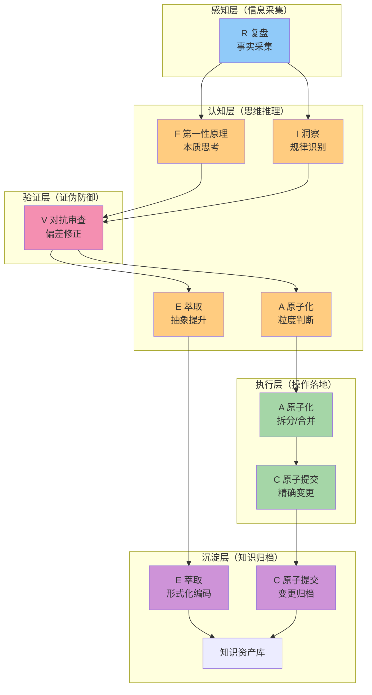

# 洞察七概念归档索引

> 基于七概念方法论（R-I-E-C-A-F-V），对11个洞察进行概念映射与五层层级归档。
> 母索引：[README.md](README.md)
> 方法论来源：[seven-concepts-methodology-index.md](../../../../../patterns/methodology-patterns/governance-strategy/seven-concepts-methodology-index.md)
> 归档日期：2026-07-13

## 五层层级定位

按照七概念方法论的「感知层→认知层→验证层→执行层→沉淀层」五层架构，11个洞察的层级分布如下：

---

## 七概念分类索引

### R — 复盘（Retrospective）
**定位**：感知层（事实采集）→ 认知层（反事实推演）→ 沉淀层（因果转化）
**核心要素**：事实采集、时序结构化、反事实推演、因果转化

| 洞察 | 核心命题 | 关联R要素 | 链接 |
|------|---------|----------|------|
| 洞察11 | 践行鸿沟——知道≠做到，自我指涉的活教材 | 反事实推演（如果当时暂停类比就不会犯错）、因果转化（从错误中提炼教训） | [11-meta-insight-practice-gap.md](11-meta-insight-practice-gap.md) |

---

### I — 洞察（Insight）
**定位**：认知层（核心）+ 验证层（迁移验证）
**核心要素**：条件识别、机制揭示、结论生成、迁移验证

| 洞察 | 核心命题 | 关联I要素 | 链接 |
|------|---------|----------|------|
| 洞察3 | 两大Prompt构成"生成-验证"闭环逻辑 | 条件识别（生成后必验证）、机制揭示（闭环抗偏误）、迁移验证（跨代码/写作/商业多场景） | [03-generation-validation-loop.md](03-generation-validation-loop.md) |
| 洞察6 | 中等规模任务Task1+2合并委派策略 | 条件识别（产出<500行+紧耦合）、机制揭示（上下文传递成本）、结论生成（合并委派决策矩阵） | [06-medium-task-merged-delegation.md](06-medium-task-merged-delegation.md) |
| 洞察11 | 践行鸿沟元洞察 | 条件识别（方法论学习后即时场景）、机制揭示（系统1惯性）、迁移验证（所有方法论学习场景） | [11-meta-insight-practice-gap.md](11-meta-insight-practice-gap.md) |

---

### E — 萃取（Extraction）
**定位**：认知层（抽象提升）→ 沉淀层（形式化编码）
**核心要素**：显化转换、抽象提升、漏斗过滤、形式化编码

| 洞察 | 核心命题 | 关联E要素 | 链接 |
|------|---------|----------|------|
| 洞察5 | 微信公众号文章提取工具降级链 | 显化转换（隐性经验→工具选择规则）、漏斗过滤（去噪后保留降级链）、形式化编码（defuddle优先提取模式） | [05-wechat-article-extraction.md](05-wechat-article-extraction.md) |
| 洞察7 | 知识库索引自动生成"禁手编辑"原则 | 显化转换（手动错误→禁手原则）、抽象提升（具体索引→通用自动化原则）、形式化编码（generate_index.py为唯一入口） | [07-index-auto-generation.md](07-index-auto-generation.md) |
| 洞察8 | 熵增定律——自动化对抗系统混乱 | 抽象提升（工具/索引/验收→熵增第一性原理）、漏斗过滤（去噪后保留底层原理）、形式化编码（自动化判断三问法） | [08-entropy-law-automation.md](08-entropy-law-automation.md) |

---

### C — 原子提交（Atomic Commit）
**定位**：执行层（核心）→ 沉淀层（变更归档）
**核心要素**：职责内聚、因果闭合、独立回滚、认知平滑

| 洞察 | 核心命题 | 关联C要素 | 链接 |
|------|---------|----------|------|
| 洞察7 | 索引自动生成"禁手编辑"原则 | 因果闭合（自动生成保证变更完整）、认知平滑（脚本执行避免人工编辑错误） | [07-index-auto-generation.md](07-index-auto-generation.md) |

---

### A — 原子化（Atomization）
**定位**：认知层（粒度判断）→ 执行层（拆分/合并操作）
**核心要素**：粒度寻优、单元独立、链接完整、双向收敛

| 洞察 | 核心命题 | 关联A要素 | 链接 |
|------|---------|----------|------|
| 洞察6 | 中等规模任务Task1+2合并委派策略 | 粒度寻优（<500行产出是合并/拆分平衡点）、单元独立（合并后子代理一次产出完整文档） | [06-medium-task-merged-delegation.md](06-medium-task-merged-delegation.md) |
| （本目录） | 11个洞察原子化拆分 | 粒度寻优（每个洞察单一职责）、单元独立（各文件独立可读）、链接完整（本索引+README双向链接） | 本目录本身 |

---

### F — 第一性原理（First Principles）
**定位**：认知层（核心思维）+ 验证层（公理自洽检验）
**核心要素**：假设剥离、要素拆解、公理自洽、重构推导

| 洞察 | 核心命题 | 关联F要素 | 成熟度 | 链接 |
|------|---------|----------|--------|------|
| 洞察1 | 第一性原理Prompt的"打断类比推理"机理 | 假设剥离（质疑类比快捷路径）、要素拆解（快思考vs慢思考）、公理自洽（双系统理论支撑） | L2 | [01-first-principles-mechanism.md](01-first-principles-mechanism.md) |
| 洞察4 | 第一性原理的跨领域迁移价值（SpaceX案例） | 要素拆解（成本=原材料×运输×回收）、重构推导（从物理公理重新推导火箭成本） | L2 | [04-first-principles-cross-domain.md](04-first-principles-cross-domain.md) |
| 洞察8 | 熵增定律——自动化对抗系统混乱 | 假设剥离（质疑"手动更灵活"）、要素拆解（重复次数/规则明确度/错误代价）、重构推导（自动化三问法） | L2 | [08-entropy-law-automation.md](08-entropy-law-automation.md) |
| 洞察9 | 公理系统——一致性保证可组合性 | 假设剥离（质疑"格式偏好无所谓"）、要素拆解（公理→定理→可组合性）、重构推导（一致性五查） | L2 | [09-axiom-system-consistency.md](09-axiom-system-consistency.md) |
| 洞察10 | 认知双系统——类比是系统1，第一性原理是系统2 | 假设剥离（质疑"我没犯类比错误"）、要素拆解（系统1/系统2特征）、重构推导（类比暂停法） | **L3** | [10-cognitive-dual-systems.md](10-cognitive-dual-systems.md) |

---

### V — 对抗性审查（Adversarial Review）
**定位**：验证层（核心，横切所有认知层产出）
**核心要素**：证伪导向、多角攻击、偏差防御、审计可溯

| 洞察 | 核心命题 | 关联V要素 | 链接 |
|------|---------|----------|------|
| 洞察2 | 对抗式审查的"多Agent攻击者视角"执行模式 | 证伪导向（主动找漏洞而非证明正确）、多角攻击（攻击者/审查者/怀疑者多角色）、偏差防御（克服确认偏误） | [02-adversarial-review-multi-agent.md](02-adversarial-review-multi-agent.md) |
| 洞察3 | "生成-验证"闭环逻辑 | 证伪导向（验证本质是对抗生成结果）、多角攻击（第一性原理管生成+对抗式审查管验证） | [03-generation-validation-loop.md](03-generation-validation-loop.md) |
| 洞察10 | 认知双系统——类比暂停法 | 偏差防御（系统性对抗确认偏误和类比惯性）、证伪导向（暂停时找反例） | [10-cognitive-dual-systems.md](10-cognitive-dual-systems.md) |

---

## 概念覆盖度统计

| 概念 | 核心关联洞察数 | 占比 | 层级归属 |
|------|--------------|------|---------|
| R 复盘 | 1 | 9% | 感知层 |
| I 洞察 | 3 | 27% | 认知层 |
| E 萃取 | 3 | 27% | 认知层→沉淀层 |
| C 原子提交 | 1 | 9% | 执行层→沉淀层 |
| A 原子化 | 2（含目录本身） | 18% | 认知层→执行层 |
| F 第一性原理 | 5 | 45% | 认知层 |
| V 对抗审查 | 3 | 27% | 验证层（横切） |

> 注：单个洞察可关联多个概念（如洞察10同时关联F和V），因此百分比总和>100%。

## 跨概念组合链路

从本次11个洞察中，可以提炼出以下典型的概念组合链路：

| 链路 | 组合 | 对应洞察 | 适用场景 |
|------|------|---------|---------|
| **本质发现链路** | R → F → V → E | 洞察11→10→V→8/9 | 从错误/复盘中提炼第一性原理 |
| **经验沉淀链路** | R → I → E → C | 洞察5/7的沉淀路径 | 从实践经验中提炼可复用规则 |
| **质量闭环链路** | F → V → I | 洞察1→2→3 | 第一性原理生成+对抗审查验证的闭环 |
| **粒度决策链路** | I → A | 洞察6 | 任务拆分/合并的粒度判断 |

---

## 五层层级×成熟度矩阵

| 层级 | L2成熟度 | L3成熟度 | 合计 |
|------|---------|---------|------|
| 感知层(R) | 洞察11 | - | 1 |
| 认知层(F/I/E/A判断) | 洞察1/3/4/6/8/9 | 洞察10 | 7 |
| 验证层(V) | 洞察2 | - | 1(+2横切) |
| 执行层(A/C) | 洞察7 | - | 1(+1目录) |
| 沉淀层(E/C归档) | 洞察5 | - | (含E/C产出) |
| **合计** | **10** | **1** | **11** |

---

*归档完成：2026-07-13*
*方法论版本：七概念方法论v1.1*
*索引维护者：orchestrator*
