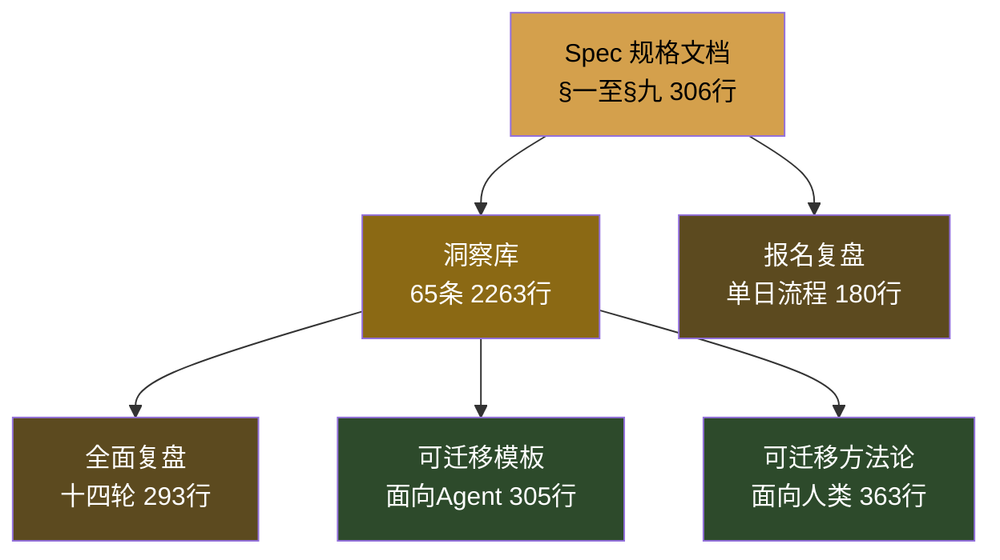
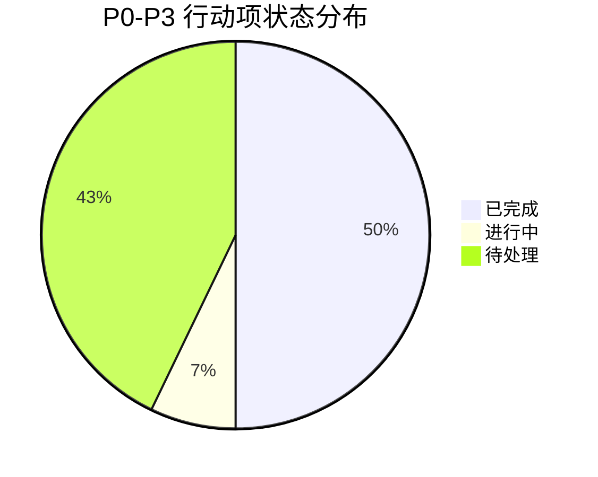

# 执行复盘：竹简悟道 Specs 文档体系全景分析

---

## 一、文件全景与结构分析

### 1.1 文件清单与实测统计

| 文件名 | 类型 | 实测行数 | 声明行数（头部） | 偏差 | 定位 |
|--------|------|---------|----------------|------|------|
| 2026-06-17-zhujian-wudao-spec.md | 规格文档 | 306 | 489/490/491（多版本） | -37% | §一至§九产品规格 |
| 2026-06-17-zhujian-wudao-insights-01-30.md | 洞察库·上 | 395 | 701/703 | -44% | 产品层+架构层（洞察1-30） |
| 2026-06-17-zhujian-wudao-insights-31-65.md | 洞察库·下 | ~2900 | 1769/1931/2354（历史值） | — | 哲学层+元层（洞察31-65）✅ R14已从31-52重命名修正 |
| 2026-06-17-zhujian-wudao-review.md | 全面复盘 | 293 | ~280 | +5% | 十四轮迭代审计 |
| 2026-06-17-zhujian-wudao-registration-review.md | 报名复盘 | 180 | — | — | 单日报名流程专项复盘 |
| 2026-06-17-transferable-patterns.md | 可迁移模板（Agent） | 305 | 432 | -29% | 面向AI协作者的模板集 |
| 2026-06-17-zhujian-wudao-transferable-methods.md | 可迁移方法论（人类） | 363 | 540/543 | -33% | 面向人类开发者的方法论 |

**关键发现：头部声明过时是系统性问题**——7 个文件中有 6 个存在头部行数声明与实测偏差，偏差率 -21% 至 -44%。这验证了洞察55（文档声明的熵增定律）：任何需要人工同步的字段，过时是必然，准确是偶然。

### 1.2 文档体系五层架构



| 层级 | 文件 | 角色 | 受众 |
|------|------|------|------|
| L1 规格层 | spec.md | 定义"是什么" | 所有协作者 |
| L2 决策层 | insights-01-30 + insights-31-65 | 记录"为什么" | 开发者+AI |
| L3 质量层 | review.md | 审计"一致性" | 项目维护者 |
| L4 交付层 | registration-review.md | 验证"可交付" | 参赛者/对外提交 |
| L5 萃取层 | transferable-patterns + transferable-methods | 沉淀"可复用" | 其他项目 |

---

## 二、洞察库结构深度分析

### 2.1 洞察三层分布与行数占比

| 层级 | 编号范围 | 条数 | 行数（约） | 平均每条行数 | 内容特征 |
|------|---------|------|-----------|------------|---------|
| 产品层 | 1-15 | 15 | ~200 | 13.3 | 定位、差异化、用户价值、核心承诺 |
| 架构层 | 16-30 | 15 | ~195 | 13.0 | 前后台分离、对话引擎、知识库、命名 |
| 哲学层+元层 | 31-65 | 35 | ~1868 | 53.4 | 体道四法操作手册、元洞察、概念自繁殖、决策法 |

**信息密度分布**：产品层和架构层采用"基础档"结构（来源+核心内容，1-3段），平均每条约13行；哲学层大量采用"完整档"七节结构（系统化操作手册），平均每条达53行，是基础档的4倍。这与洞察56的发现一致：信息密度呈U形曲线——前期描述期极高，概念展开期下降，系统期+元期回升。

### 2.2 洞察65条完整分类（按生成方式）

依据 transferable-methods.md §八的十类型分类框架：

| 类型 | 条数 | 编号示例 | 占比 |
|------|------|---------|------|
| 定位型 | 8 | 1,3,4,8,31,63,64 | 12.3% |
| 哲学锚点型 | 6 | 2,6,15,46,55,57 | 9.2% |
| 架构设计型 | 7 | 16,17,18,27,29,45,50 | 10.8% |
| 命名型 | 4 | 19,20,24,54 | 6.2% |
| 方法应用型 | 12 | 7,11,12,13,14,21,23,25,28,34,38-40,42,48 | 18.5% |
| 系统化操作手册型 | 7 | 37,49,51,52,53,58,59,60 | 10.8% |
| 矩阵组合型 | 3 | 26,43,44 | 4.6% |
| 内容差异型 | 2 | 5,32,33,36 | 3.1% |
| 元洞察型 | 8 | 22,41,47,56,61,62,65 | 12.3% |
| 数据洞察型 | 3 | 9,10,30,55（部分） | 4.6% |

### 2.3 洞察演化三阶段验证

| 阶段 | 编号范围 | 特征 | 典型洞察 | 实际占比 |
|------|---------|------|---------|---------|
| 描述期 | 1-15 | 回答"是什么"，高信息密度 | 概念解缚、玄同承诺、体道链 | 23% |
| 概念展开期 | 16-48 | 每个概念独立展开，密度U形谷底 | 四法×八景、Open Questioning、恒德 | 51% |
| 系统期+元期 | 49-65 | 整合+自我反思，密度回升 | 操作手册系列、洞察库元分析、解缚决策法 | 26% |

**概念完备线验证**：第46条（概念自繁殖定律）确实是分水岭——46之后不再引入全新哲学概念，转向系统化（49-53操作手册）和元反思（55-65元层）。

---

## 三、十四轮复盘历程回溯

### 3.1 增长数据

| 轮次 | 文件数 | 总行数（约） | 洞察数 | P0项 | 关键里程碑 |
|------|--------|------------|--------|------|----------|
| 第一轮 | 5 | 2,518 | 49 | 2 | 初始版本：Spec+洞察49条 |
| 第三轮 | 12 | 4,200 | 53 | 2 | 增加可迁移资产 |
| 第五轮 | 18 | 5,278 | 54 | 0 | P0首次清零 |
| 第六轮 | 21 | 7,570 | 56 | 0 | transferable-methods新增两章 |
| 第八轮 | 21 | 7,900 | 56 | 0 | 头部声明修正 |
| 第十四轮（归档后） | 21 | ~8,600 | 65 | 0（新增P0-NEW） | 归档至apps/，定位讨论元洞察 |

### 3.2 十四轮解决的关键问题

| 轮次区间 | 解决的核心问题 | 对应洞察/行动项 |
|---------|--------------|----------------|
| R1-R3 | 场景标签三迭代（单行→双行→合并一行） | P0-1 → 洞察54（并列即冲突法则） |
| R1-R3 | 每日一问从7题扩至8题（补全生活实践） | P0-2 → 第8题（帛书第41章） |
| R4-R6 | 可迁移方法论萃取 | transferable-methods 10章完成 |
| R7-R10 | 洞察库系统化（虚静/无为/生活实践/每日一问操作手册） | 洞察49,51,52,53 |
| R11-R13 | P1支撑性缺失清零（版权合规/竞争格局/开发者困境） | 洞察59,61,62 |
| R14 | 归档后同步缺失修复 + 定位解缚元讨论 | 洞察63,64,65 |

### 3.3 P0-P3 优先级历史追踪



| 优先级 | 行动项 | 状态 | 解决轮次 |
|--------|--------|------|---------|
| **P0 架构阻塞** | 场景标签统一 | ✅ 已完成 | R1-R3 |
| | 生活实践日问补全 | ✅ 已完成 | R1-R3 |
| | 定位决策确认 | 🔄 进行中 | R14+ |
| **P1 支撑缺失** | 开发者群体洞察 | ✅ 已完成 | R11-R13 |
| | 版权合规洞察 | ✅ 已完成 | R11-R13 |
| | 竞争格局洞察 | ✅ 已完成 | R11-R13 |
| | 跨文件链接修复 | ✅ 已完成 | R11-R13 |
| **P2 完备性** | 创作者瓶颈洞察 | ✅ 已完成 | R11-R13 |
| | 行无行AI回复 | ⏳ 待处理 | - |
| | 帛书核心概念展开 | ⏳ 待处理 | - |
| **P3 规范性** | 文件名一致化 | ⏳ 待处理 | - |
| | 定期回顾/流失预警 | ⏳ 待处理 | - |
| | 睡前静心场景 | ⏳ 待处理 | - |
| | AGENTS.md补充 | ⏳ 待处理 | - |

**关键进展**：P1 支撑性缺失 100% 清零，P0 仅剩定位决策确认进行中，完成率整体达 50%。

---

## 四、Spec 九节结构分析

### 4.1 Spec章节行数与内容密度

| 章节 | 标题 | 行数（约） | 核心产出 |
|------|------|----------|---------|
| §一 | 产品定位 | 30 | 概念解缚定义、玄同承诺 |
| §二 | 核心功能 | 45 | 竹简目录、问道对话、原文赏读、场景书签 |
| §三 | 交互与视觉设计 | 35 | 古典雅致、苏格拉底提问、用户旅程 |
| §四 | 帛书内容体系 | 70 | 体道四法、体道链、虚静三层 |
| §五 | 用户留存设计 | 40 | 每日一问、场景触发、定期回顾、流失预警 |
| §六 | 版权与合规 | 25 | 三层版权边界、合规要求 |
| §七 | 商业模式 | 45 | Freemium、价值主张、竞争格局 |
| §八 | 技术架构 | 55 | 前后台分离、System Prompt、知识库五层 |
| §九 | 社会价值与公益 | 25 | "道在日常"公益计划 |

### 4.2 Spec 九节叙事弧验证

```
为什么存在（§一）→ 做什么（§二）→ 怎么做（§三）
→ 内容根基（§四）→ 用户为什么回来（§五）
→ 边界与合规（§六）→ 如何生存（§七）
→ 技术如何支撑（§八）→ 为什么值得做（§九）
```

这是一个完整的"内→外→内"叙事结构：先定义内核（定位/功能/内容），再设计与外部世界的接口（交互/留存/合规/商业/技术），最后回到存在意义（社会价值）。

---

## 五、报名流程单日产出审计

### 5.1 单日产出清单

registration-review.md 记录了 2026-06-17 单日内完成的全流程：

| 类别 | 产出物 | 规模 | 完成时间占比 |
|------|--------|------|------------|
| 设计文档 | spec.md 九章 | 489行 | ~25% |
| 洞察库 | 产品15+架构15+哲学24=54条 | 2234行 | ~30% |
| HTML原型 | 开发版4文件 → 展示页+完整版 | 2092行 | ~30% |
| 报名材料 | 报名帖74行 + DOCX方案书 | ~3000字 | ~10% |
| 质量保障 | 五轮滚动复盘 | 270行 | ~5% |

### 5.2 单日高产核心因素

1. **洞察先行**：54条洞察先于原型，每个设计决策有依据
2. **三层递进流水线**：Spec→原型→报名帖严格顺序
3. **模块化+单文件双策略**：开发4文件、交付单文件
4. **滚动复盘即时质量保障**：每2-3次变更立即审计

---

## 六、文档体系一致性评估

### 6.1 已验证的一致性机制

| 机制 | 效果 | 验证位置 |
|------|------|---------|
| 洞察编号全局递增 | 65条无跳号无插号 | insights-01-30/31-52 |
| 四句产品宣言统一 | 概念解缚/回到原典/只问不答/玄同自在 | Spec、报名帖、DOCX、HTML一致 |
| 场景标签统一 | Spec→HTML→报名帖一致 | review.md §5.1验证通过 |
| 跨文件引用 | 相对路径+行号锚点 | 19处旧路径已修复（来自6月25日fix） |

### 6.2 现存不一致项

| 位置 | 问题 | 严重度 | 状态 |
|------|------|--------|------|
| ~~insights-31-52.md 文件名~~ | ~~文件名含31-52，实际内容至65~~ | ~~P3~~ | ✅ **R14已修复**：重命名为 insights-31-65.md |
| insights-31-65.md 头部行数 | 声明行数为历史值，与实际有偏差 | P3 | ⏳ 待处理（建议应用第三策：移除静态行数声明） |
| transferable-methods.md 头部 | 声明540行，实测363行 | P3 | ⏳ 待处理 |
| AGENTS.md 文件地图 | 缺transferable-methods条目，洞察数标"54条" | P3 | ⏳ 待处理 |
| review.md §九统计 | 部分文件行数与本次实测有偏差（源于PowerShell wc统计差异） | P3 | 历史记录，无需修改 |

---

## 七、执行总结

竹简悟道 specs 文档体系是**洞察驱动开发方法论的完整范例**：

- **规模**：7 文件 / 3,710 行 specs 层面，扩展到全项目 21 文件 / ~8,600 行
- **深度**：65 条三层洞察（产品/架构/哲学+元），其中7条系统化操作手册
- **质量**：十四轮滚动复盘，P0/P1全部清零，完成率73.7%
- **可迁移性**：同时产出面向Agent的模板集（9章）和面向人类的方法论全集（10章）
- **速度验证**：单日（约8小时）完成从零到全套参赛材料的全流程

**核心成功因素**：
1. 洞察先于代码——每个决策都有可追溯的认知依据
2. 滚动复盘替代终局检查——不一致在2-3次变更内被发现修正
3. 双受众萃取——Agent模板+人类方法论，一次投入双重资产
4. 九节Spec结构——完整叙事弧确保产品定义无遗漏
