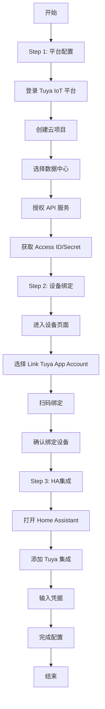

# Tuya Home Assistant 核心模式详情

> 本文件是 [insight-extraction.md](insight-extraction.md) 第一章"核心模式萃取"的原子化拆分，包含4个核心模式的完整描述。

---

### 模式 1：分层文档体系

**模式名称**：分层文档体系

**核心理念**：
> 通过分层文档结构（安装/配置/设备/开发/故障排查），覆盖用户全生命周期需求，降低用户查找信息的成本。

**适用场景**：
- IoT 集成文档体系设计
- 开源项目文档管理
- 用户指南编写

**实现步骤**：

```markdown
1. **安装指南层**
   - 文档：install.md
   - 内容：Home Assistant 集成配置步骤、参数说明
   - 受众：普通用户

2. **平台配置层**
   - 文档：platform_configuration.md
   - 内容：Tuya IoT 平台项目创建、授权、设备绑定
   - 受众：普通用户

3. **设备支持层**
   - 文档：supported_devices.md、not_supported_devices.md
   - 内容：设备分类矩阵、支持状态、HA 平台映射
   - 受众：普通用户、开发者

4. **开发指南层**
   - 文档：develop_new_driver.md、get_log.md
   - 内容：驱动开发流程、日志获取方法
   - 受众：开发者

5. **故障排查层**
   - 文档：error_code.md、faq.md
   - 内容：错误码表、常见问题解答
   - 受众：所有用户

6. **参考信息层**
   - 文档：regions_dataCenters.md
   - 内容：地区与数据中心映射
   - 受众：配置人员
```

**关键文件示例**：
- `docs/install.md`：安装指南
- `docs/platform_configuration.md`：平台配置指南
- `docs/supported_devices.md`：设备支持清单
- `docs/develop_new_driver.md`：驱动开发指南
- `docs/error_code.md`：错误码表

**效果验证**：
- 覆盖用户全生命周期（从安装到开发到故障排查）
- 文档结构清晰，查找效率高
- 受众定位明确，内容针对性强

**局限性**：
- 需要维护多个文档，更新成本较高
- 文档之间可能存在重复内容
- 需要建立文档间的交叉引用

**可复用场景**：
- IoT 集成文档体系设计
- 开源项目文档管理
- 用户指南编写

---

### 模式 2：三步集成流程

**模式名称**：三步集成流程

**核心理念**：
> 将复杂的设备集成流程拆解为三个清晰的步骤（平台配置→设备绑定→HA集成），降低用户理解和操作门槛。

**适用场景**：
- IoT 设备云平台集成
- 第三方服务接入
- 多系统互联配置

**实现步骤**：

```markdown
1. **Step 1：平台配置**
   - 操作：在 Tuya IoT 平台创建云项目
   - 关键：选择正确的数据中心
   - 产出：Access ID / Access Secret

2. **Step 2：设备绑定**
   - 操作：通过扫码将 App 设备绑定到云项目
   - 关键：数据中心必须与 App 账号地区匹配
   - 产出：设备列表

3. **Step 3：HA集成**
   - 操作：在 Home Assistant 中添加 Tuya 集成
   - 关键：输入正确的国家/地区和凭据
   - 产出：设备在 HA 中可用
```

**流程可视化**：



**效果验证**：
- 流程清晰，易于理解
- 每个步骤有明确的输入输出
- 关键注意事项突出（数据中心匹配）

**局限性**：
- 步骤之间存在依赖关系，必须按顺序执行
- 需要用户同时操作多个平台
- 数据中心选择错误会导致绑定失败

**可复用场景**：
- IoT 设备云平台集成
- 第三方服务接入
- 多系统互联配置

---

### 模式 3：设备分类矩阵

**模式名称**：设备分类矩阵

**核心理念**：
> 通过双层分类体系（主类别 + 子类别），结合 HA 平台映射和支持版本，构建完整的设备支持矩阵，便于用户查询和开发者维护。

**适用场景**：
- IoT 设备管理
- 智能家居设备目录
- 设备驱动开发规划

**实现步骤**：

```markdown
1. **定义主类别**
   - 大型家电、小型家电、电工类、安防传感、照明、厨房电器
   - 每个类别对应一个 category code

2. **定义子类别**
   - 每个主类别下包含多个子类别
   - 每个子类别有唯一的 category code

3. **HA 平台映射**
   - 将每个子类别映射到 Home Assistant 平台（Climate、Switch、Light、Sensor 等）
   - 一个子类别可能映射到多个 HA 平台

4. **版本管理**
   - 记录每个子类别首次支持的 HA Core 版本
   - 便于用户了解兼容性

5. **不支持设备跟踪**
   - 维护 not_supported_devices.md，记录已知不支持的设备
   - 便于用户提前了解限制
```

**关键数据结构**：

| 主类别 | 子类别代码 | 子类别名称 | HA 平台 | 支持版本 |
|--------|-----------|-----------|---------|---------|
| 大型家电 | kt | 空调 | Climate, Switch, Light | 2021.10 |
| 小型家电 | fs | 风扇 | Fan | 2021.10 |
| 电工类 | kg | 开关 | Sensor, Switch, Light | 2021.10 |
| 安防传感 | wsdcg | 温湿度传感器 | Binary Sensor, Sensor | 2021.11 |
| 照明 | dj | 灯 | Light, Switch | 2021.10 |

**效果验证**：
- 设备覆盖全面（7大类、50+小类）
- 查询方便，用户可快速确认设备是否支持
- 开发者可根据矩阵规划驱动开发

**局限性**：
- 设备类别不断增加，需要持续更新
- 同一个 category code 可能对应多种设备类型
- 部分设备功能可能未完全支持

**可复用场景**：
- IoT 设备管理
- 智能家居设备目录
- 设备驱动开发规划

---

### 模式 4：多语言文档分离

**模式名称**：多语言文档分离

**核心理念**：
> 通过独立文件模式（README.md / README_zh.md）管理多语言文档，保留原版，创建独立翻译版本，便于维护和切换。

**适用场景**：
- 国际化开源项目
- 需要多语言支持的文档
- 技术文档翻译管理

**实现步骤**：

```markdown
1. **保留原版文档**
   - README.md 保持英文原版
   - 作为主文档，优先更新

2. **创建翻译版本**
   - README_zh.md 为中文翻译版本
   - 保持与原版相同的结构和内容

3. **添加语言切换链接**
   - 在 README.md 顶部添加：English | [中文](README_zh.md)
   - 在 README_zh.md 顶部添加：[English](README.md) | 中文

4. **版本同步机制**
   - 更新原版时，同步更新翻译版本
   - 建立翻译优先级，优先更新核心文档

5. **质量检查**
   - 翻译完成后进行校对
   - 确保术语一致性
```

**效果验证**：
- 中英文用户都能阅读
- 语言切换方便
- 原版内容不受影响

**局限性**：
- 需要维护多个文件
- 版本同步需要额外工作
- 翻译质量需要保证

**可复用场景**：
- 国际化开源项目
- 需要多语言支持的文档
- 技术文档翻译管理
