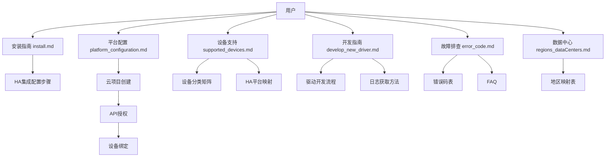
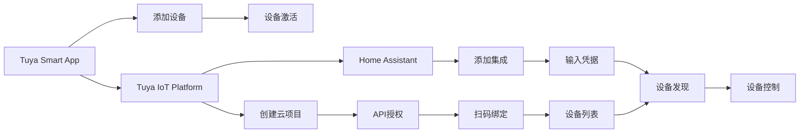

# Tuya Home Assistant 项目洞察萃取

> **⚠️ 项目已废弃**：Tuya Integration (v2) 代码已不再维护，仅保留文档。官方推荐使用 Home Assistant 官方集成（原 Smart Life 代码已合并）。以下洞察基于项目废弃前的文档体系和设计理念。
>
> **洞察萃取核心产出**：从 tuya-home-assistant 项目实践中提炼出 4 个可复用的核心模式和 6 个知识点，为同类项目的文档体系设计和集成流程设计提供参考。

---

## 第一章：核心模式萃取

从 tuya-home-assistant 项目实践中提炼出 4 个可复用的核心模式，完整描述已原子化拆分至 [core-pattern-details.md](core-pattern-details.md)。

### 模式概览

| 模式 | 名称 | 核心理念 | 可复用场景 |
|------|------|---------|-----------|
| 模式 1 | 分层文档体系 | 5-6层文档结构覆盖用户全生命周期（安装→配置→设备→开发→故障排查） | IoT集成文档、开源项目文档、用户指南 |
| 模式 2 | 三步集成流程 | 平台配置→设备绑定→HA集成，每步有明确输入输出 | IoT云平台集成、第三方服务接入、多系统互联 |
| 模式 3 | 设备分类矩阵 | 双层分类（主类别+子类别）+ HA平台映射 + 版本管理 | IoT设备管理、智能家居目录、驱动开发规划 |
| 模式 4 | 多语言文档分离 | 独立文件模式（README.md / README_zh.md），原版优先 | 国际化开源项目、多语言技术文档 |

每个模式包含：核心理念、适用场景、实现步骤、效果验证、局限性、可复用场景六个维度。详细内容见 [core-pattern-details.md](core-pattern-details.md)。

---

## 第二章：知识点提炼

### 第一节：技术知识

#### 知识点 1：数据中心映射机制

**核心思想**：根据用户账号所在地区，映射到正确的数据中心和 API Endpoint，确保设备连接成功。

**关键技术**：
- 地区 → 数据中心 → Endpoint 三层映射
- 4个数据中心：Western America、Central Europe、India、China
- 200+ 国家/地区的映射规则

**适用场景**：IoT 云平台多数据中心部署

**优势**：
- 全球覆盖，就近接入
- 降低延迟，提升用户体验
- 符合数据本地化合规要求

---

#### 知识点 2：DP Code 设备功能抽象

**核心思想**：通过 DP Code（Data Point Code）抽象设备功能，实现设备控制的标准化。

**关键技术**：
- DP Code：设备功能标识符（如 switch、countdown_1、cur_power）
- DP 类型：Boolean、Integer、String、Enum
- DP 值范围：通过 values 定义约束

**适用场景**：IoT 设备功能定义和控制

**优势**：
- 标准化接口，便于跨设备兼容
- 功能描述清晰，便于开发者理解
- 支持灵活的功能组合

---

#### 知识点 3：Home Assistant Entity 映射

**核心思想**：将 Tuya 设备类别映射到 Home Assistant Entity（SwitchEntity、ClimateEntity、LightEntity 等），实现设备在 HA 中的统一管理。

**关键技术**：
- 类别 code → HA Domain 映射
- 一个设备可能映射到多个 Entity
- 基于 DP Code 实现 Entity 属性和方法

**适用场景**：智能家居平台集成

**优势**：
- 统一的设备管理界面
- 支持 HA 自动化场景
- 与 HA 生态无缝集成

---

### 第二节：工程化知识

#### 知识点 4：驱动开发四步流程

**核心思想**：驱动开发遵循四步流程（获取信息→查找类别→开发→调试），确保开发效率和质量。

**步骤**：
1. 获取设备信息（从日志中提取 category、status、functions）
2. 查找类别支持（在 Tuya 开发者网站查找指令集）
3. 实现驱动（创建实体类，实现属性和方法）
4. 调试验证（启用日志，测试功能）

**适用场景**：IoT 设备驱动开发

**优势**：
- 流程清晰，新手友好
- 每步有明确的产出
- 便于问题定位

---

#### 知识点 5：错误码体系设计

**核心思想**：建立标准化的错误码体系，包含错误码、错误信息和解决方案，帮助用户快速排查问题。

**关键要素**：
- 错误码：唯一标识（如 1004、1106）
- 错误信息：简洁描述（如 sign invalid）
- 解决方案：详细的排查步骤

**适用场景**：API 服务、IoT 设备集成

**优势**：
- 问题定位快速
- 用户可自行解决常见问题
- 减少技术支持负担

---

### 第三节：问题解决知识

#### 知识点 6：数据中心匹配问题解决

**核心思想**：数据中心选择错误是最常见的配置问题，需要通过以下步骤解决。

**解决步骤**：
1. 确认 App 账号地区（App → Me → Setting → Account and Security → Region）
2. 根据地区查找对应的数据中心
3. 在云项目中切换数据中心
4. 重新绑定设备

**适用场景**：IoT 设备绑定失败排查

**优势**：
- 针对性强，解决效率高
- 减少用户困惑
- 提升配置成功率

---

## 第三章：架构洞察

### 3.1 文档体系架构

**文档分层设计**：

| 层级 | 文档 | 受众 | 核心功能 |
|------|------|------|---------|
| L1-入门 | install.md | 普通用户 | 快速上手 |
| L2-配置 | platform_configuration.md | 普通用户 | 平台配置 |
| L3-参考 | supported_devices.md | 用户/开发者 | 设备查询 |
| L4-开发 | develop_new_driver.md | 开发者 | 驱动开发 |
| L5-支持 | error_code.md, faq.md | 所有用户 | 故障排查 |

---

### 3.2 集成流程架构

**关键数据流**：

| 数据流 | 方向 | 内容 | 安全性 |
|--------|------|------|--------|
| 设备信息 | App → Platform | 设备列表、状态 | 需要授权 |
| 授权密钥 | Platform → HA | Access ID/Secret | 敏感信息 |
| 控制指令 | HA → Platform → 设备 | DP Code + 值 | 需要签名 |
| 状态更新 | 设备 → Platform → HA | 设备状态 | 实时推送 |

---

## 第四章：方法论总结

### 4.1 文档体系设计方法论

**核心理念**：分层文档结构，覆盖用户全生命周期需求

**步骤**：
1. 识别用户类型（普通用户、开发者、配置人员）
2. 划分文档层级（入门、配置、参考、开发、支持）
3. 定义每个层级的核心文档
4. 建立文档间的交叉引用
5. 定期更新和维护

**关键成功要素**：
- 受众定位明确
- 内容针对性强
- 更新机制完善

---

### 4.2 设备集成流程设计方法论

**核心理念**：将复杂流程拆解为清晰的步骤，降低用户操作门槛

**步骤**：
1. 分析集成流程的关键节点
2. 拆解为独立的步骤
3. 定义每个步骤的输入输出
4. 突出关键注意事项
5. 提供图文教程

**关键成功要素**：
- 流程清晰易懂
- 步骤独立可验证
- 关键注意事项突出

---

### 4.3 多语言文档管理方法论

**核心理念**：独立文件模式，保留原版，创建翻译版本

**步骤**：
1. 保留英文原版作为主文档
2. 创建独立的翻译版本
3. 添加语言切换链接
4. 建立版本同步机制
5. 进行翻译质量检查

**关键成功要素**：
- 原版不受影响
- 翻译版本完整
- 版本同步及时