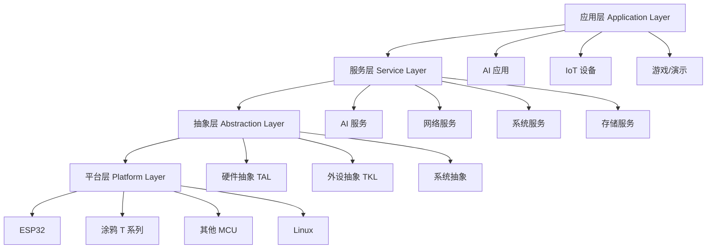
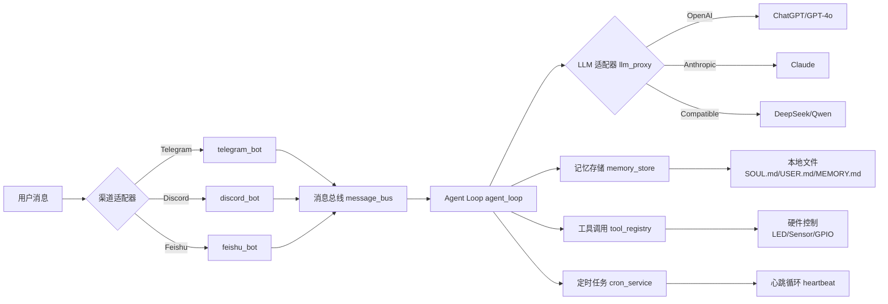

# 架构洞察

## 3.1 四层架构模型

### Layer 1：应用层

**典型应用案例**：
- **MimiClaw**：本地优先 AI 助手（Telegram/Discord/Feishu + DeepSeek/GPT/Claude）
- **switch_demo**：智能开关（涂鸦云接入）
- **your_chat_bot**：AI 聊天机器人
- **your_otto_robot**：AI 机器人狗

### Layer 2：服务层

**核心服务模块**：

| 服务模块 | 功能 | 关键文件 |
|---------|------|---------|
| `tal_system` | 系统服务（线程/队列/定时器/事件） | `tal_thread.c`, `tal_queue.c`, `tal_event.c` |
| `tal_wifi` | WiFi 管理 | `tal_wifi.c` |
| `tal_kv` | KV 存储服务 | `tal_kv.c`, `kv_serialize.c` |
| `tal_network` | 网络协议栈 | LWIP 2.1.2 + MQTT + HTTP |
| `tuya_ai_service` | AI 服务接口 | LLM proxy + 多模态处理 |
| `tuya_cloud_service` | 涂鸦云接入 | 设备认证 + OTA + 远程控制 |

### Layer 3：抽象层

**设计哲学**：
- **TAL (Tuya Abstraction Layer)**：系统级抽象（线程/内存/文件系统）
- **TKL (Tuya Kernel Layer)**：硬件抽象层（GPIO/SPI/I2C/UART）

**关键设计模式**：
- **适配器模式**：为不同平台提供统一接口
- **策略模式**：运行时切换不同实现策略
- **配置驱动**：通过 Kconfig 选择平台实现

### Layer 4：平台层

**平台支持矩阵**：

| 平台 | 芯片型号 | 支持状态 | 关键特性 |
|------|---------|---------|---------|
| **Tuya T2** | T2-U | ✅ | WiFi + BLE，Uart2/115200 |
| **Tuya T3** | T3-U/T3-2S/T3-3S/T3-E2 | ✅ | 高性能，Uart1/460800 |
| **Tuya T5** | T5-E1 | ✅ | AI 加速，Uart1/460800 |
| **ESP32** | ESP32/C3/S3 | ✅ | WiFi + BLE，Uart0/115200 |
| **LN882H** | WL2H-U | ✅ | WiFi，Uart1/921600 |
| **BK7231N** | CBU/CB3S/CB3L | ✅ | WiFi，Uart2/115200 |
| **GD32** | GD32VM553 | ✅ | 新增支持 |
| **Linux** | Ubuntu/其他 | ✅ | 开发调试环境 |

---

## 3.2 MimiClaw 架构分析

**核心设计模式**：

1. **渠道适配器模式**：统一的 Bot 接口，运行时切换渠道
2. **LLM 适配器模式**：OpenAI/Anthropic 兼容 API，多模型切换
3. **本地优先架构**：纯文本记忆存储，无数据库依赖
4. **工具调用架构**：统一的 Tool Registry，硬件工具 + 软件工具

---

**[返回洞察萃取索引](insight-extraction.md)**