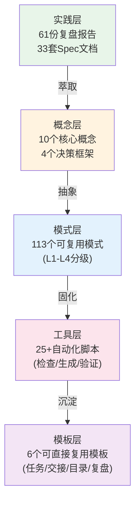

# 洞察萃取：知识资产全景分析

## 洞察 1：模式库统计缺陷修复——递归扫描的必要性

### 现象

模式库统计脚本 [patterns.py](../../../../../../scripts/lib/patterns.py) 使用 `glob('*.md')` 仅扫描目录直接子文件，无法递归扫描 `methodology-patterns/` 下的 7 个主题子目录，导致 94 个方法论模式中仅统计到少量（原统计为 19 个），严重低估资产规模。

### 根因

方法论模式按 MECE 原则分类为 7 大主题子目录（retrospective-knowledge、document-architecture、tools-automation、governance-strategy、ai-collaboration、creative-design、product-growth），但扫描逻辑未适配递归结构。`CATEGORIES.md` 分类索引文件缺少 TOML frontmatter 且被误计入模式统计。

### 修复方案

1. 将 `glob('*.md')` 替换为 `rglob('*.md')` 实现递归扫描
2. 将 `CATEGORIES.md` 加入 `EXCLUDED_FILENAMES` 排除列表
3. 同步修复 `count_patterns()` 和 `grep_maturity_per_directory()` 函数

### 修复后统计

| 领域 | 修复前 | 修复后 | 差异 |
|------|--------|--------|------|
| methodology | 19 | 94 | +75 |
| code | 8 | 11 | +3 |
| architecture | 8 | 8 | 0 |
| **总计** | **35** | **113** | **+78** |

## 洞察 2：模式成熟度分布——金字塔结构健康但 L3/L4 占比偏低

### 分布数据

| 成熟度 | 数量 | 占比 | 含义 |
|--------|------|------|------|
| L4 标准化 | 2 | 1.8% | 多次实战验证，可直接复用 |
| L3 已验证 | 9 | 8.0% | 跨场景复用，有明确绑定 |
| L2 待标准化 | 53 | 46.9% | 经至少 2 次验证，文档较完善 |
| L1 实验性 | 49 | 43.4% | 新萃取，仅 1 次验证 |

### 分析

模式库呈现健康的金字塔结构：L1/L2 为基座（90.3%），L3/L4 为塔顶（9.7%）。但 L3/L4 高价值模式占比不足 10%，说明大量已验证模式（L2，46.9%）尚未完成标准化沉淀。

**关键发现**：L2→L3 升级的核心门槛是 `reuse_count >= 1`（跨场景复用记录），多数 L2 模式因缺少显式复用记录而停留在 L2。

## 洞察 3：方法论模式七大主题分布——文档架构与工具自动化最丰富

### 七大主题分布

| 主题目录 | 模式数 | 占比 | 核心领域 |
|---------|--------|------|---------|
| document-architecture | 21 | 22.3% | 文档体系重构、原子化、Mermaid可视化 |
| retrospective-knowledge | 21 | 22.3% | 复盘方法、洞察萃取、知识沉淀 |
| tools-automation | 15 | 16.0% | 工具自动化、脚本开发、路径纪律 |
| governance-strategy | 14 | 14.9% | 治理策略、约定驱动、规范体系 |
| ai-collaboration | 9 | 9.6% | AI协作、提示词工程、双区开发 |
| creative-design | 7 | 7.4% | 创意设计、约束驱动、Spec驱动开发 |
| product-growth | 7 | 7.4% | 产品增长、赛事策略、漏斗设计 |

### 分析

- **document-architecture** 和 **retrospective-knowledge** 并列为最大主题（各 21 个），反映项目在文档治理和复盘方法论上的深度积累
- **product-growth** 和 **creative-design** 相对较少（各 7 个），属于较新的探索领域，未来增长空间大
- 整体 MECE 分类健康，无重叠覆盖盲区

## 洞察 4：L4/L3 高价值模式清单——项目核心资产

### L4 最高成熟度模式（2 个）

| 模式ID | 领域 | 验证次数 | 复用次数 | 核心价值 |
|--------|------|---------|---------|---------|
| [mermaid-safe-coding-rules](../../../../patterns/code-patterns/mermaid-safe-coding-rules.md) | code | 2 | 0 | Mermaid 安全编码五规则，系统性避免渲染失败 |
| [mermaid-trap-cheatsheet](../../../../patterns/code-patterns/mermaid-trap-cheatsheet.md) | code | 2 | 0 | 8 类高频 Mermaid 陷阱速查卡片 |

### L3 标准化模式（9 个）

| 模式ID | 领域 | 验证次数 | 复用次数 | 核心价值 |
|--------|------|---------|---------|---------|
| [rolling-retro-eight-steps](../../external-learning/retrospective-zhujian-wudao-specs-analysis-20260625/insights/rolling-retro-eight-steps.md) | methodology | 14 | 0 | 滚动复盘八步法（最高验证次数） |
| [document-entropy-three-strategies](../../../../patterns/methodology-patterns/document-architecture/document-entropy-three-strategies.md) | methodology | 5 | 0 | 文档熵增三策略 |
| [three-layer-delivery-pipeline](../../../../patterns/methodology-patterns/product-growth/three-layer-delivery-pipeline.md) | methodology | 5 | 0 | 三层交付管道 |
| [dry-run-first](../../../../patterns/methodology-patterns/tools-automation/dry-run-first.md) | methodology | 3 | 2 | 演练先行原则（最高复用次数） |
| [multi-agent-parallel-execution](../../../../patterns/architecture-patterns/multi-agent-parallel-execution.md) | architecture | 3 | 1 | 多智能体并行执行（架构层唯一L3） |
| [spec-driven-development](../../../../patterns/methodology-patterns/creative-design/spec-driven-development.md) | methodology | 3 | 1 | Spec 驱动开发 |
| [structure-first-extension](../../../../patterns/methodology-patterns/governance-strategy/structure-first-extension.md) | methodology | 3 | 1 | 结构先行扩展原则 |
| [three-part-retrospective](../../../../patterns/methodology-patterns/retrospective-knowledge/three-part-retrospective.md) | methodology | 2 | 1 | 三段式复盘结构 |
| [multi-source-intelligence-iteration](../../../../patterns/methodology-patterns/retrospective-knowledge/multi-source-intelligence-iteration.md) | methodology | 3 | 2 | 多源增量情报迭代法（本次升级） |

**关键发现**：`rolling-retro-eight-steps` 以 14 次验证位居榜首，但复用次数为 0，说明其在本项目内高度成熟但跨项目复用记录尚未显式标注。`dry-run-first` 和 `multi-source-intelligence-iteration` 复用次数最高（2次），是跨场景适用性最强的方法论。

## 洞察 5：知识资产全景——五层沉淀体系

SpecWeave 已形成完整的五层知识沉淀体系：

### 五层资产统计

| 层级 | 资产类型 | 数量 | 成熟度特征 |
|------|---------|------|-----------|
| 实践层 | 复盘报告 + Spec文档 | 94 | 原始实践记录，持续增长 |
| 概念层 | 概念定义 + 决策框架 | 14 | 抽象术语定义，稳定 |
| 模式层 | 方法论/代码/架构模式 | 113 | 分级管理，核心资产 |
| 工具层 | Python 自动化脚本 | 25+ | 高度可复用，持续迭代 |
| 模板层 | 标准化模板 | 6 | 开箱即用，零适配成本 |

## 洞察 6：萃取机制自举——自我萃取系统已可用

本次萃取过程本身验证了 SpecWeave 的自我萃取能力：

1. **模式扫描脚本**：[pattern-maturity.py](../../../../../../scripts/pattern-maturity.py) 提供 stats/scan-upgrades/verify/check-index 四个子命令
2. **共享库支撑**：[patterns.py](../../../../../../scripts/lib/patterns.py) 提供统一的 TOML frontmatter 解析与递归扫描能力
3. **CLI 工具库**：[cli.py](../../../../../../scripts/lib/cli.py) 提供彩色输出与通用参数注册
4. **升级判定标准**：`validation_count >= 2` → L2 候选；`validation_count >= 2 AND reuse_count >= 1` → L3 候选

**缺陷修复**：本次萃取同时修复了两个脚本问题：
- `patterns.py` 递归扫描缺陷（glob → rglob）
- `cli.py` Windows GBK 编码问题（Unicode符号 → ASCII兼容标记）

## 洞察 7：Windows 环境兼容性——编码问题需要系统性关注

### 现象

`cli.py` 中的 Unicode 符号（✓、⚠、✗）在 Windows GBK 编码环境下抛出 `UnicodeEncodeError`，导致 verify 命令崩溃。

### 修复方案

将 Unicode 符号替换为 ASCII 兼容的 `[PASS]`、`[WARN]`、`[FAIL]` 标记，确保跨平台兼容性。

### 启示

项目中所有 Python CLI 脚本应遵循以下原则：
1. 避免在终端输出中使用非 ASCII 符号
2. 如需彩色输出，仅使用 ANSI 颜色代码，不依赖特殊 Unicode 字符
3. Windows 环境下 stdout 编码可能为 GBK 而非 UTF-8
