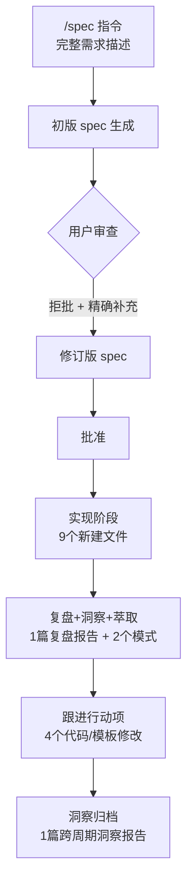

# 二、执行复盘

## 2.1 全流程执行回顾

## 2.2 六轮指令驱动闭环

| 轮次 | 指令 | 字数 | 产出物 | 耗时 |
|------|------|------|--------|------|
| 第一轮 | `/spec 在项目根目录下规划并创建...` | ~50 字 | spec.md + tasks.md + checklist.md | 单会话 |
| 第二轮 | 拒批修订（精确补充） | ~30 字 | 修订版 spec + tasks 增量更新 | 同一会话 |
| 第三轮 | 批准 | 1 字 | 9 个新建文件 + 5 个修改文件 | 单会话 |
| 第四轮 | `复盘+洞察+萃取` | 6 字 | 20KB 复盘报告 + 2 个方法论模式 | 单会话 |
| 第五轮 | `跟进行动项` | 4 字 | 4 个代码/模板修改 | 下一会话 |
| 第六轮 | `洞察` → `归档洞察报告` | 8 字 | 1 篇跨周期洞察报告（本文档） | 下一会话 |

## 2.3 执行量化数据

| 指标 | 数值 |
|------|------|
| 总指令轮次 | 6 轮 |
| 总文件变更 | 14 个（9 新建 + 5 修改） |
| 新知识资产 | 4 项（1 报告 + 2 模式 + 1 协议增强） |
| 行动项完成率 | 100%（5/5） |
| Spec 迭代次数 | 2 次 |
| 执行会话数 | 2 个 |

---