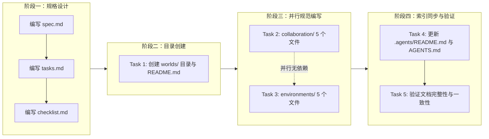

# 二、复盘环节

## 2.1 实施过程回顾

本项目采用 Spec-driven 开发流程，5 个任务分 4 个阶段执行，其中阶段三采用 2 个 Sub-Agent 并行：

**时间线**：

| 阶段 | 任务 | 执行方式 | 产出 |
|------|------|---------|------|
| 阶段一 | spec.md + tasks.md + checklist.md | 串行 | 三份规格文档定稿 |
| 阶段二 | Task 1：创建 worlds/ 目录与 README.md | 1 个 Sub-Agent 串行 | 目录骨架 + 索引文件 |
| 阶段三 | Task 2 + Task 3 | 2 个 Sub-Agent 并行 | collaboration/ 5 文件 + environments/ 5 文件 |
| 阶段四 | Task 4 → Task 5 | 2 个 Sub-Agent 串行 | 索引同步 + 三类验证 |

## 2.2 关键节点分析

#### 关键决策 1：采用 Spec-driven 开发流程

- **决策依据**：本次交付涉及 13 个文件、2 个子模块、4 项协作能力 + 4 项环境能力，复杂度较高。直接编码容易导致章节遗漏与风格不一致。Spec-driven 流程通过"先规格、后实现"分离了"设计决策"与"执行实现"。
- **技术挑战**：spec.md 需要精确描述每个文件的章节结构、关键概念、引用关系，但又不能过度约束实现细节。
- **解决方案**：spec.md 采用"章节骨架 + 关键概念清单"的描述粒度，tasks.md 拆分为 5 个独立可执行任务，checklist.md 提供逐项验收标准。三份文档形成"设计 → 执行 → 验收"的完整链路。

#### 关键决策 2：worlds/ 拆分为 collaboration/ 与 environments/ 两个子模块

- **决策依据**：worlds/ 承载"协作执行"与"环境管理"两类职责，二者关注点不同——前者面向"人如何协作"，后者面向"系统如何运行"。若合并为一个扁平目录，10 个文件将缺乏分类，难以导航。
- **技术挑战**：需确保两个子模块的职责正交，无重叠。例如，"权限管理"（collaboration）与"资源隔离"（environments）都涉及"隔离"概念，但前者隔离的是"人的操作权限"，后者隔离的是"系统资源"。
- **解决方案**：采用"正交分解"原则——collaboration/ 聚焦"协作行为治理"（权限、编辑、变更、版本），environments/ 聚焦"运行时基础设施"（环境、变量、资源、监控）。两个子模块各自独立完整，无相互依赖。

#### 关键决策 3：阶段三采用 2 个 Sub-Agent 并行执行

- **决策依据**：Task 2（collaboration/）与 Task 3（environments/）的文件集合完全独立，无引用依赖，满足并行执行的前提条件。
- **技术挑战**：需确保两个 Sub-Agent 的输出风格一致，避免出现"同一项目中两个子模块风格分裂"。
- **解决方案**：spec.md 中预先定义了统一的章节结构模板（概述 → 核心概念 → 流程图 → 数据模型 → 规范条款），两个 Sub-Agent 共享同一规格，输出风格自然一致。

#### 关键决策 4：权限系统与 teams 模块的衔接设计

- **决策依据**：teams 模块已定义 L1/L2/L3 三级权限，worlds/collaboration/permissions.md 需要扩展而非重新定义权限模型。
- **技术挑战**：需在"复用既有权限模型"与"扩展协作场景权限"之间取得平衡，避免重复定义导致维护负担。
- **解决方案**：permissions.md 显式引用 teams/permission-system.md 的 L1/L2/L3 分级，并在此基础上扩展"协作场景权限矩阵"（读/写/管理/审计四类操作 × L1/L2/L3 三级权限），形成"基础权限 → 协作权限"的映射关系。

## 2.3 执行情况与结果数据

| 指标 | 数据 |
|------|------|
| 新建文件数 | 11 |
| 更新文件数 | 2 |
| 子模块数 | 2（collaboration/ + environments/） |
| Sub-Agent 总数 | 5 |
| 并行 Sub-Agent 数 | 2（阶段三） |
| 执行阶段数 | 4 |
| 文档完整性验证 | 11/11 通过 |
| worlds/ 内部链接断链数 | 0 |
| spec 文档路径错误 | 2（已修复） |
| spec 一致性错误（修复前） | 3 |
| spec 一致性错误（修复后） | 0 |
| spec 一致性警告 | 11（元数据维护问题） |

## 2.4 成功经验

#### 2.4.1 Spec-driven 流程确保了交付完整性

**支撑事实**：文档完整性验证 11/11 通过，所有文档均包含 spec 要求的全部章节。spec.md 预先定义的章节骨架在执行阶段被严格遵循，无遗漏。

**经验**：在复杂交付（多文件、多子模块）场景下，Spec-driven 流程通过"先设计后执行"显著降低了遗漏风险。spec 文档既是设计产物，也是验收基准。

#### 2.4.2 并行子代理模式第三次验证有效

**支撑事实**：阶段三中 Task 2 与 Task 3 并行执行，无依赖冲突，两个子模块的输出风格一致。这是继"智能体开发规范体系"（4 子代理创建 35 文件）、"README.md 原子化拆分"（4 子代理创建 10 文件）后，第三次成功应用"并行子代理批量创建模式"。

**经验**：当任务集满足"文件独立、风格统一、规格共享"三个条件时，并行子代理模式可稳定复用。三次验证确认了该模式的成熟度。

#### 2.4.3 验证驱动的修复闭环确保了文档质量

**支撑事实**：check-links.py 发现 2 个 spec 路径错误，check-spec-consistency.py 发现 3 个交叉引用错误，全部在验证后立即修复，修复后重新验证通过（0 错误）。

**经验**："发现问题 → 修复 → 重新验证 → 确认修复效果"的闭环流程是文档质量的保障。验证工具不是"事后检查"，而是"修复闭环的起点"。

#### 2.4.4 正交分解原则降低了模块间耦合

**支撑事实**：collaboration/ 与 environments/ 两个子模块在验证过程中未发现任何相互引用，各自独立完整。这种正交性使得未来修改其中一个子模块时，不会影响另一个。

**经验**：在目录设计阶段就明确"职责正交"原则，可以避免后续的循环依赖和重复定义问题。正交分解是"高内聚低耦合"在目录结构层面的直接体现。

## 2.5 存在问题

#### 2.5.1 Spec 文档路径引用的"层级陷阱"

**问题**：spec.md 中使用 `../../../../.agents/README.md` 引用项目根目录文件，但 spec 位于 `.trae/specs/<change-id>/spec.md`，需要回退 3 级（`../../../`）才能到达项目根目录。

**根因**：spec 文档位于 3 级嵌套目录（`.trae/specs/<change-id>/`），但路径引用仅回退 2 级。这是一个系统性问题——在其他 spec 文档（add-team-collaboration-scenario-to-readme、sync-agents-md-with-agents-folder）中也存在相同错误。

**影响**：
- 直接影响：spec 文档中的 2 个链接断链，影响 spec 自身的可读性。
- 系统性影响：此问题在多个 spec 文档中重复出现，表明缺乏统一的路径引用规范。
- 修复成本：低（每个路径修改 1 处），但需要系统性排查所有 spec 文档。

#### 2.5.2 交叉引用路径的"前缀缺失"

**问题**：spec.md 中引用 `worlds/README.md`、`teams/permission-system.md`、`protocols/conflict-resolution.md` 时缺少 `.agents/` 前缀。

**根因**：check-spec-consistency.py 的 resolve_path 函数仅对 `.agents/`、`vendor/`、`.trae/`、`docs/` 前缀的路径按项目根目录解析，其余路径按 spec 目录解析。spec 文档作者在引用 `.agents/` 下的文件时，未添加 `.agents/` 前缀，导致路径被误解析为 spec 目录下的相对路径。

**影响**：
- 直接影响：3 个交叉引用路径错误，影响 spec 一致性验证。
- 深层影响：揭示了 spec 文档中路径引用的不一致性——有的路径带前缀，有的不带，缺乏统一规范。

#### 2.5.3 spec 一致性警告的元数据维护问题

**问题**：spec 一致性验证产生 11 项警告，均为"需求→任务"、"场景→检查点"的映射关系缺失。

**根因**：spec.md 中的需求清单、tasks.md 中的任务清单、checklist.md 中的检查点清单三者之间的映射关系未显式维护。这是 spec 元数据的维护问题，而非内容错误。

**影响**：警告不影响交付质量，但降低了 spec 文档的可追溯性。未来若需求变更，难以快速定位受影响的任务和检查点。

---
