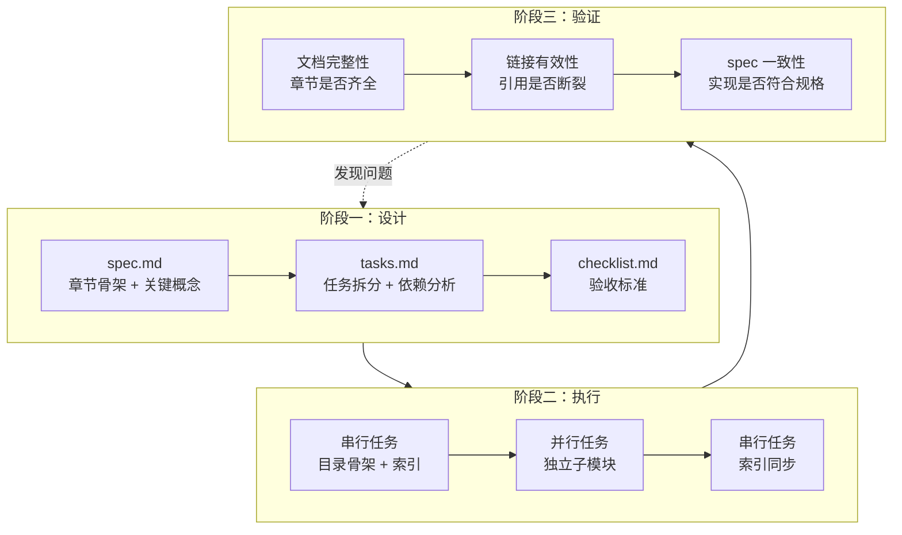
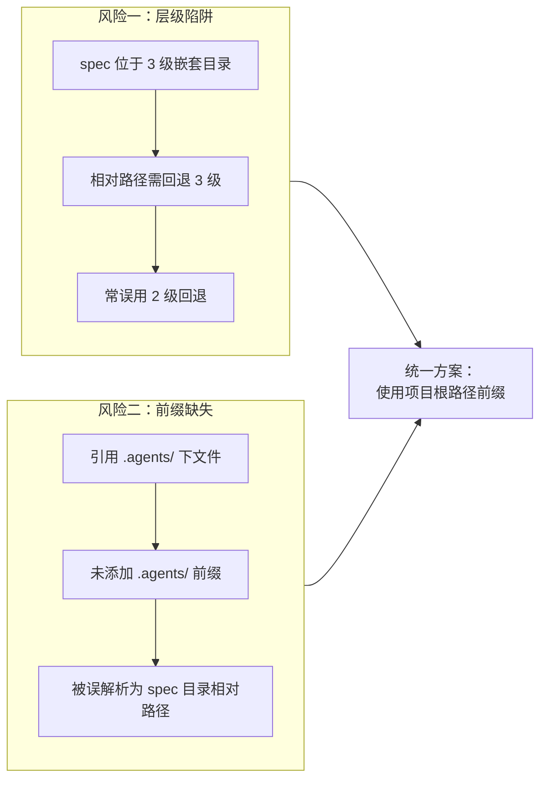

# 三、洞察环节

## 3.1 关键发现

#### 发现 1：Spec 文档路径引用的"层级陷阱"是系统性问题

**支撑事实**：本次任务发现 2 个路径错误（`../../` 应为 `../../../`），且在其他 spec 文档（add-team-collaboration-scenario-to-readme、sync-agents-md-with-agents-folder）中也存在相同错误。这表明问题不是个例，而是 spec 文档编写时的系统性陷阱。

**深层含义**：spec 文档位于 3 级嵌套目录（`.trae/specs/<change-id>/`），这种深层嵌套使得相对路径的计算容易出错。人类和 AI 在计算多层 `../` 时都容易出错，尤其是当目标文件位于项目根目录时。这暗示需要从"依赖相对路径"转向"依赖项目根路径前缀"的引用规范。

#### 发现 2：验证驱动的修复流程暴露了 spec 文档自身的不一致性

**支撑事实**：check-links.py 和 check-spec-consistency.py 不仅验证了 worlds/ 文档的质量，还顺带暴露了 spec.md 自身的路径引用问题（2 个路径错误 + 3 个前缀缺失）。验证工具的"副作用"是发现了 spec 文档自身的不一致性。

**深层含义**：验证工具是"双向"的——它既验证实现是否符合 spec，也隐式验证了 spec 自身是否正确。当 spec 文档自身存在路径错误时，验证工具会发现"实现与 spec 不一致"，但根因可能是 spec 错误而非实现错误。这要求在使用验证结果时，需要先判断"是 spec 错还是实现错"。

#### 发现 3：多 Sub-Agent 并行执行模式已达到"成熟稳定"

**支撑事实**：本次是第三次成功应用"并行子代理批量创建模式"。三次验证的规模递进：
- 第一次：4 子代理创建 35 文件（智能体开发规范体系）
- 第二次：4 子代理创建 10 文件（README.md 原子化拆分）
- 第三次：2 子代理创建 10 文件（worlds/ 协作与环境管理）

三次验证均无依赖冲突，输出风格一致。

**深层含义**：该模式的成熟度已达到"可标准化"水平。其成功条件可萃取为"三要素"：文件独立、风格统一、规格共享。当任务集满足这三要素时，可放心采用并行子代理模式。

#### 发现 4："组织→工作空间→协议→工作流"的完整闭环补齐了运行时治理

**支撑事实**：worlds/ 目录的创建使 `.agents/` 形成了完整的四层结构：
- teams/：定义"谁"（组织与权限）
- worlds/：定义"在哪里"（工作空间与环境）
- protocols/：定义"如何沟通"（交接与消息）
- workflows/：定义"如何做事"（开发与审查流程）

**深层含义**：这四层结构形成了一个完整的运行时治理闭环——从"静态定义"（teams、protocols、workflows）到"运行时执行"（worlds）。worlds/ 的补齐不是"新增功能"，而是"补齐缺失的运行时层"，使规范体系从"设计时"推进到"运行时"。

#### 发现 5：模块化目录的"正交分解"原则在本次任务中得到验证

**支撑事实**：collaboration/ 与 environments/ 两个子模块在验证过程中未发现任何相互引用，各自独立完整。这种正交性使得两个 Sub-Agent 可以无冲突地并行工作。

**深层含义**：正交分解不仅是一种目录设计原则，更是一种"并行化前提"——只有当模块间职责正交时，才能安全地并行开发。正交分解是"高内聚低耦合"在目录结构层面的直接体现，也是并行子代理模式成功的基础条件。

## 3.2 规律认知

#### 规律 1：Spec-driven 开发的"设计-执行-验证"三阶段模型

从本次任务和之前的"智能体开发规范体系"项目中，提炼出 Spec-driven 开发的三阶段模型：

**三阶段的核心职责**：
1. **设计**：分离"设计决策"与"执行实现"，预先定义章节骨架与验收标准。
2. **执行**：按 spec 实现，独立子模块可并行。
3. **验证**：三类验证（完整性、链接、一致性）形成质量闭环，发现的问题反馈到设计阶段。

**关键规律**：验证阶段发现的问题，可能是"实现错误"，也可能是"spec 错误"。需要先判断根因再修复。

#### 规律 2：路径引用的"层级陷阱"与"前缀缺失"双重风险

**规律**：spec 文档中的路径引用存在两类系统性风险——"层级陷阱"（相对路径层级计算错误）和"前缀缺失"（未添加项目根目录前缀）。两类风险的根因相同：依赖相对路径而非项目根路径。

**解决方案**：spec 文档中的路径引用应统一使用"项目根路径前缀"（如 `.agents/worlds/README.md`），由 check-spec-consistency.py 的 resolve_path 函数按项目根目录解析，避免相对路径的层级计算。

#### 规律 3：并行子代理模式的"三要素"成熟度模型

| 要素 | 含义 | 本次验证 | 前两次验证 |
|------|------|---------|-----------|
| 文件独立 | 任务集内文件无相互引用依赖 | ✅ collaboration/ 与 environments/ 无相互引用 | ✅ 三次均满足 |
| 风格统一 | 输出风格遵循统一模板 | ✅ spec.md 预定义章节骨架 | ✅ 三次均满足 |
| 规格共享 | 所有 Sub-Agent 共享同一 spec | ✅ 阶段三两个 Sub-Agent 共享 spec.md | ✅ 三次均满足 |

**规律**：当任务集满足"文件独立、风格统一、规格共享"三要素时，并行子代理模式可稳定复用。三次验证确认了该模式的成熟度。

## 3.3 潜在机会

#### 3.3.1 识别出的改进空间

1. **Spec 路径引用规范**：建立 spec 文档路径引用的统一规范，要求使用项目根路径前缀，避免相对路径的层级陷阱。
2. **验证工具增强**：check-spec-consistency.py 可增加"spec 自检"模式，专门验证 spec 文档自身的路径引用正确性。
3. **spec 元数据维护**：为 spec.md 的需求→任务、场景→检查点映射关系建立显式标注，消除 11 项警告。
4. **并行子代理模式标准化**：将"三要素"成熟度模型文档化，作为并行子代理模式的启用检查清单。

#### 3.3.2 可复用资产

| 资产 | 复用场景 | 复用方式 |
|------|---------|---------|
| worlds/ 目录结构 | 其他需要"协作+环境"双层治理的项目 | 参考正交分解原则，按职责拆分子模块 |
| Spec-driven 三阶段模型 | 任何复杂交付任务 | 直接套用"设计-执行-验证"流程 |
| 并行子代理"三要素"检查清单 | 评估任务集是否适合并行执行 | 逐项检查文件独立、风格统一、规格共享 |
| 验证驱动修复闭环 | 文档质量保障 | 套用"发现→修复→重验→确认"流程 |
| 权限系统衔接设计 | 需要扩展既有权限模型的场景 | 参考"基础权限 → 场景权限"映射模式 |

#### 3.3.3 未来可扩展的方向

1. **worlds/ 运行时实例化**：当前 worlds/ 是规范层，未来可探索"工作空间实例"的创建与管理（如为每个项目创建一个 world 实例）。
2. **协作编辑的冲突解决算法**：collaborative-editing.md 定义了锁机制与冲突解决流程，未来可探索具体的合并算法（如 OT、CRDT）。
3. **环境变量的密钥管理集成**：variables.md 定义了 AES-256-GCM 加密，未来可集成实际的密钥管理服务（如 Vault、AWS KMS）。
4. **状态监控的指标体系**：status-monitoring.md 定义了健康指标，未来可探索与 Prometheus/Grafana 的集成。

---
