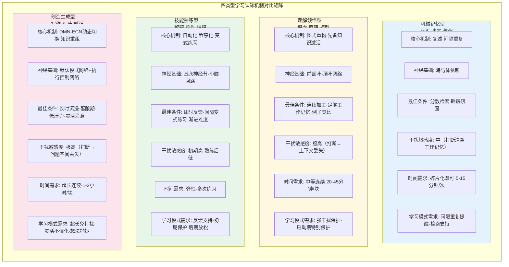

# 第1章：学习的本质——认知视角的拆解

在悬置了所有关于"学习模式应该是什么"的先入之见后，我们的分析必须从最根本的问题开始：**学习到底是什么？** 当我们说一个人"在学习"时，大脑内部究竟发生了什么？为什么"看起来在学习"不等于"真的在学习"？对这些问题的回答，是后续所有分析的逻辑基石。

## 1.1 学习行为的表象 vs 认知本质

### 1.1.1 常见学习行为表象

当我们谈论"一个人在学习"时，最先映入眼帘的总是一系列可观测的外显行为：书桌前摊开的书本、笔尖在笔记本上划过的痕迹、戴着耳机紧盯屏幕的姿态、习题册上密密麻麻的演算、视频课程播放进度条的缓慢推进。这些行为构成了大众对"学习"的直观认知——看书、做题、听课、记笔记、刷学习视频、在App上打卡背单词，甚至"在书桌前坐了两小时"本身就被视为学习发生的证据。

然而，这些外显行为与真正的学习之间的关系，远比人们直觉认为的更加脆弱。一个学生可以眼睛盯着书本整整一小时，大脑却在回想昨晚的电视剧剧情；一个人可以把视频课程从头到尾播放完，却在播放结束后回忆不起任何关键概念；笔记可以记得工整漂亮、色彩斑斓，但如果记笔记的过程只是机械抄写而没有经过大脑加工，这些笔记就只是墨水在纸上的沉积，而非知识在头脑中的建构。行为主义时代的心理学家曾一度试图用可观测的行为来定义学习，但认知革命以来的半个多世纪研究已经充分证明：学习的本质不在外部行为，而在大脑内部发生的、肉眼不可见的变化。

### 1.1.2 认知本质：图式建构与长时记忆改变

从认知科学的视角看，学习的本质是**大脑内部物理/化学结构的持久性改变**，这种改变表现为内部心理表征（图式）的建构与重构，以及长时记忆系统中神经连接的强化或重组。

让·皮亚杰（Jean Piaget, 1950）的认知发展理论指出，学习者通过两个核心过程实现认知结构的改变：**同化（assimilation）**和**顺应（accommodation）**。同化是将新信息纳入已有图式（认知结构）的过程——就像往已有的书架上摆放新书；顺应则是当新信息无法被已有图式容纳时，调整甚至重构已有图式以适应新信息的过程——就像重新设计书架的结构甚至更换更大的书架。真正的理解往往发生在顺应阶段，此时认知结构发生了质的变化，而非仅仅是量的累积。

在神经科学层面，学习对应的是**长时程增强（Long-Term Potentiation, LTP）**现象——Bliss & Lømo (1973)首次在兔海马体中发现的神经突触可塑性机制。当两个神经元反复同步放电时，它们之间的突触连接会被强化，后续一个神经元的放电更容易触发另一个神经元的放电。这种突触连接强度的持久性改变，就是记忆形成的神经基础。Hebb (1949)提出的"一起放电的神经元连接在一起"（Cells that fire together, wire together）的赫布法则，精确概括了这一过程。学习不是某种虚无缥缈的"精神活动"，而是实实在在发生在神经元突触层面的物理化学变化——受体敏感性改变、新突触生长、蛋白质合成、甚至新神经元的生成（神经发生）。

### 1.1.3 为什么"看起来在学习"≠"真的在学习"

教育心理学研究区分了三种不同性质的投入，这一区分对于理解"伪学习"现象至关重要：**行为投入（behavioral engagement）、认知投入（cognitive engagement）、情感投入（emotional engagement）**（Fredricks, Blumenfeld & Paris, 2004）。行为投入指外显的行为表现——坐得住、不说话、眼睛看向前方；认知投入指心理上的深度加工——主动思考、建立联系、深加工编码、元认知监控；情感投入指伴随学习的情感体验——好奇心、成就感、困惑后的释然。三者可以独立存在：一个学生可以有很高的行为投入但认知投入为零（如走神时仍保持端坐姿态），也可以在行为上看起来"不认真"但认知高度投入（如看似发呆实则在脑中深度思考问题）。

"看起来在学习"的错觉，本质上是将行为投入等同于认知投入。这种错觉如此普遍，以至于学习者自己也常常被欺骗——你在书桌前坐了一下午，感觉"自己很努力"，但如果这一下午主要是机械重复、被动阅读、频繁分心、没有深加工，那么长时记忆系统几乎没有发生任何持久性改变，这一下午的"学习"在神经层面几乎没有留下痕迹。更具迷惑性的是，"看起来很努力"甚至能产生一种情感上的满足感（"我今天学习了"的道德优越感），但这种满足感与实际的认知改变毫无关系。

**核心论点**：学习是大脑内部的物理/化学变化，不是外部可观测的行为。行为是学习的可能伴随现象，但既不是充分条件也不是必要条件。判断学习是否发生的唯一标准是：长时记忆中的认知结构是否发生了持久性改变——这种改变只能通过后续的提取和迁移表现来间接推断，无法通过观察当下行为直接判定。这一区分是后续所有分析的逻辑起点——如果学习模式的设计只关注"让用户看起来在学习"（如锁机、计时、种树），而不支持大脑内部的认知改变过程，那么它本质上只是"行为表演"的辅助工具，而非真正的学习支持工具。

## 1.2 学习发生的信息加工链条

学习作为认知结构的改变，发生在一个精密而脆弱的信息加工链条中。这一链条的任何一个环节出现瓶颈或断裂，都会导致学习失败。本节基于Atkinson-Shiffrin记忆多存储模型（Atkinson & Shiffrin, 1968）和Baddeley工作记忆模型（Baddeley & Hitch, 1974; Baddeley, 2000），完整描述从感知输入到长时记忆形成的完整过程，以及元认知如何对整个链条进行监控调节。

### 1.2.1 感知输入阶段：注意选择与感觉记忆

信息加工的第一站是**感觉记忆（sensory memory）**——这是信息进入认知系统的入口。各个感觉通道（视觉、听觉、触觉等）都有对应的感觉记忆存储：视觉通道的称为**图像记忆（iconic memory）**，保持时间约200-500毫秒；听觉通道的称为**声像记忆（echoic memory）**，保持时间稍长，约2-4秒。感觉记忆的容量几乎是无限的——你眼前的所有视觉信息、耳边的所有声音都短暂地存储在感觉记忆中，但绝大多数信息会在极短时间内迅速消退，不会留下任何痕迹。

感觉记忆中的信息只有被**注意（attention）**选择并识别后，才能进入下一阶段的加工。注意是信息加工链条上的第一个瓶颈——它像一个过滤器，只允许极少数信息通过。Colin Cherry (1953)发现的**鸡尾酒会效应（cocktail party effect）**生动展示了注意选择的特性：在嘈杂的鸡尾酒会上，你可以专注于和一个人的对话而完全过滤掉周围的其他谈话，但如果背景中有人提到你的名字，你的注意会立刻被吸引过去。这说明注意选择不是简单的"全或无"过滤，而是存在一个基于物理特征和意义的衰减机制（Treisman, 1964）——与当前目标相关、具有个人重要性的刺激即使在非注意通道也能被识别。

这一阶段的失败点：外源性刺激（如手机通知的声音、震动、弹窗）具有自动捕获注意的特性，它们不需要意志努力就能突破注意过滤器，将正在进行的信息加工打断。更重要的是，即使你"成功忽略"了一个通知，它也可能在感觉记忆层面短暂激活了相关的神经通路，对当前加工产生微妙干扰。

### 1.2.2 工作记忆阶段：信息加工与组块化

通过注意选择的信息进入**工作记忆（working memory）**——这是信息加工的"工作台"，所有主动的思考、推理、理解都发生在这里。Baddeley的多成分工作记忆模型（Baddeley, 2000）将工作记忆分为四个子成分：
1. **中央执行系统（central executive）**：工作记忆的"控制系统"，负责注意分配、任务切换、抑制无关信息、协调各子系统活动，是工作记忆的核心瓶颈
2. **语音回路（phonological loop）**：负责语音和听觉信息的暂时存储和复述，比如在心中默念电话号码
3. **视觉空间模板（visuospatial sketchpad）**：负责视觉和空间信息的暂时存储，比如在脑中想象一个物体旋转
4. **情景缓冲器（episodic buffer）**：负责整合来自语音回路、视觉空间模板和长时记忆的信息，形成连贯的情景表征

工作记忆最关键的特性是**容量极其有限**。Miller (1956)在经典论文中提出"神奇数字7±2"，但后续更精确的研究表明人类工作记忆容量实际约为**4±1个信息组块（chunk）**（Cowan, 2001）——这意味着在任何时刻，你能同时在脑中保持并加工的独立信息单元只有3-5个。组块化（chunking）——将多个小信息单元组合成一个有意义的大单元——是突破容量限制的唯一方式，但组块化本身依赖于长时记忆中已有的知识经验。

工作记忆的保持时间也很短——如果不复述，信息在约10-30秒后就会消退。工作记忆的另一个关键特性是**双任务干扰**：如果两个任务同时使用同一个子成分（如边听课边刷朋友圈，都需要视觉和中央执行资源），它们会互相干扰，表现急剧下降。

这一阶段是整个信息加工链条最狭窄的瓶颈，也是绝大多数学习失败发生的地方。任何无关信息（通知弹窗、未读消息提示、刚刚看到的朋友圈内容）进入工作记忆，都会挤占宝贵的4个组块容量，导致用于学习加工的资源不足。更严重的是，任务切换——哪怕只是"看一眼通知就回来"——会导致工作记忆中的当前上下文被清空，回来时需要付出巨大的重建成本。

### 1.2.3 长时记忆阶段：编码、巩固与提取

经过工作记忆加工的信息，如果要形成持久性的改变，需要进入**长时记忆（long-term memory）**系统。与工作记忆相比，长时记忆的容量几乎是无限的，保持时间可以从数分钟到终生。信息从工作记忆进入长时记忆需要经过三个关键过程：

**编码（encoding）**是将工作记忆中的信息转化为可存储的神经表征的过程。编码质量是决定记忆效果的最关键因素。Craik & Lockhart (1972)的**加工水平理论（levels of processing）**指出，记忆保持效果不取决于复述时间长短，而取决于加工深度：**浅加工**（如只注意字词的物理特征、简单重复朗读）只能形成脆弱的记忆痕迹，很快就会遗忘；**深加工**（如思考字词的意义、与已有知识建立联系、生成自己的例子、思考知识的应用场景）能形成更牢固、更易提取的记忆痕迹。Karpicke & Roediger (2008)的研究进一步表明，相对于反复阅读（主要是浅加工），**检索练习（retrieval practice）**——即主动从记忆中提取信息（如自测、回忆）——能产生更强的记忆保持效果，这被称为"测试效应"。

**巩固（consolidation）**是将编码后的记忆痕迹从暂时的易变状态转化为永久的稳定状态的神经过程。巩固分为**突触巩固**（发生在学习后数小时内，涉及蛋白质合成和突触结构改变）和**系统巩固**（发生在数天到数年时间尺度上，涉及记忆从海马体向新皮层的转移）。特别重要的是，**睡眠在记忆巩固中扮演不可替代的角色**（Stickgold, 2005）——学习后的睡眠，尤其是慢波睡眠和快速眼动睡眠，会重新激活并重组新形成的记忆痕迹，将其整合到长时记忆的知识网络中。考前熬夜学习之所以效果差，一个关键原因就是剥夺了记忆巩固所必需的睡眠。

**提取（retrieval）**是从长时记忆中查找并激活已有信息的过程。提取不是记忆的终点，而是记忆过程的核心组成部分——每次提取都会改变记忆本身（提取诱发重构，retrieval-induced reconsolidation），成功的提取会让记忆痕迹在未来更容易被提取。提取线索（retrieval cues）与编码时的上下文越匹配，提取越容易——这就是Tulving & Thomson (1973)提出的**编码特异性原理（encoding specificity principle）**："什么样的编码决定什么样的提取"。

这一阶段的失败点：如果学习时只有浅加工（如机械重复、被动阅读、划重点线），即使花了很多时间，编码质量也很差，很快就会遗忘；如果学习后没有足够的睡眠巩固，记忆痕迹无法稳定下来；如果只有输入没有主动提取练习（检索），记忆会处于"能认不能忆"的状态，遇到需要主动应用知识的场景就无法提取。

### 1.2.4 元认知监控：对整个过程的监视与调节

整个信息加工链条不是自动运行的流水线，而是在**元认知（metacognition）**的监控和调节下运行。John Flavell (1979)将元认知定义为"对认知的认知"，并区分了三个核心成分：
1. **元认知知识（metacognitive knowledge）**：关于自己认知特点、学习策略、任务要求的知识——比如知道自己什么时候更容易分心、哪种学习方法对自己更有效、哪些内容更难需要更多时间
2. **元认知体验（metacognitive experience）**：伴随认知活动的主观体验——比如阅读时感到"这段我没读懂"的困惑感、解决问题时的"啊哈"体验、知道自己"快要想起来了"的话在嘴边体验（tip-of-the-tongue）
3. **元认知监控（metacognitive regulation）**：对认知过程的主动监视、评估和调整——比如发现自己走神了把注意力拉回来、意识到没读懂退回去重读、遇到难题调整策略换个思路

元认知是区分"有效学习者"和"无效学习者"的关键变量。优秀的学习者不是不分心，而是能更快觉察到自己分心了并及时调整；不是什么都一学就会，而是能准确判断自己是否真的理解了；不是用同一种方法学习所有内容，而是能根据任务类型灵活调整策略。

元认知的一个常见失败是**元认知错觉（metacognitive illusion）**——人们常常高估自己的理解程度和记忆效果。Finn & Tauber (2015)的研究表明，反复阅读产生的**流畅感（fluency）**会让人产生"我已经会了"的错觉，但这种流畅感只是因为对文本变得熟悉，并不代表真正理解或能灵活应用。这就是为什么很多人"看书觉得都懂，一做题就不会"。

下面的Mermaid流程图完整可视化了学习的信息加工链条，标注了各阶段的瓶颈和常见失败点：

```mermaid
flowchart LR
    subgraph 感知输入阶段["感知输入阶段（0-500ms）"]
        A[外部刺激<br/>视觉/听觉/触觉] --> B[感觉记忆<br/>图像/声像记忆<br/>容量无限·时间极短]
        B -->|注意选择| C{注意过滤器<br/>瓶颈1}
        B -.->|未被注意·快速消退| X1[信息丢失·无痕迹]
        C -->|外源性刺激自动捕获| D[无关刺激侵入<br/>通知/弹窗/震动]
    end
    
    subgraph 工作记忆阶段["工作记忆阶段（10-30s）——最窄瓶颈"]
        C --> E[工作记忆"工作台"<br/>中央执行系统·语音回路·视觉空间模板<br/>容量:4±1组块·时间:10-30s]
        D --> E
        E -->|任务切换·上下文清空| X2[工作记忆溢出·重建成本]
        E -->|无关信息挤占| X3[认知资源不足·加工失败]
        E -->|维持性复述·浅加工| F[暂时保持·未深加工]
        E -->|精制性复述·深加工| G[组块化·建立联系·意义建构]
    end
    
    subgraph 长时记忆阶段["长时记忆阶段（分钟~终生）"]
        F -->|编码质量差| X4[脆弱记忆痕迹·快速遗忘]
        G --> H[编码·深加工]
        H --> I[巩固<br/>突触巩固·系统巩固<br/>依赖睡眠]
        I -->|睡眠不足| X5[巩固失败·记忆不稳定]
        I --> J[长时记忆存储<br/>容量无限·图式网络]
        K[提取·检索练习] -->|提取失败·线索不匹配| X6[惰性知识·能认不能忆]
        J --> K
        K -->|成功提取·重构强化| J
    end
    
    subgraph 元认知监控["元认知监控（Flavell, 1979）"]
        M[元认知知识] -.-> N[监视·评估·调整]
        O[元认知体验] -.-> N
        N -.-> C
        N -.-> E
        N -.-> H
        N -.-> K
        N -->|元认知错觉·流畅感误导| X7["我以为我会了"·高估理解]
    end
    
    style 感知输入阶段 fill:#e1f5fe
    style 工作记忆阶段 fill:#fff3e0
    style 长时记忆阶段 fill:#e8f5e9
    style 元认知监控 fill:#f3e5f5
    style X1 fill:#ffcdd2
    style X2 fill:#ffcdd2
    style X3 fill:#ffcdd2
    style X4 fill:#ffcdd2
    style X5 fill:#ffcdd2
    style X6 fill:#ffcdd2
    style X7 fill:#ffcdd2
```

## 1.3 不同类型学习的认知机制差异

并非所有学习都调用相同的认知机制——背单词、理解物理概念、练习解题技巧、写一篇论文，这四类学习在神经基础、关键认知过程、最佳条件、易受干扰类型上存在本质差异。忽视这些差异，用同一种"学习模式"支持所有类型的学习，是设计上的根本误区。本节区分四种本质不同的学习类型，分析各自的认知机制与对学习模式的特殊需求。

### 1.3.1 机械记忆型学习（词汇、事实）

机械记忆型学习的目标是在长时记忆中建立相对独立的事实性知识表征，如外语单词、历史年代、化学式、术语定义等。这类学习的关键是**记忆痕迹的强度和可提取性**，核心认知过程是**复述（rehearsal）**和**间隔重复（spaced repetition）**。

在神经机制上，这类学习高度依赖**海马体（hippocampus）**——内侧颞叶中的海马结构是陈述性记忆（事实和事件记忆）形成的关键脑区，海马体损伤的患者（如著名的H.M.）无法形成新的事实记忆，但仍可以学习新的技能。海马体对新异刺激敏感，也容易受到干扰——学习后短时间内学习其他类似内容会产生**倒摄抑制（retroactive interference）**，干扰先前记忆的巩固。

**最佳学习条件**：分散学习（间隔效应）比集中突击效果好得多——Ebbinghaus (1885)最早发现遗忘曲线后就指出，在记忆即将遗忘时进行复习能产生最强的保持效果；主动检索（自测、回忆）比反复阅读效果好；睡眠充足以保证巩固；学习环境有一定的背景一致性（编码特异性）。

**最易受的干扰类型**：对工作记忆容量的直接占用——如果在背单词时被通知打断，工作记忆中正在保持的单词会被清空；类似内容的干扰——学习后立即学习其他词汇会产生混淆；分神导致的加工不足——机械记忆需要足够的注意资源，"一边刷剧一边背单词"本质上是不可能的，因为两者都需要语音回路和中央执行资源。

**对学习模式的特殊需求**：需要碎片化支持——机械记忆不需要长时间连续专注，反而适合利用碎片时间；需要主动检索提示——不是反复看单词，而是主动回忆含义；需要间隔重复安排——根据记忆强度智能安排复习时间（这是Anki等记忆软件的核心原理）；需要防止学习后立即的干扰——学习新单词后短时间内避免类似内容。

### 1.3.2 理解领悟型学习（概念、原理）

理解领悟型学习的目标是建立新的认知图式或重构已有图式，掌握抽象概念、原理、理论模型及其内在联系，如理解相对论、掌握经济学供需模型、理解递归算法的本质。这类学习的关键不是记住孤立事实，而是**建立概念之间的意义联系、实现图式的顺应（重构）**，核心认知过程是**先备知识激活（prior knowledge activation）**和**精细化加工（elaboration）**。

在神经机制上，这类学习依赖**前额叶-顶叶网络（fronto-parietal network）**的激活，尤其是背外侧前额叶皮层（DLPFC）——这是执行控制、抽象推理、关系整合的核心脑区。理解过程通常是"顿悟"式的：在一段时间的困惑后，突然在概念之间建立起联系，此时伴随强烈的"啊哈"体验。

**最佳学习条件**：先备知识充分激活——如果相关基础知识没有进入工作记忆，新的概念就无法被同化；足够的工作记忆容量——理解抽象关系需要同时在脑中保持多个概念并建立联系，这需要大量工作记忆资源；时间连续不被打断——理解过程是一个需要持续在工作记忆中保持多个概念并尝试建立联系的过程，打断会导致工作记忆上下文丢失，需要重新"进入"；例子和类比——具体的例子能帮助建立抽象概念与已有知识的桥梁；生成效应——用自己的话解释概念、自己举例子比被动阅读解释效果好得多。

**最易受的干扰类型**：工作记忆容量被挤占是致命的——理解需要全部4个工作记忆组块都用于概念关系加工，哪怕一个无关想法占据一个组块，理解过程就可能失败；打断的代价极高——正在"接近理解"时被打断，之前所有的加工上下文全部丢失，可能需要重新开始；缺乏先备知识不是干扰，但如果学习模式不提示先备知识，会导致理解困难。

**对学习模式的特殊需求**：需要较长的连续不被打断时间（至少20-30分钟以上），启动期（0-15分钟）需要特别保护；需要工作记忆的"纯净空间"——不仅不能有外部干扰，还要帮助减少内部干扰（心智游移的觉察）；可能需要"相关知识链接"——在学习新概念前提示激活相关先备知识；需要主动生成的提示——"用你自己的话解释一下"比"继续阅读"更能促进理解。

### 1.3.3 技能熟练型学习（解题、操作）

技能熟练型学习的目标是将陈述性知识转化为自动化的程序性知识，如数学解题、编程、乐器演奏、体育运动。这类学习的关键是**自动化（automaticity）**和**程序化（proceduralization）**——从需要有意识控制的缓慢执行，到不需要占用工作记忆的快速自动执行。Fitts & Posner (1967)将技能学习分为三个阶段：认知阶段（理解规则、需要高度注意）、联想阶段（练习、错误减少）、自主阶段（自动化、不需要太多注意）。Anderson (1982)的ACT*理论进一步描述了从陈述性知识到程序性知识的转化过程（知识编译）。

在神经机制上，这类学习依赖**基底神经节（basal ganglia）**和**小脑（cerebellum）**回路——基底神经节参与习惯形成和程序性学习，小脑参与运动协调和精细动作的时序控制。技能熟练的标志是相关脑区激活从皮层（需要控制）向皮层下结构（自动执行）转移。

**最佳学习条件**：大量的变式练习——不是重复做同一道题，而是练习足够多的不同变式，让程序性知识能灵活迁移；即时反馈——知道自己做对了还是做错了、错在哪里，错误需要及时纠正；间隔练习——集中练习能快速提升表现但保持和迁移差，间隔练习虽然提升慢但保持和迁移更好（情境干扰效应，contextual interference effect, Shea & Morgan, 1979）；从简单到复杂的渐进式练习——先掌握子技能，再组合成复杂技能。

**最易受的干扰类型**：在认知阶段（技能形成初期）高度依赖工作记忆，此时干扰代价很大；在自主阶段（熟练后）则对干扰不那么敏感——熟练的打字员可以边打字边聊天，因为打字已经自动化不需要太多工作记忆；错误反馈延迟——如果不能即时知道自己错了，错误的程序会被强化；缺乏变化的重复——机械重复同一道题不能产生灵活的技能。

**对学习模式的特殊需求**：需要明确的即时反馈机制——用户需要知道自己做得对不对；需要支持练习的时间结构——技能练习不需要超长连续时间，但需要多次、有间隔的练习；需要渐进式难度设计——学习模式本身不提供内容，但可以与学习App配合支持难度递进；在技能形成初期需要更强的干扰保护，熟练后可以适当放松。

### 1.3.4 创造生成型学习（写作、设计、编程开发）

创造生成型学习的目标是产出新的知识产品或解决方案，如写论文、做设计、开发项目、进行创造性问题解决。这类学习本质上是一个知识重组和生成的过程，需要在已有知识之间建立全新的联系，产生以前不存在的想法或产品。

在神经机制上，这类学习需要**默认模式网络（Default Mode Network, DMN）与执行控制网络（Executive Control Network, ECN）之间的动态切换**——这是最反直觉的发现之一。传统观点认为创造需要ECN持续激活、DMN被抑制，但近期研究（Beaty et al., 2016）表明，高创造性人群的大脑特征不是DMN被完全抑制，而是DMN和ECN能同时激活、灵活切换：DMN负责想法生成、联想、远距离概念连接（灵感迸发、想法冒出来），ECN负责想法评估、选择、细化、约束（判断想法是否可行、进行逻辑修正）。创造是生成-评估的迭代循环，需要两个网络反复协作。

**最佳学习条件**：需要长时间的沉浸——创造不是线性过程，常常需要"酝酿期（incubation）"——在暂时放下问题时，DMN仍在后台继续加工，可能产生顿悟（Wallas, 1926的创造四阶段：准备→酝酿→豁朗→验证）；需要灵活的注意力——不是完全不分心，而是允许心智在聚焦和发散之间切换；需要低压力环境——压力和焦虑会让ECN过度激活、DMN被抑制，导致想法无法生成；需要容忍"无产出"时段——创造不是每一分钟都在"出活"，看起来"发呆"的时间可能是DMN在进行远距离联想。

**最易受的干扰类型**：频繁的打断会同时打断生成和评估过程——创造需要在脑中保持一个复杂的"问题空间"，打断后重建成本极高；持续的外部约束和监控（如严格的锁机、倒计时的压力）可能适得其反——压力抑制DMN，让你只能做线性的、收敛的思考，无法产生创造性想法；完全没有"走神"空间可能不利于创造——轻度的心智游移有时是DMN在进行远距离联想。

**对学习模式的特殊需求**：需要超长的连续时间块（1-3小时），且不适合严格的番茄钟式分割（25分钟打断可能刚好在想法即将涌现时）；需要更灵活的状态支持——不是"强制不分心"，而是"在需要专注时支持专注，在需要酝酿时允许适当发散"；需要记录和捕捉想法的机制——顿悟往往是短暂的，如果不及时记录会丢失；需要降低时间压力感——倒计时可能增加焦虑，抑制创造性。

下面的Mermaid矩阵图对比总结了四类学习的认知机制差异：



从这个对比中可以得出一个关键结论：**不存在单一的"最优学习模式"**。一个对理解型学习最优的模式（严格锁机、45分钟不打断），对于创造型学习可能过于僵化；一个对机械记忆友好的碎片化模式，完全无法支持深度学习。优秀的学习模式需要根据当前学习类型动态调整其支持策略——这是绝大多数现有学习模式产品完全忽略的维度。

## 1.4 心流与深度学习的关系

心流（flow）是Mihaly Csikszentmihalyi (1975)通过对艺术家、棋手、攀岩者、外科医生等人群的访谈首次系统描述的最优体验状态——当人们全身心投入到某种活动中时，会进入一种注意力高度集中、行动与意识融合、忘记自我、时间感扭曲、活动本身具有内在奖励的状态。心流常被等同于"深度学习状态"，但这种等同是一个需要仔细辨析的认知误区。

### 1.4.1 心流的九个特征

Csikszentmihalyi (1990)总结了心流状态的九个核心特征：
1. **挑战-技能平衡**：活动挑战与自身技能恰好匹配——既不会太简单导致无聊，也不会太难导致焦虑
2. **行动-意识融合**：注意力高度集中于当前活动，行为变得自发自动，不需要有意识的自我监控
3. **清晰的目标**：每一步都有明确的目标，知道自己该做什么
4. **即时反馈**：能立刻知道自己做得好不好，行为是否有效
5. **注意力高度集中**：注意力完全聚焦于当前任务，无关信息被完全过滤
6. **控制感**：感觉自己能控制局面、控制活动结果
7. **自我意识消失**：不再担心别人怎么看自己，"小我"消失，与活动融为一体
8. **时间感扭曲**：时间感发生改变——几小时像几分钟一样快，或几秒被拉长
9. **内在奖励**：活动本身就是奖励，做这件事不需要外部理由，过程本身带来愉悦

这九个特征中，第1-3项是进入心流的**前提条件**，第4-6项是心流过程中的主观体验特征，第7-9项是心流带来的结果性体验。

### 1.4.2 心流≠深度学习：警惕"虚假心流"

一个关键的认知区分是：**心流可以在完全没有深度学习发生的活动中出现**。玩简单的消消乐游戏、刷短视频、在流水线上做高度熟练的重复工作、甚至在高速公路上熟练驾驶——这些活动都可能让你进入心流状态，但它们几乎不产生新的学习，不导致长时记忆结构的持久性改变。

为什么？因为根据认知负荷理论（Sweller, 1988），深度学习需要足够的**相关认知负荷（germane cognitive load）**——用于图式建构和自动化的认知资源投入。而低认知负荷活动（如玩简单游戏）引发的心流，本质上是在高度熟练的技能上获得的流畅体验，此时虽然注意力集中、行动意识融合，但工作记忆中几乎没有进行新的图式建构，认知负荷主要是已自动化程序的运行，没有新的学习发生。这种"低认知负荷心流"可以称之为"虚假心流"——它有愉悦感和沉浸感，但没有深度学习。

反过来，真正的深度学习——尤其是理解领悟型学习和创造生成型学习——在发生时不一定伴随愉悦的心流体验。理解困难概念时的困惑、解决难题时的挣扎、写论文时的卡壳，这些都是深度学习的正常组成部分，它们与"愉悦感"相去甚远，但认知结构正在发生深刻改变。将心流等同于深度学习，会导致一个危险的设计倾向：只追求让用户"感觉良好"，而不支持真正有难度的认知加工。

### 1.4.3 学习模式能支持哪些心流前提

心流的三个前提条件中，哪些是学习模式（作为手机上的功能）可以支持的？

- **清晰的目标**：部分支持。学习模式本身不设定学习目标，但可以帮助用户明确当前学习任务、显示当前进度，让目标更具象。目标的内容本身是学习内容决定的，学习模式无法替代。
- **即时反馈**：部分支持。对于学习过程本身的反馈（如理解是否正确）需要学习内容提供，但学习模式可以提供关于专注状态、学习时间、进度的元认知反馈——"你已经专注了20分钟"本身就是一种反馈。
- **挑战-技能匹配**：基本无法支持。这主要由学习内容本身的难度设计决定，学习模式无法判断当前学习内容对用户来说是太难还是太简单。

值得注意的是，Csikszentmihalyi本人也指出，心流最容易发生在**自足目的活动（autotelic activities）**中——也就是活动本身就是目的，不需要外部奖励的活动。学习从根本上说不是天然的自足目的活动，尤其是应试学习、技能学习——它常常需要延迟满足，结果在遥远的未来。试图让学习完全像玩游戏一样时刻充满心流，本质上是不可能的。学习模式的目标不应是"让学习始终像玩游戏一样爽"，而是**降低进入深度学习状态的门槛，减少不必要的干扰，让心流/深度状态在自然发生时不被打断**。

### 1.4.4 启动期时间门槛及其设计含义

大量研究和经验观察一致表明：进入深度专注/心流状态不是瞬间完成的，而是需要一个**启动期**——通常需要10-15分钟的持续专注才能进入稳定的深度加工状态。在这10-15分钟里，大脑需要完成：从DMN主导切换到ECN主导、将与学习任务相关的先备知识激活到工作记忆中、抑制无关想法和环境干扰、建立当前任务的认知上下文。

这10-15分钟是学习会话中最脆弱的阶段——此时ECN还没有稳定占据主导，DMN随时可能重新激活，任何干扰都可能轻易将你打回初始状态，需要重新开始这10-15分钟的启动过程。这就是为什么"学5分钟就被打断"几乎等于完全没学——你根本没有度过启动期，还没进入真正的深度学习状态。

这一发现的设计含义至关重要：
1. 学习模式在启动期（前10-15分钟）需要提供**最强级别的干扰保护**，这段时间的打断代价最大
2. 不要鼓励用户"学5分钟也算数"——如果注定会被打断，不如不学，因为前5分钟的投入几乎全是启动成本，没有实际学习产出
3. 启动期的摩擦应该最小化——不要让用户在开始学习前设置一堆参数、选白噪音、选主题、定目标，这些操作本身就在消耗启动期的认知资源
4. 学习会话的最小有效长度是25-30分钟（10-15分钟启动 + 15分钟以上的深度学习），低于这个长度的"专注"大部分是启动成本

## 1.5 学习发生的必要认知条件（初步）

基于以上对学习本质、信息加工链条、不同学习类型差异、心流条件的分析，我们可以初步列出深度学习发生必须满足的认知条件——这些条件是"缺了就不行"的必要条件，而非"有了就更好"的增强条件。本节给出初步列表，第3章将在此基础上构建完整的必要条件模型。

**条件1：足够的工作记忆容量可用**。工作记忆是信息加工的"工作台"，4±1组块的容量极其有限。要发生深度学习，必须保证工作记忆容量不被无关信息（外部通知、内部未完成任务、手机存在导致的brain drain后台监控）挤占，至少保留2-3个组块用于学习本身的加工。这就是为什么"手机放在视线内哪怕不响也影响学习"——它持续占用工作记忆资源，即使你没有主动看它。

**条件2：元认知能够有效监控当前状态**。学习不是一个自动过程，需要元认知持续监控：我理解了吗？我是不是在走神？这个方法有效吗？元认知本身需要消耗少量认知资源，但如果没有元认知监控，学习就会变成"被动阅读"或"机械重复"，无法进行深度加工。学习模式可以作为外部元认知支持，帮助用户觉察分心、评估理解程度，但元认知提示不能过于频繁和侵入，否则本身也会占用工作记忆。

**条件3：信息加工链条在足够长的时间内保持连续**。度过10-15分钟启动期后，信息加工链条（感知→工作记忆→编码→巩固）需要保持连续不被打断。打断意味着工作记忆上下文丢失，需要重新付出启动成本，打断频繁到一定程度，学习就始终无法进入深度加工阶段，只能停留在浅加工层面。"足够长"的具体时长因学习类型而异：机械记忆5-15分钟即可，理解型需要20-45分钟，创造型需要1小时以上。

**条件4：编码深度达到深加工水平**。学习不是信息流过大脑就可以——必须进行精制性加工、与已有知识建立联系、主动生成意义。如果只是被动阅读、机械重复、维持性复述，即使不被打断，编码质量也很差，很快就会遗忘。这解释了为什么"坐在图书馆一下午刷手机"不叫学习——工作记忆被手机内容占据，学习材料只进行了最浅的加工；也解释了为什么"一字不差划重点抄笔记"效果很差——这是维持性复述，不是深加工。

**条件5：学习过程中有主动提取（检索）发生**。如Karpicke & Roediger (2008)的研究所示，编码不是学习的终点，提取练习是强化记忆、促进理解的核心过程。只有输入没有输出、只有阅读没有回忆、只有观看没有测试，学习就停留在"能认不能忆"的惰性知识层面，无法灵活提取和应用。

现在我们可以明确回答一个核心问题：**为什么单纯屏蔽干扰不足以产生学习？除了"不被打扰"还需要什么？**

屏蔽干扰只解决了"无关信息不进入工作记忆"的问题，这是必要条件但远非充分条件。想象一个极端场景：你被关在一个没有任何干扰的空房间里，没有手机、没有书、没有任何学习材料——确实没有任何干扰，但你也无法学习，因为根本没有学习内容。再想象另一个场景：你坐在没有干扰的房间里，书摊开在面前，但你全程在做白日梦——确实没有外部干扰，但工作记忆被DMN生成的内部想法占据，没有对学习材料进行深加工。再想象第三个场景：你在没有干扰的房间里，从头到尾逐字阅读了一章教科书，但读完后没有回忆、没有自测、没有用自己的话总结——你没有被打扰，但编码是浅加工，记忆很快就会遗忘。

屏蔽干扰是必要的，但它只是移除了学习的障碍，并没有为学习提供正向支持。除了"不被打扰"，学习还需要：有足够质量的学习内容、有主动的深加工而不是被动接收、有工作记忆容量用于意义建构、有元认知监控和调整、有主动检索练习强化记忆、有足够长的连续时间度过启动期、（对于长期记忆）有后续的睡眠巩固和间隔复习。学习模式的设计如果只停留在"屏蔽干扰"层面，就只是在做"减法"——移除障碍，但没有做"加法"——为认知加工提供正向支持。这是现有绝大多数学习/专注模式产品的根本局限。

---

### 核心问题回答：为什么人在咖啡馆也能学习，但在手机前很难学习？

基于本章的认知科学分析，这个反直觉现象可以得到清晰的解释：

**第一，咖啡馆的干扰是可预测的"背景噪音"，手机的干扰是不可预测的"外源性注意捕获"。** 咖啡馆的声音（旁人谈话、咖啡机声、背景音乐）是持续存在、相对稳定、变化缓慢的——感觉记忆会迅速适应这种稳定的背景，注意过滤器可以将其有效过滤，不占用中央执行系统资源。而手机的通知是突然出现、不可预测、具有进化意义的刺激（声音、震动、红点），它们是专门设计来自动捕获外源性注意的（Posner, 1980），每一个新通知都是一个潜在的"重要事件"，注意系统无法将其适应为背景，会持续消耗资源监控。

**第二，咖啡馆里的手机不在手边时，brain drain效应消失。** Ward et al. (2017)的研究表明，手机的认知损耗效应强度依赖于物理距离和可见性：当手机在另一个房间时，brain drain效应基本消失；当手机在视线内、手边时效应最强。在咖啡馆学习的人，常常把手机放在包里、口袋里，而不是放在桌面上——这不是行为习惯，而是无意中降低了brain drain效应。而"在手机前学习"——手机就放在桌面上、屏幕亮着、就在手边——此时brain drain效应最强，工作记忆持续被后台监控消耗。

**第三，咖啡馆的环境线索提供了情境一致性，手机本身是最强的"分心线索"。** 情境认知理论（Lave & Wenger, 1991）指出，环境线索会触发特定的行为模式。咖啡馆不是人们平时刷手机、玩游戏、社交聊天的主要场所——去咖啡馆这个行为本身、咖啡馆的视觉听觉环境，构成了"我是来学习/工作"的情境线索，帮助激活学习相关的行为模式。而手机本身是人类有史以来最强的"多任务线索聚合体"——拿起手机这个动作本身，就会触发解锁、刷微信、看短视频、回消息等一整套习惯回路（Duhigg, 2012），这些习惯的线索就是手机本身。在手机面前学习，相当于一直处于触发分心习惯的线索中，需要持续用意志力抑制这些习惯——而意志力是有限资源（Baumeister et al., 1998），很快就会耗竭。

**第四，咖啡馆的干扰不指向未完成的社交/信息任务，手机上的每个红点都是"认知张力"来源。** 蔡格尼克效应（Zeigarnik, 1927）告诉我们，未完成的任务会持续占用心理资源。咖啡馆里的陌生人谈话与你无关，你不需要回应，不产生未完成任务；但手机上的微信消息、未读邮件、点赞通知，都是指向你的未完成社交任务——你知道这些消息是发给你的、需要你回应、不回应可能有后果，这种"需要处理"的认知张力会持续拉扯你的注意力，即使你不看手机。这就是为什么"手机在旁边但我不看"仍然很难专注——你的大脑知道那里有未完成的任务，无法完全放下。

**第五，心流/深度学习的启动期在咖啡馆中更容易自然完成，在手机前不断被打断重置。** 在咖啡馆坐下、点单、拿出书本、翻到要读的页码——这一系列仪式化动作本身就在帮助大脑度过启动期，过程中没有突然的干扰把你拉出来。而在手机前学习，随时可能弹出一个通知、一个消息提示、一个红点更新，每一次这样的事件，哪怕你"只是看一眼"，都意味着10-15分钟启动期的计时器被重置，你永远无法真正进入深度加工状态。

总结来说：咖啡馆看似"更吵"，但它的干扰是"软干扰"——稳定、可预测、与你无关、不触发习惯、不产生认知张力；手机放在面前看似"没在打扰你"，但它的干扰是"硬干扰"——不可预测、自动捕获注意、持续消耗后台资源、触发习惯回路、产生未完成任务张力。理解了这一本质区别，我们就明白了：学习模式需要解决的不是"噪音"问题，而是"硬干扰"问题——是那些被设计来捕获注意、触发习惯、占用认知资源的手机固有特性。

---
