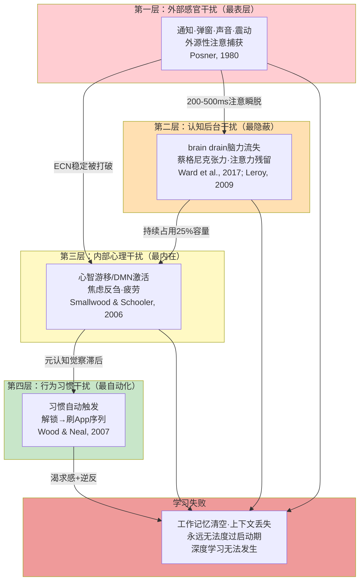
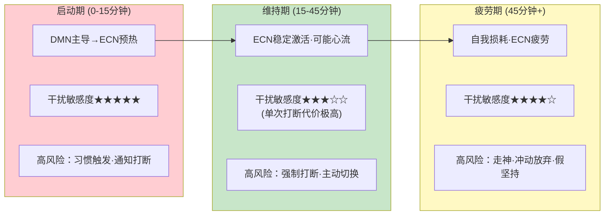

# 第4章：干扰因素的作用机制分析

第2章对用户痛点进行了四层溯源，识别出17个底层认知/心理机制；第3章建立了深度学习的14个必要条件模型，明确了学习发生需要满足的条件。但这些机制分散在不同痛点层级中，尚未形成一个关于"干扰如何系统地破坏学习"的统一理论框架。本章将这些分散的机制重新组织，建立干扰因素的分类学，详细解析6种核心干扰的具体作用路径，分析干扰在学习会话不同阶段的时间动态特征，并用这些机制解释4个反直觉现象，最终建立一个完整的干扰作用机制模型。

理解干扰的作用机制至关重要——它决定了什么样的应对策略是有效的。现有学习模式产品之所以效果有限，根本原因在于它们只处理了最表层的一类干扰（外部感官干扰），而对其他三类更深层、更隐蔽的干扰几乎完全没有应对措施。对症下药的前提是准确诊断——本章就是这份诊断书。

## 4.1 干扰因素分类学

干扰不是一个单一现象，而是多种不同性质、不同来源、不同作用机制的认知破坏因素的统称。将所有干扰混为一谈是现有产品设计的根本误区之一——"一刀切"的屏蔽策略只能应对其中一类，对其他三类几乎无效。我们根据干扰的来源、可感知性、可控制性、作用时间和恢复难度，建立四大类干扰的分类体系。

### 4.1.1 外部感官干扰

**定义**：来自外部环境、通过感觉通道（视觉、听觉、触觉）进入认知系统的干扰刺激。

**典型例子**：通知声音/震动、弹窗、红点角标、来电全屏打断、他人说话、环境噪音、屏幕闪烁、突然的运动。

**特征维度**：
- **可感知性**：高——用户通常能明确感知到这类干扰的发生（"刚才有个通知弹出来"）
- **可控制性**：中高——通过软件设置（勿扰模式、通知屏蔽）或物理手段（静音、戴耳塞）可以在很大程度上控制
- **作用时间**：短暂但具有破坏性——单次刺激本身只持续几百毫秒到几秒，但引发的后续认知影响持续10-15分钟
- **恢复难度**：一旦发生，需要重新付出启动成本才能恢复
- **意识参与**：前意识捕获（注意捕获发生在你意识到之前），但你能意识到自己被打断了

这是现有产品最关注、也是用户最容易抱怨的一类干扰。它确实是一个真实问题，但它只是冰山一角——解决了外部感官干扰，只解决了约25%的干扰问题。

### 4.1.2 认知后台干扰

**定义**：不直接进入意识焦点、但在认知后台持续运行、持续消耗工作记忆和注意资源的干扰过程。

**典型例子**：brain drain（脑力流失）效应（手机存在导致的后台监控）、未完成任务的蔡格尼克张力、注意力残留、期待性焦虑（"会不会有重要消息找我"）、"有什么事没做"的模糊坐立不安感。

**特征维度**：
- **可感知性**：极低——用户通常完全意识不到这些干扰的存在，只会模糊地感觉"今天脑子不好使""学不进去"，但不知道原因
- **可控制性**：低——因为你觉察不到它在发生，也就无法主动控制；单纯的通知屏蔽对这类干扰完全无效
- **作用时间**：持续、稳定、贯穿整个学习会话——从你坐下开始学习到结束，它一直在后台消耗资源
- **恢复难度**：一旦移除干扰源（如把手机放到另一个房间），效应立即消失；但如果干扰源持续存在，它会持续占用约20-25%的工作记忆容量
- **意识参与**：完全潜意识——这些过程发生在意识层面之下，你无法通过内省觉察到它们

这是最隐蔽、最被现有产品忽视的一类干扰。Ward et al. (2017)发现的brain drain效应是这类干扰的典型代表——手机放在桌上哪怕关机、屏幕朝下，仍然持续消耗认知资源，但99%的用户坚称"手机没有影响我"。这类干扰虽然单次看起来"不严重"（只是占用1个工作记忆组块），但它是持续性的"慢性失血"，让整个学习过程的认知容量基线下降了20-25%，深度学习根本无法发生。

### 4.1.3 内部心理干扰

**定义**：从认知系统内部产生的、不依赖外部刺激的干扰，是大脑默认运作模式的自然结果。

**典型例子**：心智游移（走神）、焦虑性反刍（反复想烦心事）、困倦/疲劳、对未来的担忧、对过去的回忆、自我批判的想法（"我怎么又分心了""我学不会"）。

**特征维度**：
- **可感知性**：低到中——你能意识到自己在走神，但通常走神几分钟后才觉察到（元认知觉察滞后）；焦虑和困倦可能被归因于"我状态不好"而非被识别为干扰
- **可控制性**：低——你无法命令自己"不要走神"，越强迫自己集中反而越容易走神（韦格纳的"白熊效应"）；困倦和疲劳更是生理状态，无法靠意志直接消除
- **作用时间**：间歇性、阵发性——不是持续存在，而是每隔几分钟就"来袭"一次，每次持续几十秒到几分钟
- **恢复难度**：可以通过元认知觉察后温和拉回，但强行压制反而会加剧；疲劳和困倦需要真正的休息才能恢复
- **意识参与**：半意识——走神时你在想别的事，但没有觉察到自己不在学习；焦虑想法是有意识的，但很难控制

这是最"内在"的一类干扰——即使手机在另一个房间、绝对安静、没有任何外部干扰，心智游移仍然会发生（占清醒时间的30-50%，Smallwood & Schooler, 2006）。现有产品完全没有应对这类干扰的机制——它们假设"没有外部干扰=专注"，但这个假设根本不成立。

### 4.1.4 行为习惯干扰

**定义**：由环境线索自动触发的、高度练习过的习惯性行为序列，不需要意识参与就会自动执行。

**典型例子**：习惯性解锁手机（拿起手机就解锁，甚至不知道自己为什么解锁）、解锁后自动点开微信/短视频App、刷手机的自动化行为序列（解锁→下拉刷新→切换App→刷Feed流）、学一会儿就下意识伸手去拿手机。

**特征维度**：
- **可感知性**：极低——习惯行为发生时你通常完全没有觉察，等你反应过来时已经在刷手机了；"我本来想查个单词，怎么在刷朋友圈？"是这类干扰的典型体验
- **可控制性**：极低——习惯是System 1（快思考）层面的自动化行为，发生在System 2（慢思考）介入之前；靠意志力"忍住"是效率最低的应对方式，因为意志力本身是有限资源
- **作用时间**：一旦触发，会持续数分钟到数十分钟（"就看一眼"变成"刷了半小时"）；习惯回路本身的触发只需要几百毫秒
- **恢复难度**：习惯一旦被触发并开始执行，停下来需要付出意志力成本；最有效的方法是不让触发线索出现，而不是在线索出现后抵抗
- **意识参与**：完全无意识——习惯行为的执行不需要意识决策，甚至你事后可能不记得自己做过这些动作

这是最"自动化"的一类干扰。手机是人类有史以来最强的习惯暗示聚合体（Wood & Neal, 2007），经过成百上千次重复后，"看到手机→拿起手机→解锁→刷App"这个序列已经变得像"看到台阶就抬脚踏上去"一样自动化。锁机、白名单等设计试图用System 2的约束对抗System 1的自动化，本质上是用鸡蛋碰石头——习惯回路的神经连接比短期意志力强大得多。

### 4.1.5 四类干扰的特征对比总结

| 干扰类型 | 来源 | 可感知性 | 可控制性 | 作用模式 | 现有产品应对效果 |
|---|---|---|---|---|---|
| 外部感官干扰 | 外部环境刺激 | 高 | 中高 | 突发性、脉冲式 | 较好——通知屏蔽能解决大部分 |
| 认知后台干扰 | 潜意识后台过程 | 极低 | 低 | 持续性、稳定占用 | 几乎为零——通知屏蔽完全无效 |
| 内部心理干扰 | 大脑内部产生 | 低到中 | 低 | 间歇性、阵发性 | 几乎为零——无任何应对机制 |
| 行为习惯干扰 | 线索触发的自动化行为 | 极低 | 极低 | 触发式、一旦启动持续很久 | 差——强制约束反而引发逆反 |

理解了这个分类体系，就能立刻看出一个关键结论：现有学习模式产品几乎把所有精力都花在了应对第一类干扰（外部感官干扰）上，但这类干扰只占所有干扰的约四分之一。剩下三类更深层、更隐蔽、破坏性更强的干扰，几乎完全没有被触及。这就是为什么很多用户感觉"开了专注模式还是学不进去"——因为只堵住了一个漏风口，另外三个大敞着。

为了更直观地理解四类干扰如何层层递进地破坏学习，我们可以用下面的Mermaid图可视化干扰从表层到深层的层级结构：

## 4.2 每类干扰的作用机制详解

分类学告诉我们有哪些类型的干扰，但没有告诉我们这些干扰具体是如何作用于认知系统、如何一步步破坏学习的。本节将详细解析6种核心干扰机制的完整作用路径——从干扰源出现，到注意被捕获，到工作记忆变化，到最终对学习产生的具体影响。理解这些机制是设计有效应对策略的前提。

### 4.2.1 通知干扰：外源性捕获→注意瞬脱→工作记忆清空→重建成本

通知干扰是外部感官干扰的典型代表，也是研究最充分、机制最清晰的一种干扰。它的作用路径可以分为四个阶段，每个阶段都有明确的认知科学证据支持。

**第一阶段：外源性注意捕获（0-100ms）**

Michael Posner (1980)在其经典的注意定向实验中，系统区分了内源性注意和外源性注意两种注意定向方式。内源性注意是目标驱动的、自上而下的——你主动决定把注意力集中在学习材料上，这是需要意志努力的。外源性注意是刺激驱动的、自下而上的——外部刺激的突然变化会**自动、无意识、在你做出任何决定之前**就捕获你的注意力。

外源性注意捕获有明确的进化根源：在原始环境中，草丛中的突然移动、身后的异常声响可能意味着捕食者逼近，那些能自动将注意转向这些刺激的个体有更高的生存概率。这套"预警系统"在数百万年的进化中被打磨得极其敏锐和快速——从刺激出现到注意被捕获，只需要80-120毫秒。

智能手机的通知系统精准利用了这套进化而来的预警机制：
- **听觉通道**：通知提示音是突然出现的新异听觉刺激，声像记忆会在2-4秒内保持这些声音，立即触发注意转向。Cherry (1953)发现的鸡尾酒会效应也证明：即使你完全专注于当前对话，你的名字或其他重要刺激仍然能自动捕获注意——这说明注意过滤发生在比较晚的加工阶段，早期的感觉输入是"先捕获再筛选"的。
- **触觉通道**：震动具有私密性和突然性，触觉感受器对突然的机械刺激极其敏感，而且震动不会像声音那样打扰他人，因此被更频繁地使用。
- **视觉通道**：弹窗的突然出现、红点的鲜艳红色、状态栏图标的变化，都是视觉系统特别敏感的刺激类型。红色在进化中与血液、危险、重要信号关联，视觉系统对红色的反应速度比其他颜色快20-30毫秒。

关键在于：这个阶段是**完全不可控的神经反射**。你无法"决定不注意到"一个突然响起的声音或弹出的窗口——在你有意识地决定"我要忽略它"之前，你的注意已经被它捕获了。这不是意志力问题，就像你无法决定不眨眼当一个物体快速飞向你的眼睛。

**第二阶段：注意瞬脱（200-500ms）**

如果说注意捕获是"被打断的起点"，那么注意瞬脱（attentional blink）则是打断的第一个实质性认知代价。Raymond, Shapiro & Arnell (1992)在快速系列视觉呈现（RSVP）实验中发现：当被试成功识别了第一个目标刺激后，在之后200-500毫秒内呈现的第二个目标刺激往往无法被识别——仿佛注意"眨了一下眼"。

注意瞬脱反映了注意的"脱离-转移-投入"三阶段时间成本：
1. 注意从当前任务（学习）上脱离需要约100-200毫秒
2. 注意转移到新刺激（通知）上需要约100毫秒
3. 处理完新刺激后，注意再重新投入回原任务又需要约100-200毫秒

这个过程不是瞬间完成的——每一次任务切换，都存在200-500毫秒的"注意空白期"，期间你无法有效处理任何信息。这意味着，即使你"只是看一眼通知"然后立刻回来，你也已经损失了至少半秒钟的有效加工时间——而且这还只是最表层的代价。

**第三阶段：工作记忆上下文清空（500ms-2s）**

更严重的代价发生在工作记忆层面。Baddeley (1974)的工作记忆理论指出，工作记忆是信息加工的"工作台"，容量极其有限（约4±1个信息组块，Cowan, 2001）。当你在深度学习时，这4个组块都被当前的学习内容占据：你正在理解的概念、刚刚推导到一半的逻辑、与当前内容相关的先备知识、正在形成的图式联结。

当注意被通知捕获、你切换到消息内容时，大脑会执行一个快速的"工作台清理"过程——因为工作记忆容量不够同时处理两套独立的上下文，之前保持的学习上下文会被迅速覆盖清空。这个过程就像你在用电脑写文章，突然弹出一个窗口把你当前写的内容全部清空——你虽然关掉了弹窗，但你之前写的东西已经不见了。

工作记忆清空的速度有多快？研究表明，只需要1-2秒的注意转移，工作记忆中未被主动复述的内容就会开始快速消退（Peterson & Peterson, 1959发现工作记忆的保持时间只有约18秒，没有复述的话消退更快）。如果你真的"点开看了一眼"通知内容（哪怕只花了2秒钟），工作记忆中的学习上下文已经丢失了大部分。

**第四阶段：上下文重建成本（10-15分钟）**

等你"看完通知"决定回来学习时，你面临的是一个空荡荡的"工作台"——你需要重新激活那些先备知识、重新找到之前读到的位置、重新推导到一半的逻辑、重新建立思考上下文。这个重建过程不是几秒就能完成的。

心流理论（Csikszentmihalyi, 1975）和注意力恢复研究一致表明：从被打断的状态重新回到深度专注/心流状态，需要**10-15分钟**的连续无打断时间。这不是一个随意的数字——它是大脑完成从默认模式网络（DMN）主导到执行控制网络（ECN）主导的切换、激活相关脑区、建立稳定加工上下文所需要的时间，是一个神经生理学上的硬约束。

这就是为什么"回一条消息就回来"的代价比你想象的大得多：你以为只花了30秒回消息，但实际上你付出了10-15分钟的重建成本。如果你每10分钟被打断一次，你永远在重建上下文，永远无法到达真正的深度加工状态——你的有效学习时间接近零。

而且，如果你的"回一条消息"演变成了"回了十条消息刷了5分钟朋友圈"，那么除了工作记忆清空，还有Leroy (2009)发现的**注意力残留**效应——你回来后，刚才的聊天内容、朋友圈信息仍然残留在工作记忆中，进一步挤占可用容量，让重建过程变得更慢、更困难。

**完整链条总结**：通知出现→（80-120ms）外源性注意自动捕获→（200-500ms）注意瞬脱，注意脱离学习任务→（500ms-2s）工作记忆中的学习上下文被清空→（10-15分钟）需要重新建立上下文，付出完整启动成本。这就是为什么一个只有1秒的通知，可以让你接下来10分钟都无法高效学习。

### 4.2.2 手机存在干扰（brain drain效应）：后台监控→工作记忆持续占用→认知容量系统性下降

通知干扰是"看得见"的干扰——通知弹出来，你知道自己被打断了。但有一种干扰是完全"看不见"的：手机只是静静放在那里，不响不亮不震动，甚至关机屏幕朝下，但你的认知表现仍然显著下降。这就是Adrian Ward及其同事2017年发现的**brain drain（脑力流失）效应**——一个对现有学习模式设计最具颠覆性的发现。

**Ward et al. (2017)实验详解**

Ward等人在德克萨斯大学奥斯汀分校招募了近800名被试，进行了一项设计精巧的实验。被试被随机分配到三种实验条件下，这三种条件的唯一区别是手机放置的位置：

1. **桌面组**：手机放在被试面前的桌上，屏幕朝下
2. **口袋/包组**：手机放在被试自己的口袋或包里，不在视线内但在同一房间
3. **另一个房间组**：手机被研究者拿到房间外面

实验过程中，所有手机都被调到静音模式，不会有任何通知、震动或亮屏——被试被明确要求不要碰手机。在这种条件下，被试完成两项标准化认知功能测试：
- **操作广度任务（OSPAN）**：测量工作记忆容量——被试需要在记忆字母序列的同时解决简单数学题，模拟真实场景中"同时记住多个信息并进行加工"的认知需求
- **瑞文标准推理测验**：测量流体智力——解决新颖的抽象推理问题，不依赖已有知识，反映当前的认知功能水平

实验结果令人震惊，且完全违背了绝大多数人的直觉：
- **另一个房间组**的认知表现显著最好
- **口袋/包组**的表现次之，比另一个房间组差
- **桌面组**的表现最差——即使手机是关机的、屏幕朝下的、完全没有任何动静！

效应量有多大？后续重复验证研究一致发现：手机在视线内导致的认知容量下降，效应量约为d=0.3-0.4，这相当于**一整晚没睡觉**造成的认知损伤程度，或者相当于**持续进行2小时高强度脑力劳动后的疲劳状态**。这不是"有点影响"——这是显著的、实质性的认知能力下降。

更令人不安的是：这种效应与被试的主观报告完全无关。实验结束后，绝大多数桌面组的被试坚称"手机没有影响我""我完全没有注意到手机的存在"——但客观测试数据明确显示他们的表现下降了20%左右。**你意识不到自己的认知资源被消耗了，这正是brain drain效应最危险的地方。**你只会模糊地感觉"今天脑子不太好使""怎么都学不进去"，但不知道罪魁祸首就是静静放在桌上的手机。

**机制解释：后台注意监控**

为什么手机只是静静放在那里就会消耗认知资源？Ward等人提出的机制解释是：智能手机作为我们生活中最重要的信息枢纽和社交连接工具，已经成为一个**具有高度奖赏相关性和个人重要性的刺激物**。它不仅仅是一个物理设备——它代表着：可能有重要的人联系你、可能有有趣的新信息等着你、可能有需要你处理的工作/社交事务、可能有你期待的消息或回复。

你的大脑，具体来说是负责监控环境中重要、相关、奖赏性刺激的**前额叶-顶叶注意网络**，会针对这种高优先级刺激维持一种**持续的、低水平的后台监控状态**：手机有没有亮屏？有没有震动？有没有新消息提示？这种监控不是你有意识进行的——它完全自动化地发生在意识层面之下，就像你在嘈杂的派对上仍然会在有人说你名字时自动注意到一样（鸡尾酒会效应的后台版本）。

这个后台监控进程的资源消耗虽然单次看起来不大，但它是**持续性的**——它全程占用中央执行系统的一部分资源。根据实验结果的效应量推算，它大约占用了工作记忆4个组块中的1个，也就是约20-25%的认知容量。这就像你的手机后台运行着一个你看不到的App——你在前台用其他App时感觉不到它，但你的系统整体变慢了。对于需要深度加工的理解型学习，这20-25%的认知容量损失是致命的——少了1个组块，你就无法完成多概念的同时加工，只能进行单线程的浅阅读。

**距离与可见性的调节作用**

关键的调节变量是**物理距离**和**可见性**，它们决定了后台监控的强度：
- **同一房间、视线内（桌面）**：监控强度最高——brain drain效应最强
- **同一房间、视线外（口袋/包里）**：监控强度显著减弱，但没有完全消失
- **另一个房间**：监控基本停止——brain drain效应消失

Ward等人的实验明确验证了这个梯度。这解释了为什么"把手机反过来扣在桌上"效果有限——它只是减少了视觉可见性，但手机仍然在你手边、在同一房间，后台监控仍然在运行。这也解释了为什么"开了勿扰模式还是学不进去"——勿扰模式只是阻止了通知（解决了外部感官干扰），但手机仍然在你面前，brain drain效应（认知后台干扰）完全没有被触及。

### 4.2.3 切换干扰/注意力残留：任务切换→残留持续→返回重建困难

通知干扰通常是"被动打断"，但还有一种非常普遍的情况是"主动切换"：你学了一会儿，想着"我就回一条消息，很快就回来"。但大多数时候，"回一条消息"会演变成回十条消息、刷5分钟朋友圈、看两个短视频，等你终于"回来"时，半小时已经过去了，而且你还需要10-15分钟才能重新进入学习状态。为什么"回一条消息"这么容易回不来？Sophie Leroy (2009)发现的**注意力残留（attention residue）**效应解释了其中的关键机制。

**Leroy (2009)的经典研究**

Sophie Leroy发现：当人们从任务A切换到任务B时，注意力并不会完全从任务A转移——即使你已经明确停止做任务A、开始做任务B了，**部分注意力仍然"残留"在任务A上**。这种残留表现为：任务A相关的想法仍然在工作记忆中活跃、你仍然在无意识地思考任务A中未解决的问题、大脑仍在对任务A的内容进行某种程度的后台加工。

Leroy的实验还发现了一个关键的调节因素：**任务切换的频率和原因**。如果你是因为完成了任务A而自然切换到任务B，注意力残留很少、很快消散；但如果你是在任务A还没完成时被打断或主动中断，注意力残留会非常强、持续很久。未完成的任务产生的蔡格尼克张力会和注意力残留叠加，让原任务的内容持续占据认知资源。

**"回一条消息"的完整认知过程**

让我们以"回一条微信消息就回来学习"这个典型场景为例，拆解完整的认知过程：

**阶段1：切换决策**。你学了一会儿，脑子里冒出"我看一眼有没有消息"的念头。在这个决策点，双曲贴现（Ainslie, 1975）已经在起作用：回消息是简单、即时、低门槛的，而继续学习需要持续付出认知努力，收益在未来。此时如果学习刚好遇到一点小困难，大脑会非常倾向于"就看一眼，很快回来"这个选项，而且你会真诚地相信自己真的"很快就回来"——因为你低估了切换的认知代价。

**阶段2：离开学习任务**。当你拿起手机、退出学习App、打开微信的那一刻，注意力开始从学习任务上脱离。但学习内容并没有立即从工作记忆中消失——你刚才正在理解的概念、推导到一半的逻辑仍然残留在那里，但已经开始消退了。更关键的是：如果你当时正在思考一个难题、快要形成一个理解，这个未完成的思考过程会产生蔡格尼克张力。

**阶段3：进入微信**。当你打开微信、看到消息列表的那一刻，你的工作记忆被迅速"覆盖"——未读消息、群聊小红点、朋友圈更新提示，每一个都是新的刺激、新的未完成任务。此时发生了两件事：工作记忆中的学习上下文被微信内容快速替换；但注意力残留仍然存在——学习的内容并没有100%消失，只是被推到了后台。

**阶段4：消息处理中的连锁触发**。当你开始回第一条消息时，你已经进入了微信的信息生态：回完这条消息，你看到另一个群有新消息→点进去看一眼→看到有人发了个有趣的链接→点进去看→看完链接回来发现朋友圈有更新→刷两下朋友圈→看到有人分享了一个短视频→点开看……这是一个典型的"注意力连锁捕获"过程——微信本身就是为了最大化你的使用时长而设计的，每一个内容都会触发下一个内容。

**阶段5：决定回来学习**。终于，你意识到自己刷了太久，决定回去学习。此时你面临的是：工作记忆里充满了刚才的微信内容、多层注意力残留叠加、学习的上下文已经完全清空、蔡格尼克张力反向作用——微信里可能还有没看完的内容、没回完的消息，这些未完成任务在拉你回去。

你以为"我只是回了一条消息，花了2分钟"，但实际上你面临的重建难度，比你第一次坐下来开始学习时还要大——因为第一次开始时你的工作记忆是"空"的，而现在你的工作记忆被微信内容填满了。这就是为什么"回一条消息就回来"几乎总是失败——一次"30秒的回消息"可能让你损失20-30分钟的有效学习时间。

**如何减少注意力残留？**

Leroy的研究也发现了减少注意力残留的关键：如果你必须切换任务，**在切换前明确标记一个"停止点"和"返回点"**，能显著减少残留。比如，在拿起手机之前，先在看到的地方折个角、或者在笔记上快速写下"我刚才看到这里，在想XX问题"——这个简单的动作给大脑一个"这个任务暂时告一段落，我知道在哪里继续"的信号，能显著降低蔡格尼克张力，减少注意力残留。但这是一个缓解措施，不是解决方案——最好的策略仍然是：在学习会话期间，不要进行任何任务切换，哪怕是"只回一条消息"。

### 4.2.4 习惯干扰：暗示触发→惯常行为→奖赏强化→渴求感循环

前三类干扰都是"认知"层面的干扰——它们影响你的注意、工作记忆、认知资源。但还有一类更深层、更难对抗的干扰，它不是发生在认知层面，而是发生在行为层面——它是高度自动化的习惯回路，在你意识到之前就已经触发并执行了。这就是为什么很多人有这样的体验："我拿起手机本来想查单词，怎么在刷朋友圈？"——等你反应过来时，行为已经发生了。

**习惯回路的神经基础：Wood & Neal (2007)与Duhigg (2012)**

Wendy Wood和David Neal (2007)系统阐述了习惯的心理学机制，Charles Duhigg (2012)在《习惯的力量》一书中将其普及为广为人知的**习惯回路模型（Habit Loop）**。这个模型指出，习惯由三个核心要素构成一个闭环：

1. **暗示（Cue/Trigger）**：环境中的某个线索触发习惯——可以是视觉线索（看到手机）、听觉线索（通知声）、位置线索（坐在书桌前）、时间线索（下午3点）、情绪状态（无聊、焦虑）、或者前一个行为（解锁手机）
2. **惯常行为（Routine）**：暗示触发后自动执行的行为序列——可以是身体动作（拿起手机、解锁）、心理活动（焦虑时胡思乱想）、或情绪反应（看到红点就想点）
3. **奖赏（Reward）**：惯常行为带来的满足感——可以是直接的愉悦（刷短视频的快乐）、信息获取（看到新消息的知晓感）、紧张释放（焦虑时分心）、或者社交奖赏（被人回复的感觉）

当这个"暗示→惯常行为→奖赏"的回路重复足够多次后（研究表明通常需要18-254天，平均66天，Lally et al., 2010），大脑会发生两个关键变化：首先，暗示和惯常行为之间建立起直接的神经连接——位于基底神经节的习惯系统直接"硬编码"了这个联结，不需要前额叶皮层参与；其次，大脑会开始**预期奖赏**——当暗示出现时，多巴胺系统开始释放，产生对奖赏的"渴求感"（craving），这种渴求感驱动你执行惯常行为。

习惯一旦形成，就会表现出三个关键特征：**自动化**（不需要有意识的决策）、**低能耗**（几乎不消耗意志力和认知资源）、**无意识**（你甚至可能不记得自己做过这个行为）。

**手机作为人类有史以来最强的习惯暗示聚合体**

智能手机是习惯形成的完美载体，原因有三：

第一，手机本身就是一个**多通道暗示源**：视觉暗示（只要手机在视线范围内就是超强视觉暗示）、触觉暗示（手碰到手机的触觉也是强暗示）、位置暗示（床、沙发、马桶这些位置本身就会触发刷手机的习惯）、情境暗示（无聊时、排队时、等电梯时自动触发"拿出手机刷一下"）。

第二，手机提供**即时且多变的奖赏**：刷微信获得社交连接感、刷短视频获得新奇刺激、看新闻获得信息知晓感、玩游戏获得成就感。而且这些奖赏是**变比率强化**——你不知道下一条消息什么时候来、不知道下一个视频好不好看，这种不确定性让多巴胺系统疯狂释放，是最强的习惯强化程式（这也是老虎机让人上瘾的原理）。

第三，手机**整合了上百个独立的习惯回路**：你不是只有一个"使用手机"的习惯，而是有几十个甚至上百个与手机相关的习惯——看到时间想顺便刷微信、解锁后自动点开微信、学习遇到困难就拿起手机。这些习惯回路相互关联、相互触发，形成了一个极其强大的习惯网络。

**渴求感：为什么越抵抗越想做**

习惯回路的另一个关键特征是**渴求感（craving）**。当习惯形成后，仅仅是暗示的出现就会让多巴胺系统释放，产生对奖赏的强烈预期和渴望——这种渴求感本身就是一种不舒服的紧张状态，只有执行了惯常行为、获得了奖赏，这种紧张才会缓解。

这就是为什么"看到手机在桌上但忍着不拿"这么消耗意志力——你不仅是在"不做一个动作"，你是在抵抗多巴胺驱动的渴求感，这种渴求感会越来越强，直到你屈服或者它消退。更糟糕的是：根据**白熊效应（Wegner, 1989）**——当你刻意试图抑制一个想法时，那个想法反而会变得更频繁、更强烈——"我不要想手机"的自我提示，反而会激活大脑中与手机相关的概念，让渴求感更强。

改变习惯最有效的方法，Wood & Neal (2007)的研究明确指出：不是靠意志力抑制惯常行为（效率最低、最消耗资源、成功率最低），而是**改变环境中的暗示线索**——如果暗示不出现，习惯回路根本不会被触发，你不需要抵抗任何东西。这就是为什么"把手机放到另一个房间"效果这么好——物理上移除了最强的暗示，解锁-刷App的习惯回路根本不会被启动。

这也是现有"锁机"类设计效果有限的根本原因：锁机强行阻止了惯常行为，但暗示仍然存在（手机就在你面前、在你手里），渴求感仍然被触发——你会感到一种强烈的、不舒服的渴望，想要用手机，这种渴望会持续消耗你的意志力，让你无法把注意力集中在学习上。锁机看似"挡住了"行为，实际上制造了持续的内在冲突，认知代价甚至比不锁机还大。

### 4.2.5 心智游移（走神）：DMN激活→ECN抑制→元认知觉察滞后→正反馈循环

即使你完美解决了前面四类干扰——手机放到另一个房间、绝对安静、没有任何通知、习惯回路也没有被触发——你仍然会分心。这是因为大脑有一个内置的"默认模式"，它会不断把你的注意力从外部任务拉向内部生成的想法——这就是**心智游移（mind-wandering）**，也就是我们常说的"走神"。这是最"内在"的一种干扰，它不依赖任何外部刺激，是大脑运作的自然方式。

**Smallwood & Schooler (2006)的心智游移理论**

Jonathan Smallwood和Jonathan Schooler在2006年发表于《Psychological Bulletin》的里程碑综述，系统总结了数十年的心智游移研究，确立了这一现象的核心特征：心智游移是指注意力从当前外部任务转移到内部生成的想法和感受上，是一种极其普遍的意识现象。

使用经验取样法（experience sampling）——在一天中随机时间点询问被试"你现在在想什么？是在想当前正在做的事吗？"——的研究一致发现：**人们在清醒时的30%-50%时间里都在走神**（Killingsworth & Gilbert, 2010）。也就是说，你以为自己在专注工作学习，但实际上有接近一半时间你的脑子在想别的事。这个数字高得惊人，但它是被反复验证的科学事实。

心智游移不是"坏"现象——它有重要的适应功能：计划未来、整合记忆、创造性联想、社会认知。但是，对于需要持续、专注于外部材料的深度学习来说，心智游移是致命的——当你走神时，你的眼睛可能还在看着书本/屏幕，但学习内容的加工完全停止了。工作记忆被内部生成的想法占据，信息不再从感觉记忆进入工作记忆进行深加工。

**DMN与ECN的拮抗关系：神经基础**

心智游移的神经基础是大脑的两个大尺度脑网络的拮抗关系（Raichle et al., 2001; Fox et al., 2005）：

- **默认模式网络（Default Mode Network, DMN）**：包括内侧前额叶皮层、后扣带回皮层、角回等区域。当你没有专注于外部任务、大脑处于"静息"状态时，DMN激活。它负责内部导向的认知：自我反思、回忆过去、想象未来、思考他人想法、心智游移。
- **执行控制网络（Executive Control Network, ECN）**：包括背外侧前额叶皮层、顶叶皮层等区域。当你需要专注于外部任务、进行工作记忆加工、解决问题、抑制干扰时，ECN激活。

这两个网络呈**反相关（anti-correlation）**关系——一个激活时另一个往往被抑制。它们就像大脑的两个"模式开关"：要么ECN主导（专注外部任务），要么DMN主导（专注内部想法），但两者不能同时高强度激活。专注学习需要ECN持续激活、DMN被抑制；而走神就是DMN重新激活、ECN活动下降的状态。

**元认知觉察滞后：为什么走神几分钟后你才发现？**

心智游移最麻烦的特征是**元认知觉察的严重滞后**。对于外部干扰（如一个通知弹出来），你的元认知几乎是即时的——你立刻知道"我被打断了"。但对于心智游移，觉察存在明显的延迟：你通常不是"一开始走神就知道自己走神了"，而是走神了几十秒、几分钟、甚至十几分钟之后，才突然反应过来。

为什么会有这种滞后？Smallwood & Schooler (2006)的解释是：当你开始走神时，你的元认知监控本身也"溜号"了——负责监控你注意力状态的，正是ECN的一部分功能；而当DMN激活、ECN抑制时，不仅你的注意力从外部任务上移开了，你对自己注意力状态的监控能力也同时下降了。这就像一个保安——他本来应该监控有没有人闯入，但当他自己开始玩手机时，他不仅没在监控，他甚至没意识到自己没在监控。

**外部干扰与心智游移的正反馈循环**

心智游移不是孤立发生的——它和外部干扰之间存在危险的**正反馈循环**：外部干扰打断ECN稳定→DMN激活走神→觉察回来后ECN脆弱→更容易被下一个干扰打断→更多走神。这就解释了为什么"一旦开始分心，就越来越容易分心"——一次干扰打断了你的专注状态，之后你进入了一个恶性循环，很难再回到最初的深度专注状态。这也解释了为什么启动期（前10-15分钟）是最高危阶段——此时ECN还没有稳定激活，DMN特别容易夺取主导权。

**应对走神：为什么"强行集中注意力"没用**

很多人发现自己走神后，会对自己说"集中注意力！别走神！"——但这种策略往往适得其反。原因有三：自责消耗ECN资源、"别走神"触发白熊效应、强行"用力集中"会快速疲劳。正确的应对方式是**温和的元觉察+不带评判的返回**：当你发现自己走神了，不要自责，不要批判自己，就只是简单地注意到"哦，我刚才走神了"，然后温和地把注意力带回到当前的学习内容上。这就像你发现自己走岔路了，不需要打自己一巴掌——你只需要停下脚步，转个方向，走回正确的路上就好。

### 4.2.6 自我损耗：连续自我控制→资源下降→冲动控制能力下降→屈服于诱惑

最后一种核心干扰机制与意志力本身有关——你用来抵抗所有其他干扰的"武器"，本身就是一种有限的、会被耗尽的资源。这就是Roy Baumeister及其同事提出的**自我损耗理论（ego depletion）**。理解这个机制至关重要——它解释了为什么你早上起来学习能专注1小时，而晚上学了一天之后，哪怕手机放在另一个房间你也学不进去；它也解释了为什么靠意志力"忍住不玩手机"是效率极低的策略。

**Baumeister et al. (1998)的自我损耗理论**

Baumeister等人在1998年提出了一个影响深远的理论模型，其核心命题可以概括为四点：

1. **自我控制是一种有限资源**：自我控制（意志力）类似于肌肉力量——你使用它之后，它会暂时疲劳，力量下降，需要休息才能恢复。
2. **所有自我控制行为消耗同一资源池**：不管你用意志力做什么——抑制冲动、调节情绪、做决策、主动思考——都从同一个"能量池"里消耗资源。
3. **初始的自我控制努力会损害后续的自我控制表现**：如果你先做了一件需要意志力的事，那么你在接下来的另一件不相关的自我控制任务上表现会更差。
4. **资源耗尽时，人们倾向于选择"轻松选项"**：当意志力资源不足时，人会变得更冲动、更难延迟满足、更容易屈服于诱惑。

Baumeister等人用一系列经典实验验证了这个模型。其中最著名的"萝卜-饼干实验"发现：仅仅是几分钟"忍住不吃饼干"的意志力消耗，就让被试在后续无解难题上的坚持时间下降了一半以上。

**学习是一项极高自我消耗的活动**

这里有一个关键但被大多数人忽视的事实：**学习本身就是一项高度消耗自我控制资源的活动**。启动阶段克服拖延、启动期熬过不舒服感、学习过程中维持专注和主动思考、抵抗诱惑——所有这些都在持续消耗意志力。

如果你的学习策略是"靠意志力忍住不玩手机"，那么你在做一件非常不划算的事：你把宝贵的意志力资源浪费在了"抵抗手机诱惑"上——这些资源本来应该用在学习本身。这就像你开车去一个目的地，你一边开车一边一直踩着刹车——你的油（意志力）都浪费在刹车（抵抗诱惑）上了，用来前进（学习）的油自然就少了。

对比两种策略：
- **策略A（靠意志力抵抗）**：手机放在桌上，每一分钟都在消耗意志力抵抗诱惑，学习本身还需要消耗大量意志力——你很快就会疲劳屈服。
- **策略B（环境设计减少抵抗需求）**：手机放到另一个房间，环境中没有触发习惯和诱惑的线索——你不需要"忍住不看手机"，因为根本看不到、摸不到，脑子里压根不会冒出这个念头。你节省下来的意志力，全部可以用在学习上。

Wood & Neal (2007)的习惯研究和Baumeister的自我损耗理论指向同一个结论：**好的设计不是考验意志力，而是让"不分心"成为默认状态，根本不需要动用意志力**。需要持续意志力维持的状态注定无法长久。

**资源耗尽时的行为特征**

当意志力资源被消耗到较低水平时，人的行为会表现出几个典型特征：冲动性显著增加、决策质量下降、情绪调节能力下降、被动性增加、"我不在乎了"的解脱心态。这解释了一个常见现象：你早上学习时状态很好，但到了晚上，工作/学习了一整天之后，你明明知道应该看书，但就是忍不住拿起手机刷——不是你变懒了，是你的意志力"电池"经过一整天的消耗已经快没电了。

**关于自我损耗理论的争议与我们的立场**

需要说明的是，近年来自我损耗理论面临一些重复验证争议——部分大规模重复实验没有发现最初Baumeister等人报告的那么大的效应量。但在本分析中，我们认为自我损耗理论的核心洞见仍然成立：即使效应量比最初认为的小，"持续的冲动抑制消耗认知资源，导致后续自我控制能力下降"这个基本事实对产品设计有直接指导意义——不管你叫它"资源"还是"疲劳"，结果是一样的：靠意志力持续抵抗诱惑不可持续，好的设计应该减少而不是增加用户需要动用意志力的场景。

## 4.3 干扰的时间动态：学习会话中的干扰分布

六种干扰机制不是均匀分布在整个学习会话中的——它们的发生概率、破坏力、高风险类型在学习会话的不同阶段有显著差异。理解干扰的时间动态特征至关重要：它告诉我们应该在什么时候投入最多的保护资源、什么时候最需要警惕打断、什么时候应该主动休息而不是继续硬撑。

我们可以把一个典型的深度学习会话划分为三个阶段：启动期（0-15分钟）、维持期（15-45分钟）、疲劳期（45分钟后）。

### 4.3.1 启动期（0-15分钟）：最高危的脆弱窗口

**神经状态**：从DMN主导到ECN主导的切换过程。你刚开始学习时，大脑还处于"默认模式"，ECN还没有被充分动员和激活。这个阶段是神经模式的"过渡阶段"——就像飞机起飞前在跑道上加速，还没有升空，任何一点干扰都可能让你偏离跑道。

**干扰敏感度**：★★★★★（最高）。这个阶段的认知状态极其脆弱——ECN还在"预热"，你对干扰的抵抗能力最弱。任何微小的外部干扰、任何一次习惯回路触发、任何一个走神的念头，都可能轻易打破这个脆弱的启动过程，让你倒回到DMN主导状态，需要重新开始启动。

**高风险干扰类型**：习惯干扰（最危险，很多人在前2分钟就失败了）、外部感官干扰、心智游移、"开始拖延"干扰。

**关键数据**：对于启动期的打断，恢复时间更长——如果你在第3分钟被打断，你可能需要重新付出完整的10-15分钟启动成本，相当于净损失15分钟以上。

**这一阶段的核心原则**：启动期需要最强级别的保护——尽一切可能消除所有干扰源，在前15分钟不要接受任何打断、不要进行任何任务切换、不要碰手机。很多人学习失败，不是因为他们无法维持专注，而是因为他们从来没有成功度过启动期。

### 4.3.2 维持期（15-45分钟）：心流可能出现，单次打断代价极高

**神经状态**：如果你成功度过了启动期，ECN会进入稳定激活状态，DMN被有效抑制，工作记忆装载了当前学习任务的上下文，你开始进入"状态"——如果挑战和技能匹配，你甚至可能进入心流状态（Csikszentmihalyi, 1975）。这个阶段是深度学习真正发生的阶段，也是学习效率最高的阶段。

**干扰敏感度**：★★★☆☆（单次打断代价极高，但相对不容易被打断）。进入维持期后，你对干扰的抵抗力显著增强——微小的干扰你可能根本注意不到。但是，一旦干扰真的突破了过滤、成功打断了你，代价极高——工作记忆中建立的复杂上下文全部清空，重新恢复需要付出完整的10-15分钟启动成本。

**高风险干扰类型**：强制打断类干扰（来电、有人搭话）、主动切换类干扰（"就回一条消息"）、认知后台干扰（brain drain、蔡格尼克张力）。

**关键数据**：心流状态下被打断，你可能在整个学习会话中都无法再回到同样深度的心流状态——心流需要多个条件的微妙配合，这种配合一旦被打破，很难在同一个会话中重建。

**这一阶段的核心原则**：进入维持期后，最重要的是**保护连续性**——不要主动切换任务、不要接受非紧急打断、不要看手机。这个阶段每分钟的有效学习价值是启动期的好几倍。

### 4.3.3 疲劳期（45分钟后）：自我损耗累积，DMN更容易激活

**神经状态**：连续45-60分钟的ECN高强度激活后，神经疲劳开始出现——自我损耗效应开始显现，意志力资源下降，ECN维持激活变得越来越困难，DMN"反扑"的力量越来越强。你可能开始感觉累了、注意力开始涣散、阅读同一个段落要读好几遍才能理解、开始频繁看时间。

**干扰敏感度**：★★★★☆（敏感度回升，但原因与启动期不同）。这个阶段你不是"脆弱"，而是"疲劳"——你的ECN还在工作，但它在"硬撑"，抵抗干扰的能力显著下降。

**高风险干扰类型**：心智游移（走神高发期）、意志力耗竭后的冲动行为、"假坚持"的自我欺骗。

**关键数据**：对于需要高度认知投入的学习任务，大多数人的有效持续时间在45-60分钟左右——超过这个时间后，学习效率呈非线性下降，继续"坚持"的边际收益极低。

**这一阶段的核心原则**：**主动休息，不要硬撑**。当你感觉到疲劳信号时，不要责怪自己"意志力差"——这是大脑在给你发信号。主动休息10分钟（站起来走动、远眺、喝水、闭目养神——但不要刷手机），让ECN恢复，然后再开始下一个学习块。硬撑着继续学，是性价比最低的选择。

### 4.3.4 三阶段干扰敏感度时间线

## 4.4 本章小结：干扰层级传播模型

本章我们系统分析了六种核心干扰机制：外部感官干扰（通知）、认知后台干扰（brain drain效应、注意力残留）、内部心理干扰（心智游移）、行为习惯干扰（习惯回路）、以及自我损耗（意志力有限性）。这些干扰不是孤立的——它们之间存在清晰的层级传播关系：表层干扰触发中层干扰，中层干扰触发深层干扰，最终导致学习失败。

图4-4展示了干扰的完整层级传播链条：

这个层级模型有三个关键的设计启示：

第一，**只解决表层干扰是远远不够的**。现有产品几乎全部资源投入到第一层（通知屏蔽），但只解决了约25%的问题。第二到第四层的干扰——brain drain、注意力残留、心智游移、习惯回路——完全没有被触及。这就是为什么"开了勿扰模式还是学不进去"。

第二，**干扰是会"传染"和"放大"的**。一个表层的通知干扰，可能触发注意力残留，残留导致工作记忆占用，占用导致ECN不稳定，不稳定导致心智游移，游移导致习惯回路触发——最后演变成半小时的刷手机。这是一个正反馈循环，一旦启动就很难停下来。最好的策略是在最外层就阻止它启动。

第三，**不同阶段需要不同强度和类型的保护**。启动期需要最强的全方位保护，维持期重点保护连续性，疲劳期需要主动休息而不是硬撑。一刀切的保护策略（整个学习会话都用同样强度的屏蔽）既低效又可能引起逆反。

理解了干扰的完整机制和层级结构后，本章我们转向一个关键问题：现有的各种技术手段——通知屏蔽、白噪音、番茄钟、锁机、种树等——究竟在多大程度上能解决这些干扰？哪些有科学证据支持，哪些只是行业惯例甚至可能产生反效果？
---
