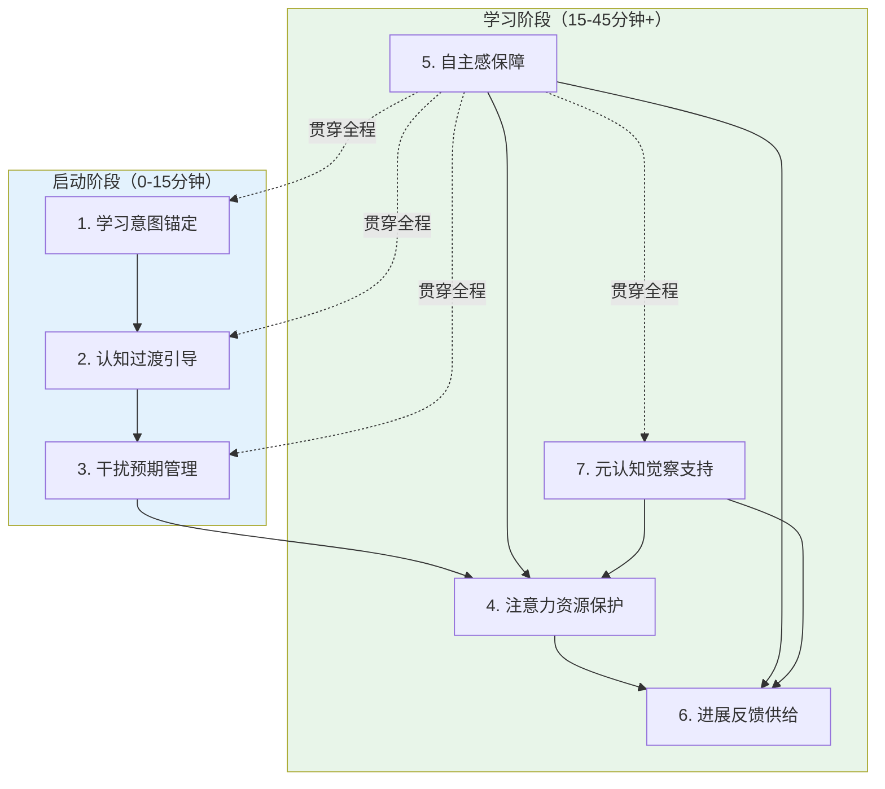

# 第8章：学习模式核心构成要素定义

前7章完成了学习本质拆解、痛点溯源、必要条件建模、干扰机制分析、技术证据评估、群体差异分析和根本假设质疑。本章是整个分析的综合产出：推导出学习模式的**最小完备要素集**——缺了任何一个内核要素，它就不再是"学习模式"，而退化为"勿扰模式+计时器"这类表层工具。

## 8.1 核心要素设计原则

在定义具体要素之前，我们确立五条筛选原则：
1. **最小完备性**：要素集必须最小（无冗余，去掉任何一个发生本质退化）且完备（满足后即使无扩展功能也能支持深度学习）
2. **原理溯源**：每个要素必须能追溯到14个必要条件和6种干扰机制，不接受直觉或行业惯例
3. **不可替代性**：反事实验证——移除后是否退化为已知但效果有限的工具
4. **三层分类**：内核层（缺一不可，定义本质）、支撑层（增强效果非必须）、扩展层（特定群体/场景可选）
5. **自主支持而非控制**：所有要素遵循自我决定理论，支持自主感而非施加控制

## 8.2 七个内核要素（Core Elements）

内核要素共7个，它们共同定义了"学习模式"的本质。

### 8.2.1 要素一：学习意图锚定

**定义**：启动期内帮助用户建立具体可执行的学习目标，将模糊的"我要学习"转化为"做什么+做多少"的执行意图（Gollwitzer, 1999）。

**对应必要条件**：M3目标清晰度、M1启动摩擦最小化
**对抗干扰**：意志力耗竭（减少决策内耗）、心智游移（提供注意锚点）、习惯干扰（减少因"不知道做什么"逃避到刷手机）

**反事实验证**：移除后退化为"带白噪音的计时器"——记录坐了多久，但无法支持启动和方向维持，这就是为什么很多人"开了番茄钟坐了2小时但什么都没学"。

**设计原则**：轻量引导而非强制设置（不能形成"设置墙"）；引导"做什么+做多少"的小目标（25-45分钟能完成）；目标可见但不施压；支持无目标启动。

**反模式**：启动前强制填写5-6个设置项；引导"学3小时"这类大目标；用目标完成率评判用户；不填目标无法开始。

**现有产品实现度**：10-20%——极少数产品有初步待办关联，但普遍存在设置前置、格式无引导、过程中不可见的问题。

### 8.2.2 要素二：认知过渡引导

**定义**：启动后的前30-60秒提供简短认知过渡过程，帮助用户：（1）认知卸载未完成事务（释放蔡格尼克张力）；（2）从之前任务的注意力残留中脱离；（3）完成从"日常模式"到"学习模式"的心理切换。这是现有产品**完全缺失**的最关键要素。

**对应必要条件**：E2无认知张力、C1工作记忆容量充足、ENV3情境线索一致性
**对抗干扰**：注意力残留、认知后台干扰（期待性焦虑）、心智游移（启动期DMN最活跃）、习惯干扰（仪式打破刷手机序列）

**反事实验证**：移除后退化为"即按即走的计时器"——计时器在走，但大脑还停留在之前的状态，前10-15分钟本质上在浪费时间，用户必须自己熬过"心神不宁"的启动期。

**设计原则**：30-60秒简短不拖沓；提供"认知卸载"输入框（写下来就放下）；多通道仪式（视觉切换+独特提示音+轻振动）；目标回顾；可选的3次深呼吸调节（高焦虑时）。

**反模式**：零过渡立刻计时；3分钟以上冗长冥想；强制填写烦心事才能开始；花哨转场动画（本身是外在认知负荷）。

**现有产品实现度**：0-5%——极少数产品有3秒数字倒计时，但没有认知卸载、没有残留清空、没有多通道切换，本质仍是零过渡。

### 8.2.3 要素三：干扰预期管理

**定义**：不是粗暴"屏蔽所有干扰"，而是系统性管理用户对"会不会有干扰"的预期——通过明确规则、安心提示、可控例外机制，消除"万一有急事"的期待性焦虑。核心是"让用户确信重要的事不会漏，不重要的事不会打扰"，而非"让用户什么都收不到"。

**对应必要条件**：ENV1外源性干扰可控、ENV2物理可见性管理、E2无认知张力
**对抗干扰**：通知干扰、brain drain效应（消除期待性焦虑释放后台资源）、注意力残留（减少"要不要看一眼"的冲动）

**反事实验证**：移除后（只做物理屏蔽）退化为"通知拦截器"——挡住了弹窗，但挡不住心里的担忧；制造了"没有干扰"的表象，但没有消除"干扰可能存在"的焦虑，用户仍然会频繁想"退出看一眼"。

**设计原则**："安心感"优先于"零干扰"（可见的"无紧急消息"提示比看不见的全屏蔽更有效）；白名单透明可控（3-5个紧急联系人可突破，清晰可见）；温和引导物理距离（"试试把手机放另一个房间，研究表明提升20%表现"，不强制）；支持"非手机学习"模式（手机只是计时器可放到远处）；必须用手机学习时界面"去手机化"（隐藏状态栏等典型手机元素）。

**反模式**：全屏蔽无例外；显示"有12条未读"（数字本身是强刺激）；强制物理隔离；只做软件屏蔽从不提物理距离。

**现有产品实现度**：30-40%——几乎都有通知屏蔽，但白名单安心提示普遍缺失，物理可见性管理是盲区（Flora屏幕朝下是唯一例外但引导不足）。

### 8.2.4 要素四：注意力资源保护

**定义**：整个学习会话期间系统性保护有限的工作记忆容量——通过启动期超强保护、外在认知负荷最小化、加工连续性保障、打断后上下文恢复，确保工作记忆4±1组块（Cowan, 2001）有足够空间用于学习加工，而非被无关信息占用。

**对应必要条件**：C1工作记忆充足、C2认知负荷平衡、C3注意稳定、C4加工连续性
**对抗干扰**：全部五类干扰——核心是保护"工作台"不被杂物堆满

**反事实验证**：移除后退化为"一个安静的房间"——确实没有外部噪音，但工作记忆"工作台"堆满杂物（倒计时、积分、励志语录、被番茄钟强制打断、打断后无法恢复），还是无法深度工作。

**设计原则**：启动期前15分钟超强保护（最严屏蔽、极简界面、无任何弹窗）；界面极简（只显示绝对必要信息，倒计时/积分/树动画默认隐藏）；不主动打断（无固定时间休息提醒，自然断点或疲劳信号才提示）；打断后提供"30秒快速记录"+"1分钟上下文恢复"（将10-15分钟重建成本缩短到1-2分钟）；状态自适应（通过交互模式推测是否度过启动期，动态调整保护强度）。

**反模式**：一刀切全程同强度保护；界面堆砌倒计时、积分、种树动画、励志语录；番茄钟25分钟强制打断（和微信通知代价相同）；显示"再坚持X分钟"这类压力提示。

**现有产品实现度**：25-35%——通知屏蔽有，但三个关键机制完全缺失：启动期差异化保护、外在认知负荷管理、上下文保存恢复；固定番茄钟打断更是主动破坏。

### 8.2.5 要素五：自主感保障

**定义**：所有约束都是用户自主选择的，用户随时拥有完全控制权——可以暂停、退出、调整、处理急事。学习模式是"工具"和"支持者"，不是"狱警"和"监工"。这是自我决定理论（Deci & Ryan, 1985）的核心应用。

**对应必要条件**：M4自主感支持、M1启动摩擦最小化
**对抗干扰**：习惯干扰（自主选择不触发额外渴求感）、意志力耗竭（不需要和App对抗节省资源）、心智游移（逆反引发的焦虑升高唤醒）

**反事实验证**：移除后（强制锁机+无法退出+惩罚）退化为"电子脚镣"——确实限制了行为，但触发心理抗拒（"你不让我退我偏要退"成为最高优先级）、削弱内在动机（"我被强迫学"而非"我选择学"）、锁机结束后报复性反弹。很多人体验"开了严格模式坐了2小时什么都没看进去"——手机没玩成，习也没学成。

**设计原则**：永远允许退出（退出按钮始终可见可用）；没有惩罚（没有植物枯死、没有失败标记、没有扣分）；约束定位为"帮你减少诱惑"而非"不让你做"；用户自主启动（不自动强制开启）；退出友好（信息提示而非道德绑架，提供"继续/快速查看30秒/结束"三选项）。

**反模式**：无法退出的严格模式；退出时植物枯死/失败记录；道德绑架（"你的努力会白费！"）；默认开启严格模式；5层确认弹窗的虚假选择。

**现有产品实现度**：15-25%——主流产品的核心卖点恰恰是"严格锁机+惩罚"，方向根本错误；严格模式+惩罚仍是行业主流，因为它"看起来有力量"好营销。

### 8.2.6 要素六：进展反馈供给

**定义**：提供清晰、即时、非侵入式的进展反馈——让用户感知到"学了多久、学了多少、取得了什么进展"，用持续小奖赏对抗双曲贴现（即时诱惑>延迟收益）。反馈像汽车仪表盘——不需要一直盯着，但想看时随时能看到，不会弹窗打扰。

**对应必要条件**：M2即时反馈可得、E3自我效能感（Bandura, 1977）、M3目标清晰度
**对抗干扰**：意志力耗竭（小奖赏补充动机资源）、心智游移（进展感减少焦虑）、主动切换（进展增加退出感知成本但这是自主选择）

**反事实验证**：移除后退化为"没有仪表盘的驾驶"——在黑屋子里走路，不知道走了多远、还有多远、方向对不对。学习收益天然延迟（几周后考试才见成果），如果过程中零反馈，每一分钟都要靠意志力对抗即时诱惑，不可能持续。

**设计原则**：非侵入式默认可见（不突出但一直在）；反馈具体（"你已经专注30分钟完成第一个学习块"而非"你真棒"）；里程碑温和反馈（细微颜色变化/轻振动/不遮挡小动画，无声音无弹窗）；只做正向反馈不做负反馈；长期统计（周/月趋势）结束后展示，过程中不显示。

**反模式**：大字体红色倒计时（创造持续时间压力）；每10分钟弹窗祝贺（本身是打断）；分心时弹出"你又分心了！"（引发自我批判）；社交排行榜（对复杂学习有害）；"今日目标还差X小时"（把学习变成KPI）。

**现有产品实现度**：30-40%——有时长显示但过于突出成为压力源；虚拟种树/徽章代替真实进展反馈（过度合理化削弱内在动机）；负反馈和惩罚普遍，正向反馈不足。

### 8.2.7 要素七：元认知觉察支持

**定义**：以非侵入、非评判的方式帮助用户觉察认知状态变化——走神、疲劳、唤醒偏离（过困/过焦虑）——并在合适时机提供温和调节引导。核心是"作为元认知能力的延伸"，帮助更快觉察、温和返回、需要休息时提醒休息，而非"监督用户有没有认真"。

**对应必要条件**：C3注意稳定、E1唤醒最优、E3自我效能感
**对抗干扰**：心智游移（缩短觉察滞后从几分钟到几秒）、意志力耗竭（疲劳期主动提醒休息避免硬撑）、认知后台干扰（唤醒偏离时帮助调节）

**反事实验证**：移除后——即使环境完美，人仍然30-50%时间走神（Smallwood & Schooler, 2006），新手觉察滞后5-10分钟；用户会在疲劳时硬撑导致效率骤降；唤醒偏离时无法调节（太困硬撑、太焦虑强行集中）。

**设计原则**：非评判性觉察提示（温和的"你好像走神了，需要拉回来吗？"而非"你又分心了！"）；疲劳信号检测（频繁切换、阅读速度下降时提示"要不要休息5分钟？"）；唤醒调节引导（启动时检测状态，累时建议拉伸2分钟，焦虑时建议呼吸1分钟）；所有提示完全可选可忽略，不强制打断。

**反模式**："分心警察"式监控和批评；检测到分心立刻弹窗打断（本身就是干扰）；强制休息（破坏自主感）；把走神数据作为"不认真"证据展示给用户。

**现有产品实现度**：10-15%——极少数产品有简单的分心提醒，但普遍带有评判语气，且只检测"离开App"无法检测"人在App里脑子走神"的更常见情况；疲劳检测和唤醒调节完全缺失。

### 8.2.8 七要素关系架构

七个内核要素不是孤立的，它们共同构成一个完整的认知支持系统：

## 8.3 支撑要素与扩展要素

除了7个内核要素，我们识别出5个支撑要素和3个扩展要素：

**支撑要素（Supporting Elements）**：增强效果但非必须，去掉后学习模式仍能工作但效果下降：
1. **感官环境调节**：可选的白噪音/自然音（个体差异大，不默认开启）
2. **休息结构化引导**：主动休息时的5分钟活动建议（远眺、拉伸、喝水，但不刷手机）
3. **学习内容关联**：与学习App/资料的轻量集成（不做强制白名单）
4. **长期趋势反思**：学习结束后的周/月统计和反思提示（不做社交比较）
5. **习惯养成支持**：温和的情境触发建议（如"每周一三五晚8点是你的高效学习时间"）

**扩展要素（Extended Elements）**：针对特定群体/场景可选，对主流用户非必须：
1. **同伴轻量陪伴**：亲密好友"一起学习"状态共享（无排行榜无比较，仅"我知道有人也在学"的连接感）
2. **场景适配模式**：通勤模式/图书馆模式/高压考试模式等预设配置
3. **第三方工具集成**：与笔记App、待办App、日历的深度集成

## 8.4 不属于核心要素的常见功能

需要明确：很多广泛使用的功能不属于核心要素，甚至属于反模式：
- **虚拟奖励（种树/徽章）**：属于❌反效果（过度合理化削弱内在动机）
- **社交排行榜**：属于❌反效果（社会比较损害复杂学习）
- **严格锁机+无法退出**：属于❌反模式（破坏自主感触发逆反）
- **固定25分钟番茄钟强制打断**：属于❌反模式（主动破坏加工连续性）
- **连续打卡天数**：属于❌反效果（外在动机取代内在动机，破罐破摔效应）
- **白噪音播放**：属于❓无证据（个体差异极大，安慰剂+习惯化效应）
- **励志语录**：属于外在认知负荷，无证据支持效果

## 8.5 本章小结

七个内核要素共同回答了"什么是学习模式"：它不是"更好的勿扰模式"，而是一个覆盖学习完整认知链条的系统级认知脚手架——从启动前的意图锚定和认知过渡，到学习中的注意力保护、自主感保障、进展反馈、元认知支持，再到打断后的上下文恢复和疲劳期的主动休息引导。

现有产品普遍只实现了干扰预期管理的一小部分（通知屏蔽），其余6个要素几乎完全缺失——这就是为什么"开了专注模式还是学不进去"的根本原因。

定义了核心要素后，下一章我们将清晰陈述学习模式的核心价值主张：它到底是什么、为谁解决什么根本问题。
---
