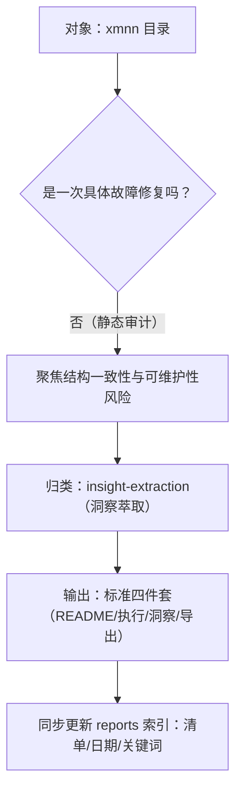

# 执行复盘 — XMNN 目录结构与打包系统静态审计

## 一、实施过程回顾

### 1.1 事实时间线（按审计步骤）

| 阶段 | 事实输入 | 关键判断 | 产出 |
|---|---|---|---|
| S1 定位范围 | 目标目录为 `server/libs/notebook/xmnn` | 属于“运行时分发与离线交付”型工程结构，而非纯源码包 | 明确复盘维度：包结构/安装规则/离线闭环/依赖边界 |
| S2 入口审阅 | `xmnn/README.md` | 项目自述已覆盖 wheel 与 client 运行镜像，但仍需要对“离线闭环与依赖策略”做一致性核对 | 建立检查清单 |
| S3 打包元数据审计 | `pyproject.toml` | 依赖表偏“全量开发环境”而非“运行时最小集”，可能导致体积膨胀与离线分发复杂化 | 记录风险：依赖膨胀、extras 与离线策略的矛盾 |
| S4 安装规则审计 | `CMakeLists.txt`（含 tvm/vta 子工程） | 采用“install-only CMake + 预编译产物”模式，结构上可复用、可分层，但需要明确数据/包边界（尤其是 `xmnn/` 数据目录与 `xmnn` 扩展模块同名） | 记录风险：包名冲突/namespace 边界不清 |
| S5 离线交付审计 | `client/README.md` + `client/Containerfile` | client 的目标是离线，但镜像构建阶段仍默认 `pip install xmnn[onnx]`，与“完全离线”存在潜在冲突 | 记录风险：离线闭环未制度化（需可开关/本地 wheels） |
| S6 归档交付 | 复盘体系四件套与全局索引要求 | 归类为 `insight-extraction/`；需同步更新 reports 索引（清单/日期/关键词） | 生成四件套并纳入索引 |

### 1.2 关键决策节点

## 二、检查清单（本次覆盖范围）

| 维度 | 覆盖点 | 结论形态 |
|---|---|---|
| wheel 内容与结构 | TVM/VTA/xmnn 三个扩展模块 + 数据目录安装规则 | 结构描述与 install 规则可对齐，但存在“同名包边界”风险 |
| 构建/安装链路 | scikit-build-core + CMake install-only | 属于可复用工程模式，可抽象为通用打包模板 |
| 离线交付闭环 | wheel + 运行镜像 + 完整性校验 | 方向正确，但默认依赖拉取策略需要进一步制度化 |
| 依赖策略 | dependencies + optional-dependencies | 当前偏全量，建议拆分 runtime/dev/extras 三层 |

## 三、复用验证追记（2026-07-02）

### 3.1 验证对象

- 目标项目：`workspace/apps/npu-project-hub/apps/project-hub`
- 验证方式：将本目录导出的建议视为“外部方法论资产”，映射到一个 FastAPI + React + Docker Compose 的全栈工程中，观察其是否足以指导真实改造收口

### 3.2 复用时间线

| 阶段 | 方法论映射 | 在 `npu-project-hub` 的实际动作 | 结果 |
|---|---|---|---|
| V1 构建入口收敛 | “统一打包入口、弱化脚本式运行” | 建立 `pyproject.toml`，迁移到 `scikit-build-core` + `CMake` + `Ninja`，删除旧 `requirements*.txt` | 成功落地 |
| V2 依赖边界收敛 | “runtime/dev/extras 分层” | 将后端运行依赖与 dev 依赖收口到 `project.dependencies` / `optional-dependencies.dev` | 成功落地 |
| V3 离线/镜像闭环 | “交付件应支持离线或受限网络场景” | 增加 Dockerfile、Compose、健康检查，并使用本地基础镜像 tar 验证 | 成功落地 |
| V4 交付入口统一 | “文档、CI、部署路径应一致可追溯” | 对齐 README、deploy 文档、CI 工作流和镜像构建入口 | 成功落地 |
| V5 用户侧闭环 | “从能力存在到可操作闭环” | 项目页补齐完整性、备份恢复、Git 历史操作面板 | 成功落地 |
| V6 运行时基线声明 | “产物应自描述兼容性基线” | 目前仅实现健康检查与容器约束，尚未形成显式基线声明文件 | 待继续 |

### 3.3 新增结论

1. 本目录导出的建议并非只适用于 `xmnn` 一类“预编译 runtime wheel”工程，其中“入口统一、依赖分层、离线交付、文档对齐”四项可跨工程复用。
2. 当目标项目从“纯 Python wheel”扩展到“后端 + 前端 + 容器编排”时，原建议中的“离线闭环制度化”需要扩展解释为：
   - Python 依赖源策略
   - npm 依赖源策略
   - 基础镜像离线导入策略
   - 健康检查与就绪探针
3. “运行时基线/兼容性声明”依然是最容易被延后但最值得保留的 P2 项，因为它直接决定二进制与部署环境是否真正可迁移。
