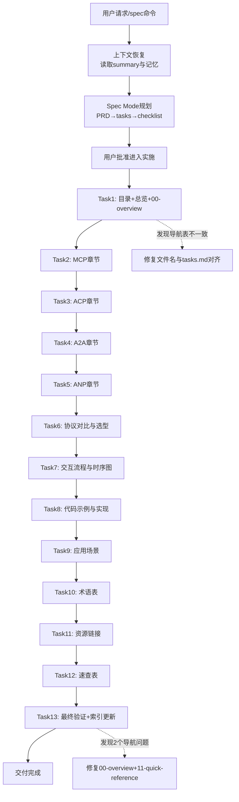

# Agent通信协议Wiki教程 — 执行复盘

## 一、项目概述

### 1.1 项目背景

用户请求系统性解析Agent架构中MCP、ACP、A2A、ANP四大核心通信协议概念，创建一份结构清晰、内容详实的wiki技术教程，面向技术人员学习参考。

### 1.2 项目目标

- 准确定义四大协议（MCP/ACP/A2A/ANP）的概念、功能、系统定位
- 阐明概念间关联关系与交互流程
- 提供技术实现要点与典型应用场景
- 包含术语解释与图示说明
- 采用专业规范的技术文档格式

### 1.3 交付物清单

| 交付物 | 文件路径 | 行数 | Mermaid图 |
|--------|---------|------|-----------|
| 总览入口 | `docs/knowledge/learning/01-agent-protocols-interfaces/agent-communication-protocols-wiki.md` | 93 | 1 |
| 00 概述 | `agent-communication-protocols/00-overview.md` | 139 | 3 |
| 01 MCP详解 | `agent-communication-protocols/01-mcp.md` | 252 | 3 |
| 02 ACP详解 | `agent-communication-protocols/02-acp.md` | 335 | 2 |
| 03 A2A详解 | `agent-communication-protocols/03-a2a.md` | 533 | 6 |
| 04 ANP概述 | `agent-communication-protocols/04-anp.md` | 178 | 1 |
| 05 协议对比 | `agent-communication-protocols/05-comparison.md` | 436 | 5 |
| 06 交互流程 | `agent-communication-protocols/06-flows.md` | 446 | 8 |
| 07 实现指南 | `agent-communication-protocols/07-implementation.md` | 1191 | 0 |
| 08 应用场景 | `agent-communication-protocols/08-scenarios.md` | 308 | 5 |
| 09 术语表 | `agent-communication-protocols/09-glossary.md` | 178 | 0 |
| 10 资源链接 | `agent-communication-protocols/10-resources.md` | 95 | 0 |
| 11 速查表 | `agent-communication-protocols/11-quick-reference.md` | 102 | 0 |
| **合计** | **13个文件** | **4286行** | **34个** |

附加交付物：
- PRD文档：`.trae/specs/standards-tools/agent-communication-protocols-wiki/spec.md`
- 任务分解：`.trae/specs/standards-tools/agent-communication-protocols-wiki/tasks.md`
- 验证清单：`.trae/specs/standards-tools/agent-communication-protocols-wiki/checklist.md`

***

## 二、实施过程回顾

### 2.1 时间线与关键节点

### 2.2 关键节点分析

| 节点 | 决策/挑战 | 处理方式 | 结果 |
|------|----------|---------|------|
| 上下文恢复 | 会话丢失，需从summary恢复 | 读取summary + project_memory，重新执行启动协议 | 正确定位到Spec Mode中已批准PRD状态 |
| Task1导航不一致 | 子agent创建的导航表文件名与tasks.md规划不符（protocol/practice双文件 vs 按主题分章） | Edit工具修正导航表文件名，使其与已批准tasks.md一致 | 修正后12个章节文件名对齐 |
| 07-implementation篇幅 | 代码示例章节达1191行，远超预期 | 保留丰富示例但不做拆分——代码示例密集是好事，非冗余 | 可接受，信息密度合理 |
| 最终验证 | 验证子agent发现00-overview缺少标准章节导航、11-quick-reference链接格式不统一 | 自动修复+更新知识库索引 | 全部通过 |

### 2.3 执行情况与结果数据

| 指标 | 数值 | 说明 |
|------|------|------|
| 总任务数 | 13个 | 按Spec Mode分解 |
| 任务完成率 | 100% | 全部按顺序完成 |
| 总文件数 | 13个文档 | 1入口+12分章 |
| 总行数 | 4286行 | 含代码示例 |
| Mermaid图总数 | 34个 | 架构图/时序图/状态图/决策树/场景图 |
| 代码示例数 | ~48个 | JSON/curl/Python/TypeScript |
| 术语条目 | 31个 | 按A-Z排列 |
| 发现并修复问题 | 3个 | 导航不一致×1 + 导航缺失×2 |
| 知识库索引更新 | 已执行 | generate_index.py自动更新 |

### 2.4 成功经验

1. **Spec Mode流程严格执行**：PRD→tasks→checklist→逐任务委派→验证的流程保障了产出物完整性，无遗漏章节
2. **原子化文档组织**："总览入口+编号分章子文件"模式适合长篇技术教程，便于维护扩展
3. **子agent委派效率高**：13个任务通过general_purpose_task委派，主agent聚焦流程控制和质量保证
4. **Mermaid安全编码规则前置**：在每个子agent指令中明确六规则，34个图全部合规，零违规
5. **最终验证子agent兜底**：独立验证环节发现了2个人工审查遗漏的导航问题，验证了"第三方检查"的价值

### 2.5 存在问题

1. **子agent输出行数不可控**：03-a2a.md初始682行、07-implementation.md初始1448行，远超指令中建议的长度，虽然内容质量高但存在冗余风险；最终验证后有所精简但仍偏长
2. **导航表文件名错误**：Task1中子agent自行决定将协议拆分为protocol/practice双文件，与已批准的tasks.md不一致，说明子agent指令需要更强调"严格遵循tasks.md文件名约定"
3. **章节间交叉引用不完整**：验证发现00-overview.md缺少标准的底部章节导航表格，说明"每个章节末尾必须有导航"这条规则需要在子agent指令中显式强调
4. **代码示例SDK准确性风险**：07-implementation中Python/TypeScript SDK示例标注为"伪代码"但可能与最新SDK API存在偏差，无法实际运行验证
