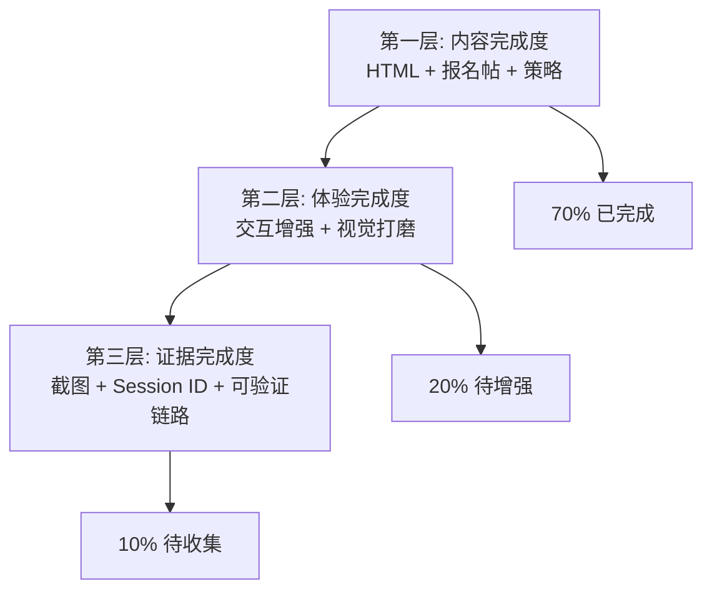

# 洞察萃取：SpecWeave Demo 制作流程分析

## 一、核心洞察

### 洞察 1：80% 完成度——报名帖已发布，剩余仅 §4 证据收集 ⭐⭐⭐⭐⭐

**事实**：截至 2026-06-25，SpecWeave 的 Demo 制作完成度已从 70% 提升至 80%。报名帖已发布（[forum.trae.cn/t/topic/44402](https://forum.trae.cn/t/topic/44402)），HTML 附件已上传（18.1 KB），§1-§3 和 §5 均已完成。已有 1 个 Session ID（TRAE Work CN，2026-06-25 09:29）。剩余 20% 主要是：还需 2 个 Session ID + 3 张截图 + HTML 交互增强 + Demo 帖整合提交。

**分析**：完成度从 70% 跃升至 80% 的关键动作是报名帖发布——这一动作同时完成了 §3（HTML 体验地址已上传）和 §5（报名帖链接已就绪），并将 §1-§2 从"草稿"状态升级为"已发布"状态。

**洞察**：报名帖发布是 Demo 制作流程的关键里程碑——它将多个"待办"一次性转化为"已完成"。剩余的唯一高优先级待办是 §4 TRAE 实践过程证据收集（2 个 Session ID + 3 张截图），这是自指涉证据闭环的最后一环。

### 洞察 2：80/20 资源分配原则的实践验证 ⭐⭐⭐

**事实**：参赛策略 v12 明确提出 SpecWeave 占 20% 资源、竹简悟道占 80% 资源。本次探索将 SpecWeave Demo 制作总工时预估为 5 小时，符合 20% 资源分配原则。

**分析**：80/20 原则之所以可行，是因为 SpecWeave 的 70% 完成度——已有资产足够丰富，只需少量增强工作即可达到提交标准。如果完成度低于 50%，5 小时显然不够；如果追求 100% 完美（如完全重构 HTML），则违反 80/20 原则。

**洞察**：80/20 资源分配不是"偷懒"，而是"精准投入"。关键在于识别哪些 20% 的工作能带来 80% 的评审价值。本次分析识别出：§4 TRAE 实践过程证据是投入产出比最高的增强项——它直接证明"SpecWeave 是用 TRAE 做出来的"，是自指涉命题的核心证据。

### 洞察 3：自指涉证据闭环的最后一环 ⭐⭐⭐⭐

**事实**：SpecWeave 的核心差异化是"自指涉证明"——方法论的内容是"如何更好地与 AI 协作"，而它的诞生过程本身就是这个命题的最佳实践。但这个证明目前是**逻辑闭环**而非**证据闭环**——142 次对话的量化数字在 HTML 中展示，但评审无法验证这些对话是否真实发生。

**分析**：§4 TRAE 实践过程（截图 + Session ID）正是补全证据闭环的最后一环。它将"142 次对话"从 HTML 上的一个数字，变成可验证的 TRAE IDE 对话记录截图。评审看到的不再是"声称做了 142 次对话"，而是"这是第 X 次对话的截图，这是 Session ID"。

**洞察**：自指涉证明的完整性取决于证据链的闭环程度。逻辑闭环（方法论内容 = 实践过程）是第一层，量化闭环（142 次对话的数字）是第二层，证据闭环（截图 + Session ID）是第三层。§4 是从第二层跃升到第三层的关键步骤。

### 洞察 4：HTML 交互增强的投入产出比分析 ⭐⭐

**事实**：现有 HTML 是纯静态展示页（648 行），缺乏交互性。提出了 5 项交互增强建议，但各增强项的投入产出比差异显著。

**分析**：

| 增强项 | 投入 | 产出 | 投入产出比 |
|--------|------|------|-----------|
| 侧边栏导航 | 低（CSS+JS 各 20 行） | 高（评审浏览体验显著提升） | ⭐⭐⭐⭐⭐ |
| 量化数字动画 | 低（JS 15 行） | 中（视觉冲击力） | ⭐⭐⭐⭐ |
| 模式卡片展开 | 中（JS 40 行+数据结构） | 高（信息密度可控） | ⭐⭐⭐⭐ |
| 脚本运行模拟 | 中（需准备示例数据） | 中（证明验证体系可用） | ⭐⭐⭐ |
| 架构图交互 | 高（Mermaid 节点交互复杂） | 低（评审不一定点击探索） | ⭐⭐ |

**洞察**：HTML 交互增强应优先投入低成本低产出的项目（侧边栏导航、数字动画），而非高成本低产出的项目（架构图交互）。这与项目中已有的 `cost-benefit-asymmetry.md`（成本效益不对称模式）一致——在有限资源下，优先选择投入产出比最高的增强项。

### 洞察 5：Demo 帖 = 报名帖策略的合理性 ⭐⭐⭐

**事实**：大赛规则允许初赛提交时直接用报名帖内容作为 Demo 帖。本次探索建议采用"报名帖 = Demo 帖"策略，仅在提交时补充 §4 内容。

**分析**：这一策略的合理性基于三点：
1. **内容重叠**：报名帖的 4 部分（创意名称/目标用户/价值意义/HTML 说明）与 Demo 帖的 §1-§3 高度重叠
2. **资源约束**：80/20 原则下 SpecWeave 只有 5 小时，不可能维护两份独立内容
3. **评审逻辑**：评审先看 Demo 帖，报名帖是辅助参考——两者内容一致反而增强可信度

**洞察**："报名帖 = Demo 帖"不是妥协，而是信息一致性策略。在参赛策略 v12 中已识别出"信息一致性"是 SpecWeave 的核心优势之一——142 次对话产出的一致性体系，在参赛材料层面也应保持一致。

---

## 二、规律认知

### 2.1 Demo 制作的三层完成度模型

SpecWeave 当前处于第一层完成（内容已有），需向第二层（体验增强）和第三层（证据收集）推进。第三层（证据完成度）是评审差异化价值最高的层次。

### 2.2 自指涉证明的三层闭环模型

| 层次 | 内容 | 当前状态 |
|------|------|---------|
| 逻辑闭环 | 方法论内容 = 实践过程 | ✅ 已完成 |
| 量化闭环 | 142 次对话的数字展示 | ✅ 已完成 |
| 证据闭环 | 截图 + Session ID 可验证 | ❌ 待收集（§4） |

---

## 三、潜在机会

### 3.1 Spec 文档作为 TRAE 实践过程的补充证据

`.trae/specs/` 目录下有 23 个 spec 文档（含 checklist/tasks），这些是 TRAE IDE 中使用 Spec-driven 开发流程的直接产物。可在 §4 中展示 spec 文档的截图，作为"SpecWeave 方法论在 TRAE 中的实际使用"的证据。

### 3.2 CI 检查脚本运行作为验证体系的活证据

`.agents/scripts/ci-check.ps1` 可在终端中运行并产生输出。可在 §4 中展示 CI 检查的运行截图（通过/失败/修复），证明验证体系不是纸面规则而是可执行的自动化工具。

### 3.3 竹简悟道作为交叉叙事的视觉素材

`.temp/AI/` 下的竹简悟道 HTML（3 个版本）可作为"SpecWeave 方法论在另一个作品中的实际应用"的视觉证据，强化交叉叙事的可信度。

---

*数据来源：SpecWeave 项目资产盘点 + 参赛策略分析报告 v12 + 大赛官方 Demo 帖要求*
