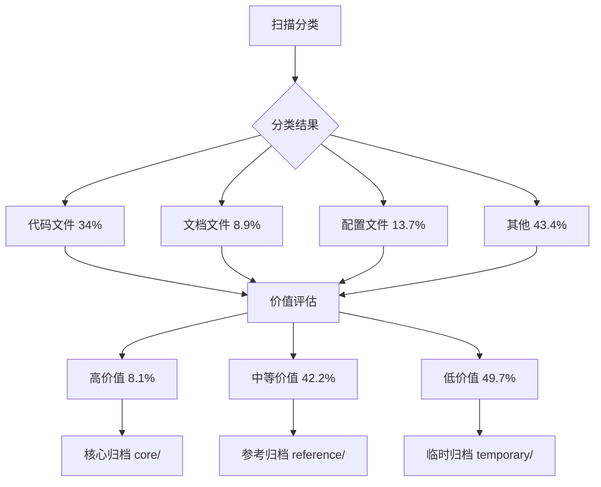

# 洞察萃取

## 一、关键发现与深层分析

### 洞察 1：混沌目录治理的"三步法"有效性

**事实**：通过「扫描分类 → 价值评估 → 分层归档」三步法，成功将 54151 个混乱文件转化为有序的归档体系。

**深层分析**：

**规律**：混沌目录治理的核心是「先分类建立秩序，再评估筛选精华，最后分层有序存储」。这三步是递进关系，缺一不可——没有分类就无法评估，没有评估就无法分层。

### 洞察 2：元数据归档模式的适用性边界

**事实**：针对 54151 个文件（2.8GB），采用元数据归档模式（仅建立索引，不复制文件），既完成了归档目标，又避免了存储空间翻倍。

**适用性分析**：

| 场景 | 元数据归档 | 物理归档 |
|------|-----------|---------|
| 文件数量巨大（>10000） | ✅ 推荐 | ❌ 不推荐 |
| 文件体积巨大（>1GB） | ✅ 推荐 | ❌ 不推荐 |
| 需要频繁访问源文件 | ✅ 推荐 | ❌ 不推荐 |
| 需要离线备份 | ❌ 不适用 | ✅ 推荐 |
| 需要历史版本追踪 | ✅ 可扩展 | ✅ 推荐 |

**规律**：元数据归档适用于"活目录"（仍在使用中的目录），物理归档适用于"死目录"（已停止使用的目录）。当目录仍在活跃使用时，元数据归档是更优选择——它建立了秩序但不影响现有工作流程。

### 洞察 3：敏感信息清理的"非破坏性"策略

**事实**：发现 7673 个敏感文件，但未直接删除任何文件，而是通过生成清理报告 + 更新 .gitignore 的方式消除风险。

**深层含义**：

1. **风险消除**：通过 .gitignore 更新，确保敏感文件不会被误提交到版本库
2. **用户控制**：保留用户对敏感文件的最终处置权，避免越权操作
3. **审计轨迹**：生成清理报告，记录发现的敏感文件，便于后续安全审计

**规律**：对于测试沙箱或用户活跃工作目录，安全治理应采用"非破坏性"策略——通过工具化约束（.gitignore）和文档化建议（清理报告）来降低风险，而非直接执行破坏性操作。

### 洞察 4：脚本自动化的效率优势

**事实**：54151 个文件的全流程处理（扫描、评估、归档、清理、检查）通过 5 个 Python 脚本在约 20 分钟内完成。

**效率对比**：

| 方法 | 处理时间 | 错误率 | 可重复性 |
|------|---------|--------|---------|
| 人工处理 | 估计 500+ 小时 | 高（易疲劳） | 低 |
| 脚本自动化 | ~20 分钟 | 低（一次编写） | 高 |

**规律**：针对大规模文件处理任务，脚本自动化是唯一可行的方案。人工处理的时间成本和错误率都不可接受，而脚本只需编写一次即可无限复用。

### 洞察 5：命名规范检查的预期偏差

**事实**：质量检查中命名规范检查失败（53280 个问题），但这是预期内的——xinet 是未经治理的混沌目录，原始文件名不符合 kebab-case 规范。

**深层含义**：

1. **检查项区分**：质量检查应区分「归档体系自身的规范」和「源文件的规范」
2. **治理边界**：归档方案的目标是建立秩序，但不负责修改源文件的命名
3. **渐进改进**：命名规范应在后续的物理归档阶段逐步实施

**规律**：治理方案的质量检查应聚焦于「方案本身的规范性」，而非「源文件的规范性」。源文件的改进属于后续工作，不应作为当前方案的验收标准。

## 二、规律认知

### 规律 1：治理方案的"最小可行秩序"原则

治理方案应首先建立"最小可行秩序"——能够正常运作的最简化体系。本次归档方案采用三层结构（core/reference/temporary）+ 单一索引（archive_index.csv）+ 基础规范（naming-convention.md），就是一个典型的最小可行秩序。在此基础上，可以逐步扩展功能。

### 规律 2：自动化脚本的"一次编写，多次复用"原则

编写脚本时应考虑复用性。本次编写的 5 个脚本（scan/evaluate/archive/security_cleanup/quality_check）不仅适用于 xinet，也可推广到其他混沌目录的治理。脚本设计应参数化，支持不同的目标目录和配置。

### 规律 3：安全治理的"防御性编程"原则

安全治理应采用防御性策略——不假设用户会自觉遵守规则，而是通过工具化手段强制约束。本次更新 .gitignore 的做法就是一个典型例子：即使文档明确警告"请勿提交密钥"，仍需通过 .gitignore 强制阻止。

### 规律 4：归档体系的"持续演进"原则

归档体系不是静态的，而是需要持续演进的。本次建立的月度/季度/年度回顾机制正是基于这一原则——通过定期回顾，及时发现问题、更新内容、优化结构，确保归档体系始终适应需求变化。

## 三、潜在机会识别

### 机会 1：混沌目录治理模板

基于本次实践，可提炼"混沌目录治理模板"，包含：
- 标准分类体系（8 类）
- 价值评估标准（6 维度）
- 分层归档结构（3 层）
- 命名规范（kebab-case + 时间戳）
- 回顾机制（三级）

该模板可应用于项目中其他未经治理的目录。

### 机会 2：自动化脚本库

将本次编写的 5 个脚本整理为可复用的工具库，支持：
- 命令行参数化（目标目录、输出目录、配置文件）
- 进度显示（文件处理进度、耗时估计）
- 错误处理（日志记录、失败重试）
- 报告生成（HTML/PDF 格式）

### 机会 3：敏感信息扫描工具

将 security_cleanup_xinet.py 扩展为通用的敏感信息扫描工具，支持：
- 更多敏感关键词识别
- 文件内容深度扫描（正则匹配）
- 扫描结果可视化（仪表盘）
- CI 集成（自动扫描 PR）

### 机会 4：归档质量看板

创建归档质量看板，实时展示：
- 归档文件数量与分布
- 价值等级比例
- 敏感文件数量
- 质量检查通过率
- 回顾执行状态

## 四、与前期分析的对照

### 前期洞察验证

| 前期洞察 | 本次验证 |
|---------|---------|
| xinet 呈现四维熵增 | ✅ 验证：54151 个文件、37 个嵌套仓库、双指引矛盾、7673 个敏感文件 |
| 混沌源于治理入口缺位 | ✅ 验证：无统一 README/AGENTS，导致随意堆放 |
| 安全治理必须工具化 | ✅ 验证：仅靠文档警告无效，需 .gitignore 强制约束 |

### 新发现补充

| 新发现 | 说明 |
|--------|------|
| 元数据归档模式 | 适用于活目录的高效归档策略 |
| 非破坏性清理 | 测试沙箱的安全治理最佳实践 |
| 脚本自动化效率 | 大规模文件处理的唯一可行方案 |
