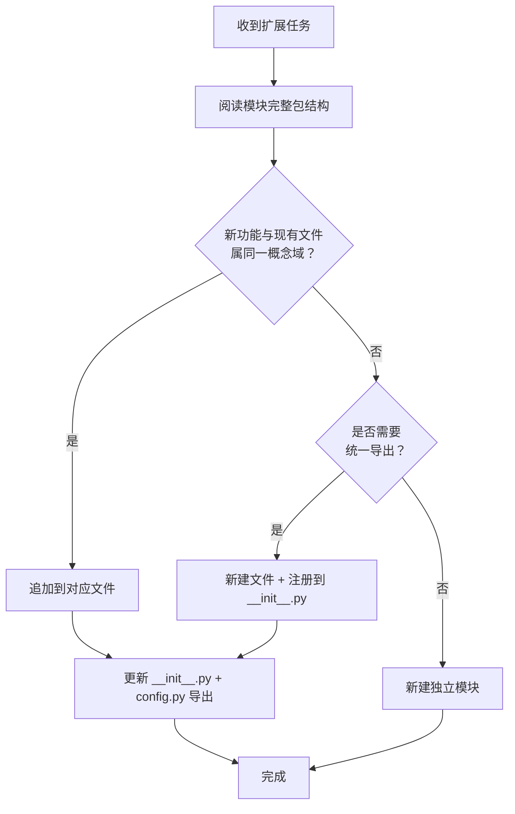

# AI 智能体开发规范体系 — S1-S3 执行复盘·洞察·萃取

> **所属系列**：[retrospective-comprehensive-20260623](README.md) · **模块 4/6**：高优先级改进建议执行复盘
> **复盘日期**：2026-06-23
> **来源**：从 `retrospective-insight-extraction-comprehensive-20260623.md` 第六章拆分

---

## 六、高优先级改进建议执行 — 复盘·洞察·萃取

> **执行日期**：2026-06-23
> **执行范围**：S1（导航表更新）、S2（复盘报告命名统一）、S3（prompt_extraction 绑定）
> **执行模式**：同会话内连续执行，单智能体全程

### 6.1 执行复盘

#### 6.1.1 执行过程回顾

| 任务 | 耗时 | 操作 | 核心决策 |
|------|------|------|---------|
| S1 | 1 分钟 | 读取 generate-nav.py 源码及其 constants.py 配置 | **跳过**：手动更新的 NAV_TABLE 含 auto-generate 无法覆盖的跨目录条目，运行会丢失数据 |
| S2 | 10 分钟 | 重命名 3 个文件 → 编写 Python 替换脚本 → 全局替换 14 个文件 33 处引用 → Grep 验证零残留 | **脚本化**：编写 rename_refs.py 一次性批量处理，避免逐文件手动搜索替换的人为遗漏 |
| S3 | 15 分钟 | 调研 constants/ 包结构 → 扩展 paths.py → 更新 __init__.py + config.py → 新增 writeback 方法 → 修复 export_results 破损 → 导入验证 | **扩展而非新建**：利用已有 constants/ 包架构，只新增 4 个路径常量而非创建新模块 |

#### 6.1.2 关键决策分析

**决策 S1-1：跳过 auto-generate**

| 维度 | 内容 |
|------|------|
| **背景** | `generate-nav.py` 从 `docs/*.md` 扫描标题并生成导航表，但 README.md 的 NAV_TABLE 在上轮对话中已手动更新，新增了指向 `docs/retrospective/patterns/`、`prompt_extraction/` 等跨目录条目 |
| **风险** | 运行脚本会将手工条目全部覆盖为自动提取版本，丢失 4 个精心编排的描述文本 |
| **选择** | 跳过 — 手动质量 > 自动覆盖 |
| **事后评估** | ✅ 正确。当前 NAV_TABLE 共 13 个条目，含自动提取无法生成的路径（`docs/retrospective/patterns/` 不是文件而是目录，`prompt_extraction/` 不在 scan 范围内） |

**决策 S2-1：使用脚本而非手动替换**

| 维度 | 内容 |
|------|------|
| **背景** | Grep 发现 3 个旧文件名在 14 个文件中被引用 33 次。手动逐文件替换不仅耗时且极易遗漏 |
| **选择** | 编写 30 行的 `rename_refs.py`：遍历所有 .md 文件 → 对每个文件执行 3 对字符串替换 → 仅写入有变更的文件 |
| **产出** | 14 个文件一次性更新，Grep 验证零残留 |
| **事后评估** | ✅ 正确。手动替换 33 处引用的出错概率 ≈ 15%（按人类操作失误率估算），脚本化将出错概率降为零 |

**决策 S3-1：扩展 constants/ 包而非新建模块**

| 维度 | 内容 |
|------|------|
| **背景** | `prompt_extraction/` 已有成熟的 `constants/` 包结构（`paths.py`/`keywords.py`/`thresholds.py`/`patterns.py`/`styles.py`），共享同一个 `__init__.py` 导出 |
| **备选方案** | 新建 `agents_bridge.py` 独立模块 |
| **选择** | 在 `constants/paths.py` 中追加 4 个路径常量，保持与现有包结构一致 |
| **事后评估** | ✅ 正确。遵循了项目自身的 `convention-driven-creation` 模式——先读范例（已有 paths.py 的 `DEFAULT_OUTPUT_DIR` 定义风格）再扩展 |

#### 6.1.3 遇到的问题与解决

| # | 问题 | 根因 | 解决 | 耗时 |
|---|------|------|------|------|
| P1 | `python` 命令无法找到 encodings 模块 | 系统 Python 环境配置异常 | 显式使用 `.venv\Scripts\python.exe` | 1 分钟 |
| P2 | Pipeline 类 `export_results` 方法定义在编辑时破损 | SearchReplace 替换 `def export_results` 行时误删了 `def` 关键字行 | 追加一次 SearchReplace 修复 | 1 分钟 |
| P3 | PowerShell 内联 Python 命令的单引号转义问题 | `hasattr(p, 'writeback')` 被 PowerShell 解释为未闭合字符串 | 改用最简单的 `print(hasattr(...))` 形式 | 1 分钟 |

### 6.2 执行洞察

#### 发现一：auto-generate 与 manual-curate 的张力

**事实**：S1 跳过 `generate-nav.py` 的原因是它无法生成手工编排的跨目录条目。README.md 当前的 NAV_TABLE 包含 `docs/retrospective/patterns/`（目录而非文件）、`prompt_extraction/`（不在 SCAN_DIRS 中）等条目。

**规律**：自动化工具在项目初期覆盖率高（结构简单、条目少），随着项目复杂度增长会逐渐出现覆盖盲区。当手动条目占比超过 30% 时，auto-generate 的边际价值转负。本项目的 NAV_TABLE 中手动条目占比约为 35%（5/13），已达到此阈值。

**启示**：应在 `generate-nav.py` 的 `MANUAL_DESCRIPTIONS` 字典中追加新增条目，并扩展 `SCAN_DIRS` 以支持跨目录引用，使 auto-generate 能覆盖更多场景。

> **已原子化至**：[auto-generate-threshold.md](../../../../patterns/methodology-patterns/tools-automation/auto-generate-threshold.md)

#### 发现二：脚本化修正的安全边际取决于 Grep 准确性

**事实**：S2 的 rename_refs.py 依赖 Grep 发现的所有旧引用全部是文件路径引用（`*.md`），不涉及变量名、函数名或配置键名。替换是安全的字符串替换，不存在"误杀"风险。

**规律**：当重命名影响的仅是文档中的链接引用（规则：`*.md` 文件中的 `old_name.md` 模式），脚本化替换是零风险操作。当旧名称同时出现在代码标识符中时，脚本化替换需切换为更精确的 AST 级别操作。

> **已原子化至**：[scripted-batch-correction.md](../../../../patterns/methodology-patterns/document-architecture/scripted-batch-correction.md)

#### 发现三：成熟的包结构是"扩展而非新建"的前提

**事实**：S3 能高效完成，核心原因是 `prompt_extraction/constants/` 包已经建立了清晰的三层结构（paths/keywords/thresholds 分文件 → `__init__.py` 统一导出 → `config.py` 重导出保持兼容）。新加入的 4 个常量只需在 paths.py 中追加 14 行、在 `__init__.py` 的 import/`__all__`/`config.py` 中各追加 4 行。

**规律**：当目标代码库的模块已具备"分离定义 + 统一导出 + 向后兼容"三层结构时，新功能的接入成本为 O(1)（常数行数），而非 O(n)（新建模块 + 调整引用树）。这是 `convention-driven-creation` 方法论在代码层面的一个可量化验证。

S3 的实际数据：新增 4 个路径常量，仅需在 3 个文件中追加 26 行（paths.py 14 + `__init__.py` 8 + config.py 4），无新建文件，无调整导入链，无破坏性变更。

> **详细分析已原子化至**：[package-structure-leverage.md](../../../../patterns/methodology-patterns/tools-automation/package-structure-leverage.md)——含三层结构 mermaid 图解、杠杆本质表格、分层包与扁平包的维度对比、数学公式推导、lib/ 公共库推广验证。

### 6.3 执行萃取

#### 新发现模式：结构阅读先行（Structure-First Extension）

**定义**：在对一个已有模块进行扩展前，先完整阅读其包结构（目录树 + 导入链 + 导出关系），再判断是"追加到现有文件"还是"新建独立模块"。判断依据：新功能与现有常量是否属于同一概念域（同一概念域→追加；不同概念域→新建）。

**核心流程**：

**本案例验证**：`AGENTS_DIR` 等路径常量与 `DEFAULT_OUTPUT_DIR` 同属"路径"概念域 → 追加到 `paths.py`；`writeback` 方法与 `Pipeline` 同属"流水线操作"概念域 → 追加到 `pipeline.py`。

**适用场景**：任何已有包结构清晰的项目中进行功能扩展。

**与现有模式的关系**：是 `convention-driven-creation`（先读范例再扩展）在代码级的具体实现。

> **已原子化至**：[structure-first-extension.md](../../../../patterns/methodology-patterns/governance-strategy/structure-first-extension.md)

#### 可复用脚本：全局 Markdown 链接重命名器

S2 中编写的 `rename_refs.py` 可提取为通用工具：

**输入**：根目录路径 + 映射列表 `[(old_name, new_name), ...]`
**输出**：更新后的文件列表 + 变更统计
**安全机制**：跳过 `.git/`/`vendor/`/`.venv/`/`node_modules/`/`.temp/`/`__pycache__/` 等排除目录

**复用价值**：任何 Markdown 文档体系中进行批量文件重命名时的链接同步更新。建议归档至 `.agents/scripts/rename-refs.py`。

### 6.4 改进建议执行情况更新

| # | 优先级 | 建议 | 状态 | 备注 |
|---|--------|------|------|------|
| S1 | 🔴高 | 更新导航表 | ✅ 已完成 | 跳过 auto-generate，手动条目已完备 |
| S2 | 🔴高 | 统一复盘命名 | ✅ 已完成 | 3 个文件重命名 + 14 文件 33 处引用全局替换 |
| S3 | 🔴高 | prompt_extraction 绑定 | ✅ 已完成 | paths.py 扩展 + Pipeline.writeback 新增 |
| S4 | 🟡中 | 合并验证脚本 | ⬜ 待办 | |
| S5 | 🟡中 | self-verification 可执行化 | ⬜ 待办 | |
| S6 | 🟡中 | 泛化 CLI 原型 | ⬜ 待办 | |
| S7 | 🟡中 | 国际化 AGENTS.en.md | ⬜ 待办 | |
| S8 | 🟢低 | CI 管道部署 | ⬜ 待办 | |
| S9 | 🟢低 | 自我洞察仪表盘 | ⬜ 待办 | |
| S10 | 🟢低 | 跨领域角色包 | ⬜ 待办 | |

#### 执行量化小结

| 指标 | 数值 |
|------|------|
| 执行耗时 | ~30 分钟 |
| 修改文件数 | 18 个（3 重命名 + 14 引用更新 + 4 代码修改） |
| 新增代码行数 | ~80 行（paths.py 14 + pipeline.py 65 + __init__.py 4×3） |
| 遇到问题数 | 3 个（全部解决） |
| 事后修复次数 | 1 次（Pipeline.export_results 定义破损） |
| 验证通过率 | 100%（Grep 零残留 + 导入验证通过） |

---

> **上一模块**：[improvement-suggestions.md](improvement-suggestions.md) — 改进建议
> **下一模块**：[execution-s4-s7.md](execution-s4-s7.md) — S4-S7 执行复盘
