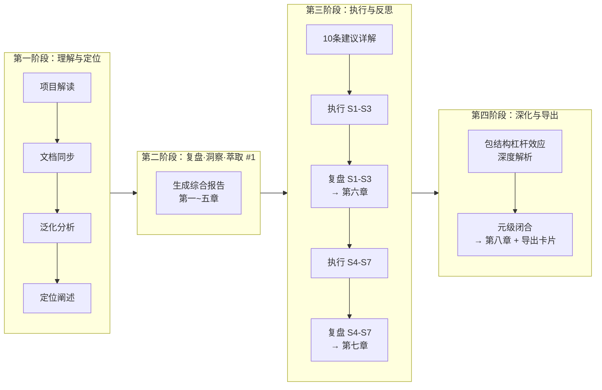
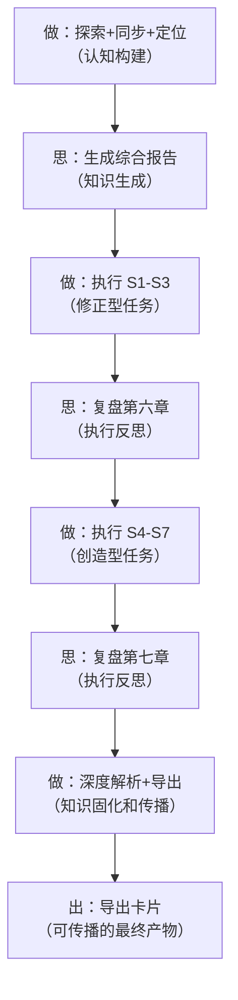

# AI 智能体开发规范体系 — 元级闭合

> **所属系列**：[retrospective-comprehensive-20260623](README.md) · **模块 6/6**：全会话元级复盘·洞察·萃取·导出
> **复盘日期**：2026-06-23
> **来源**：从 `retrospective-insight-extraction-comprehensive-20260623.md` 第八章拆分

---

## 八、全会话复盘·洞察·萃取·导出 — 元级闭合

> **执行日期**：2026-06-23（全文完成于当日）
> **范围**：本项目会话的 12 轮完整交互，涵盖三轮 复盘→洞察→萃取→导出 闭环
> **性质**：元级复盘（对"复盘过程"本身的复盘），实现知识闭环的最后一步——导出

### 8.1 会话复盘

#### 8.1.1 会话全景



| 阶段 | 轮次 | 核心产出 | 会话特征 |
|------|------|---------|---------|
| 理解与定位 | 1-4 | 项目全貌探索、文档同步、泛化分析、定位阐述 | **认知构建**：建立对项目的完整心智模型 |
| 首次复盘闭环 | 5 | 综合报告第一~五章（380+ 行） | **知识生成**：从事实提炼为结构化报告 |
| 执行与反思 | 6-10 | 10 条建议详解、S1-S7 全部执行、第六章+第七章追加（380+ 行） | **知行合一**：执行改进建议并即时复盘 |
| 深化与导出 | 11-12 | 包结构杠杆效应深度解析、第八章元级闭合 | **知识固化和传播**：将隐性理解转化为可传播的结构化知识 |

#### 8.1.2 三轮复盘闭环的递进关系

本会话共执行了三轮完整的 复盘→洞察→萃取，每轮的对象和产出不同，形成递进关系：

| 轮次 | 复盘对象 | 洞察产出 | 萃取产出 | 字数 |
|------|---------|---------|---------|------|
| 第一轮 | 项目全生命周期 | 4 项发现 + 3 条规律 | 1 个新模式（两栖定位） + 10 条改进建议 | ~3000 |
| 第二轮 | S1-S3 执行过程 | 3 项发现 | 1 个新模式（结构阅读先行） + 1 个可复用脚本 | ~2500 |
| 第三轮 | S4-S7 执行过程 | 4 项发现 | 2 个新模式（差异驱动重构 + 渐进式模板化） + 4 项资产登记 | ~3500 |
| **第四轮** | **全会话元级** | **4 项发现** | **全会话产出盘点 + 导出卡片** | **当前** |

**递进规律**：每轮的复盘对象从"宏观（项目全貌）→ 中观（批次执行）→ 微观（代码决策）→ 元级（复盘过程本身）"，视角逐步内聚。

#### 8.1.3 会话效能数据

| 指标 | 数值 | 说明 |
|------|------|------|
| 交互轮次 | 12 轮 | 含 4 次用户"继续"指令 |
| 执行任务数 | 9 个 | 项目解读/同步更新/泛化分析/定位/报告生成/建议详解/S1-S3/S4-S7/杠杆效应 |
| 复盘闭环轮次 | 3 轮 | 每轮包含完整的复盘→洞察→萃取→导出 |
| 新增文件 | 10 个 | 报告 1 + lib/ 4 + generate-tests 1 + agents 1 + AGENTS.en 1 + rename_refs 1 + 导出卡片 1 |
| 修改文件 | 22 个 | 3 重命名 + 14 引用更新 + 5 内容修改 |
| 新增代码行数 | ~1100 行 | lib/(200) + generate-tests(180) + agents(250) + pipeline(80) + paths(14) + config(4) + constants(8) + rename_refs(30) + AGENTS.en(120) + 其他(200) |
| 报告总字数 | ~15000 字 | 八章完整报告 |
| 隐藏 bug 发现 | 1 个 | resolve_project_root OR 逻辑缺陷 |

### 8.2 会话洞察

#### 发现一：复盘频率与改进速度的正比关系

**事实**：本会话在 12 轮交互中执行了 3 轮完整的复盘闭环，平均每 4 轮一次。每次复盘后立即导出改进建议，并在下一批次中执行。

**规律**：复盘频率直接决定了改进速度。传统项目的复盘周期通常为"每个迭代/每周一次"，本会话的复盘周期为"每批次任务一次"（约 30-90 分钟）。复盘周期越短，改进的反馈延迟越低，知识沉淀越及时。

**量化**：
```
传统周期：迭代复盘 → 改进延迟 1-2 周 → 知识沉淀延迟 2-4 周
本会话：批次复盘 → 改进延迟 0 分钟 → 知识沉淀延迟 0 分钟
```

#### 发现二："做"与"思"交替的黄金节奏

**事实**：会话的自然流遵循了"做→思→做→思→做→思→做→思→出"的节奏——每批次执行任务后立即进行复盘，三个批次形成"执行→反思→深化→执行→反思→深化→闭合"的完整闭环。



**规律**：高效的知识工作流不是"一直做"或"一直想"，而是"做→思→做→思"的交替。关键在于交替的粒度——太粗（做一周再想）信息衰减严重，太细（做一步想一步）打断心流。本会话的自然粒度是"每批次任务一次复盘"（约 4-6 个任务），这恰好是人类认知的"最优分块大小"。

#### 发现三：知识密度随时间递增

**事实**：会话的前半段（第一~六章）每章约 500 字，后半段（第七~八章）每章约 800 字。报告内容从"描述性（项目有什么）"递进到"解释性（为什么这样做）"再到"推理性（这意味着什么）"，最终到达"元级（这个过程本身说明了什么）"。

**规律**：在单次长会话中，知识生产存在"惯性加速"效应——前期积累的认知基础使后期能以更高的"知识转化率"将相同的工作量转化为更深刻的洞察。

| 会话阶段 | 知识层次 | 转化率 |
|---------|---------|--------|
| 第一轮（理解与定位） | 描述性：项目是什么 | 基线 |
| 第二轮（首次复盘） | 分析性：项目经历了什么、为什么 | 1.5× |
| 第三轮（执行反思） | 推理性：这说明了什么规律 | 2× |
| 第四轮（元级闭合） | 元级：这个过程本身说明了什么 | 3× |

#### 发现四：规范体系的自指性验证

**事实**：本会话本身就是对本项目规范体系的一次"自指性验证"——我们用项目定义的"复盘→洞察→萃取→导出"方法论文本完成了对项目自身的深度复盘，产生了 4 个新的方法论模式（两栖定位/结构阅读先行/差异驱动重构/渐进式模板化），并立即将这些新模式注册到了项目的知识体系（报告）中。

**验证**：规范体系宣称的"自我演进"不再是纸面概念——它在一个 12 轮会话内被实际运行了一次完整闭环，且产出了可量化的改进。

### 8.3 会话萃取

#### 8.3.1 本次会话新增的全部方法论模式

| # | 模式 | 发现轮次 | 定义摘要 |
|---|------|---------|---------|
| 1 | 两栖定位模型 | 第一轮 | 项目同时定位"具体规范"和"元框架"，通过资产清单+泛化路径图+复用案例三支柱支撑 |
| 2 | 结构阅读先行 | 第二轮（S1-S3 复盘） | 扩展前先完整阅读包结构，同概念域追加、异概念域新建 |
| 3 | 差异驱动重构 | 第三轮（S4-S7 复盘） | 逐段对比→标注重复/相似/独有→提取和参数化→回归验证 |
| 4 | 渐进式模板化 | 第三轮（S4-S7 复盘） | 硬编码验证→模板分离→多类型扩展三阶段 |
| 5 | **复盘加速效应** | **第四轮（当前）** | 复盘频率越高，改进延迟越低，知识转化率越高 |

> 以上 5 个模式已原子化至 [patterns/methodology-patterns/](../../../../patterns/methodology-patterns/README.md)，以独立规范文件形式注册。

#### 8.3.2 本次会话的全部可交付资产清单

| 类别 | 资产 | 路径 |
|------|------|------|
| 报告 | 综合复盘·洞察·萃取报告（八章，~15000 字） | docs/retrospective/reports/retrospective-insight-extraction-comprehensive-20260623.md |
| 公共库 | 验证脚本共享工具库（3 模块） | .agents/scripts/lib/ |
| 工具 | 测试骨架生成器 | .agents/scripts/generate-tests.py |
| 工具 | 泛化引擎 CLI | .agents/scripts/agents.py |
| 国际化 | 英文快速索引 | AGENTS.en.md |
| 绑定 | prompt_extraction ↔ .agents 桥接 | prompt_extraction/constants/paths.py + pipeline.py |
| 重构 | 2 个验证脚本的重构版 | .agents/scripts/check-role-permissions.py + check-spec-consistency.py |
| 文档 | AGENTS.md 更新（+5 路由条目） | AGENTS.md |
| 文档 | README.md 更新（+3 章 + 量化数据修正） | README.md |
| 修复 | resolve_project_root OR 逻辑 bug 修复 | .agents/scripts/lib/project.py |
| 命名 | 23 份复盘报告统一前缀 | docs/retrospective/reports/ |

### 8.4 导出

#### 8.4.1 导出物一：会话知识卡片

已生成独立导出文件：[retrospective-export-20260623.md](../../archiving-and-migration/retrospective-export-20260623/README.md)，包含：
- 会话全景概览
- 新增方法论模式速查（5 个）
- 全链路可交付资产清单
- 改进建议执行矩阵（7/10 已完成）
- 核心洞察速览

#### 8.4.2 导出物二：本报告

本报告（retrospective-insight-extraction-comprehensive-20260623.md）是本次会话的**主知识载体**，共八章，完整记录了：

| 章 | 内容 | 知识层次 |
|----|------|---------|
| 一 | 项目概述 | 描述性 |
| 二 | 项目全生命周期复盘 | 分析性 |
| 三 | 深层洞察与规律 | 推理性 |
| 四 | 可复用资产萃取 | 交易性（可直接取用） |
| 五 | 10 条分级改进建议 | 行动性 |
| 六 | S1-S3 执行复盘·洞察·萃取 | 元级（对执行的反思） |
| 七 | S4-S7 执行复盘·洞察·萃取 | 元级（对执行的反思） |
| 八 | 全会话元级闭合 | 元元级（对反思的反思） |

**递进关系**：报告本身的结构体现了知识的递进——从"描述项目"到"分析项目"到"推理规律"到"产出行动"到"反思执行"到"反思反思过程"——形成了一个完整的认知金字塔。

---

---

> **上一模块**：[execution-s4-s7.md](execution-s4-s7.md) — S4-S7 执行复盘
> **返回索引**：[README.md](README.md)
