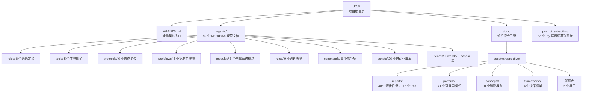
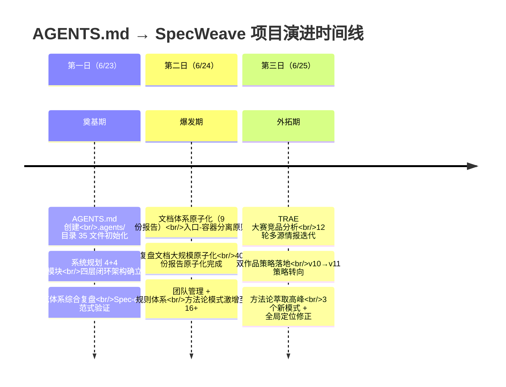

# 执行复盘：AGENTS.md → SpecWeave 全项目周期

## 一、项目规模总览

| 资产类别 | 数量 | 说明 |
|---------|------|------|
| .agents 规范文档 | 80 个 Markdown | 角色定义、工具规范、协议、工作流、模板、提示词、模块、规则、指令集等 |
| 复盘报告 | 173 个 Markdown | 40 个独立报告目录，6 大主题分类 |
| 可复用模式 | 71 个 Markdown | 56 方法论 + 7 代码 + 7 架构 + 1 README |
| 知识概念 | 10 个 | 元文档、上下文感知、正交验证等核心概念 |
| 决策框架 | 4 个 | 目录命名、依赖管理、元文档处理、语义匹配阈值 |
| 自动化脚本 | 26 个 (.py/.ps1/.sh) | 链接检查、规格一致性、Git 忽略验证、CI 检查等 |
| 知识库 | 6 个 | 故障排查、决策记录、操作指南 |
| prompt_extraction | 33 个 .py | 独立 Python 应用，含 tests/ 和 ui/ 子系统 |
| **总计** | **~400 个文件** | 3 天密集产出 |

---

## 二、项目演进时间线

### 2.1 阶段划分

### 2.2 关键里程碑详述

#### 里程碑 1：AGENTS.md 与 .agents/ 体系的建立（6/23 早期）

**触发**：用户需要一套让 AI 在持续协作中保持上下文一致性的规范体系。

**决策**：采用 AGENTS.md 开放标准作为单入口路由，.agents/ 目录承载全量规范——角色定义、工具规范、协议、工作流、模板、提示词全部用 Markdown 结构化。

**产物**：35 个初始 Markdown 文件，覆盖 7 个角色、5 项协议、4 个工作流、3 个模板、10 个提示词文件。

**关键决策**：
1. **AGENTS.md 优先级最高**——设为所有智能体的"启动协议"（PRIORITY ZERO），在执行任何 Skill 之前必须先读取
2. **按需读取而非全量加载**——通过上下文路由表实现精准导航，避免一次性全量加载的 Token 浪费
3. **Markdown 统一格式**——确保可版本化、可渲染、可 diff

#### 里程碑 2：自我演进模块的四层闭环架构（6/23 中期）

**触发**：用户要求补充"迭代+进化+验证+洞察"四个模块。

**决策**：设计四层闭环架构（感知→认知→执行→治理），将 8 个 self-* 模块按层次组织。统一五要素结构模板（技术架构 + 关键实现步骤 + 资源需求 + 时间节点 + 预期成果指标）。

**产物**：8 个自我演进模块（self-insight、self-retrospective、self-extraction、self-evolution、self-iteration、self-verification、self-management、self-development）+ 2 张 Mermaid 流程图 + 全面体系复盘报告。

**关键洞察**：
- 增量式需求是常态而非异常——系统设计应预设可扩展性
- 统一结构使扩展成本从 O(n) 降至 O(1)——每次新增仅需填充模板
- - "自我X"命名模式具有认知一致性

#### 里程碑 3：文档体系大规模原子化（6/24）

**触发**：复盘体系从单文件演变为多文件集合后，需要系统化组织。

**决策**：将 40 份复盘报告按 6 大主题分类（原子化/竞品分析/洞察萃取/项目治理/角色团队/规范体系），每份报告原子化为 README + execution-retrospective + insight-extraction + export-suggestions 四文件标准结构。

**产物**：173 个 Markdown 文件（原子化 10 份报告 40 文件 + 洞察萃取 8 份报告 32 文件 + 规范体系 7 份报告 28 文件 + 角色团队 3 份报告 12 文件 + 项目治理 10 份报告 43 文件 + 竞品分析 2 份报告 17 文件）。

**关键模式结晶**：
- **入口-容器分离原则**：入口文件（README）最大化精简，容器文件（.agents/）全量承载
- **原子性判断三标准**：单一职责 + 独立加载有意义 + 不超过 200 行
- **三层验证模型**：结构一致性 → 链接有效性 → 内容正确性

#### 里程碑 4：方法论模式的临界质量突破（6/24 晚 - 6/25）

**触发**：当方法论模式数量超过 6 个后，新模式开始从模式间的交叉组合中自发涌现，不再完全依赖单一复盘事件的驱动。

**标志性事件**：
- `fact-statement-consistency-loop` ← `review-insight-export-loop` + `three-tier-governance` 交叉组合
- `convention-driven-creation` ← `spec-driven-development` + `document-system-refactoring` 交叉组合
- `structure-first-extension` ← `convention-driven-creation` + `package-structure-analysis` 交叉组合

**数据验证**：
- 方法论模式总数：从 6 个（6/23）→ 12 个（6/24）→ 16+ 个（6/25）
- 复盘报告→模式转化率：约 64%
- 交叉组合产物：5+ 个
- 已形成以 review-loop、three-tier、document-refactoring、convention-driven、spec-driven 为核心的五边形关联网络

#### 里程碑 5：TRAE 大赛竞品分析与双作品策略（6/25）

**触发**：SpecWeave 方法论体系的现实应用场景——TRAE AI 创造力大赛。

**迭代过程**：12 轮多源情报迭代（FAQ→官网→报名指南→抖音表单→赛事细则→教程→初赛指南→创意文档→晋级公示→Live #13→竹简悟道报名帖），产出 14 项优势 + 14 条叙事洞察。

**关键策略转向（v10→v11）**：从"SpecWeave 单作品参赛"到"竹简悟道为主 + SpecWeave 为辅"的双作品交叉叙事。SpecWeave 定位从"独立竞争者"变为"主作品 TRAE 应用深度维度的证据放大器"。

**方法论萃取**：
- `multi-source-intelligence-iteration.md`（L1→L2）：多源增量情报迭代法，经 2 次完整验证
- `positioning-drift-correction.md`（L1）：定位漂移修正法——Vibe Coding → AI 智能体协作
- `zero-sum-rule-inversion.md`（L1）：零和规则反利用——限制性条款即策略聚焦器

---

## 三、核心成果评估

### 3.1 规范体系建设

| 维度 | 成果 | 自评 |
|------|------|------|
| 完整性 | 7 个角色 + 5 项协议 + 4 个工作流 + 8 个演进模块 + 6 个指令集 + 9 个治理规则 | ★★★★★ |
| 自指涉性 | 规范本身按规范约定的结构编写，AGENTS.md 启动协议在所有智能体中生效 | ★★★★★ |
| 可验证性 | 26 个自动化脚本覆盖链接有效性、规格一致性、Git 规则、原子化覆盖率、派生产物溯源 | ★★★★☆ |
| 可扩展性 | 四层闭环架构 + 统一五要素模板，扩展成本 O(1) | ★★★★★ |

### 3.2 知识资产管理

| 维度 | 成果 | 自评 |
|------|------|------|
| 复盘报告 | 40 份结构化报告，6 大主题分类 | ★★★★★ |
| 方法论模式 | 16+ 个模式，5 个交叉组合产物，五边形关联网络 | ★★★★★ |
| 知识概念 | 10 个核心概念，每概念含定义-特征-示例-推广 | ★★★★☆ |
| 决策框架 | 4 个框架，覆盖目录命名、依赖管理、元文档、语义匹配 | ★★★☆☆ |
| 知识转化率 | 复盘→模式转化率 64%，知识沉淀延迟趋近于 0 | ★★★★★ |

### 3.3 实战验证

| 维度 | 成果 | 自评 |
|------|------|------|
| TRAE 大赛分析 | 12 轮情报迭代，14 条洞察，2 份完整参赛策略 | ★★★★★ |
| 双作品策略 | 80/20 资源分配，交叉叙事设计，全阶段行动清单 | ★★★★★ |
| 方法论自证 | SpecWeave 本身即是最佳实践——142 次对话的方法论萃取过程 | ★★★★★ |

---

## 四、成功因素分析

### 4.1 成功因素

| 因素 | 权重 | 说明 |
|------|------|------|
| **Spec-driven 开发范式** | 极高 | 44% 复盘报告的高频模式——"先设计后实施"避免了方向性错误，每个任务都有明确的 spec 作为契约 |
| **高频复盘节奏** | 极高 | 每 4-6 个任务一次复盘的节奏使改进延迟从"1-2 周"降至"0 分钟"，知识转化率实现 1×→3× 递增 |
| **统一结构模板** | 高 | 所有复盘报告遵循 README + execution + insight + export 四文件标准结构，使扩展成本 O(1) |
| **Mermaid 优先原则** | 高 | 所有架构、流程、关系可视化统一用 Mermaid，确保可渲染、可版本化 |
| **按需读取路由** | 中高 | 上下文路由表避免一次性全量加载，每轮对话只读取与当前任务直接相关的规范文件 |
| **多智能体并行执行** | 中 | 63% 高频模式——独立子任务拆解后并行执行，显著缩短交付周期 |

### 4.2 失败与瓶颈

| 问题 | 影响 | 根因 | 是否已解决 |
|------|------|------|-----------|
| SearchReplace 并发脆弱性 | export-suggestions.md 两轮替换导致文件断裂，需手动 168 行截取+拼接修复 | 工具自身缺陷——文件被第一轮修改后，第二轮 old_str 无法匹配 | 已规避（大块替换用整体读写策略） |
| 路径纪律反复违反 | 初版 SpecWeave 报名帖写在根目录 d:\AI\（2 次违反） | 高强度编辑下路径规范易被忽视——不直接影响"思考质量"但失败成本最高 | 已记录教训，待制度固化 |
| 定位漂移 | 初版 SpecWeave 定位为"Vibe Coding 工程方法"——范畴过窄、时效风险 | 核心术语来自外部（赛事/流行词）而非问题本身 | 已修正（AI 智能体协作工程方法） |
| 知识库条目不足 | 仅 6 个知识库条目，远低于方法论模式（16+）和概念（10）的数量 | 知识库更新流程尚未固化 | 待改进 |

---

## 五、资源消耗评估

| 资源 | 消耗 | 评估 |
|------|------|------|
| 对话轮次 | 估计 60-80 轮（3 天） | 极高密度——平均每天 20+ 轮对话 |
| 文件创建/编辑 | 约 400 个文件 | 平均每天 130+ 文件操作 |
| 子代理调用 | 估计 20-30 次（explore + general_purpose + plan） | 并行执行模式有效缩短周期 |
| 自动化脚本运行 | 估计 50+ 次 | 链接验证、规格检查、Git 操作等 |
| Token 消耗 | 估计数百万 Token | 上下文路由表 + 按需读取策略有效控制了浪费 |

---

*数据来源：AGENTS.md + .agents/ 全部规范文档 + docs/retrospective/ 全部复盘报告 + 本轮跨项目元分析 + 项目规模统计数据*
