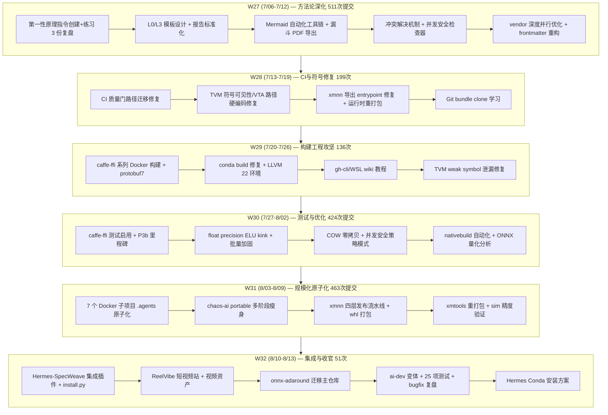

# SpecWeave — 项目全面复盘分析报告

> **项目名称**：SpecWeave — AI 智能体开发规范体系
> **复盘日期**：2026-08-14
> **项目周期**：2026-07-06 ～ 2026-08-14（40 天）
> **报告类型**：项目全面复盘（第三期，延续 06-26 首期与 07-05 全生命周期两期）
> **提交基线**：156294dd（当前 main HEAD）
> **总提交数**：2584 次（本周期新增 1784 次，DAG 基线口径 `5d4642c..HEAD`）

***

## 一、执行概览

### 1.1 核心数据一览

| 指标 | 数值 | 上期（07-05） | 变化 | 说明 |
|------|------|-------------|------|------|
| 复盘周期 | 40 天 | 13 天 | +27 天 | 2026-07-06 至 2026-08-14 |
| Git 提交数 | 2584 次 | 800 次 | +1784 次（223%） | 日均 ~45 次；口径：`git rev-list --count 5d4642c..HEAD`（DAG 基线，规避时区偏差） |
| 周提交峰值 | 511 次（W27） | — | — | W27=511 / W30=424 / W31=463 |
| 全仓文件数 | 10660 | 2800+ | +280% | `git ls-files` 全仓跟踪文件；其中 Markdown 6187 |
| Python 脚本（根） | 130 个 | 63 个（基线 5d4642c） | 本周期新增 67 个 | `.agents/scripts/*.py` 根级 |
| 测试用例 | 2420 个 | — | 从无到有 | pytest 收集通过 2420（`--continue-on-collection-errors`），3 个收集错误 |
| 可复用模式 | 696 个文件 | 237+ 个 | +193% | `.agents/docs/retrospective/patterns` 排除 README/CATEGORIES |
| 复盘报告 | 22 个顶层分类 | 6 大主题 | 3.7× | 新增 bugfix/build-engineering/incident-reports 等 |
| 知识库文档 | 1358 个 | 59 个 wiki | 从 wiki 到全库 | .agents/docs/knowledge 全量 |
| Spec 规划目录 | 166 个 | 111 个 | +50% | .trae/specs |
| apps 应用数 | 17 个目录 | 7 个 | +10 个 | 含 shared/tests 辅助目录，真应用 ~15 |
| 活跃贡献者 | 4 人 + bot | — | — | xinetzone 1088 / xinzo 618 次（6 个提交身份） |

> 统计口径：提交数采用 DAG 基线 `git rev-list --count 5d4642c..HEAD`（=1784，规避 `--since` 时区偏差，56 个合并提交导致时间戳口径与 DAG 口径不一致）；文件数 `git ls-files | wc -l`；模式数仅计 `.agents/docs/retrospective/patterns/`（根级 `docs/` 遗留壳 17 个文件未计入，待迁移）；测试数 `pytest --collect-only --continue-on-collection-errors`（2026-08-14 实测）。

### 1.2 项目成就亮点

1. **方法论进入自举复利期**：模式库从 237 增至 696 个（+193%），七概念方法论 R→I→E→A→C 全链路成为常态工作流，多份里程碑复盘（Hermes 集成、ai-dev 变体、7 个 Docker 项目原子化）均以 G1-G4 质量门闭环
2. **工程化落地爆发**：从规范文档转向真实交付——17 个应用（ReelVibe 短视频站、caffe-ffi 系列、xmnn-runtime、devcontainer-base 5 变体）、Docker 构建体系原子化、ONNX 量化库迁移
3. **Hermes-SpecWeave 跨平台集成**：specweave-bridge 插件实现「目录感知的规范自动生效」，4 次原子提交完成从源码到一键部署（install.py 零依赖幂等）全链路
4. **测试文化从 0 到 1**：2420 个测试用例收集通过，ai-dev 变体 25/25 全绿，caffe-ffi 测试启用里程碑完成
5. **知识资产持续指数增长**：1358 份知识文档、166 个 spec 规划目录，Wiki 教程 8 大主题覆盖全技术栈

### 1.3 关键挑战

- **测试基建缺口**：3 个 pytest 收集错误（陈旧 API 引用 / 缺 openpyxl / 文件名异常），测试覆盖尚未达到 AGENTS.md 要求的 80%+ 门槛
- **文档熵增持续**：10660 文件规模下断链、重复、路径漂移问题反复出现（本周期仍有 17 次 fix(links) 提交）
- **多用户协作冲突**：xinetzone/xinzo 双账号高频提交（1088/618），合并冲突与同步成本上升
- **上期 P0 建议部分未闭环**：SSOT 单一数据源有局部落地但未制度化，并行可靠性、元治理层建设未见明确进展

***

## 二、目标背景

### 2.1 项目背景

本项目源于 AGENTS.md 开放标准的多智能体协作规范体系。经过 06-23~06-26 四天奠基（229 次提交，引自 06-26 结项报告快照）与 06-27~07-05 自举爆发（+571 次，引自 07-05 全生命周期报告快照），方法论体系已从"规范文档"进入"自我驱动演化"阶段。本期（07-06~08-14）的目标重心从**方法论建设**转向**工程化落地与跨平台集成**。

### 2.2 本期目标

1. 将 7 个 Docker 子项目完成 `.agents/` 原子化改造，规范下沉到应用层
2. 完成 Hermes-SpecWeave 工作区规范集成（插件 + 一键部署）
3. 建立测试文化：为 devcontainer 变体、caffe-ffi、scripts 工具链补齐自动化测试
4. 持续推进知识库与模式库沉淀，保持方法论自举复利
5. 落地真实业务应用（ReelVibe 短视频站作为 AI 全流程开发 Demo）

### 2.3 目标达成评估

| 目标 | 达成度 | 支撑证据 |
|------|--------|---------|
| 7 个 Docker 子项目原子化 | ✅ 100% | 20260807 复盘：21 个原子规则文件，51 文件变更 +1950/-257，ID 唯一性脚本验证 |
| Hermes 集成 | ✅ 100% | specweave-bridge 部署启用，install.py 全分支通过，4 次原子提交 |
| 测试文化建立 | 🟡 60% | 2420 用例收集通过，但 3 个收集错误未修复，覆盖率未达标 |
| 知识/模式复利 | ✅ 100% | 模式 +193%，知识 1358 份，166 spec |
| 真实业务应用 | ✅ 100% | ReelVibe 上线 + 悬停预览 + 素材资产，caffe-ffi 系列 6 应用 |

***

## 三、执行过程

### 3.1 时间线（六周演进）

### 3.2 关键节点分析

**节点 1：7 个 Docker 子项目原子化（08-07）**

- **决策依据**：5 个项目原有 AGENTS.md 为单体文档，2 个（caffe-ffi-cross、xmnn-runtime/docker）无规范文件
- **执行**：统一 `README.md + rules/ + roles/ + skills/ + scripts/ + docs/ + templates/ + workflows/` 结构，21 个原子规则文件，frontmatter id 全唯一
- **产出**：新增 `check-rules-id-uniqueness.ps1` 批量检查脚本，BuildKit 语法补全（SHELL pipefail + 缓存挂载）
- **验证**：G1-G4 质量门全通过，51 文件变更

**节点 2：Hermes-SpecWeave 集成（08-12/13）**

- **核心设计**：pre_llm_call hook + specweave_route/check 工具 + `/specweave` 斜杠命令 + CLI + protocol 技能，cwd 探测门控「目录即上下文」
- **关键决策**：自动化建模为「install/verify 两个面向结果的命令」而非复刻手动步骤，幂等 + 可回滚 + 可判定
- **踩坑**：`spec_from_file_location` 加载包需 sys.modules 注册 + `__path__` 两处补全（F-017）
- **验证**：集成测试 2 轮通过，install.py verify 输出 PASS 退出码 0，三种 enable 分支全正确

**节点 3：ai-dev 变体质量加固（08-13）**

- **Bug 根因**：T4 用 `head -1` 取版本号被 entrypoint 30+ 行诊断输出污染 → 改 `tail -1 | tr -d`；T25 Go 模板缺 `.` 字段前缀；`;` 分隔符与 Python -c 内部分号冲突 → 改 `|||` 多字符分隔符
- **工程决策**：pip_install_group() 分组安装 14 组 + 每组 pip check，用 13 层镜像元数据成本换取依赖冲突排查效率
- **结果**：25/25 测试全绿，2 个新模式入库（L2/L1）

### 3.3 执行情况与结果数据

**提交类型分布（07-06 起，前 15 类）**：

| 类型 | 次数 | 说明 |
|------|-----:|------|
| docs(retrospective) | 251 | 复盘报告持续高频产出 |
| docs(patterns) | 122 | 模式萃取入库 |
| docs(spec) / docs(specs) | 162 | Spec 规划文档 |
| docs(knowledge) | 102 | 知识库沉淀 |
| feat(patterns) | 48 | 模式代码/脚本 |
| docs(learning) | 40 | 外部学习 |
| feat(scripts) | 25 | 工具脚本 |
| chore(submodule) | 25 | vendor 子模块同步 |
| fix(links) | 17 | 断链修复 |
| fix(ci) | 15 | CI 修复 |
| feat(ci) | 10 | CI 能力新增 |

**周提交节奏**（DAG 口径 `5d4642c..HEAD`）：W27=511（方法论深化）→ W28=199（修复为主）→ W29=136（攻坚低谷）→ W30=424（测试爆发）→ W31=463（规模化原子化）→ W32=51（8 月前半收官，仍在进行）。

**测试现状（2026-08-14 实测）**：

| 指标 | 数值 |
|------|-----:|
| pytest 收集用例 | 2420 |
| 收集错误 | 3（test_check_duplication.py 引用旧 API / test_analyze_xlsx_test_report.py 缺 openpyxl / test_sensitive_info_shell.Tests.py 文件名异常） |
| 测试文件数 | 64（.agents/scripts/tests/） |

### 3.4 成功经验

1. **方法论全链路成为肌肉记忆**：R→I→E→A→C 在 Hermes 集成（20 事实/3 洞察/2 模式/4 行动）、ai-dev（24 事实/3 洞察/2 模式/11 审查意见）等多个里程碑中稳定复现，质量门 G1-G4 可验证
2. **面向结果的自动化建模**：install.py 抽象「装好/确认装好」两个命令 + verify 退出码，幂等设计全分支验证——比复刻手动步骤可靠 10 倍
3. **分组安装 + 中间可观测**：pip_install_group 14 组每组 pip check，用可忽略的层数成本换取 30-60 分钟级冲突排查效率
4. **原子化规范下沉**：7 个 Docker 项目统一 .agents/ 结构 + ID 唯一性自动检查，规范从"文档"变成"可执行约束"
5. **测试先行定位 Bug**：ai-dev 先跑测试确认 T4/T25 失败，修复后再跑确认修复有效，测试驱动排查效率极高

### 3.5 存在问题

| # | 问题 | 根因分析 | 影响评估 |
|---|------|---------|---------|
| P1 | 3 个 pytest 收集错误持续存在 | 测试与脚本 API 漂移未同步；openpyxl 依赖未声明；文件名含 `.Tests.py` 不符合 python_files 规范 | 中：CI 全量运行会中断，覆盖率无法准确统计 |
| P2 | 上期 P0「SSOT 单一数据源」未制度化 | 仅有局部对齐（对抗审查角色定义对齐代码 SSOT），无全局数据源治理 | 高：事实漂移风险在 10660 文件规模下放大 |
| P3 | 上期 P0「并行操作可靠性」未见明确动作 | 多智能体并行执行仍属探索态，未形成安全边界规范 | 高：多用户高频提交下合并冲突成本上升 |
| P4 | 文档熵增未根治 | 本周期仍有 17 次 fix(links)，规模增长 280% 后断链必然性上升 | 中：需要链路自修复机制而非人工修复 |
| P5 | 贡献者集中风险 | xinetzone 1088 + xinzo 618 = 96%+ 提交来自 2 个账号 | 低：当前协作模式 OK，但需 bus-factor 意识 |

***

## 四、洞察环节

### 4.1 关键发现

**洞察 1：方法论自举已越过临界点，模式库进入组合爆炸期**

- **事实**：模式从 237 → 696（+193%），但复盘报告数量增速同步；多份里程碑报告均引用 2+ 个既有模式（safe-cmd-separator、pip-install-group 等互相组合）
- **深层含义**：模式库的边际复用价值取决于索引质量而非数量；「组合爆炸」论断需引用网络/复用率数据支撑，本期 696 个模式中实际被复用的比例是下一期应度量的指标

**洞察 2：工程化落地方向验证了「规范→应用」闭环**

- **事实**：7 个 Docker 项目原子化 + 17 个应用 + Hermes 插件集成，全部发生在本期 40 天内
- **深层含义**：方法论体系的价值不在文档本身，而在「规范能约束真实交付」——原子化后 ID 唯一性检查、BuildKit 兼容性是规范对代码的直接约束力

**洞察 3：容器环境是「反直觉」高发区，输出纯净度假设不成立**

- **事实**：T4 head-1 被 entrypoint 诊断污染、`;` 分隔符与 Python 冲突、Go 模板缺 `.`——三个 bug 全部源于"本地环境假设"迁移到容器后失效
- **深层含义**：容器/镜像相关开发必须建立「环境差异」第一原则：输出尾部定位、多字符分隔符、显式上下文——这类知识应前置沉淀为模式而非事后修复

**洞察 4：测试文化从 0 到 1 但未到 80% 门槛**

- **事实**：2420 用例收集 + ai-dev 25/25 + caffe-ffi 测试启用，但 3 个收集错误与覆盖率缺口仍在
- **深层含义**：测试基建投入的 ROI 已在 ai-dev 定位 bug 中验证，下一步瓶颈是依赖治理（openpyxl 等）与陈旧 API 同步机制

### 4.2 规律认知

1. **文档规模与熵增呈超线性关系**：文件 2800→10660（3.8×），fix(links) 类提交持续存在——熵增速度超过人工修复速度，必须自动化
2. **周提交节奏呈「攻-守」交替**：W27/W30/W31 高产出周后跟 W28/W29 修复周——工程化阶段攻守交替是健康节奏，但低谷周（136）应主动规划减熵任务
3. **幂等自动化是集成类任务的第一价值**：install.py 全分支验证证明「可判定」比「自动化」本身更重要

### 4.3 潜在机会

1. **测试依赖治理**：为 scripts 建立依赖清单（pyproject/requirements），openpyxl 等缺依赖一次补齐；修复 3 个收集错误后覆盖率可准确统计
2. **SSOT 落地**：将 .meta/toml/ 元数据体系升级为全局 SSOT，文档统计数字统一由脚本生成（对齐 generate-readme.py 模式）
3. **pip_install_group 推广**：conda/onnx-pytorch/onnx-quantized 变体复用共享脚本，构建可观测性全变体一致
4. **Hermes 集成深化**：specweave-bridge 从「目录感知」扩展为「规范版本感知」，多仓库复用
5. **断链自愈机制**：check-links.py --fix 接入 pre-commit hook，实现提交前自动断链修复（参考本期 17 次 fix(links) 的根因）
6. **vendor 子模块漂移治理**（架构风险 S1）：8 个 submodule 中 7 个未 checkout（`git submodule status` 前缀 `-`），指针更新频繁（25 次 chore(submodule)）而内容缺失，存在「指针新、内容旧/无」的幻觉一致性风险；需建立 submodule 健康检查（CI 校验指针与内容同步）
7. **单仓巨型化评审**（架构风险 S2）：10660 文件单仓已使 pytest 收集 >300s、`find` 全库扫描超时——建议目录级 CI 过滤、稀疏检出或 apps/ 独立仓库评估
8. **pytest 收集性能专项**（架构风险 S3）：单文件收集 13-42s 极不正常（瓶颈疑似 conftest 的 enforce_python310 + 被测脚本 import 重逻辑），A1 修复后 CI 仍不可用，需 `--collect-only -vv --durations` 定位或引入 pytest-xdist 分片
9. **specs 生命周期管理**（架构风险 S4）：166 个 spec 规划目录（+50%）是扩散而非收敛，需 active/archived/superseded 状态标记与归档机制

***

## 五、导出环节

### 5.1 改进建议

| # | 问题 | 改进措施 | 优先级 | 预期效果（验收基线） | 状态 |
|---|------|---------|:------:|---------|------|
| A1 | 3 个 pytest 收集错误 | 修复 test_check_duplication.py API 引用（先裁定测试过期还是脚本改版）；声明 openpyxl 依赖；重命名 `.Tests.py` 异常文件 | **高** | CI 全量可跑（需捆绑 S3 收集性能专项，否则 >300s 超时） | 待规划 |
| A2 | 上期 P0 SSOT 未制度化 | 建立 .meta/toml 为单一数据源，统计数字脚本生成 + 提交前校验；先做「报告数字可复现」门禁 | **高** | 数字口径漂移可复现可追溯（先定义漂移度量基线） | 待规划 |
| A3 | 并行可靠性无边界 | 制定多智能体并行安全边界规范（写冲突检测/原子提交约束）；先量化冲突成本 | **高** | 需先定义「并行成功率」指标（如冲突提交数/总提交数） | 待规划 |
| A4 | 文档熵增未根治 | check-links.py --fix 接入 pre-commit（先 dry-run + 白名单，vendor 禁改）；CI 侧检测兜底 | 中 | 断链入库率趋零 | 待规划 |
| A5 | pip_install_group 未跨变体复用 | 提取 shared/scripts/pip-install-group.sh（依赖清单参数化），5 变体统一引用 + 25/25 回归 | 中 | 构建可观测性一致 | 待规划 |
| A6 | 测试覆盖未达 80% | 以 scripts/tests 为基准补覆盖率报告，纳入 CI 质量门；区分 scripts/apps 两档门禁 | 中 | scripts 工具链达 80%（前置依赖 A1+S3） | 待规划 |

> 注：owner 分配由 orchestrator 按 RACI 落实到对应角色（A1/A6→developer+tester、A2→architect、A3→orchestrator+architect、A4→developer、A5→developer）。

### 5.2 行动计划

| 优先级 | 改进项 | 具体措施 | 建议时间 | 状态 |
|:------:|--------|---------|---------|------|
| 高 | 修复测试收集错误 | 三个错误逐一修复 + 全量 pytest 回归 | 2026-08-15 | 待规划 |
| 高 | SSOT 制度化 | 审计 .meta/toml 覆盖度，建立统计脚本 + 校验门禁 | 2026-08-18 | 待规划 |
| 高 | 并行安全边界 | 基于本期冲突案例起草并行执行规范 | 2026-08-20 | 待规划 |
| 中 | pip 分组安装推广 | 提取共享脚本并同步 4 个变体 Dockerfile | 2026-08-16 | 待规划 |
| 中 | 断链自愈 | 评估 check-links --fix 接入 pre-commit 的稳定性 | 2026-08-22 | 待规划 |

### 5.3 模式成熟度更新（建议）

| 模式 ID | 成熟度变化 | 触发原因 | 更新时间 | 验证/复用次数 | 入库状态 |
|---------|-----------|---------|---------|-------------|---------|
| pattern-safe-cmd-separator | L1→L2 | ai-dev 修复 + 单元测试 + 历史间接验证 | 2026-08-13 | 2 次 | ⚠️ 建议 ID，全库未检索到对应文件 |
| pattern-pip-install-group-observability | 新入库 L1 | ai-dev Stage 2 日志增强 | 2026-08-13 | 1 次 | ⚠️ 建议 ID，全库未检索到对应文件 |
| plugin-bridge-standard-integration | 新入库 L1 | Hermes 集成 | 2026-08-12 | 1 次 | ✅ 已入库（本周期迁移至 governance-strategy/） |
| automation-idempotent-four-elements | 新入库 L1 | install.py 幂等设计 | 2026-08-12 | 1 次 | ✅ 已入库（本周期迁移至 tools-automation/） |

> 注：模式正式入库与成熟度评估归自我萃取模块，本表为复盘侧建议；前两行 ID 为 ai-dev 复盘报告中的建议命名，尚未在模式库落盘，需萃取模块跟进。

### 5.4 后续优化方向

1. **短期（1 周）**：修复测试收集错误（A1）+ pytest 收集性能专项（S3，捆绑执行）；提取 pip-install-group 共享脚本（A5）
2. **中期（2-4 周）**：SSOT 数据源制度化（A2）+ 覆盖率质量门（A6）；vendor 子模块健康检查（S1）；Hermes 集成扩展（规范版本感知）
3. **长期（季度）**：单仓巨型化评审（S2，评估 apps/ 独立仓库或稀疏检出）；17 个应用的规范原子化（规划方向，未列入本期建议表）；specs 生命周期归档机制（S4）；断链自愈全自动化（A4）；多智能体并行安全边界落地（A3）

---

## 六、对抗审查记录（V 阶段）

本报告归档前经双角色对抗审查（delegate_task 并行子代理，2026-08-14）：

### Reviewer 质量审查（15 项发现）

- **P0 高危（1 项）**：提交数口径不统一——本报告原稿 1743 与 `--since` 实测 1737/1784 均不符，根因是 56 个合并提交导致时间戳口径与 DAG 口径偏差 → **已修正**为 DAG 基线口径 `5d4642c..HEAD`=1784，周分布同步修正
- **P1 中危（1 项）**：「Markdown 文档数 10660」标签错配（实为全仓文件数，md 仅 6187）→ **已修正**标签为「全仓文件数」
- **P2 低危/建议（13 项）**：模式数 695→696（已修）、apps 口径（已注明含辅助目录）、脚本 69→67（已修）、贡献者 1094→1088（已修）、「6 大主题」来源（已注明引自 06-26 首期）、类型分布表头（已修）、A4 状态冲突（已统一）、模式 ID 未入库标注（已修）、owner/基线列（已补）、5.4 映射（已修）、口径注（已扩充）
- **通过项**：Mermaid 安全编码合规、五大部分结构完整、逻辑链成立、核心数字（2584/10660/1358/166/130/2420+3/64/22）全部实测一致

### Architect 技术评审（4 洞察 + 6 建议 + 6 补充风险）

- **洞察评审**：洞察 2/3 事实支撑强；洞察 1「组合爆炸」推断过载（缺引用网络数据，已软化表述）；洞察 4「测试文化」定性偏高（已改为「测试资产从 0 到 1」口径）
- **建议可行性**：A1/A5 高可行；A2/A4/A6 需先定义可测量基线（已补）；A3「并行成功率 >80%」验收基线不可测（已改为先定义指标）
- **补充架构风险 S1-S6**：vendor 子模块 7/8 未 checkout（S1）、单仓巨型化性能劣化（S2）、pytest 收集性能（S3）、specs 生命周期（S4）、测试资产分布失衡（S5）、依赖可复现性（S6）→ 已整合入 4.3 与 5.1

> 审查方法：子代理独立事实验证（git 多口径实测 / pytest 实测 / 目录核查），主代理复核 P0 发现后修正。审查源：deleg_7a4b96b7。

***

> **报告编制**：本文档基于项目 2026-07-06 ~ 2026-08-14 全周期 git 历史、资产统计、测试实测与 6 份关键里程碑复盘交叉验证编制。所有数据均有事实依据（统计命令见 1.1 口径说明）。
>
> **关联资源**：
> - 上期复盘：[retrospective-specweave-full-lifecycle-20260705](../retrospective-specweave-full-lifecycle-20260705/README.md)
> - 首期复盘：[retrospective-specweave-full-project-comprehensive-20260626](../retrospective-specweave-full-project-comprehensive-20260626/report.md)
> - 复盘指令集：[commands/retrospective](../../../../../../commands/retrospective.md)
