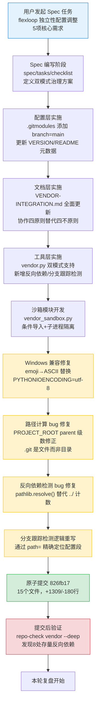

# 执行复盘：flexloop 子模块治理模式调整过程

## 执行时间线

## 量化数据

| 指标 | 数值 |
|------|------|
| Spec 文档 | 3 个（spec.md/tasks.md/checklist.md） |
| 新增文件 | 4 个（vendor_sandbox.py、3个spec文件） |
| 修改文件 | 11 个 |
| 新增代码行数 | +1309 行 |
| 删除代码行数 | -180 行 |
| 净增代码 | +1129 行 |
| 实施中发现并修复的 bug | 5 个（Windows编码、路径计算、.git判断、反向依赖检测、分支跟踪匹配） |
| 提交后验证发现的存量问题 | 8 处（flexloop 内部 Markdown 反向链接） |
| vendor check 检测项新增 | 3 项（子模块类型识别、分支跟踪检测、反向依赖检测） |
| 治理模式文档更新 | 2 个核心文档（VENDOR-INTEGRATION.md、dependency-management.md） |

## 事实陈述

### 阶段1：Spec 方案设计

**做了什么：**
- 创建了 [adjust-vendor-flexloop-governance/spec.md](../../../../../../../.trae/specs/standards-tools/adjust-vendor-flexloop-governance/spec.md)，明确定义了从"第三方只读"到"自有协作"的5个目标、9个功能需求、5个非功能需求、11个验收标准
- 创建了 tasks.md 和 checklist.md，将实施分解为配置层、文档层、工具层、验证层四个阶段
- 更新了 [standards-tools/README.md](../../../../../../../.trae/specs/standards-tools/README.md) 主题看板，将本任务标记为第8阶段，9/9完成

**方案关键决策：**
- 保留 Git submodule 机制，不改为普通目录（保持独立版本历史）
- 采用"条件导入+萃取"双模式使用方式，核心功能不依赖 flexloop
- 建立三层访问控制：规范约束→自动化检测→运行时沙箱
- 沙箱初期仅限制文件系统写入（通过 cwd + 环境变量），不做网络限制

### 阶段2：配置层实施

**做了什么：**
- 修改 [.gitmodules](../../../../../../../.gitmodules)，为 `vendor/flexloop` 添加 `branch = main` 配置
- 更新 [vendor/VERSION.md](../../../../../../../vendor/VERSION.md)，新增"类型"和"跟踪分支"两列，版本号格式改为 `main@d618849a`
- 更新 [vendor/README.md](../../../../../../../vendor/README.md)，增加子模块类型说明和自有协作子模块开发指引

**遇到的问题：**
- 无，配置层变更相对简单直接

### 阶段3：文档层实施

**做了什么：**
- 全面重写 [VENDOR-INTEGRATION.md](../../../../../knowledge/VENDOR-INTEGRATION.md)：
  - 三区域边界模型更新 flexloop 区描述为"允许子模块内开发，提交至 flexloop 仓库"
  -   - "外部依赖四不原则"更新为"协作四原则"：可编辑、条件引、跟踪分支、沙箱护
  - 新增子模块开发工作流（编辑→commit→push→更新指针）
  - 新增条件导入规范和代码示例
  - 新增沙箱运行规范和使用示例
- 更新 [dependency-management.md](../../../../../../protocols/dependency-management.md)：
  - 新增双模式子模块适用场景对比表
  - 区分两种模式的版本管理策略、禁止事项清单、元数据要求

**遇到的问题：**
- 无，文档更新基于 Spec 方案按部就班完成

### 阶段4：工具层实施（问题高发阶段）

**做了什么：**
- 重构 `vendor.py`：
  - 新增 `_get_submodule_type()` 函数，通过元数据或默认规则识别子模块类型
  - 修改 `_check_illegal_imports()`：区分"条件导入"（try/except 包裹，允许）和"裸导入"（警告）
  - 新增 `_check_reverse_dependency()` 函数：检测子模块内代码是否引用主项目路径
  - 新增 `_check_branch_tracking()` 函数：验证 .gitmodules 是否配置了 branch 字段
  - 修改 `_check_submodule_clean()`：允许子模块内有本地提交（ahead of remote），但不允许未提交的工作树修改
- 创建 `vendor_sandbox.py`：
  - `FLEXLOOP_AVAILABLE` 常量：检测子模块是否已初始化
  - `conditional_import()` 函数：临时修改 sys.path 条件导入，导入后恢复路径
  - `run_flexloop_script()` 函数：在子进程中运行 flexloop 脚本，设置 cwd 和环境变量隔离
- 更新 [check-vendor.py](../../../../../../scripts/check-vendor.py)：包装器添加 `PYTHONIOENCODING=utf-8` 和 `-X utf8` 参数

**遇到的5个bug：**

#### Bug 1：Windows GBK 编码崩溃（emoji 问题）
- **现象**：运行 vendor check 时抛出 UnicodeEncodeError，提示 emoji 字符无法在 GBK 终端编码
- **根因**：脚本中使用了 emoji（✅❌⚠️）作为状态标记，Windows PowerShell 默认编码为 GBK，不支持这些字符
- **修复**：将所有 emoji 替换为 ASCII 标记（`[OK]`/`[FAIL]`/`[WARN]`/`[INFO]`/`[SUB]`/`[FILE]`），并在 check-vendor.py 包装器中设置 UTF-8 环境变量

#### Bug 2：路径计算多一级 parent
- **现象**：FLEXLOOP_DIR 指向 `vendor/flexloop/vendor/flexloop`，路径重复
- **根因**：PROJECT_ROOT 计算时 parent 级数错误，从 `_MODULE_DIR.parent.parent.parent.parent` 应为 `_MODULE_DIR.parent.parent.parent`
- **修复**：修正路径计算逻辑，减少一级 parent

#### Bug 3：.git 是文件而非目录
- **现象**：`FLEXLOOP_AVAILABLE` 始终返回 False，即使子模块已初始化
- **根因**：Git submodule 的 `.git` 不是目录，而是一个文件指针（内容为 `gitdir: ../../.git/modules/vendor/flexloop`），`.is_dir()` 返回 False
- **修复**：改为检查 `.git` 存在且是文件（`.is_file()`），并检查 AGENTS.md 存在作为补充验证

#### Bug 4：反向依赖检测误报
- **现象**：子模块内合法的相对路径链接（如子模块内文件互引）被误判为反向依赖
- **根因**：最初实现使用简单的 `../` 计数法（超过 N 个 `../` 判定为外部），无法处理复杂的路径层级
- **修复**：改用 `pathlib.resolve()` 解析绝对路径后，用 `relative_to()` 精确判断链接目标是否在子模块目录内

#### Bug 5：分支跟踪检测逻辑失效
- **现象**：.gitmodules 已配置 branch=main，但检测报告"未配置分支跟踪"
- **根因**：原实现通过 section 名称匹配（如 `[submodule "vendor/flexloop"]`）定位配置段，但 ConfigParser 读取时 section 名称可能包含空格或格式差异
- **修复**：重写匹配逻辑，遍历所有 submodule section，通过 `path =` 字段的值精确定位目标子模块配置段

### 阶段5：原子提交与验证

**做了什么：**
- 严格筛选提交文件范围，仅包含与 flexloop 治理模式调整相关的 15 个文件
- 生成符合 Conventional Commits 规范的提交信息：`feat(vendor): flexloop 子模块治理模式调整为自有协作模式`
- 提交哈希：`826fb17`
- 提交后运行 `repo-check.py vendor --deep` 进行端到端验证

**验证发现的存量问题：**
- 8 处反向依赖链接：flexloop 内部 Markdown 文件引用了 `../../../apps/chaos/` 路径
- 这些是 flexloop 原有代码中的历史遗留链接，不是本次引入的问题
- 1 个未提交修改：子模块工作树有未暂存的变更

## 过程分析

### 成功因素

1. **Spec 先行**：先编写完整的 Spec（包含 9 个 FR、5 个 NFR、11 个 AC）再实施，确保所有需求点都被覆盖，没有遗漏关键功能
2. **分层实施**：按配置层→文档层→工具层的顺序实施，每层完成后验证，问题在引入层即被发现
3. **原子提交**：严格控制提交范围，单一职责提交便于回滚和审查
4. **提交后验证**：没有"提交即完事"，而是运行完整检查验证功能正确性，及时发现存量问题

### 不足与教训

1. **工具开发中的"平台假设"偏误**：开发时在类 Unix 环境或已设置 UTF-8 的终端测试，默认假设编码为 UTF-8，忽略了 Windows GBK 编码的兼容性问题。跨平台工具必须显式处理编码，不能依赖系统默认。
2. **路径计算的心智负担**：通过 `parent.parent.parent` 链式调用推算路径非常容易出错，且错误不易在静态阅读时发现。这类路径计算应该用更稳健的方式（如从已知锚点逐段拼接）或添加注释说明每级 parent 对应的目录。
3. **对 Git 内部细节了解不足**：submodule 的 `.git` 是文件指针而非目录这个细节，如果不熟悉 Git submodule 的实现机制很容易踩坑。说明对所使用工具的底层机制了解不足。
4. **检测工具落地时未先扫描存量**：实施反向依赖检测后，没有先在 flexloop 目录上试运行看看有多少存量问题，直接就提交了，导致提交后检查才发现问题。正确做法是"新检测规则落地前先跑一遍，确认存量问题规模和处理方案"。
5. **简单字符串匹配的脆弱性**：分支跟踪检测最初用 section 名称匹配，这是一种脆弱的实现方式——配置文件格式可能有空格、换行、注释等变化。解析配置文件应该使用专用解析器的字段匹配，而非字符串模式匹配。
