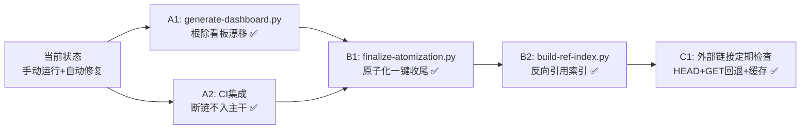

# 改进建议与行动计划

## 一、改进建议总表

| 问题 | 改进措施 | 优先级 | 预期效果 | 状态 |
|------|---------|--------|---------|------|
| README 看板数据手动同步易漂移 | 开发 `generate-dashboard.py` 自动从 .trae/specs/ 聚合状态 | 高 | 根除看板数据漂移，数字始终准确 | ✅ 已完成 |
| 重构后需要手动运行 check-links | 将 `check-links.py --fix` 集成到 CI 检查（ci-check.ps1） | 高 | 断链问题在 CI 阶段被发现，不进入主干 | ✅ 已完成 |
| 原子化操作时引用方不更新 | 开发 `finalize-atomization.py` 一键收尾脚本，在原子化后自动运行断链修复、导航更新、看板刷新 | 中 | 原子化完成后链接自动正确，无需事后修复 | ✅ 已完成 |
| 外部链接可达性未验证 | 增强 `check-links.py --check-external`：HEAD→GET Range 回退、7天结果缓存、并发检测、401/403/405 智能容错；缓存存入 `.agents/cache/`（已 gitignore） | 低 | 可定期运行外部链接检查，发现失效外部 URL，且不会对目标网站造成频繁请求压力 | ✅ 已完成 |
| 缺少链接依赖关系视图 | 开发 `build-ref-index.py` 构建文件引用反向索引，支持查询受影响文件列表 | 中 | 移动文件时可快速定位所有受影响的引用方，批量重构安全可控 | ✅ 已完成 |

## 二、行动计划

### 高优先级行动项

| 序号 | 改进项 | 具体措施 | 建议时间 | 状态 |
|------|--------|---------|---------|------|
| A1 | 开发看板自动生成脚本 | 新增 `.agents/scripts/generate-dashboard.py`，扫描 `.trae/specs/*/tasks.md` 聚合状态，自动更新 README.md 的 Spec 执行进度章节；支持 TOML/YAML frontmatter status 字段与复选框双重判定；已集成到 CI | 2026-06-27 | ✅ 已完成 |
| A2 | CI 集成链接检查 | 修改 `.agents/scripts/ci-check.ps1`，在现有检查后增加 `python .agents/scripts/check-links.py` 步骤，断链时返回非零退出码 | 2026-06-27 | ✅ 已完成（CI 已包含链接检查步骤） |

### 中优先级行动项

| 序号 | 改进项 | 具体措施 | 建议时间 | 状态 |
|------|--------|---------|---------|------|
| B1 | 原子化脚本联动更新 | 新增 `.agents/scripts/finalize-atomization.py` 一键收尾脚本，原子化操作后自动运行断链修复（link_fixer）、导航表更新（generate-nav.py）、Spec 看板刷新（generate-dashboard.py）；已在 atomization.md 流程文档步骤 5 中集成 | 2026-06-28 | ✅ 已完成 |
| B2 | 反向引用索引 | 新增 `.agents/scripts/build-ref-index.py` 反向引用索引脚本，扫描 Markdown 文件构建 `{目标:[引用方]}` 映射；支持 `--query` 文件查询、`--query-dir` 目录查询、`--orphans` 孤立文件检测、`--json` 格式输出；文件移动/重构前可快速评估影响面 | 2026-06-26 | ✅ 已完成 |

### 低优先级行动项

| 序号 | 改进项 | 具体措施 | 建议时间 | 状态 |
|------|--------|---------|---------|------|
| C1 | 外部链接定期检查 | 增强 `check-links.py --check-external`：①HEAD失败时GET Range:bytes=0-0回退（提升检测准确率）；②结果缓存7天至`.agents/cache/external-links-cache.json`（避免频繁请求）；③401/403/405智能容错；④支持`--no-cache`强制重检、`--clear-cache`清缓存、`--cache-ttl`自定义有效期；`.agents/cache/`已加入.gitignore | 2026-06-26 | ✅ 已完成 |

## 三、模式成熟度更新

| 模式 ID | 成熟度变化 | 触发原因 | 更新时间 | 验证/复用次数 |
|---------|-----------|---------|---------|-------------|
| pattern-relative-depth-adjustment | L1 → L2 | 算法实现完成，通过 7 个测试用例 + 14 个真实断链验证，全量扫描零误报 | 2026-06-26 | 1 次实战验证 |
| pattern-fix-priority-chain | L1 → L2 | 在 link_fixer.py 中按精确→模糊顺序实现了 5 级修复链，工作稳定 | 2026-06-26 | 1 次实战验证 |
| pattern-dry-run-first | L2 → L3 | 本次再次验证 dry-run 模式对安全修改的重要性，与历次实践一致 | 2026-06-26 | 多次复用 |

## 四、check-links.py --fix 当前支持的修复类型清单

本次增强后，`--fix` 模式可自动修复以下类型的断链：

| 修复类型 | 说明 | 精确度 |
|---------|------|--------|
| `file:///` 绝对路径转相对路径 | 将本地绝对路径转换为相对于源文件的相对路径 | 高 |
| **相对路径层级校正**（新增） | 自动调整 `../` 层数 ±3 级，处理目录迁移/原子化后的断链 | 高 |
| 目录链接尾部斜杠补全 | 目录引用自动解析为下的 `README.md` | 高 |
| 顶级目录根路径识别 | 以 `docs/`、`.agents/`、`.trae/`、`prompt_extraction/` 开头的路径自动从项目根解析 | 高 |
| 文件名重命名映射 | 已知的文件重命名自动映射（如 SUMMARY.md → AGENTS.md） | 高 |
| 文件名模糊搜索 | 基于 basename 在全项目搜索同名文件（兜底） | 中（可能有歧义） |

使用方法：

```bash
# 预览所有可修复的断链（不修改文件）
python .agents/scripts/check-links.py --fix --dry-run

# 实际执行修复
python .agents/scripts/check-links.py --fix

# 同时检查外部链接
python .agents/scripts/check-links.py --fix --check-external
```

## 五、后续优化方向

### 路线图



### 与现有工具链整合

- 新增的 `generate-dashboard.py` 可在规范稳定后纳入 `ci-check.ps1`，确保 README 看板始终是最新状态
- `check-links.py --fix` 可作为原子化操作后的标准清理步骤，在 `.agents/commands/atomization.md` 流程文档中补充
- 本次新增的"相对路径层级校正"算法可作为通用工具函数，在未来开发文件重命名/移动工具时复用

## 六、元洞察与建议方法论

> 本章节已原子化为独立文档，详见 [meta-insights-suggestions.md](meta-insights-suggestions.md)

**内容摘要**：从改进建议100%落地案例中萃取建议文档设计方法论：

1. **可执行性五要素**：具体交付物+验收标准+优先级+集成位置+状态追踪——建议落地概率 = f(具体性,可验证性,优先级明确度,集成清晰度,状态可见性)
2. **优先级分层隐藏逻辑**：按治理层级排序（🔴高：防止问题再发→🟡中：提升效率→🟢低：拓展边界），而非按难度
3. **模式成熟度显式追踪**：L1实验性→L2已验证→L3标准化，知识资产的"资产负债表"
4. **能力清单化价值**：工具功能矩阵既是用户手册，也是维护者backlog，也是规划起点
5. **三段式复盘结构协同**：事实层→认知层→行动层单向依赖，防止清谈
6. **建议-交付物无冗余映射**：1:1原子化映射，单一职责，独立可验证

**可复用模式**：三段式复盘改进法（pattern-three-part-retrospective，L2），含5项检查清单。

**核心启示**：建议质量决定落地率——好建议自带"落地基因"，不是团队执行力差，而是建议本身不具备可执行性。
