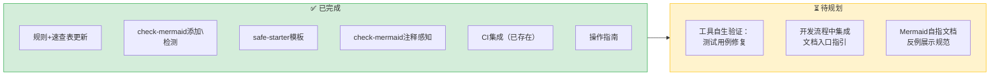
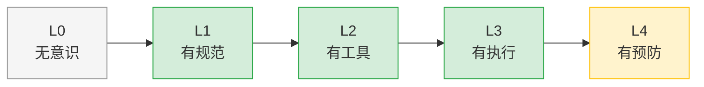

# 改进建议：Mermaid 治理闭环剩余项

## 改进建议总览

## 待执行建议

### 建议1：修复 check-mermaid 单元测试用例（优先级：🟡 中）

**责任角色**：developer
**状态**：⏳ 待规划

上次测试修复时（`5a17eed`），端到端测试（TestRun）通过但单元测试引用了已重命名的 `_fix_block`/`_check_block` 函数（17个失败）。这些测试过期问题不影响功能，但应在 CI 集成前修复以保持测试套件健康。

**验收标准**：`pytest .agents/scripts/tests/test_checks_mermaid.py -v` 全部通过。

### 建议2：在开发流程文档中集成 Mermaid 指南入口（优先级：🟡 中）

**责任角色**：orchestrator + developer
**状态**：⏳ 待规划

在 [feature-development.md](../../../../../../workflows/feature-development.md) 的文档编写章节中添加 Mermaid 指南的引用，让开发者在涉及Mermaid图的任务时能快速找到入口。

**验收标准**：功能开发工作流中包含Mermaid图表编写的指引和链接。

### 建议3：将"工具自测文档模式"沉淀为可复用方法论模式（优先级：🟢 低）

**责任角色**：developer
**状态**：⏳ 待规划

本次发现的"工具自测文档模式"（用工具验证描述该工具的文档，以发现边界case bug）具有跨工具复用价值，可考虑萃取为方法论模式入库。类似适用于所有linter/checker类工具的文档编写场景。

**验收标准**：在 `docs/retrospective/patterns/methodology-patterns/` 中新增模式文档。

## 已完成项确认

| # | 建议 | 交付物 | 提交 |
|---|------|--------|------|
| 1 | 补全速查表换行符陷阱 | [mermaid-trap-cheatsheet.md](../../../../patterns/code-patterns/mermaid-trap-cheatsheet.md) | `d8faa30` |
| 2 | 更新五规则→六规则 | [mermaid-safe-coding-rules.md](../../../../patterns/code-patterns/mermaid-safe-coding-rules.md)、[development-standards.md](../../../../../development-standards.md) | `d8faa30` |
| 3 | check-mermaid添加`\n`检测 | [mermaid.py](../../../../../../scripts/lib/checks/mermaid.py) `_check_backslash_n` | `d8faa30` |
| 4 | 修正成熟度评估 | mermaid-safe-coding-rules.md maturity L4→L3 | `d8faa30` |
| 5 | CI集成验证 | 确认ci-check.ps1/sh第4步已集成 | `06c634b` |
| 6 | 模板内置安全提醒 | [safe-starter.md](../../../../../../templates/mermaid-templates/safe-starter.md) | `ec556bd` |
| 7 | check-mermaid注释感知 | `_strip_inline_comment()` 函数 | `ec556bd` |
| 8 | 一站式操作指南 | [mermaid-guide.md](../../../../../knowledge/best-practices/mermaid-guide.md) | `d39813b` |

## 治理成熟度评估更新

基于本次执行，Mermaid 安全编码治理的成熟度评估：

**当前位置：L3（有执行）**

- ✅ L1：六规则文档齐全（mermaid-safe-coding-rules.md）
- ✅ L2：check-mermaid.py 覆盖10类问题，含自动修复
- ✅ L3：CI脚本第4步已集成，失败时阻断
- 🟡 L4（部分）：safe-starter模板内置提醒（源头预防），但pre-commit hook未强制（属于本地配置）

三道防线现状：
- ✅ 第一道（源头预防）：safe-starter.md 内置 `%%` 注释提醒 + mermaid-guide.md 一站式入口
- ✅ 第二道（自动检测）：check-mermaid.py 覆盖10类问题 + CI集成
- ⏳ 第三道（人工审查）：Code Review Checklist 中尚未明确列出Mermaid检查项
