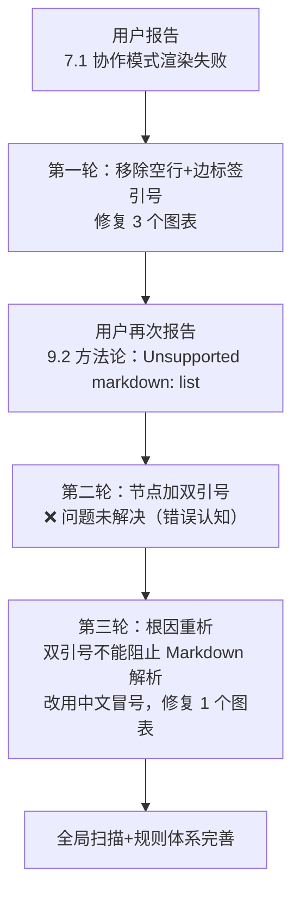

# 执行复盘：Mermaid 渲染兼容性问题修复

## 一、事实回顾

### 1.1 时间线

| 轮次 | 问题 | 处理 | 结果 |
|------|------|------|------|
| 第一轮 | 7.1 协作模式渲染失败 | 移除空行、边标签加引号、修复 3 个图表 | 结构层问题解决 |
| 第二轮 | 9.2 "Unsupported markdown: list" | 节点文本加双引号包裹 | ❌ 仍失败 |
| 第三轮 | 重新分析根因 | 双引号不阻止内部Markdown解析；改用中文冒号 | ✅ 解决 |
| 收尾 | 全局扫描 | 更新项目记忆、开发规范、Lint脚本、CI | 规则体系完善 |

### 1.2 受影响图表

受影响文件：`docs/retrospective/reports/project-governance/retrospective-specweave-full-project-comprehensive-20260626/report.md`

| 位置 | 类型 | 问题 |
|------|------|------|
| 3.1 项目时间线 | flowchart TB（4 subgraph） | subgraph 间空行 |
| 7.1 协作模式 | flowchart LR（2 subgraph） | subgraph 间空行 + 边标签未加引号 |
| 9.2 方法论提炼 | flowchart TB | 空行 + 节点文本触发 Markdown 列表解析 |

### 1.3 核心教训

> 8类陷阱速查见 [mermaid-trap-cheatsheet.md](../../../../patterns/code-patterns/mermaid-trap-cheatsheet.md)，完整编码规则见 [mermaid-safe-coding-rules.md](../../../../patterns/code-patterns/mermaid-safe-coding-rules.md)。

本次修复共发现4类问题模式（空行截断、边标签无引号、空行中断style、列表触发），其中最关键的教训是第二轮的错误认知：**误以为双引号可以阻止内部 Markdown 解析**。实际上双引号仅作用于 Mermaid 语法层（识别文本边界），引号内文本仍经过内置 Markdown 渲染器处理——这一两阶段解析模型是纠正认知错误的关键（详见 [insight-five](insights/insight-five-safe-coding-rules.md)）。

## 二、根因分析

### 2.1 根因链

五个深层原因共同导致本次故障，按发现顺序：

1. **分层屏蔽效应**（[insight-06](insights/insight-06-layered-verification.md)）：结构层错误（空行）屏蔽了内容层错误，导致三轮迭代
2. **渲染器容错差异**（[insight-07](insights/insight-07-renderer-tolerance.md)）：VS Code 宽容、飞书零容忍，本地预览无法发现问题
3. **错误认知**：假设双引号有穿透Markdown层的能力，导致一次无效修复
4. **知识缺口**：项目记忆未覆盖空行截断和Markdown隐式解析规则（已补全）
5. **验证盲区**：修复前无 Mermaid 语法自动化校验（已补全：check-mermaid.py + CI）

### 2.2 影响评估

- **用户体验**：关键章节渲染失败，两轮不充分修复导致用户多次反馈
- **修复成本**：三轮修复共约 20 分钟，主要浪费在错误认知导致的无效迭代
- **无数据丢失**：问题仅在渲染层，源码完整

## 三、修复效果验证

- ✅ 3 个问题图表全部修复
- ✅ 项目记忆、开发规范、Lint脚本、CI 集成均已更新
- ✅ 全项目审计：653+ 文件扫描，0错误0警告
- ✅ 链接校验通过
